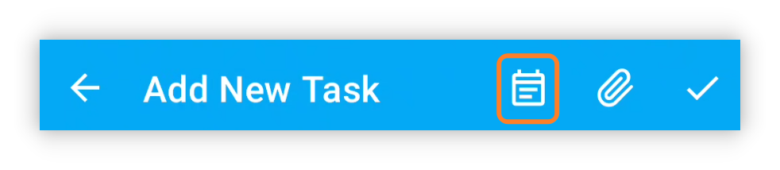

## v1.93.0 - قوالب المهام و Material 3

## 🚀مقدمة

في LifeUp، نستمع عن كثب لملاحظات مستخدمينا، وكانت جهودنا الأخيرة مكرسة لتحسين بعض الميزات الأكثر طلبًا. نلتزم بتحسين تجربة LifeUp بناءً على مدخلاتكم القيّمة.

علاوة على ذلك، نتقدّم بجد على خارطة التطوير، بهدف جلب المزيد من التحديثات المثيرة مستقبلًا. ثقتكم ودعمكم هما ما يدفعنا للتحسين المستمر.

بالإضافة إلى هذه التحسينات، نستكشف بنشاط تقنيات مثل Flutter و KMM، ما يفتح أبوابًا لإمكانيات جديدة ستُرفع تجربة LifeUp أكثر. ترقّبوا هذه التطورات بينما نواصل النمو والتطور. 🚀🔍

**يجلب هذا التحديث قوالب المهام والإنجازات السرية والتكيّف الكامل مع لغة التصميم الجديدة Material You، إلى جانب ميزات أخرى.**

**شهدت بعض الوحدات الوظيفية، مثل المشاعر و APIs، أيضًا تحسينات وتحسينات.**

إذا كان لديك أي أسئلة أو اقتراحات، تواصل معنا على 📫[lifeup@ulives.io](mailto:lifeup@ulives.io) أو أرسل issue على GitHub (https://github.com/Ayagikei/LifeUp/issues)

---

## I. 📋 قوالب المهام

يقدّم هذا الإصدار قوالب مهام مدمجة. يلغي الحاجة إلى إنشاء المهام بشكل غير مباشر عبر «نسخ المهمة» و APIs.

عند إنشاء المهام أو تحريرها، يمكن للمستخدمين حفظ الإعدادات الحالية كقوالب.

مستقبلًا، عند إنشاء المهام، يمكنك استيراد إعدادات المكافآت وإعدادات المهام السابقة وغيرها بنقرة واحدة.

### 📕 كيفية الاستخدام؟

عند إنشاء المهام أو تحريرها، انقر زر قوالب المهام في الشريط العلوي.

ستسجّل قوالب المهام معظم إعداداتك، لكنها لا تتضمن حاليًا الموعد النهائي.

## II. 🎨 سمة Material You

يتكيّف هذا الإصدار بالكامل مع لغة التصميم Material You (السمة).

هذه اللغة أكثر حداثة وتقدّم مظهرًا أنظف. إنها أيضًا أحد أنماط واجهة المستخدم الرسمية المروّجة للمستقبل.

علاوة على ذلك، الميزة الأساسية في Material You هي أن «لكل شخص لون سمة مختلف».

يتيح ذلك لـ LifeUp إضافة آليات جديدة مثل ألوان السمة الديناميكية بناءً على خلفية الشاشة وألوان السمة المخصصة. (ملاحظة: يلزم دعم الجهاز.)

### 📕 كيفية الاستخدام؟

كما في الصور أعلاه، افتح الشريط الجانبي → Settings → Display لضبط الخيارات ذات الصلة.

إذا لم يدعم جهازك ألوان السمة الديناميكية، يمكنك اختيار ألوان محددة مسبقًا.

لكن إذا دعم جهازك ألوان السمة الديناميكية، يمكنك تفعيل هذه الميزة وتخصيص ألوان السمة المرغوبة بمرونة عالية:

## IV. 🌐الموقع الرسمي الجديد

أطلقنا صفحة هبوط جديدة تجعل مشاركة LifeUp مع أصدقائك أسهل من أي وقت.

زر [lifeup.ulives.io](https://lifeup.ulives.io) للحصول على لمحة عما يقدّمه LifeUp.

## III. ✨ ميزات إضافية

**سمة واجهة المستخدم**

1. التكيّف الكامل مع Material Design 3.
2. دعم تخصيص ألوان سمة Material Design 3، بما في ذلك الألوان المخصصة والألوان من خلفية الشاشة والألوان من الصور.
3. تحسين بعض تأثيرات الرسوم المتحركة، مثل النوافذ المنبثقة.
4. تحسين تأثيرات التكيّف edge-to-edge (الغامر).

**المهام**

1. دعم قوالب المهام.
2. الإحصائيات في صفحة التفاصيل تدعم التبديل حسب معايير الوقت وتحسين الخيارات الافتراضية.
3. صفحة السجل تدعم البحث عن أسماء المهام وتعديل واجهة المستخدم والتفاعلات ذات الصلة.

**الإنجازات**

1. دعم الإنجازات السرية.
2. عند إضافة إنجازات، دعم «متابعة إضافة الإنجاز التالي».

**السمات**

1. دعم إخفاء السمات.

**مؤقت Pomodoro**

1. دعم تحرير سجلات الوقت.
2. في صفحة Pomodoro، دعم إكمال المهمة (الضغط مطولًا على المهمة المختارة أثناء وضع الإيقاف المؤقت).

**المشاعر**

1. دعم إضافة المشاعر مباشرة في صفحة المشاعر.

**API**

1. إضافة «use_item» API.
2. إضافة «random» API.
3. إضافة «edit_exp» API.
4. «item» API يدعم الآن ضبط معاملات مثل «action_text» و «disable_use» و «title_color_string».
5. «shop_settings» API يدعم معامل «silent».
6. دعم عنصر نائب «time». يمكنك الآن تعيين مهام بتواريخ مثل «مستحقة غدًا» أو «مستحقة الشهر القادم» دون الحاجة إلى أدوات الأتمتة.

------

بالإضافة إلى هذه الميزات، عالجنا مجموعة متنوعة من المشكلات المُبلَّغ عنها وأجرينا بعض إصلاحات الأخطاء. لمزيد من التفاصيل، راجع سجل التحديث أدناه.

### ♻️ تحسينات

1. إضافة بادئات في بعض الأماكن التي تعرض معرفات البيانات.
2. تحسين عرض أنشطة الفريق.
3. محاولة معالجة مشكلة أن بعض إشعارات Toast طويلة جدًا ولا تُعرض بالكامل.
4. تحسين منطق إكمال widget في الفرق، مع ضمان الاتساق مع سلوك App.
5. صفحة الإحصائيات: بعد اختيار نطاق زمني «مخصص»، النقر على «مخصص» مرة أخرى يُطلق إعادة اختيار التواريخ.
6. ضمان التوافق مع Harmony OS 4 لعرض أزرار الإجراء في إشعارات شريط التقدم.
7. تحسين منطق تفاعل طلبات الإشعارات.
8. معالجة مشكلة حجب طريقة الإدخال للإدخال في «Repeat Count».
9. عند إنشاء المهام، يُسجَّل الآن اختيار المستخدم لأوقات البدء غير المحددة (مثل تلقائي أو مستحق اليوم). عند التحرير، تُستعاد هذه الخيارات بدل الأوقات المحددة لتجنب تناقضات في الأوقات المحررة.
10. عند إنشاء المهام، إذا ظهرت تحذيرات غير متوقعة عن التكرارات، ستُعرض أيضًا في نافذة «التحقق من التكرارات».
11. إضافة دعم اللغة الإندونيسية.
12. تحديث الترجمات.

## 🐛 إصلاحات الأخطاء

1. إصلاح مشكلة أن وحدة world قد تعلق في التحميل (دوران مستمر) في حالات معيّنة.
2. إصلاح مشكلة أن المتجر/المستودع قد يستمر في عرض التحميل (دوران مستمر) في حالات معيّنة.
3. إصلاح مشكلات قد تحدث عند استدعاء APIs بمحتوى واجهة المستخدم عبر content provider.
4. إصلاح مشكلات ترتيب المهام التي لم تلبِّ التوقعات.
5. إصلاح مشكلة أن البيانات في صفحة الإحصائيات غير صحيحة بعد اختيار نطاق زمني «مخصص».
6. إصلاح مشكلة أن النوافذ المنبثقة لطلبات الإشعارات لا تدعم التمرير.
7. إصلاح مشكلة أن بحث وحدة world يعرض كل المحتوى في حالات معيّنة.
8. إصلاح مشكلة أن خيار «إظهار المكتمل» يعرض أيضًا المهام المجمّدة.
9. إصلاح مشكلات حساب القيم المتوسطة في صفحة الإحصائيات.

## شكر خاص لمساهمي GitHub وأبطال ملاحظات البريد الإلكتروني ومساهمي ترجمة Crowdin

نُعبّر عن امتناننا العميق للمستخدمين الذين شاركوا بنشاط بإرسال issues على GitHub والتواصل عبر البريد الإلكتروني وتخصيص وقتهم للمساهمة في الترجمات على Crowdin.

جهودكم مجتمعة كانت حاسمة في تشكيل تجربة LifeUp لمجتمعنا العالمي. ساعدتمنا على تحسين وظائف App وإتاحته، ومساهماتكم لا تُقدَّر بثمن حقًا.

بينما نعمل معًا لجعل LifeUp أفضل، نريد التعبير عن شكرنا الصادق لدعمكم وتعاونكم المستمر. 🙏📧🌍
