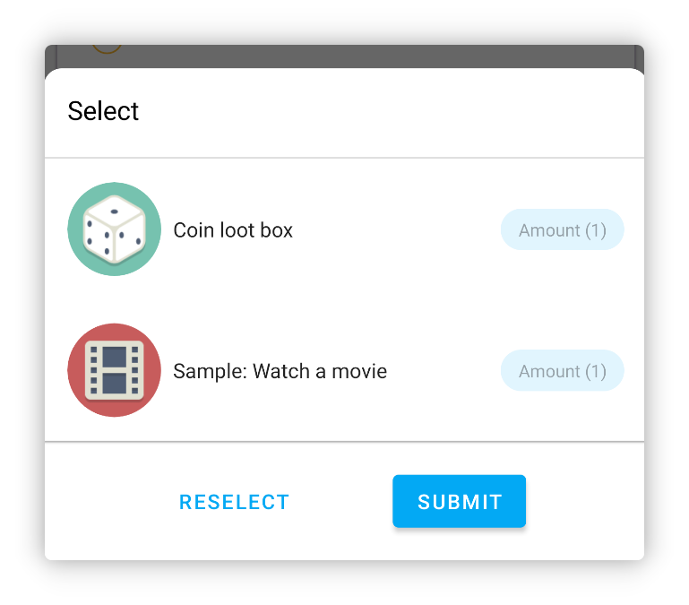
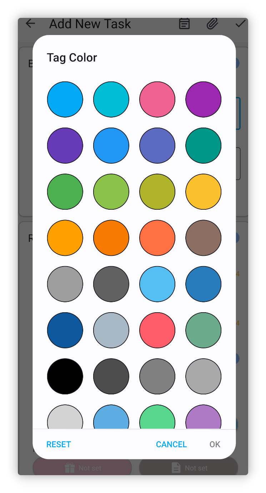

<h1 align="center" padding="100">v1.94.0 مكافآت عناصر متعددة</h1>

## مقدمة

يركز هذا التحديث أساسًا على ميزات مثل مكافآت العناصر المتعددة وwidgets المخزون، إلى جانب تحسينات عديدة وتحسينات الأداء وإصلاحات الأخطاء.

**📧كيف تقدّم ملاحظات؟**

إذا كان لديك أي أسئلة أو اقتراحات أو تقارير أخطاء، تواصل معنا على 📫[lifeup@ulives.io](mailto:lifeup@ulives.io) أو أرسل issue على GitHub (https://github.com/Ayagikei/LifeUp/issues)

## 1. ✅مكافآت عناصر متعددة

يمكنك الآن في LifeUp اختيار عناصر متعددة في أماكن مختلفة. لم تعد بحاجة إلى إعداد فتح صناديق أو التركيب لتحقيق مكافآت متعددة.

على سبيل المثال، يمكنك:

- تعيين مكافآت عناصر متعددة مباشرة لمهمة
- اختيار عناصر متعددة عند إعداد فتح الصندوق، ثم ضبط الاحتمالات دفعة واحدة
- تعيين مكافآت عناصر متعددة مباشرة للإنجازات والمهام الفرعية

 

### 📕كيفية الاستخدام؟

انقر زر التحديد المتعدد في الأعلى عند اختيار العناصر.

> لاحظ أن بعض السيناريوهات قد تدعم الاختيار الفردي فقط.

## 2. 🔧widgets المخزون

يقدّم هذا الإصدار حجمين من widgets المخزون.

يمكنك الآن عرض العناصر في مخزونك واستخدامها بسرعة مباشرة من سطح المكتب.

 

### 🚀 تحسينات وحل المشكلات

رغم إطلاق widget المتجر قبل عدة إصدارات، واجهنا تدريجيًا بعض الأعطال أو مشكلات أخرى.

على سبيل المثال، بسبب حدود نقل نظام الـ widget، قد يؤدي وجود عناصر كثيرة جدًا إلى تعطل App، أو مشكلات تبديل القوائم، أو فشل تحميل الصور المخصصة.

في هذا الإصدار، وجدنا حلولًا مناسبة. يجب أن تستطيع widgets المتجر والمخزون الآن عرض عدد كبير من العناصر، واختبرنا widgets المتجر مع ما يقارب 1000 عنصر وظلت تعمل وتحمّل بشكل صحيح (بالطبع، هذا غير موصى به).

 

### 📕كيفية الاستخدام؟

عادةً يمكنك إنشاء widget بالضغط مطولًا على سطح مكتب النظام.

إذا كنت تستخدم جهازًا مثل Xiaomi أو Redmi (MIUI/HyperOS)، فإضافة widgets في MIUI/HyperOS مخفية نوعًا ما؛ راجع وثيقة إعداد التوافق لمعرفة كيفية إضافة widgets.

## 3. ✨ميزات إضافية

**سمات واجهة المستخدم**

1. ألوان (نص المهام والعناصر) المخصصة تتضمن الآن قيمًا محددة مسبقًا أكثر
2. تكيّف مع ميزة الأيقونة أحادية اللون التكيفية في Android 14
3. تكيّفات لغوية إضافية (نسخة Google Play)

**الإنجازات**

1. إذا وُجدت إنجازات بمكافآت غير مُستَلَمة، سيُعرض الآن نقطة حمراء صغيرة على قائمة الإنجازات.

**المهام**

1. المهام الفرعية للمهام العقابية ستنفّذ منطق العقوبة بشكل صحيح الآن
2. إضافة «إدارة المنطقة الزمنية الذكية»؛ إذا كنت تعمل عبر مناطق زمنية مختلفة، يدعم LifeUp أيضًا اكتشاف تغييرات المنطقة الزمنية تلقائيًا ويدعم تعديل الوقت عالميًا
3. أساس الإحصائيات في صفحة التفاصيل يتذكّر الآن آخر اختيار، وحسّنا بعض القيم الافتراضية في سيناريوهات معيّنة
4. تحسين معالجة فترة السماح لأيام إكمال المهام المتتالية في صفحة «أنا»؛ إذا نسيت إكمال مهمة يومًا، يمكن لاحقًا مواصلة السلسلة

**السمات**

1. يدعم حذف سجلات نقاط الخبرة
2. يدعم إعادة تعيين نقاط الخبرة لسمة فردية

**Widgets**

1. النقر على المساحة الفارغة في widgets المتجر أو المخزون يدخل الآن مباشرة إلى القائمة التي يشير إليها الـ widget، بدل آخر قائمة
2. widgets المهام تعرض الآن تقدم مهام العد

**API**

1. إضافة API لتحرير سجلات Pomodoro
2. API إكمال المهام يعالج المهام العقابية بشكل صحيح الآن أيضًا
3. API إكمال المهام يدعم الآن أيضًا معالجة مهام العد (يضيف معامل `count`)
4. API إكمال المهام يدعم الآن معامل معامل المكافأة
5. API تعديل العناصر يدعم الآن تغيير list id للعنصر
6. APIs إنشاء وتعديل العناصر تدعم معامل معايير الترتيب
7. Jump API يدعم الآن الانتقال إلى نافذة استخدام العنصر
8. توحيد بعض تعريفات المعاملات، مثل `itemId` → `item_id`
9. إضافة إشعارات broadcast لبدء وإيقاف مؤقت وإنهاء ساعة الإيقاف
10. `title_color_string` في API تعديل العناصر يدعم الآن تمرير سلسلة فارغة لاستعادة القيمة الافتراضية
11. broadcast إكمال المهام يتضمن الآن list id
12. فتح الصناديق والتركيب يُطلقان الآن أيضًا broadcast استخدام العنصر

------

بالإضافة إلى ذلك، أصلحنا عددًا كبيرًا من المشكلات وبعض الأخطاء المُبلَّغ عنها مؤخرًا.

التفاصيل في سجل التحديث أدناه~

### ♻️تحسينات

1. إضافة تحذير عند إضافة أو تحرير مهام إذا لم تُختَر سمة ودُخلت نقاط خبرة
2. تحسين سجلات إعادة محاولة الرفع
3. تحسين عرض العنوان وقيود الإدخال في صفحة المستوى المخصص
4. تحسين الأداء ومشكلات التوقيت عند التراجع عن مهام تكرّرت بكثافة
5. إعادة هيكلة نافذة استخدام العنصر ومنطق واجهة التقويم وغيرها
6. تحسين منطق تذكيرات المهام، مع ضمان عدم إصدار تذكيرات من بيانات محذوفة أو سابقة
7. تحسين نص الانتظار في واجهة النسخ الاحتياطي
8. الصور المختارة في صفحة السمة المخصصة تُضاف الآن أيضًا إلى سجل الاختيار
9. تحرير سجلات Pomodoro يحاول الآن تصحيح (زيادة أو نقص) العدد الصحيح من Pomodoros

### 🐛إصلاحات الأخطاء

1. إصلاح إنجاز نظام متعلق بالإحصائيات والنسخ الاحتياطي لم يُطلَق بشكل طبيعي بعد إعادة الهيكلة
2. إصلاح تعارضات محتملة بين random API و toast API widgets مع toast الافتراضي
3. إصلاح عدم تحديث تفاصيل المهمة في بعض السيناريوهات عند الدخول من widget
4. إصلاح احتمال أخطاء في فتح صناديق متعددة في بعض الحالات الخاصة (استخدام مخزون العنصر مسبقًا)
5. إصلاح عدم عرض المهام الفرعية في صفحة التفاصيل بعد تحرير مهمة بلا مهام فرعية ثم إضافة مهام جديدة
6. إصلاح بعض الحالات الخاصة التي كان فيها تحرير مكافآت العملات مستحيلًا
7. إصلاح بعض الحالات التي قد لا يعمل فيها استلام عناصر الفريق
8. إصلاح شذوذات نمط MD2 في بعض النوافذ السفلية
9. إصلاح قيم وقت إضافية محتملة غير صحيحة في مؤقتات Pomodoro
10. إصلاح احتمال عدم عرض شريط اللون في widget تغيّر نقاط الخبرة
11. إصلاح عدم عرض بعض المهام بشكل صحيح في calendar-in-progress
12. إصلاح بعض مشكلات تحميل القوائم في صفحات السجل والمشاعر
13. إصلاح مشكلة عدم السماح بإكمالين متتاليين عند استدعاء complete task API مرتين بسرعة
