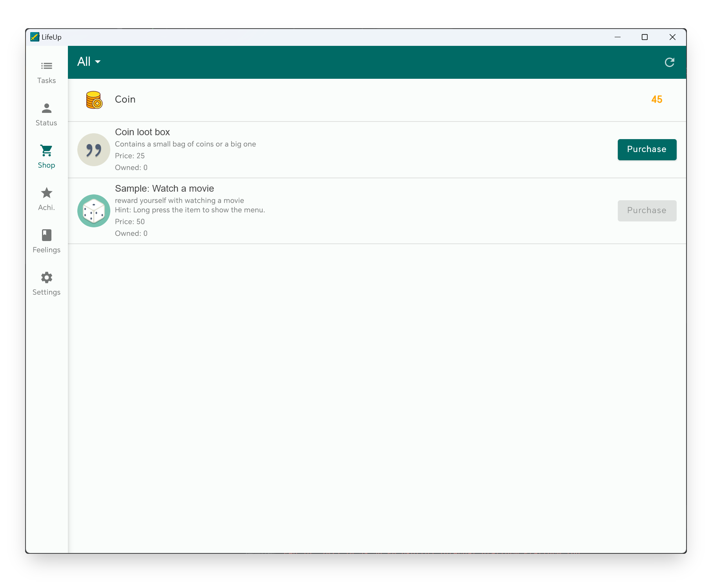

## v1.91.0 - Status-Widget, benutzerdefinierte Stufenkurve, einfacher Desktop

> [DEV] Neu in v1.91: Status-Widget, benutzerdefinierte Stufenkurve, einfacher Desktop

> Hier stellen wir das v1.91-Update vor. Vielen Dank an die langjährigen Maintainer der LifeUp-Reddit-Community! :D Wir haben leider nicht genug Ressourcen, alle Communities zu verfolgen – Feedback bearbeiten wir vor allem über 📧 und GitHub. Bei Fragen oder Vorschlägen: 📫[lifeup@ulives.io](mailto:lifeup@ulives.io) oder ein Issue auf GitHub (https://github.com/Ayagikei/LifeUp/issues).

Entschuldigung, dass ihr so lange warten musstet.

Verschiedene Dinge haben Entwicklung und Lernfortschritt seit Jahresende verzögert. Mit eurer Unterstützung konnte ich meine Entwicklungsausstattung erneuern und einen Desktop-Rechner aufsetzen – das macht Entwicklung, Debugging und Releases effizienter.

Kürzlich sind wir wieder im normalen Update-Takt. Version 1.91 bringt Updates gemäß der bisherigen „Entwicklungs-Roadmap“. **v1.91 wird schrittweise ausgerollt – wenn du das Update noch nicht hast, warte bitte noch etwas.**

Geplant war in v1.91 eine integrierte Google-Kalender-Anbindung. In der Entwicklung stießen wir auf technische Hürden. Um schneller weitere Updates zu liefern, haben wir das vorübergehend verschoben und konzentrieren uns zuerst auf andere Funktionen. Entschuldigung an alle, die Google Kalender in v1.91 erwartet haben – wir arbeiten weiter an der Integration.

Außerdem haben wir etwas Neues ausprobiert: einen LAN-Desktop-Client. **Bitte beachte: Der Desktop-Client ist noch sehr rudimentär und hängt von den Mobil-Daten ab.** 

---

## 🔖Überblick

1. **🏆Widget:** Neues Status-Widget (erste Charge)
2. **📈Attribute:** Benutzerdefinierte Stufenkurven
3. **✨Multiplattform:** LAN-Desktop-Version
4. **✏️API:** Abfrage vollständiger Listendaten und weitere APIs
5. **🍅Pomodoro:** Automatischer Start von Arbeits- und Pausenzeit
6. **🚀Sonstiges:** Performance-Optimierung
7. **Vollständiges Changelog**

## 🏆Widget: Neue Status-Widgets (erste Charge)

Dieses Update bringt Widgets zu Eigenschaften und Münzen:

- Münzen (klein, groß, Ziel)
- Eigenschaftenliste (klein, groß)

Das ist nur die erste Charge – weitere Widgets folgen.

### 📝So geht's

In der Regel: Launcher lang drücken oder zusammenziehen, um Widgets hinzuzufügen.

------

## 📈Attribute: Benutzerdefinierte Stufenkurve

Ab v1.91 kannst du deine Stufenkurve anpassen – die Erfahrungspunkte pro Stufe.

Wähle höhere Herausforderungen oder sanftere Kurven nach deinem Geschmack.

Die eingebaute Stufentabelle findest du auf derselben Seite.

### 📝So geht's

Seitenleiste → Einstellungen → Erweitert → Benutzerdefinierte Stufe

------

## ✨Multiplattform: Desktop

In dieser Phase haben wir mit dem neuen API-Update auch detaillierte Listendaten abfragbar gemacht.

Wir haben **vollständig Open-Source-Software (https://github.com/Ayagikei/LifeUp-Desktop)** für das LAN entwickelt: Verbindung zum Handy, Anzeige verschiedener Listen und einfache Aktionen – Gegenstände kaufen, Aufgaben erledigen, Gefühlsbilder exportieren und im System-Bildbetrachter ansehen.

Theoretisch unterstützt: Windows, Linux und macOS.

⚠ Der Desktop ist noch in früher Entwicklung.

Wir pflegen und erweitern weiter – z. B. Aufgaben vom Desktop anlegen, angepasste Oberfläche, Gefühle als Markdown exportieren usw.

### 📝So geht's

Details unter „Seitenleiste → Einstellungen → Labs → LifeUp Cloud“.

Siehe auch: [LifeUp Desktop🖥 (lifeupapp.fun)](https://docs.lifeupapp.fun/en/#/guide/api_desktop).

## ✏️API: Abfrage vollständiger Listendaten und weitere APIs

**Datenschnittstelle**

Als Datenbasis für den Desktop-Client liefern wir in dieser Version eine vollständige Abfrageschnittstelle.

Als Android-Entwickler kannst du unser **LifeUp SDK** nutzen, um verschiedene Daten in der LifeUp-App abzufragen.

Andere Entwickler können per HTTP die „LifeUp Cloud“-API aufrufen – so auch der Desktop-Client.

Keine Entwicklungserfahrung? Kein Problem:

1. Jetzt ist eine gute Lernchance.

2. Die Daten-APIs sind offen – Community-Entwickler können sie für Zweitentwicklung nutzen.

Zum Beispiel: eigene Aufgabenlisten, Shop-Seiten, komplexere Funktionen (Rabatte, „Rüben“-Handel usw.).

Ergebnisse profitieren allen Nutzern.

Die konkreten Schnittstellen kommen später in die API-Dokumentation.

**Weitere API-Verbesserungen**

Neu:

- ATM-Einzahlung und -Auszahlung
- „Kauf deaktivieren“ für Gegenstände
- „Tag-Farbe“ für Aufgaben
- ATM-Saldo direkt setzen
- Einfache Abfrage bestimmter Gegenstandsdetails
- Dritter Button und Aktion in „confirm_dialog“

Verhaltensänderungen:

- confirm_dialog: Fehlen Text oder Aktion eines Buttons, wird der Button nicht angezeigt.

  Mehr Flexibilität – z. B. reiner Text-Pop-up ohne Buttons für Motivationssprüche.

- penalty-API: Früher max. 100 Gegenstände abziehbar, jetzt bis 9 Stellen.

### 📝 Nutzung

API-Dokumentation und GitHub:

[LifeUp Cloud☁️ (lifeupapp.fun)](https://docs.lifeupapp.fun/en/#/guide/api_cloud)

https://github.com/Ayagikei/LifeUp-SDK

------

## 🍅Pomodoro: Automatische Arbeits- und Pausenzeit

Diese Version führt automatischen Start der Pomodoro-Uhr ein.

Stelle sicher, dass dein Handy **kompatibilitätskonfiguriert** ist, damit das System den Pomodoro nicht unterbricht.

Nach „Automatischer Pausenstart“ ist die bisherige zusätzliche Countdown-Funktion deaktiviert.

### 📝 Nutzung

Pomodoro → Einstellungen oben rechts.

------

## 🚀Sonstiges: Performance-Optimierung

Feedback und Online-Daten zeigten: Bei großen Datenmengen werden manche Abfragen deutlich langsamer.

Für eine To-do-App sind Stabilität und Langzeitnutzung entscheidend.

In dieser Version haben wir Szenarien mit vielen Daten optimiert – die meisten Listen (besonders die To-do-Liste) laden spürbar schneller.

Weitere Optimierungen folgen.

## Vollständiges Changelog

**1.91.0-alpha01 (2023/02/13)**

**✨Funktionen**

1. Benutzerdefinierte Stufenkurven.
2. Erste Widget-Charge:
   - Münzen (klein, groß, Ziel)
   - Attribute (klein, groß)

1. Die meisten Datendetails per Content Provider API abfragbar, u. a.:
   - Neue Version von „LifeUp Cloud“.
   - Erste Desktop-Version (Windows, Linux, macOS) fürs LAN.

1. Mehrfachauswahl-Löschen für Pomodoro-Einträge.
2. Automatischer Start von Pause und Arbeit für die Pomodoro-Uhr.
3. API-Verbesserungen und neue Felder, u. a.:
   - ATM-Einzahlung und -Auszahlung.
   - Kauf für Gegenstände deaktivieren.
   - Label-Farben für Aufgaben.
   - ATM-Saldo direkt setzen.
   - Einfache Abfrage bestimmter Produktdetails.
   - Dritter Button und Aktion im Pop-up.

**♻️Optimierungen**

1. Abfrage, Verarbeitung und Performance bei großen Datenmengen verbessert.
2. Falsche Ränder bei adaptiven Icons behoben.
3. Anzeige der Pomodoro-Einträge optimiert.
4. Interaktion beim Wiederherstellen eines Backups verbessert.
5. UI für Lizenz über Google Play (GitHub-Testversion).
6. Hinweis, Ein-Klick-Import zu deaktivieren, wenn die Backup-Datei nicht von LifeUp stammt.
7. Tastatur schließt automatisch bei Gegenstandssuche im Pop-up.
8. API-Verhaltensänderungen, u. a.:
   - confirm_dialog: Fehlende Button-Texte oder -Aktionen → Button ausgeblendet; z. B. reiner Text ohne Buttons.
   - penalty-API: Limit von 100 auf 9 Stellen erweitert.

**🐛Fehlerbehebungen**

1. Pomodoro-Seite zeigt unter Umständen am Ende „Laden“.
2. Abstürze durch Drittanbieter-Bibliotheken behoben.
3. Absturz, wenn Pomodoro in unterer Navigationsleiste und Hinweis-Pop-up erscheint.
4. Falsche Attributwerte beim Profil anderer Nutzer behoben.
5. API-Events und Benachrichtigungen bei Attribut-Stufenreduktion korrekt gesendet.
6. Interaktionsprobleme bei Langdruck-Bearbeitungsseiten behoben.
7. Abnormale Ränder auf Bildverwaltungs- und Synthese-Seiten behoben.
8. Nicht scrollbare Pop-ups im Querformat behoben.

**✨Sonderrelease: LifeUp Cloud v1.1.1 (2023/02/13)**

1. Lesen und Autorisieren von Content-Provider-Informationen.
2. Wake Lock beim Dienststart für Reaktion bei gesperrtem Bildschirm.
3. Reihe von Content-Provider-Schnittstellen.

**✨Sonderrelease: LifeUp Desktop v1.0.1 (2023/02/13)**

Erstveröffentlichung, zusammen mit „LifeUp Cloud“ und der mobilen App.

Unterstützt:

- Abfrage von Aufgaben-, Listen-, Gegenstands-, Erfolgs- und Gefühlslisten.
- Gegenstände kaufen und Aufgaben erledigen.
- Vergrößerte Gefühlsbilder im Desktop-Bildbetrachter.

## 4. Jahrestag

Viel Spaß mit dem Update!

Seit vier Jahren entwickeln wir LifeUp – weitere Updates und Optimierungen folgen.

Einmaliger Kauf ist langfristig schwer zu finanzieren – wir bleiben dennoch dabei.

Wir würden gern Vollzeit an LifeUp arbeiten. LifeUp ist noch eine Nischen-App. In jüngeren Versionen haben wir deshalb viele APIs geöffnet, damit die Community mitbauen kann.

Wenn LifeUp dir hilft: Ein Kaffee auf der Info-Seite oder eine Empfehlung an Freunde und Communities unterstützt uns langfristig und bringt uns der Vollzeit-Entwicklung näher.

Nochmals danke, dass du LifeUp nutzt!
