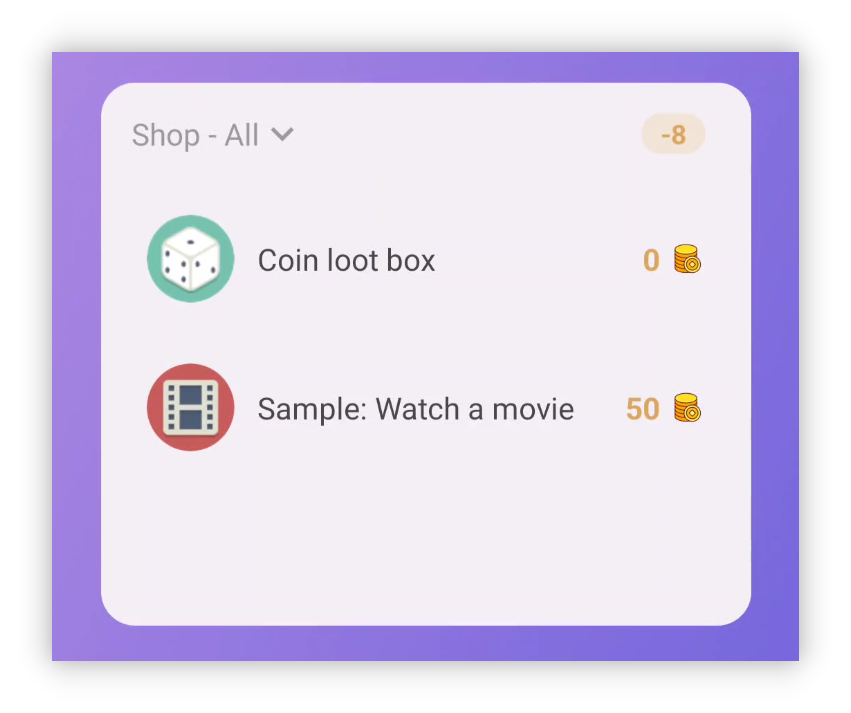

## v1.92.0 - Neu gestaltete Statistik, Desktop-Update, mehr Widgets

**Danke, dass du LifeUp nutzt!**

Hier die jüngsten Updates für v1.91.1–v1.92.0.

Wir hoffen, sie helfen dir bei Nutzung und Produktivität.

Bei Fragen oder Vorschlägen: 📫[lifeup@ulives.io](mailto:lifeup@ulives.io) oder ein Issue auf GitHub (https://github.com/Ayagikei/LifeUp/issues

---

## 🔖Überblick

### 📱Android-App

1. 📈**Neu gestaltete Statistik**
2. 🏆**Neue App-Widgets**: Shop-Gegenstände und EP-Änderungs-Widget
3. ✨**Neue Funktion**: Shop-/Inventar-Listen ausblenden

### 🖥️Desktop

1. ✨**Automatische Verbindung**
2. 🚀**Gefühle als Markdown exportieren**
3. 🖥️**macOS-Installationspaket**

## 📱Android-App-Updates

### 🏆Neu gestaltete Statistik

Statistik und Datenauswertung sind wichtig für Produktivität – und eine Quelle für Inspiration und Feedback.

Im Rückblick siehst du Fortschritt und Erfolge in Zahlen und erkennst Schwachstellen.

Dafür gibt es **[Statistik 2.0]** mit vielfältigen Einblicken.

 

#### ❓So geht's?

Nach Update auf v1.92.0: Seite **[Statistik]** → oben **[Neue Statistik anzeigen]** tippen.

 

#### 📊Statistik-Inhalte

Statistik 2.0 analysiert verschiedene Module: Anteil fokussierter Aufgaben in Pomodoros, durchschnittliche Pomodoros pro Tag, tägliche Attributänderungen, Gegenstandskäufe, Aufgabenabschlüsse und mehr.

 

#### ⏰Zeitfilter

Und es unterstützt **flexible** Zeitbereiche – Tag, Woche, Monat, Jahr oder benutzerdefiniert.

LifeUp soll zu dir passen: Du musst nicht bis Jahresende warten und verlierst keine Jahreszusammenfassung.

In LifeUp erreichst du **Jahreszusammenfassungen vergangener Jahre** jederzeit. Neugierig auf 2022? Update und probier es aus!

 

#### 👥Teilen

Teile deine LifeUp-Reise mit der Community!

Statistik-Karte lang drücken → Share-Karte erstellen → mit einem Tipp in andere Apps teilen.

------

### 🏆**Neue App-Widgets**

#### Shop-Listen-Widgets

Zwei Shop-Listen-Widgets in groß und klein.

Kaufen und nutzen direkt vom Desktop~

> Hinweis: Das ist das „Shop“-Widget, nicht das „Inventar“-Widget.
>
> Du kannst kaufen und nutzen, siehst aber nicht direkt die Gegenstände im „Inventar“.

 

Wie bei der Aufgabenliste:

**Jedes Widget kann eine andere Liste wählen.**

 

Tippe auf den Hintergrund oben → schneller Sprung zur Shop-Seite in der App.

#### Tägliche EP-Änderungen

Mit diesem Widget siehst du auf dem Startbildschirm die tägliche Zusammenfassung deiner Erfahrungspunkte-Änderungen.

------

## 🖥️Desktop

### ✨Automatische Verbindung

Laut Feedback hindert das manuelle IP-Eintragen viele am Desktop.

Dieses Update erkennt die IP des LifeUp Cloud Servers automatisch.

 

Voraussetzung:

- LifeUp Cloud v1.3.0 (Google Play oder GitHub Releases).

Die Desktop-Version erkennt die IP automatisch – kein manuelles Eintragen mehr.

> Getestet vor allem unter Windows.
>
> Unter macOS funktioniert die automatische Erkennung ggf. noch nicht.

------

### 🚀**Gefühle als Markdown exportieren**

Der Desktop exportiert Gefühle im Markdown-Format.

Gruppierung und Export auf verschiedene Arten; Bildanhänge bleiben vollständig.

Mit Markdown kannst du **Drittanbieter-Tools** nutzen und z. B. PDF oder Word erzeugen.

------

### **✏️Aufgabe hinzufügen**

Mit den früheren APIs unterstützt der Desktop einfache Aufgaben.

Noch nicht alle App-Optionen – aber genug für einfache Aufgaben.

Bearbeiten und weitere Optionen folgen in späteren Versionen.

------

### 🖥️**macOS-Installationspaket**

Ab Version 1.1.0 gibt es auch macOS-Installationspakete.

Kurzer Test: macOS-Version funktioniert im Wesentlichen normal.

Details: [🖥LifeUp Desktop (lifeupapp.fun)](https://docs.lifeupapp.fun/en/#/guide/api_desktop)

### **Versionshinweise**

#### LifeUp Android app

**1.92.0-rc02 (2023/07/16)**

**🐛Fix**

1. Shop-Widget springt ggf. nicht zu anderen Apps (API-Ausführung)
2. Gelegentliche Anomalie beim Listenwechsel im Shop-Widget
3. Shop-Widget blendet ausverkaufte/nicht kaufbare Gegenstände nicht gemäß App-Einstellungen aus
4. Shop-Widget reagiert ggf. nicht auf bestimmten Gegenstand
5. Seltene Abstürze behoben

**1.92.0-rc01 (2023/07/11)**

**✨Funktionen**

1. Statistik 2.0
2. Share-Karte

**♻️Optimierung**

1. Preise für „nicht kaufbare“ Gegenstände (z. B. Rückgaben)
2. Wenn „Aufgabenstrafe separat“ aus ist, wird der Strafe-Button nicht mehr angezeigt
3. UI der Unteraufgaben in Team-Details optimiert
4. UI der Gefühle optimiert

**🐛Fix**

1. Bei Attribut-Clipping „Abgerundetes Rechteck“ zeigt Bearbeitungs-Icon ggf. lange das alte Icon

#### **LifeUp-Desktop**

**v1.1.0 (2023/06/25)**

**🚀Funktionen**

1. Automatische Prüfung der „LifeUp Cloud“-IP und Verbindung (LifeUp Cloud v1.3.0)
2. Aufgaben hinzufügen, Optionen noch begrenzt (Fixed [#6](https://github.com/Ayagikei/LifeUp-Desktop/issues/6))
3. Gefühle als Markdown exportieren (Fixed [#5](https://github.com/Ayagikei/LifeUp-Desktop/issues/5))
4. Traditionelles Chinesisch
5. macOS-Release
6. Update-Prüfung

**🔧Optimierung und Fehlerbehebungen**

1. Erfolgs-Unterkategorien werden korrekt angezeigt
2. Einige Icons werden korrekt angezeigt (LifeUp v1.91.3)
3. Titel-Mismatch (Fixed [#8](https://github.com/Ayagikei/LifeUp-Desktop/issues/8))
4. Verknüpfungen im Windows-Installer (Fixed [#13](https://github.com/Ayagikei/LifeUp-Desktop/issues/13))
5. Fenstergröße angepasst für Auflösungen unter 1080p

#### **LifeUp Cloud**

**v1.3.0 (2023/06/25)**

**🚀Funktionen**

1. mDNS-Dienst für automatische IP-Erkennung durch Desktop (Desktop v1.1.0)
2. Ergebniswerte für per ContentProvider aufgerufene APIs.

**🔧Verbesserungen**

1. Größerer Klickbereich für QR-Code-Scan
2. ActivityNotFound-Absturz behoben
