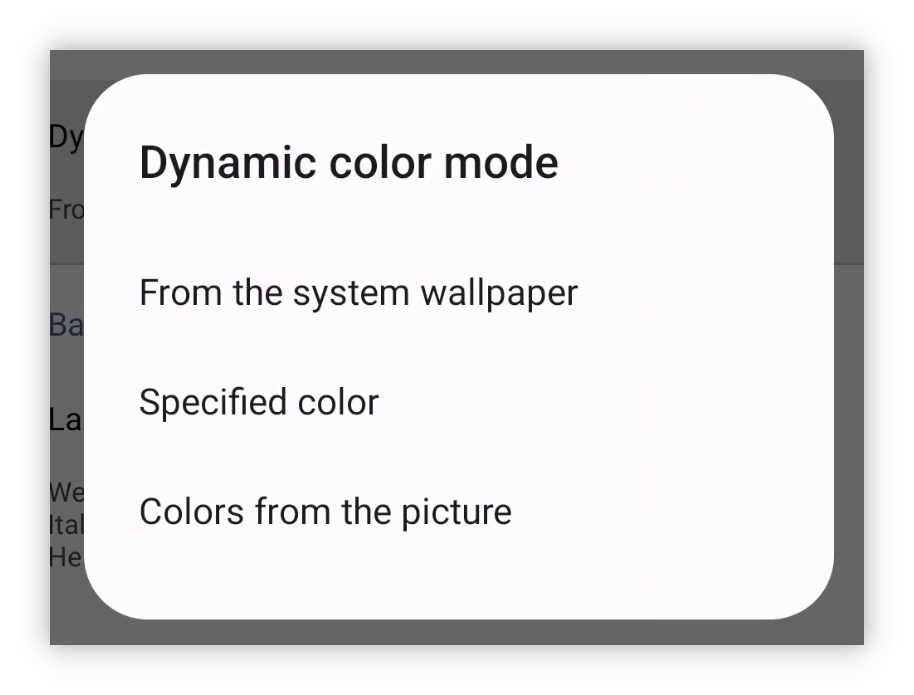

## v1.93.0 - Aufgabenvorlagen und Material 3

## 🚀Einführung

Bei LifeUp hören wir genau auf euer Feedback – zuletzt haben wir stark nachgefragte Funktionen ausgebaut. Wir verfeinern LifeUp weiter nach euren Wünschen.

Gleichzeitig arbeiten wir an der Entwicklungs-Roadmap und planen weitere spannende Updates. Euer Vertrauen treibt uns an.

Außerdem erkunden wir Technologien wie Flutter und KMM – das eröffnet neue Möglichkeiten für LifeUp. Bleibt dran. 🚀🔍

**Dieses Update bringt Aufgabenvorlagen, geheime Erfolge und vollständige Anpassung an Material You – und mehr.**

**Module wie Gefühle und APIs wurden ebenfalls verbessert.**

Bei Fragen oder Vorschlägen: 📫[lifeup@ulives.io](mailto:lifeup@ulives.io) oder ein Issue auf GitHub (https://github.com/Ayagikei/LifeUp/issues)

---

## I. 📋 Aufgabenvorlagen

Diese Version führt eingebaute Aufgabenvorlagen ein. Kein indirektes Anlegen mehr nur über „Aufgabe kopieren“ und APIs.

Beim Erstellen oder Bearbeiten kannst du die aktuellen Einstellungen als Vorlage speichern.

Beim späteren Anlegen importierst du Belohnungs- und Aufgabeneinstellungen mit einem Klick.

### 📕 So geht's?

Beim Erstellen oder Bearbeiten: Schaltfläche **Aufgabenvorlagen** in der oberen Leiste.

Vorlagen speichern die meisten Einstellungen – aktuell **ohne** Frist.

## II. 🎨 Material-You-Theme

Diese Version passt vollständig an Material You an.

Moderneres, klareres Erscheinungsbild – eine von Google empfohlene UI-Richtung.

Kernidee: „Jeder kann eine andere Theme-Farbe haben.“

So kann „LifeUp“ dynamische Farben aus dem Hintergrundbild und eigene Theme-Farben nutzen. (Geräteunterstützung vorausgesetzt.)

### 📕 So geht's?

Seitenleiste → Einstellungen → Anzeige → zugehörige Optionen.

Ohne dynamische Theme-Farben: Preset-Farben wählen.

Mit Unterstützung: Feature aktivieren und Farben flexibel anpassen:

## IV. 🌐 Neue offizielle Website

Neue Landingpage – LifeUp mit Freunden teilen ist einfacher.

Besuche [lifeup.ulives.io](https://lifeup.ulives.io) für einen ersten Eindruck.

## III. ✨ Weitere Funktionen

**UI-Theme**

1. Vollständige Anpassung an Material Design 3.
2. Material-Design-3-Theme-Farben: eigene Farben, aus Wallpaper, aus Bildern.
3. Animationen verbessert, z. B. Pop-ups.
4. Edge-to-Edge (immersiv) optimiert.

**Aufgaben**

1. Aufgabenvorlagen.
2. Statistik auf der Detailseite: Wechsel nach Zeitkriterien; Standardoptionen optimiert.
3. Verlauf: Suche nach Aufgabenname; UI und Interaktion angepasst.

**Erfolge**

1. Geheime Erfolge.
2. Beim Hinzufügen: „Nächsten Erfolg weiter hinzufügen“.

**Attribute**

1. Attribute ausblenden.

**Pomodoro-Timer**

1. Zeiteinträge bearbeiten.
2. Auf der Pomodoro-Seite: Aufgabe abschließen (Langdruck auf gewählte Aufgabe im Pausenmodus).

**Gefühle**

1. Gefühle direkt auf der Gefühle-Seite hinzufügen.

**API**

1. „use_item“-API.
2. „random“-API.
3. „edit_exp“-API.
4. „item“-API: u. a. „action_text“, „disable_use“, „title_color_string“.
5. „shop_settings“-API: Parameter „silent“.
6. „time“-Platzhalter – Aufgaben wie „morgen fällig“ ohne Automatisierungstools.

------

Zusätzlich viele gemeldete Probleme behoben. Details im Changelog unten.

### ♻️ Optimierungen

1. Präfixe an manchen Stellen für Daten-IDs.
2. Anzeige von Team-Aktivitäten optimiert.
3. Zu lange Toast-Benachrichtigungen besser darstellbar.
4. Widget-Abschluss in Teams konsistent mit In-App-Verhalten.
5. Statistik: Nach „Benutzerdefiniert“ erneut „Benutzerdefiniert“ → Datumsauswahl erneut.
6. Harmony OS 4: Fortschrittsbalken-Benachrichtigungen mit Aktionsbuttons.
7. Interaktionslogik bei Benachrichtigungsanfragen verbessert.
8. Eingabemethode blockiert „Wiederholungsanzahl“ nicht mehr.
9. Beim Anlegen: Nicht-spezifische Startzeiten (automatisch, heute fällig) werden gespeichert; beim Bearbeiten wiederhergestellt statt konkreter Zeiten.
10. Unerwartete Duplikat-Warnungen beim Anlegen auch im Pop-up „Duplikate prüfen“.
11. Indonesische Sprache.
12. Übersetzungen aktualisiert.

## 🐛 Fehlerbehebungen

1. World-Modul hängt unter Umständen beim Laden.
2. Shop/Lager zeigt unter Umständen dauerhaft Laden.
3. APIs mit UI-Inhalt über Content Provider.
4. Aufgabensortierung entsprach nicht der Erwartung.
5. Falsche Statistikdaten nach „Benutzerdefiniert“-Zeitraum.
6. Pop-ups für Benachrichtigungsanfragen nicht scrollbar.
7. World-Suche zeigte unter Umständen alles.
8. „Erledigte anzeigen“ zeigte auch eingefrorene Aufgaben.
9. Falsche Durchschnittswerte auf der Statistikseite.

## Besonderer Dank an GitHub-Mitwirkende, E-Mail-Feedback und Crowdin-Übersetzer

Danke an alle, die GitHub-Issues einreichen, per E-Mail Feedback geben und auf Crowdin übersetzen.

Eure Beiträge prägen „LifeUp“ für die globale Community – Funktionalität und Zugänglichkeit. Unbezahlbar.

Während wir LifeUp weiter verbessern: herzlichen Dank für eure Unterstützung. 🙏📧🌍
