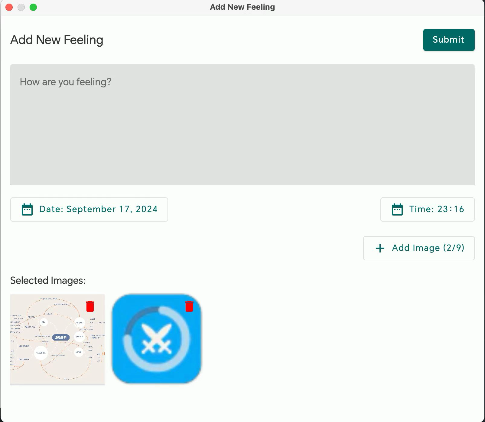

<h1 align="center" padding="100">v1.98.0 API 2.0 & Desktop-Client-Update</h1>

## Einführung
Das erste Release 2025 mit folgenden Schwerpunkten:

- Emoji-Icon-Unterstützung: Emojis direkt als Icons für Gegenstände, Erfolge und mehr.

- Zweite API-Update-Welle: Schnittstellen unterstützen jetzt Bearbeiten von Aufgaben, Gegenstandseffekten, Erfolgs-Freischaltbedingungen, Synthese und fast allen Kernfunktionen.

- LifeUp Cloud und Desktop-Client optimiert: bessere automatische Verbindungserkennung; Desktop mit „Neue Gefühle“ und Backup Import/Export.

## I. Emoji-Icons

### 📕So geht's?

- Beim Icon wählen für Gegenstände, Erfolge usw. kannst du Emoji-Ausdrücke direkt als Icons wählen.

## II. Zweite API-Update-Welle

Seit API-Freigabe in v1.90.0 sehen wir viele Nutzer, die reichhaltige Inhalte per API bauen – von URL-Grundlagen bis Desktop-Widgets, DIY-Desktop-Clients und Web-Integration. Beeindruckend.

Wegen komplexer Datenstrukturen und hohem Entwicklungsaufwand fehlten im ersten API-Batch Kernfunktionen: Aufgaben bearbeiten, Gegenstände bearbeiten, Erfolge mit Freischaltbedingungen, Gegenstände mit Nutzungseffekten. Diese Arbeit dauerte bis zu dieser Version.

Design, Entwicklung, Tests und Updates für Cloud, Desktop und API-Doku brachten exponentiell wachsende Last – der vor Monaten gestartete Branch ist erst jetzt fertig getestet.

**Aber es hat sich gelohnt! Heute deckt die API fast alle Kernfunktionen von LifeUp ab. Mit offener API soll LifeUp mehr als eine App sein – eine offene Plattform, auf der Nutzer eigene Gamification-Systeme entwickeln, erweitern und anpassen.**

### 📕So geht's?

- API-Nutzung: Dokumentationsbibliothek → Verzeichnis → Abschnitt Offene Schnittstelle.
- Neue API-Schnittstellen sind in der Dokumentation ergänzt.

## III. Desktop-Client: Archiv & Gefühle

### Archiv

Backup-Dateien kannst du jetzt direkt im Desktop-Client exportieren oder importieren.

Das vereinfacht Datentransfer auf andere Geräte und Wiederherstellung.

### Neue Gefühle veröffentlichen

Neue Gefühle vom Desktop veröffentlichen – mit Bildern und Zeiteinstellungen.

⚠️Hinweis: Gefühle bearbeiten wird noch nicht unterstützt.

### Weitere Updates

- Verbindungsfehler und Erklärungen optimiert: klar zwischen Netzwerk und LifeUp-Backend nicht aktiv
- Aufgabendetails anzeigen
- API-Token-Sicherheitsprüfung (optional, LifeUp Cloud 2.0.0)
- Kauf-Logik nutzt neue „Gegenstand kaufen“-API statt „Gegenstandsmenge anpassen“ + „Münzen anpassen“. Kauflimits werden korrekt wie in der App behandelt.

Dieses Update zeigt API-Fähigkeiten am Desktop – alle Desktop-Funktionen laufen über die API.

## IV. LifeUp Cloud Optimierung

> LifeUp Cloud stellt die API als HTTP-Schnittstellen bereit und verbindet den Desktop-Client.

Viele Optimierungen nach Feedback zu LifeUp Cloud:

- Statusanzeige: schnell erkennen, warum der Desktop nicht verbindet
- Erweiterte Einstellungen
  - Cross-Origin-Zugriff: für Web-Technologien auf LifeUp Cloud HTTP
  - Eigene Dienstports
  - Zugriffstokens: optionale Sicherheitsprüfung
- Fehlerrückgaben und Spezifikationen der Cloud-Schnittstellen optimiert
- Service Discovery und HTTP-Schalter optimiert – automatische Erkennung im Desktop soll besser funktionieren

## V. Vorschau

Da dieses Update relativ wenige Nicht-API-Funktionen bringt, eine Vorschau auf kommende Versionen (teils in Entwicklung):

- **Große Funktion:** Wiederholbare Erfolge
- **Mittlere Funktion:** Textlesbarkeit bei benutzerdefinierten Hintergründen
  - Zuerst als kleine Änderung gedacht, erwies sich als komplex
- **Kleine Funktion:** Abschließen und später erinnern in Benachrichtigungen
  - Persistente Benachrichtigungen geplant, verworfen – neuere Android-Versionen unterstützen echte Persistenz nicht mehr

## VI. ✨Vollständiges Changelog

### **LifeUp-Android**

**v1.98.0 (2025/01/01)**

**✨Funktionen**

1. Google-Anmeldung und Drive-Autorisierung über Credential Manager.
2. Emoji als Icons wählbar.
3. ContentProvider Query API: Synthese.
4. ContentProvider Query API: Pomodoro-Aufzeichnungen.
5. ContentProvider Query API: Mehrere Gegenstände zurückgeben.
6. Pomodoro-API (Pomodoro-Anzahl anpassen).
7. export_backup API (Backup exportieren).
8. purchase_item API (Gegenstand kaufen).
9. synthesize API (Synthese auslösen).
10. subtask API (Unteraufgaben anlegen oder anpassen).
11. subtask_operation API (Unteraufgaben bedienen, z. B. abschließen).
12. synthesis_formula API (Syntheseformel).
13. edit_task API (Aufgabe bearbeiten).
14. category API (Liste anlegen oder anpassen).
15. history_operation API (Verlauf anpassen).
16. AppSettingsScheme API (App-Einstellungen anpassen).
17. achievement API (Erfolg anlegen oder bearbeiten).
18. skill API (Attribut anlegen oder bearbeiten).
19. Anzeige von Unteraufgaben-id und gid.
20. Anzeige der Synthese-id.
21. Abfrage von creditLimit.
22. ContentProvider API: Unteraufgaben abfragbar (id, gid).
23. ContentProvider Gegenstände: Feld „maximal kaufbare Menge“.
24. ContentProvider Shop API: Gegenstände nach id-Liste.
25. Rückgabewert bei falscher ContentProvider-URL optimiert.
26. Abfrage einzelner Erfolge.

**♻️Optimierung**

1. Standard-Sortierung neu hinzugefügter Gegenstände optimiert.
2. Standard-Sortierung neu hinzugefügter Attribute optimiert.
3. „add_item“ API: Parameter `purchase_limit`, `disable_use`, `effects`.
4. „add_task“ API: `background_alpha`, `items`, `start_time`, `auto_use_item`, `remind_time`, `pin`.
5. „add_task“ API: mehr Aufgabenfrequenzen.
6. „item“ API: `effects`, `purchase_limit`.
7. Vorherige APIs (z. B. Eingabe): Abbruch unterstützt.
8. Numerische Platzhalter: Parameter `signed`.
9. Zufallszahl- und Dezimal-Platzhalter.

### **LifeUp-Desktop**

**v1.2.0 (2025/01/01)**

**🚀Funktionen**
1. Archivverwaltung
- Backup auf Computer
- Wiederherstellung vom Computer
- Drag-and-drop
2. Neue Gedanken anlegen
- Bildauswahl
- Bild-Sync zum Handy
3. Aufgabendetails anzeigen
4. Kauf-System verbessert
- Neue „Gegenstände kaufen“-API
- Kauflimits wie in der App
5. Optionale API-Token-Validierung
6. Multiplattform
- Windows
- Linux
- macOS (Apple Silicon)
- macOS (Intel) 🆕
7. Fehlerbehandlung und Benachrichtigungen verbessert

### **LifeUp Cloud**

**v2.0.0 (2025/01/01)**

**🚀Funktionen**
1. Dienst-Optimierung
- Service Discovery und Kompatibilität verbessert
- Mehr Geräte mit automatischer IP-Erkennung
- Start/Pause-Übergänge optimiert
- Fehlerbehandlung und Benachrichtigungen verbessert
2. Sicherheit & Performance
- Optionale API-Token-Validierung
- CORS-Konfiguration
- Eigene Ports
- Eigene Wake-Lock-Dauer
3. UI
- Neues Interface-Design
- Verbesserte visuelle Erfahrung
