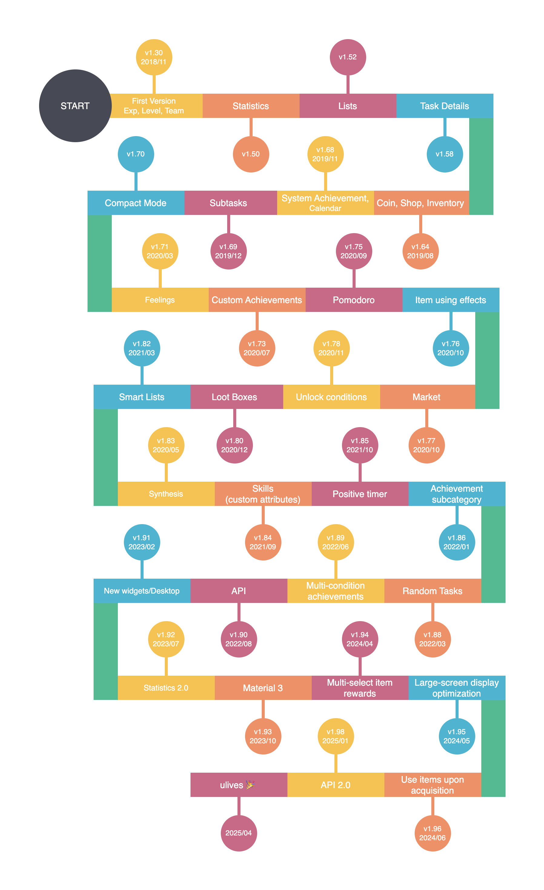

# Release Log

## Timeline

## Log

(Part of the translation is provided by Google Translate and may not be accurate)

**1.88.4 (2022/4/21)**

1. Fix the problem that warehouse search will cause crash
2. Fix the display disorder of custom background and history page
3. Fix the UI overlap problem when editing
4. Fix the problem that the quantity may be displayed abnormally when the achievement is rewarded with goods
5. Fix the problem that the completion times of achievement calculation items may not match the actual times in some special cases
6. Fix the problem that the title may disappear when the history page is clicked quickly
7. When creating or editing an item, after clicking on the property, the soft keyboard cannot be popped up by clicking the input box that is in focus again.
8. Fixed the crash issue when setting monthly purchase limit in French language

**1.88.3 (2022/4/09)**

1. Fixed that after restoring the backup, the cloud backup will prompt a conflict problem
2. Fixed the problem that the edited task start time and subtask reminder time did not select the filled time by default
3. Fix the problem that other effects will only be calculated once during batch simple synthesis
4. Fixed the issue that any attribute of the system achievement reaching level 10 would not be counted into the custom attribute
5. Fixed the abnormal display of the text UI on the "My" page for non-members

**1.88.2(-)**

> Updates included in 1.88.3

**1.88.1 (2022/4/02)**

1. Fix a crash caused by backup reminder

**1.88.0 (2022/3/30)**

✨Features

1. Added the function of sharing "random tasks" in the world module
2. Counting items can optionally set the coefficient to affect the number of items
3. Support setting loan interest rate
4. Picture management supports one-click filtering of unused pictures + select all operations
5. Support custom image cropping size (that is, use higher-definition icons, membership functions)
6. Explicitly display the "feelings" switch within the achievement
7. Optimize the sorting algorithm of the "All" list

⚡️Optimized

1. Optimize the visual effects of some pop-up windows
2. Optimize the interaction of backup/restore functions
3. Optimize the loading speed of the delegated page
4. Greatly optimized the loading speed of the product selection pop-up window

🐛 Fixes
1. Fixed the problem of custom background disorder
2. Fixed the problem that the task may be created to the deleted list
3. Some crash bug fixes

**1.87.1（2022/3/07）**

1. The sorting menu of shop and inventory explicitly displays "custom" sorting
2. Fix the problem that abnormal sorting may occur in the inventory
3. Added a button to jump to email feedback on the feedback page
4. Optimize the prompt for restore failure due to database version problems
5. Fixed the problem that the number of coins in the compact mode card is not displayed

**1.87.0 official version (2022/3/04)**

1. Fix the problem that the custom card background will zoom abnormally in some cases
2. Fixed an issue where clicking on the task reminder notification may jump to the wrong task details when continuously receiving task reminders
3. Fixed the problem that the numbers on the card were not refreshed normally when sliding to increase the count task count
4. Added new  guide task for some language

**1.87.0-rc02（2022/2/25）**

1. Improve error handling and prompts for recovery operations
2. Optimize the interaction of setting "day of the week", and increase the warning of abnormal setting (start-period is not on the same day)
3. Optimize the night mode color matching of some pages
4. Fix the problem that the cache may be displayed incorrectly in the picture selection box and picture management
5. Fixed the problem that the "Download" operation in the backup conflict pop-up window does not support Google Drive/Dropbox
6. Fix the problem that the search of the store may show wrong results
7. Fix the problem that the top of the task may fail
8. Fix some UI exceptions and text issues

**1.87.0-rc01（2022/2/23）**

**✨Feature**

1. Achievement sub-category supports folding operation
2. Introduce the Material You design style switch (experimental)
3. Inventory supports sorting by shop
4. Inventory supports commodity "star" operation
5. The shop supports select all operations
6. Shop and Inventory related operations support selecting MAX quantity
7. Tasks support continuous creation
8. Task support configuration: The description of the product reward will be automatically added to the card remarks (that is, "Reward: [a product] x1" will be automatically displayed) 
9. The task supports the specified freezing duration

**⚡️Improvements**

1. Add a "Skip" button to the backup conflict pop-up window
2. Play version supports French/Polish
3. Task click notification reminder now supports jumping to task details
4. When editing the time related to the task, the default pop-up window will point to the time before editing instead of the current time
5. Each list selection entry of the store supports "Rename", "Delete", "New" operations
6. Extension page UI redesign
7. Added a second confirmation pop-up window for "Delete Calendar Account"
8. The product will no longer be automatically removed from the shelf if it is sold out
9. The "Get up early" task in the example task is changed to 0 penalty
10. When getting an item reward, if the item quantity is negative, a related warning will now appear
11. Optimize the random algorithm of gold coins in the effect of commodity use
12. "Set as complete" operation adds complete sound effect
13. Optimize some UI display in night mode
14. Optimize the performance of the task list

**🐛Fixes**

1. Fix the abnormality of "unconcerned" copy in some languages
2. Fix the problem that the product icon on the "Return" pop-up window may display abnormally
3. Fix the problem that the task may be repeatedly generated when the task is completed quickly
4. Fix the problem that the memory of the current list of the "synthesis" system may be invalid
5. Fix the problem that QQ login may not be possible in the horizontal screen state
6. Fixed the issue that when editing a recipe in the [All] list in the "Synthesis" system, the recipe might disappear from the original list
7. Fixed an issue where clicking to complete an infinite task multiple times in a row may cause the display of the number of completions to return to zero
8. Fixed the issue that the backup interval could not be set to "Monthly"
9. Fix the problem that the experience icon is not displayed in the simple mode
10. Fix the problem that the "Achievements" and "Achievement List" columns are missing in the picture management
11. Fix the problem that the task details page does not support abandoning team tasks
12. Fix the problem that the guide of the world module is not displayed correctly
13. Fix the problem that the product can be successfully shared when the image upload fails, but the local image will be overwritten
14. Fix some rare crashes and exceptions

**1.86.0（2022/1/20）**

**Feature**

1. Achievement sub-category: Divide categories, automatically count category counts
2. Google Drive backup
3. Picture management function (in the backup page)
4. Product random gold coin effect
5. Batch copy of achievements
6. Step counting supports multiple input of steps and multiple rewards
7. Pomodoro supports setting up commodity exchange
8. Support custom return discount ratio
9. Use exclusive format for backup (some systems support direct opening and import backup)
10. Simple synthesis supports batch operation
11. Newly added custom sound effect option: commodity use
12. New achievement unlocking condition: current ATM deposit
13. Statistics on the number of times that negative matters support the detail page
14. "All" list supports renaming
15. The naming and description of notification channels for unified applications

**Improvements**

1. Prioritize achievements that have been unlocked but not received rewards
2. The Pomodoro Today’s focus time on the status page will be displayed in hours according to the time.
3. The warehouse adds commodity description display
4. New account registration will pop up a confirmation dialog
5. Support for displaying maintenance announcements
6. Added "Skip" confirmation dialog for Pomodoro Extra Time
7. Support saving data when uninstalling the application (system support required)
8. Optimize backup and recovery logic
9. Optimize the overdue logic of single items and unlimited items, and support editing
10. Optimize the chart statistics time basis of unlimited events, based on the completion time rather than the deadline time
11. The compact mode card will also show the overdue time of single and unlimited items
12. Try to improve the survival rate of the countdown function in the background
13. Optimize the impression function:
    -On by default
    -The team task setting page does not display the "Impressions" switch that does not actually take effect
    -Remove the confusing feeling switch memory function
14. Select the pop-up window for the list of commodities and warehouses to increase the number of commodities displayed
15. When the notification bar continues to time, the vibration effect in progress will also be cancelled
16. The dynamic text in the world module supports selected copy
17. Optimize the data refresh animation effect of the custom achievement page
18. Optimize the recovery logic, display the "Loading" dialog box instead of directly stuck interface
19. Optimized the problem that the bottom button may not be seen in the "Crash pop-up window"
20. Click the task notification reminder, and now it will jump to the list page where the task is located
21. Custom attribute icon, now supports selecting application built-in icon library
22. Optimize the "Read Later" sharing operation name instead of directly displaying the application name
23. Optimized the notification of achievement unlocking, the achievement description will now be displayed
24. When the desktop widget enters the homepage, it will automatically jump to the "delegation" module
25. Optimized the display of copywriting after the completion of the day list
26. Optimize the operation copy and sequence of the product countdown effect
27. When all attributes are hidden, the status page no longer displays the "Attribute" card

**Fixes**

1. Fix a rare crash issue when unlocking pop-up windows for achievements
2. Fix the display problem that one task may squeeze multiple lines when emptying desktop widgets with insufficient width
3. Fix the issue that the first exercise authorization for step counting may support the display of the total number of steps accumulated by the sensor
4. Fix the crash or recovery confusion when pausing a countdown and then starting another countdown
5. Fix the problem that the 0-minute countdown effect of the product can be entered and it will crash
6. Fix the problem that the name of the currently selected list is not refreshed in time when renaming the currently selected list on the page of adding or editing items
7. Fix the abnormal display of cards with repeated frequency of "annual"
8. Fix the problem that custom gold coins will not take effect in time in some cases
9. Fix the issue that widgets will display frozen items
10. Fix the problem that the custom achievement does not display the "long press operation" prompt
11. Fix the problem that the total experience value of the "My" page does not count the experience value of the custom attribute
12. Fix the problem that the "Impressions" page refreshes back to the top after previewing the picture abnormally
13. Fix the problem that the static shortcut of "Tomato" will only jump to the homepage when the application has been started under MIUI system
14. Fixed an issue where non-members might also load custom backgrounds
15. Fixed the problem that the number of gold coins on the store page was not refreshed in time
16. Fix the problem that the calendar cannot be turned to the next year
17. Fix the problem that the list name on the widget will not be refreshed in time after the name of the list is modified

**Release Candidate -> Official Version**

1. Optimize the success rate of uploading large files on Google Drive, increase the retry and optimize the block strategy
2. Fixed the problem that members may not display the button for individual custom task backgrounds in a non-Chinese environment
3. The backup of Google Drive/DropBox failed and jumped to the backup page instead of the WebDAV configuration page
4. Add a pop-up window description of Google Play verification failure, and provide data export path
5. The nickname of the "My" page changes color according to the membership status
6. Eliminate the floating point error problem of ATM interest rate in most scenarios
7. When deleting local data, custom background, attribute picture and sound effect files will also be deleted synchronously
8. Fix the abnormal problem of step count chart
9. Fix the problem that the properties of the new to-do page are not refreshed after clicking the question mark button of the property from the new to-do page, jumping to the property customization page for editing, and returning to the new to-do page
10. When customizing the effect of the product, clicking outside the pop-up window will no longer automatically cancel the pop-up window, avoiding the loss of editing content
11. Optimize the foreign language UI problem of the product setting page (the Russian text is too long)
12. Attempt to fix the crash of color toast on some models
13. Fix the problem that the use button can still be clicked when the warehouse page is selected
14. Fix the logic of displaying overdue single tasks in the smart list, and adapt to the new overdue time storage method
15. When the warehouse is selected, the toggle list should be deselected 

**1.85.4 (2021/12/08)**

Regular bug fix version, the next feature version is still under development~

1. Fix the problem that the default icon of the gold coin of the widget in the non-dark mode is not displayed correctly
2. Fix the problem that the animation of the progress bar does not play normally in the case of continuous upgrade/downgrade
3. Fix the problem that the number of gold coins on the warehouse page is not updated in time
4. Fix the issue that the deadline may be forcibly changed when editing the "day of the week" item
5. Fix the problem that screen rotation may cause the information of the changed subtasks to be lost when editing items
6. Fix the problem that the number of gold coins does not actually take effect when creating new or editing products
7. The display conditions of the annual completion times on the amendment details page
8. Optimize the storage of pictures in the app, and should not be scanned by the system photo album
9. Optimize the description of the feeling switch
10. Fix some crashes

**1.85.3 (2021/11/18)**

1. Optimize the time calculation method of the timing, will make up for the CPU sleep time
2. Fix the problem that editing the icon while copying the product will cause the original product icon to be lost
3. Other minor bug fixes (such as team tag)

**1.85.2 (2021/11/07)**

1. Fix the problem that records and rewards cannot be generated during settlement after the timing is suspended
2. Fix that using the "move to" operation under the smart list will cause the list to display inaccurately
3. Fix the problem that the current value display of "Current number of gold coins" does not match the actual calculation (the current value display does not include ATM deposits)
4. Fix the problem that the record and reward will be repeated after the Pomodoro work is over, and then the skip button is clicked twice in a row

**1.85.1 (2021/11/02)**

0. Fix loading problem of feelings list

**1.85.0 2021/10/20)**
*Feature*

1. Pomodoro supports positive timing mode
2. Paste multiple lines of text to quickly create subtasks
3. Commodity support copy operation
4. Swipe to switch the direction of the list of items, support reverse (settings-items)
5. Support clearing the Pomodoro to get the record
6. The Pomodoro adds a forced horizontal and vertical screen switch button
7. Achievement unlocking conditions have been increased:
   ● The number of products obtained by synthesis
   ● Cumulative acquisition quantity of goods
   ● The current quantity of the product
   ● Life level
   ● (Repetitive) the focus time of the task
8. The skill icon also supports multiple cropping settings
9. Static shortcut:
   ● New task
   ● Enter the Pomodoro page
10. Sound effect customization increased:
    ● Obtain achievement rewards (including system achievements and custom achievements)
    ● Unpacking
    ● Synthesis (including simple synthesis and synthesis)
    ● Notification sound effect
11. Gold coin icon customization
12. Product use effect supports setting multiple experience value change effects
13. Changes to the experience pie chart adaptation skills
14. The history page supports status filtering
15. Team tag function

*Improve*

1. When the subtask gold coin reward is 0, the gold coin reward will not be displayed in the details
2. Create a new achievement list page and add a guide to "Create Achievement"
3. Optimize the icon display of widgets
4. Complete subtasks to add sound effects (details, new pages)
5. After entering content on the new or editing (items, products, achievements, synthesis) page, click the return button, and a confirmation box to discard changes should pop up
6. Sort optimization of product creation (in the case of custom sorting, newly added products should be the top priority)
7. When editing items/products, the input method should not pop up automatically
8. New item page should support horizontal screen and no data loss
9. Member theme color adaptation for desktop widgets
10. Optimize the product selection box, change the display and then load the data asynchronously
11. The warehouse label also adds "composite" and "ATM" entrances
12. Put the [Set as complete] and [Undo] operations in the history change status back to the first level menu
13. Add the Pomodoro quick entry for details of the event
14. Optimization of the sorting of the "All" list of the store (addition of the option of grouping by list, only stores)
15. After selecting the days of the week to repeat, the deadline time should be calculated again. (Prevent the user from choosing a work day to repeat, and the deadline still stays on Saturday and Sunday.)
16. When returning to the "Delegation" page, if the "+" button is not displayed, the display will be triggered.

*Fixes*

1. Fixed the problem that the progress on the list was not refreshed in time when the achievement page was configured to the bottom navigation bar
2. The state switching problem of historical items is fixed
3. Negative countdown overdue display repair
4. The achievement of gold coins should be included in the deposit in the ATM
5. Fixed the problem that when the Pomodoro is paused, reentering the Pomodoro twice will cause the time to be cleared
6. Fix the purchase restriction may become invalid under certain circumstances
7. Fix the problem that countdown records will repeat in rare cases
8. Fix the problem that clicking different task cards in quick succession may cause the task content of one of the cards to be blank after returning to the page
9. Logic adjustment of automatic calculation of gold coins and experience points
10. Fixed some crashes

**1.84.4 (2021/10/09)**

1. Fix the problem that the built-in icon may not be displayed

2. Update Q group

**1.84.3 (2021/10)**

1. Update overseas text

**1.84.2 (2021/09/26)**

1. Fix the deadlock problem that may be caused by synthesis

2. Fix the problem of abnormal usage effects displayed in the product details that are not available

3. Optimize the visual effect of rounded corners of widgets

**1.84.1 (2021/09/20)**

1. Fix the problem that the target repeat count cannot be cleared during editing

**1.84.0 (2021/09/19)**

***Features***

1. Skill system (attribute customization)

   All the original mechanisms are adapted to the attribute customization system, such as achievement attributes reaching unlock conditions, product experience rewards, etc.

2. Customize the edible effect of the Pomodoro, allowing you to change the experience value and attribute types

3. The store icon supports changing the cropping style (store settings)

4. The product details will now display a list of usage effects

5. Add member theme color #6bab8b

6. Support deleting reminder calendar account

***Improvements***

1. The Pomodoro page supports horizontal display

2. Added the description of "Loanable Amount" in the product settings

3. Add a reminder of the file size of the cloud synchronization

4. Upgrade Facebook and Dropbox related dependencies

5. Part of the page UI display and text optimization

6. Optimize the interaction of new subtasks

***Fixes***

1. Fix the problem that the default icon version of the attribute is inconsistent

2. Fix the problem that quick click to open the box may cause repeated unboxing or crash

3. Fix the problem that calendar events that have been reminded will not be removed synchronously when deleting items

4. Fix the abnormal status after setting the item from "Completed" to "Overdue" on the history page. The historical data should be automatically repaired when upgrading to the new version

5. Fix the problem that the currently selected list is incorrectly marked in the list selection dialog when creating a new product; and the display of the "all" list is removed

6. Fix the problem of editing other content + target repetition times, the editing will fail again

7. Create a new achievement page, fix the problem that the attribute selection cannot be edited and left blank

8. Other minor bug fixes and optimizations 

**1.83.16 (2021/08/20)**

1. Fix the crash and ineffectiveness of avatar modification in offline mode
2. Optimize the interaction of product unpacking effect selection
3. Fix the focus problem of some long text input boxes
4. Fix the issue that the reminder deadline and time are displayed incorrectly in some cases
5. Fix the problem that the related configuration changes of the concise mode will not take effect immediately 

**1.83.15**

1. Support marking penalties tasks in app widgets
2. Fix the abnormal behavior of "folding non-seven days' matter"
3. The upper limit of the number of impression pictures has been increased to 9 pictures
4. The login page will show the last login method
5. When the penalty is cancelled (marked as completed), no additional reward will be given
6. The smart list now supports displaying completed items
7. Fix the abnormal situation of automatically backing up to the download folder in some cases
8. Fix some UI display problems 

**1.83.14**

1. Fix the issue that Pomodoro may not record the time length when executing "skip"
2. Fix the problem that penalty items will be executed overdue and penalty logic
3. Fix issues related to editing penalties
4. Fix issues related to selecting pictures in landscape mode
5. Fix the occasional restore failure when restoring a backup from a custom path 

**1.83.8-1.83.13**
Features
1. Support independent setting of card background
2. The delete record function now supports deleting thoughts, warehouses, and timing records
3. System achievements can choose whether to get experience points or gold coin rewards
4. Event search function
5. Support local automatic backup to "download" folder (Android 10 and above) 

Improvements
1. Improve the default notification reminder calling method, which can theoretically enhance the notification success rate above Android6
2. Increase the notification priority of the Pomodoro timer to [High], improve the survival probability of the background timer and the notification display
3. On the page, add QQ group and official website links, optimize the UI, QQ supports one-click group addition
4. Improve the trigger timing of achievement notifications, which should be reminded immediately after triggering on the homepage
5. Add a check box of "Apply to current list only" in the "Filter" option of the item list, and separate the default and all list options
6. Add animation effects when compositing
7. Feedback Increase the feedback channel of the Rabbit Xiaochao community, which is convenient for uploading pictures and tracking issues
8. Increase the relative value display in the counting item input box
9. Optimize the unselected Tab display effect
10. Remove the random prompt when clicking on the avatar, and click to enter the personal homepage instead
11. When the gold coin reward is not set, it will be displayed as "not set" instead of "0"
12. When the probability of unboxing setting is lower than 0.01%, it will no longer display "0.00%" but change to "<0.01%"
13. Feel that the switch is no longer memorized, and it is turned off by default
14. Optimize the application process for calendar and camera permissions
15. Optimize the click effect and display effect of some pages
16. Optimize the calendar reminder method, try to solve the problem that some devices may delete the calendar account 

Fixes
1. Fix the crash problem of continuous filtering on the impression page
2. Try to fix the rare crash of the dialog box that is set out of the box
3. Fix the problem that when the input box is long, clicking on the text will automatically jump to the bottom
4. Fix the issue that random gold coin rewards cannot be set when creating a team
5. The domestic distribution version completely removes Firebase related dependencies
6. Fix the occasional exception when refreshing the achievement list page
7. Fix an occasional abnormal crash when selecting the built-in icon
8. Fix the problem that the subtasks are still visible when returning to the details page after deleting all subtasks
9. Fix the problem that the name of the synthetic default list cannot be edited
10. Fix the problem that the filter box will be displayed on the profile page
11. Fix the problem that the team item cannot be inherited after setting the product reward 

**1.83.7 (2021/06/24)** 

1. The list is sorted by gold coin added 
2. Add language selection to the guide page 
3. Optimize the loading speed of achievement page 
4. Change QQ group to join information with one click 
5. Fixed the problem that continuous clicking during unpacking may trigger inventory changes multiple times
6. Fixed the incorrect display of single overdue items in the daily items list

**1.83.6 (2021/06/22)**

Features
1. (Members) Support independent setting of card background
2. The delete record function now supports deleting thoughts, warehouses, and timing records
3. System achievements can choose whether to get experience points or gold coin rewards
4. Event search function
5. Support local automatic backup to "download" folder (Android 10 and above)

Optimization
1. Improve the default notification reminder calling method, which can theoretically enhance the notification success rate above Android6
2. Increase the notification priority of the Pomodoro timer to [High], improve the survival probability of the background timer and the notification display
3. On the page, add QQ group and official website links, optimize the UI, QQ supports one-click group addition
4. Improve the trigger timing of achievement notifications, which should be reminded immediately after triggering on the homepage
5. Add a check box of "Apply to current list only" in the "Filter" option of the item list, and separate the default and all list options
6. Add animation effects when compositing
7. Feedback Increase the feedback channel of the Rabbit Xiaochao community, which is convenient for uploading pictures and tracking issues
8. Increase the relative value display in the counting item input box
9. Optimize the unselected Tab display effect
10. Remove the random prompt when clicking on the avatar, and click to enter the personal homepage instead
11. When the gold coin reward is not set, it will be displayed as "not set" instead of "0"
12. When the probability of unboxing setting is lower than 0.01%, it will no longer display "0.00%" but change to "<0.01%"

**1.83.0-alpha04 (2021/05/23)**

1. Support the free configuration, sorting and disabling of the bottom module
   Modules need to be adapted gradually in the future, and currently only support some functional modules (such as Pomodoro, historical unadapted)
2. The second pause mode is added to the countdown effect of the product, which will stay in the notification bar and can be resumed at any time
    And add the "experimental" logo
3. When choosing to skip the Pomodoro, add a reminder that you cannot get a Pomodoro
4. Add a hint to expand and collapse the sample task
5. Fix the crash that may be caused by the layout at the top of the list on some pages
6. Optimize the network error prompt when the network is disconnected
7. Optimized the gold coin reward reminder when completing the sub-tasks, changed to non-obstructive Toast reminder 

**1.83.0-alpha03 (2021/05)**

1. Fix the problem that the empty layout display of the composite page may exceed the screen
2. Fix the problem that the "Charm" attribute name of the newly created page is displayed incorrectly
3. Fix some issues with gold coin settings
4. Optimize the animation effect of the achievement page to adapt to the scene at the bottom navigation bar
    (Adapted but the interface is not ready yet, please wait for subsequent updates)
5. Upgrade the target SDK version to Android11
6. Fix the empty layout display problem of the "Moment" page
7. Fix the problem of abnormal interest calculation 

**1.83.0-alpha02 (2021/05/16)**

1. Fix the problem that synthetic recipes can be created in the "All" list
2. After entering the synthesis system interface, no matter which list you are in, the actual display content is the "All" list.
3. Simple repair of the calculation method of ATM interest 

**1.83.0-alpha01 (2021/05/16)**

1. A complete synthesis system, supporting any N-to-N synthesis implementation
   - Checklist
   - New/Edit
   - Synthesis dialog
   - Night mode and multi-language support
   - "Entrance" is at the top of the store page
2. Refactoring the internal code of the new item page
    For the scalability of the application, we have almost completely sorted out the code of the newly created items, and may also redesign the UI in the future.
    Subsequent alpha updates will also add "target repeat date", "relative reminder time", "penalty type items (to be determined)" and other functions.
    If you encounter a problem, you can switch to the old version of the page at any time.

3. Add ATM entrance at the top of the store
4. The item attachment supports up to 9 pictures, and the storage path has been adjusted
5. Team TAG function
    The implementation is built-in, but the specific TAG content has not been configured yet, so it will not be displayed for the time being 

**1.82.16 (2021/05)**

1. Fix the problem that the example items cannot execute the overdue logic correctly (only valid for new users)
2. Fix the problem that the number of completions of infinite items in certain scenarios will be missing 1 time 

**1.82.15 (2021/05)**

1. Fix the background sound effect playback problem 

**1.82.14 (2021/05)**

-

**1.82.13 (2021/05)**

1. Fix the problem that unlimited items may cause the list to load slowly and the cancellation count is inaccurate
2. Fix the problem that the completion of the task in the desktop widget may be played multiple times to complete the sound effect
3. Fix the problem that the total count of the top items in the smart list is not accurate
4. Support delete all local data and delete account functions
5. Fix the problem that the editing of subtasks of team items cannot be inherited 

**1.82.12 (2021/05)**

1. Fix the counting problem of undo complete infinite items
2. Fix the issue that the frozen items will still be reminded
3. Some optimizations have been made to the list switching, which may increase the switching speed of old devices and add loading animations
4. Fix the problem that the custom rest end sound effect does not take effect, and supports setting the end sound effect of commodity timing
5. Fix the problem that Pomodoro cannot count the concentration time when using the "skip" operation
6. Fix the problem that the pause button of the product countdown does not take effect 

**1.82.11 (2021/05)**

1. Fix the counting problem of undo complete infinite items
2. Fix the issue that the frozen items will still be reminded
3. Some optimizations have been made to the list switching, which may increase the switching speed of old devices and add loading animations
4. Fix the problem that the custom rest end sound effect does not take effect, and supports setting the end sound effect of commodity timing
5. Support Russian language

**1.82.10 (2021/05)**

1. Fix the problem that Pomodoro cannot count the concentration time when using the "skip" operation
2. Fix the problem that the pause button of the product countdown does not take effect
3. Capture a crash caused by failure to create a calendar reminder 

**1.82.9 (2021/05)**

1. Fix the problem that the time limit of the copied item may be emptied, and it may cause a crash when repeated 
2. Optimize the refresh speed after completing unlimited items
2. Fix the problem of calculating reminder time for team tasks
3. Fix the problem that the completion of sliding may cause the animation to not end correctly and remain blank
4. Team tasks should support sliding abandonment
5. The product introduction in the purchase window supports sliding browsing 

**1.82.8 (2021/04/28)**

**features**

1. Added the current complete streak display
2. The shop item countdown effect is optimized, and two operations of ending and pausing are added; it is calculated in absolute time when it is abnormally terminated
3. Support for setting the vibration mode and bell switch of the Pomodoro separately
4. Partially supports preview of future deadlines of ongoing events in the calendar
5. Support restarting single and unlimited events
6. Modify the data display on the "Me" page, and change "Overdue" and "Give Up" to "Achievement (Unlocked)" and "Feelings"; now the statistics page displays the number of "Overdue" and "Abandoned"
7. Support to directly apply to create widgets from the "desktop widgets" setting page (only in Android 8 or higher)

**improvements**

1. Support for viewing large images of shop items
2. Optimize the power consumption problem that may be caused by step counting
3. Fix some display problems when the font is too large
4. Optimize the cancellation of unlimited items
5. Optimize the display of Pomodoro notifications and add a progress bar display
6. After the event is completed, remove the notification reminder that is currently being displayed
7. Optimize the income and expenditure statistics of gold coins
8. Add some user guidelines and tips
9.  When editing items, support clearing the product reward selection
10. When dealing with continuous crashes, add "Known Issues" notice
11. Optimize the display effect when the attribute is not selected

【repair】
1. After the homepage sorts the list, the status should be refreshed immediately
2. Fix the issue that the details page will not refresh the subtask list immediately
3. Forcibly fix the crash problem of Weibo authorized login
4. Fix the problem that the name of the item that may be displayed in the Pomodoro notification is incorrect
5. Fixed an issue where the Pomodoro’s notification countdown display was inaccurate
6. Fix the issue that the reward box will not pop up when the item and achievement only have merchandise rewards
7. Fix the problem of not being able to purchase 0 gold coins under certain circumstances
8. Optimize the calculation method of repairing Ebbinghaus items
9. Optimize the calculation method of the number of completions today for unlimited events 

**1.82.7 (2021/04/10)**
1. Fixed the UI display when empty data in the [Moments] screen
2. Font size will follow system settings again
3. Update English and Portuguese translation

**1.82.5 (2021/04/02)**

1. Fixed some issue about pomodoro record
2. Added some new guide

**1.82.4-alpha01/beta (2021/03/25)**
1. Fixed rewards of loot boxes
2. View feelings of selected tasks
3. Exp/random coin rewards for custom achievement
4. Tasks in the smart list now will be grouped by list
5. Yearly repeatation
6. More improvements and bug fixes

**1.82.1 (2021/03/12)**

1. Fixed some issues about smart lists
2. Fixed an issue where progress bar might not changed after completed a task
3. Fixed an issue with force complete an count task
4. Fixed an issue where displaying "NULL" in the overdue bottom dialog

**1.82.0 (2021/03/11)**

1. Smart lists
2. Redesigned attributes icons
3. New item effect "Countdown"
4. Pomodoro timer will continue to record extra time after completed timer, and you can choose to update the focus time and get extra reward.
5. Count tasks now can be force completed when not reached target times.
6. Now you can choose to complete an unstarted tasks, and decide whether to postpone the time
7. More issuses fixed and improvements

**1.81.6**

1. Fixed isuues about pomodoro reminder hint

**1.81.5 (2021/03/02)**

1. Italian translation(partial)
2. Fixed notification icon
3. Fixed the reminder not working well with weekday repeat
4. Fixed "take photo" selection not working
5. More minor fixes

**1.81.0~1.81.4**

1. Redesign some UI and animations
2. Task will be auto completed when all sub-tasks of it is completed
3. Fixed bug about multi exps changed
4. Fixed bug about dropbox restore
5. Now you can return item without getting coins
6. 12-hour clock display setting
7. Freeze/Unfreeze multible tasks

**1.80.7（2021/01/26)**

1. Add shop item statistic
2. Redesign attributes description dialog
3. Custom attributes description
4. Add a config settings for compact mode: hide all extra info
5. Fixed a restore from backup file bug
6. More fixes and improvements...

**1.80.6（2021/01/22)**

1. Now the item with loot boxes effect can be shared to market
2. New search page: now you can searching user by nickname
3. Filter team/makret items with time range
4. Quick add tasks notification
5. Media files can be ignored when performing backup.
6. More fixes and improvements...

**1.80.5（2021/01/14)**

1. Open 10/50 loot boxes by one click
2. Add unlock condition [Get selected item for specify times from Loot Boxes]
3. ATM interest rate settings
4. Input number for selling/eating tomatoes
5. Custom rest timer end sound effect
6. Add some user guide
7. Fixed some problems and make some improvements

**1.80.4（2021/01/04)**

1. Fix a crash on Android 6

**1.80.3（2021/01/04)**

1. Free style crop picture
2. View/Add the icon of the items in the market
3. When selecting task/item, now you can create a new one directly
4. Support COPY action for user achievements
5. A lot of fixes and improvements

**1.80.0（2020/12/24)**

1. Loot boxes shop item effect!
2. Integrated with Dropbox backup
3. Configurations for compact mode
4. Add photo select history bar
5. A lot of fixes and improvements

**1.79.x（2020/12)**

1. 3 more unlock condition settings
2. Custom sound effects settings
3. Set item reward for achievements
4. Pomodoro timer record page
5. Create task from the Calendar page
6. 5 new theme color.
7. Lots of improvements and fixes

**1.78.x（2020/11)**

1. Custom achievements unlock condition
2. Custom task experience points
3. Lots of improvements and fixes

**1.77.1（2020/11/05)**

1. List switch toolbar
2. Show completed task switch
3. List can be archived now
4. Add coin status card
5. Now you can create feelings for a user achivements
6. Add a setting to follow system's night mode

**1.77.0（2020/10/28)**

1. Add Market module for community, in where you can share the shop item design or import the item
2. Fix the logic of the month repeat
3. Fix webdav auto backup not working when haven't backup at least once

**1.76.0（2020/10/13)**

1. Default coin of subtask
2. Add in-app icons for creating shop item and achievements
3. Custom tomato price
4. Global sound effect enable settings
5. Now feelings can be search by task content

**1.75.2（Released at 2020/10/05）**

1. Default coin number setting of subtask
2. Add over 100+ icons that can be selected as shop item/achievements icons
3. add "Enable sound effect" settings
4. Filter feelings by task content and better ui of filters
5. Create pomodoro shortcuts
6. Custom tomatoes selling prices
7. Pomodoro page will keep screen on when counting down now
8. Fixed some problems

**1.75.1（Released at 2020/09/20）**

1. Fix lots bugs of 1.75.0

   

**1.75.0（Released at 2020/09/16）**

1. Gamify pomodoro timer
2. Custom task/list tag color
3. WebDAV auto backup
4. Hide modules settings
5. Lots of improvements and fixes

**1.74.2（Released at 2020/08/23）**

1. Portuguese Language

**1.74.0（Released at 2020/08/13）**

1. ATM: Deposit & Withdrawal coins
2. Now support that selecting shop items as task reward
3. Shop item stock quantity setting
4. Improve animation and fixed some bugs
5. Add hint for Repeat Frequency setting
6. More.. (update description later)

**1.73.0（Released at 2020/07/26）**

**Features:**

- User achievements
- Exp decrease animation
- Edit the completed time of history record
- Team subtask coin setting

**Improvement:**

- Add coin sound effect

**Fix:**

- The problem of losing subtask coin setting after repeating a task

**1.72.1（Released at 2020/06/14）**

**Features:**

- Clear achievements data

**Improvement:**

- Better display of shop item description

**Fix:**

- The problem of editing pictures of shop items
- The problem of editing the text of feelings

**1.72.0（Released at 2020/06/11）**

**Features:**

- Subtask Remind
- Subtask Coin
- App Widget
  1. Opacity Setting
  2. Display Coin Number
  3. Display Count Task Input Dialog
- Statistics Page Time Select
- Inventory: Return Item
- Add subtask support for team

**Improvement:**

- Swipe a count task now will add 1 completed time instead of marking it as completed
- Add Help Translate Button
- Add Enabled Multi Exp Reward Setting for count task

**Fix:**

- Fixed that transparent part of png picture showing black after cropping.
- Fixed that App Widget not working well on some devices.
- Fixed that Coin Number showing in the Detail Page when it's set to 0.
- Fixed that Swipe to Finish (no dialog mode) will make the page displayed incorrectly
- Fixed that subtask cannot be created when click the ENTER button on some devices

**1.71.3/1.71.4（Released at 2020/04/16）**

**Minor Fixes about icon and crash report**

**1.71.2（Released at 2020/04/14）**

**Features:**

- Turkish Language (thanks **İbrahim DOĞAN** for helping translation)

- Customize task card background and opacity
- Customize the action button text of inventory item
- Feelings Favorites
- Feelings Search

**Improvement:**

- New Icon

- Report type support multiple languages
- Improve UI of the Settings Page
- Improve the method of switching theme color and language. No need to restart the app to make it work.
- Improve the crop picture page
- Improve UI of the select list
- Add shop item description showing on the shop item list page

**Fixed:**

- Fixed bug that achievement unlock date incorrectly showing
- Fixed bug that shop item picture showing empty when the file deleted. 
- Not clear the status of sub-tasks after single task become overdue.
- Fixed bug that not enough space for Difficulty Degree to show in the Task Detail Page.
- Fixed bug that after setting overdue task to finished, completed times of the next task not plus one.
- Fixed bug that the max coin number not showing correctly in the task default settings.
- Make the data backup/restore page scrollable.
- Fixed that swipe to complete task not working well when fast swiping multiple tasks.
- Now app widgets will show the Frozen status
- Fixed bug that the progress bar on task page showing incorrect progress sometimes

**Server Fixed（2020/4/13）**

- Fixed that report function not working

**v1.71.1 (Released at 2020/03/17)**

**Improvement:**

- Better progress bar animation in task page

**Fixed:**

- Fixed a bug that may cause crash when launching application on some devices
- Fixed a bug about selecting photos

<!-- more -->

**v1.71.0 (Released at 2020/03/13)**

**Features:**

- Feelings Feature

- Add Swipe Action: Finish Task (No Dialog)

**Fixed:**

- Fixed bug that task card state showing incorrectly

- Fixed bug that task which was undo may be disappeared when overdue

- Fixed that the selected sort not showing correctly

**v1.70.6 (Released at 2020/03/09)**

**Improvement:** 

- Make the Achievement unlocked Hint colors same as the theme color

**Fixed：**

- Fixed overdue dialog status not showing correctly after clicking the button

- Fixed a bug that COPY cannot copy sub-tasks
- Fixed a crash occurred when using "Move To..."
- Fixed the Selecting Card not correctly showing on some devices

**v1.70.5 (Released at 2020/03/06)**

**Fixed：**

- To-Do Card keep loading when change theme color or enable/disable night mode

**v1.70.4 (Released at 2020/03/05)**

**Improvements：**

- Shop Page will show coin number when there is no items
- Can access the Coin Detail Page by clicking the coin number in the Shop Page
- Improve text format of the app widget in English
- Can access the Task Detail Page by clicking the task on the App Widget

**Fixed：**

- Team activity incorrect showing style

**v1.70.3 (Released at 2020/03/05)**

**Improvements:**

- Shop Page will now show coin number when there is no items
- Click the coin number in the Shop Page to enter Coin Detail Page now
- Improve the English text format on the App Widget
- Click the App Widget item to enter Task Detail Page

**Fixed：**

- Fixed when Filter Today, the footer hint "xx task(s) is not yet started" not showing after completing task

**v1.70.3 (Released at 2020/03/05)**

**Important Fixes:**

- Fixes bugs about input coin number
- Fixes bugs that sub-tasks not refreshing correctly
- Fixes bugs that cannot like others' activity
- Fixes bugs that App Widget cannot finishing tasks

**v1.70.2 (Released at 2020/03/04)**

**Features：**

- Community is now available for all time zone

- Copy Tasks
- Support edit new task default settings
- Shop List

- Improve App Widget actions
- Add menu for ended tasks for In Calendar Page

**Improvements**：

- Improve animations of task card 

- Remove an unneeded permission
- Add complete sound
- Improve History Page UI style
- Add "Lost Calendar Write/Read Permission" Dialog when enabling System Calendar Reminder and not granted permissions

**Fixed：**

- Fixes bugs about Count Task in compact mode
- Fixes bugs about repeat tasks
- Fixes crash that may occurs when delete sub-tasks
- Fixes crash that occurs when input incorrect WebDAV URL
- Fixes incorrect theme color showing , which may occurs after restore a backup