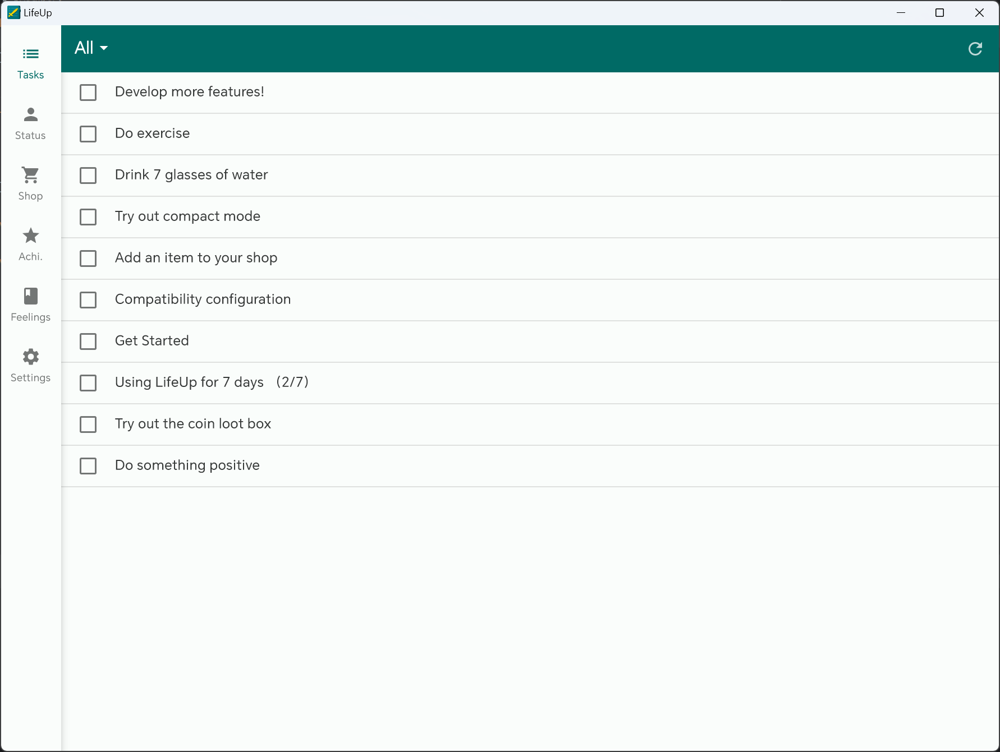
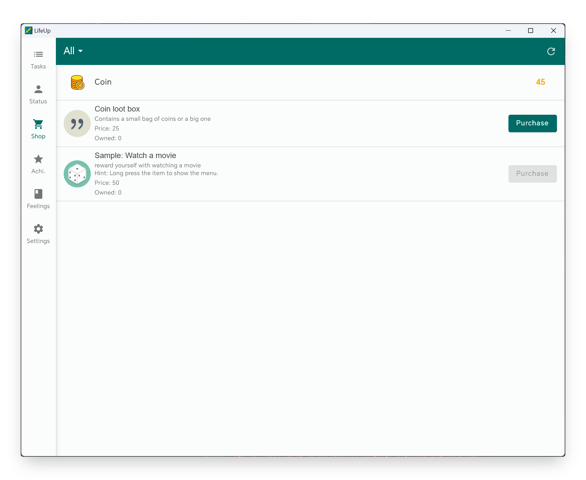
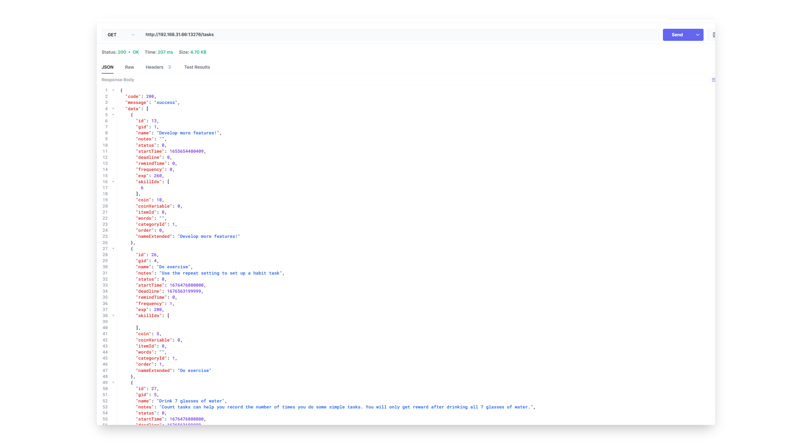
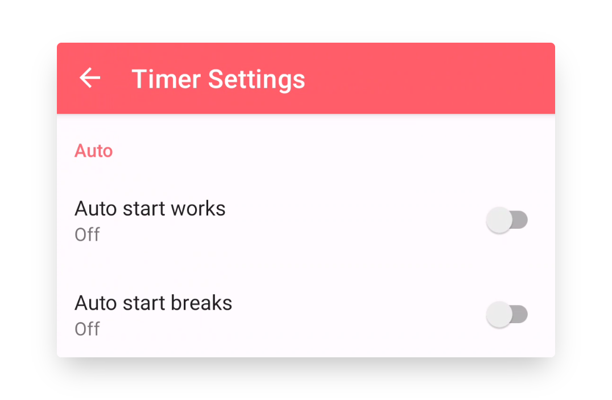

## v1.91.0 - Status Widget, Custom Level Gradient, Simple Desktop

> [DEV] What's new in v1.91: Status Widget, Custom Level Gradient, Simple Desktop

> We are here to introduce the v1.91 update. Many thanks to the long-term maintainers of the LifeUp Reddit community! :D Sorry that we do not have enough resources to keep track of all communities, so we mainly handle feedback from 📧 and GitHub. If you have any questions or suggestions, feel free to contact us at 📫[kei.ayagi@gmail.com](mailto:kei.ayagi@gmail.com) or submit an issue on GitHub (https://github.com/Ayagikei/LifeUp/issues).

Sorry for keeping everyone has been waiting for a long time. 

Due to various matters, the overall development and learning progress has been delayed since the end of the year. And with everyone's support, I also successfully updated my development equipment, and I set up a desktop computer. This makes our development, debugging, and releases more efficient.

Recently, we have finally returned to normal update status. Version 1.91 will bring some updates according to the previous "Development Roadmap". **v1.91 is being released gradually, if you haven't received the update, you need to wait for a while.**

We had planned to introduce an integrated Google Calendar in v1.91. However, we encountered many technical obstacles in the actual development process. In order to release more updates as soon as possible, we have temporarily decided to postpone it and focus on developing other features first before coming back to develop Google Calendar integration. We are sorry for the users who were expecting to see Google Calendar integration in v1.91. But we will continue to work on integrating Google Calendar.

By the way, we also tried something new: the development of a LAN desktop client. **But please note that the desktop client is still very rudimentary and dependent on mobile data.** 

---

## 🔖Overview

1. **🏆Widget:** Brand new status widget (first batch)
2. **📈Attributes:** Customizable level gradients
3. **✨Multi-platform:** LAN Desktop version
4. **✏️API:** Querying Full List Data and More APIS
5. **🍅Tomato Timer:** Automatic start of work and rest timing
6. **🚀Other:** Performance optimization
7. **Full changelog**

## 🏆Widget: New Status Widgets (First Batch)

This update brings a series of widgets related to properties and coins, including:

- Coins (Small, Large, Target)
- Property List (Small, Large)

And this is just the first batch, we will develop more widgets soon.

### 📝How to use

Usually, long press or pinch the system launcher to add widgets.

------

## 📈Attributes: Custom Level Gradient

In version v1.91, you can customize your level gradient, which is the experience value required for each level.

You can choose higher challenges or smoother growth curves according to your preferences, now it's up to you.

If you just want to know the built-in level table, you can also go to that page to check it out.

### 📝How to use

Sidebar - Settings - Advance - Custom Level

------

## ✨Multi-Platform: Desktop

During this period, we also tried something new, and with the new API update, we made it possible to query various detailed list data.

We have developed a **fully open-source（https://github.com/Ayagikei/LifeUp-Desktop）** LAN desktop software that can connect to your phone and display various list data, and supports some simple operations: purchase products, complete tasks, export reflection pictures and view them with the system picture browser.

The software theoretically supports Windows, Linux, and MacOS.

⚠ Note that the desktop is still in the early development stage.

We will continue to maintain and add more functions, such as adding tasks through the desktop, adapting the interface for interaction, exporting reflections in markdown format, etc.

### 📝How to use

For details, please see the "Sidebar-Settings-Labs-LifeUp Cloud" section.

Also check our document: [LifeUp Desktop🖥 (lifeupapp.fun)](https://docs.lifeupapp.fun/en/#/guide/api_desktop).

## ✏️API: Querying Full List Data and More APIS

**Data Interface**

As the data source foundation for the desktop client, we provide a complete data query interface in this version.

If you are an Android developer, you can use our **LifeUp SDK** to query various data in LifeUp app.

If you are any other type of developer, you can use the HTTP protocol to call the "LifeUp Cloud" API. This is also the practice on the desktop client.

If you don't know about development, don't worry:

1. First, now is the best learning opportunity.

2. Second, the above data APIs are open, which means that community developers can use this data for secondary development.

For example, they can design task list pages, shop pages, and perform more complex secondary development (such as discount, turnip buying and selling functions).

The results of secondary development can also benefit all users.

Specific interfaces will be added to the API documentation later.

**Other API Interface Improvements**

Additions

- ATM deposit and withdrawal
- Set "Disable Purchase" for items
- Set "Tag Color" for tasks
- Set ATM balance directly
- Simple query for specified item details
- Add a third button and operation option to the "confirm_dialog" interface

Behavior Changes

- confirm_dialog pop-up API, if the text or operation of some buttons is not provided, the button will not be displayed.

  This will provide higher flexibility in pop-up control, for example, you can set a text-only pop-up without buttons for displaying text and motivational language.

- penalty punishment API, in the past version, a maximum of 100 items can be deducted for goods, and now the limit has been expanded to 9 digits.

### 📝 Usage

Check our API documentation and GitHub repository: 

[LifeUp Cloud☁️ (lifeupapp.fun)](https://docs.lifeupapp.fun/en/#/guide/api_cloud)

https://github.com/Ayagikei/LifeUp-SDK

------

## 🍅Tomato: Automatic Work and Rest Timing

This version will also introduce the automatic start of the Pomodoro clock function.

Please make sure that your phone has been **compatibility configured** to avoid the system interrupting the operation of the Pomodoro clock.

Note that after turning on "Automatic Start of Rest", the original additional countdown function will be disabled.

### 📝 Usage

Go to the Tomato - Upper right corner settings page.

------

## 🚀Others: Performance Optimization

Through user feedback and online data collection, we found that the efficiency of some data queries in the LifeUp application will be significantly reduced in the case of a large amount of data.

For a to-do list tool application, stability and long-term are crucial.

Therefore, in this version, we have made a series of optimizations for scenarios with a large amount of data. These optimizations can significantly improve the loading speed of most list pages (especially the to-do list page).

We will continue to optimize for these scenarios.

## Full Update Log

**1.91.0-alpha01 (2023/02/13)**

**✨Features**

1. Support custom-level gradients.
2. Add initial batch of widgets:
   - Coins (small, large, target)
   - Attributes (small, large)

1. Support querying most of the data details in LifeUp through Content Provider API, including:
   - Offer a new version of "LifeUp Cloud".
   - Provide a rudimentary first version of the desktop version (Windows, Linux, MacOS) for local network use.

1. Support multiple selection deletion for tomato timer records.
2. Support setting the automatic start of rest and work for the tomato clock.
3. API improvements and added fields, including:
   - ATM deposits and withdrawals.
   - Setting whether to disable purchasing items.
   - Setting label colors for tasks.
   - Directly set ATM balance.
   - A simple query for specified product details.
   - Add a third button and operation option to the popup interface.

**♻️Optimizations**

1. Improve query, processing speed, and performance when dealing with large amounts of data.
2. Fix the incorrect margins for adaptive icons.
3. Optimize the display effect of the tomato timer records.
4. Improve the interaction when restoring a backup.
5. Add UI display for obtaining the license through Google Play (for GitHub free trial version).
6. Provide a prompt to disable the one-click import feature if the selected backup file is not from LifeUp when importing directly from the file system.
7. Close the input method automatically when searching for goods in the product selection popup.
8. API behavior changes, including:
   - Confirm_dialog popup API. If certain button text or operation is not provided, the button will not be displayed. This provides greater flexibility in popup control, for example, you can set up a text-only popup without buttons for displaying text and motivational language.
   - Penalty API. In previous versions, it could only deduct up to 100 items, now the limit has been extended to 9 digits.

**🐛Bug Fixes**

1. Fix the issue where the tomato timer page would display "loading" at the end under certain circumstances.
2. Fix crashes caused by certain third-party libraries.
3. Fix the issue where the app would crash when placing the tomato clock in the bottom navigation bar due to a prompt popup.
4. Fix the abnormal display of attribute values when browsing other users' profiles.
5. Fix the issue where the API events and notifications for attribute level reductions were not sent correctly.
6. Fix some interaction issues with long press-editing pages.
7. Fix some abnormal margins on the image management and synthesis pages.
8. Fix some popup windows that were not scrollable, resulting in abnormal usage in landscape mode.

**✨Special Release: LifeUp Cloud v1.1.1 (2023/02/13)**

1. Support reading and authorizing operations for Content Provider information.
2. During service startup, apply for a wake lock to allow response even when the screen is locked.
3. Add a series of interfaces for Content Providers.

**✨Special Release: LifeUp Desktop v1.0.1 (2023/02/13)**

Initial release, designed to be used in conjunction with "LifeUp Cloud" and the mobile app.

Support the following operations:

- Query tasks, lists, items, achievements, and feelings lists.
- Purchase items, and complete tasks.
- Support using the desktop image browser to view enlarged images of feelings.

## 4th Anniversary

Hope you enjoy the update!

It has been 4 years since we started developing LifeUp, and we will continue to bring more updates and optimizations to LifeUp.

But we also realize that a one-time buyout is not very friendly to the long-term maintenance of an app. But don't worry, we're also proponents of one-time buyouts.

We would love to have the opportunity to work full-time on the development of LifeUp. But LifeUp is still a very niche app right now. Due to lack of time, in recent versions, we have designed a variety of APIs to allow the community to participate in the construction of more functions of LifeUp.

If you think LifeUp helps you and if you are willing to buy a cup of coffee for the developers on the about page, or recommend LifeUp to your friends and communities, this will all play a role in our long-term maintenance, and it will also bring us one step closer to full-time development. 

Also thank you again for using LifeUp!