## v1.92.0 - Newly designed stats, updated desktop, more widgets

**Thanks for using LifeUp!**

Here are some recent updates which cover v1.91.1-v1.92.0.

We hope these updates are helpful for your usage and productivity.

If you have any questions or suggestions, feel free to contact us at 📫[kei.ayagi@gmail.com](mailto:kei.ayagi@gmail.com) or submit an issue on GitHub (https://github.com/Ayagikei/LifeUp/issues

---

## 🔖Overview

### 📱Android app

1. 📈**Newly designed stats**
2. 🏆**New app widgets**: shop items widget and exp changed widget
3. ✨**New feature**: support to hide the shop/inventory list

### 🖥️Desktop

1. ✨**Automatic connection**
2. 🚀**Export feelings to markdown**
3. 🖥️**MacOS installation package**

## 📱Android app updates

### 🏆Newly designed stats

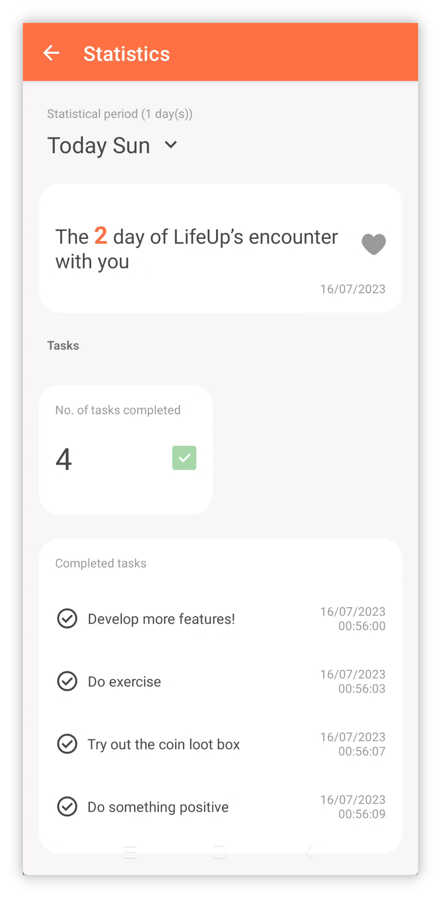

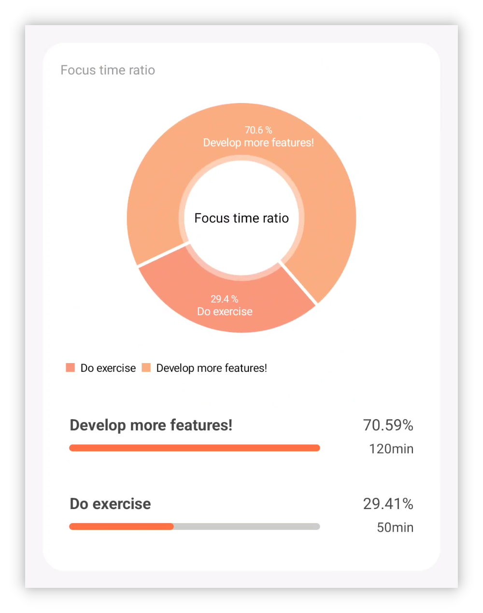

Statistics and data review are not only an important step in improving our productivity, but also a source of inspiration and feedback.

By reviewing our efforts, we can see our progress and achievements with data, and also identify issues and areas for improvement.

For this, we have launched [Statistics 2.0], which offers you a variety of intriguing data insights.

 

#### ❓How to use?

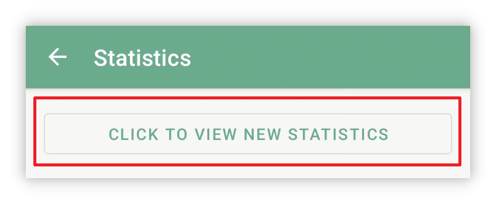

To access the new statistics, upgrade to v1.92.0 version, go to the [Statistics] page, and then tap on the [Click to view new statistics] button at the top.

 

#### 📊Statistics items

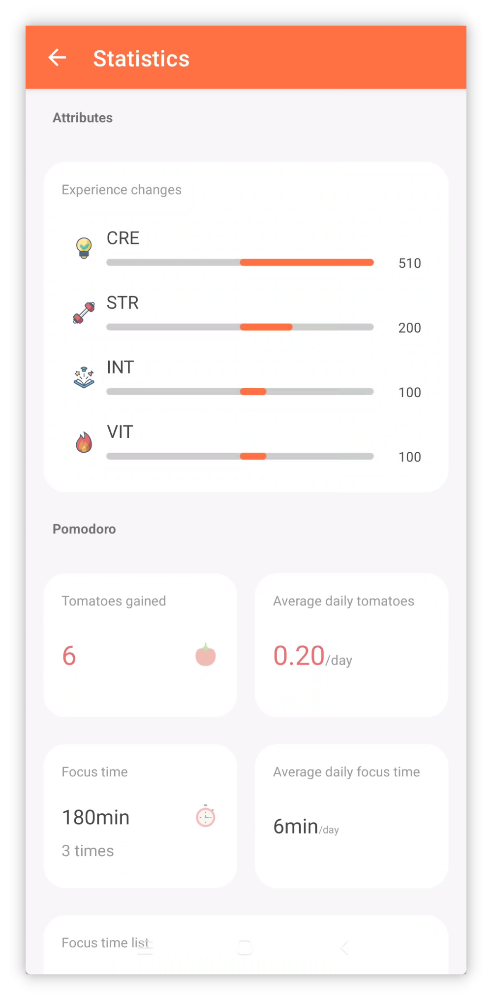

Statistics 2.0 will provide data analysis for various modules: from the percentage of focused tasks in tomatoes, to the average number of tomatoes per day, to the daily changes in attributes, to the purchase records of items, to the completion status of tasks, and more.

 

#### ⏰Time filter

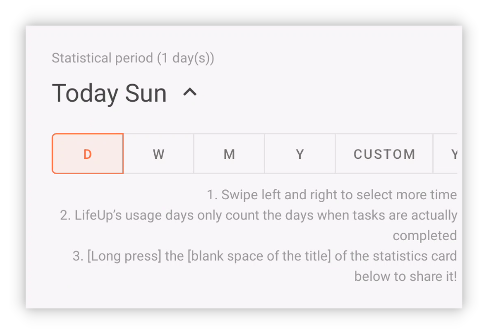

nd it supports **flexible** time range filtering, you can easily view the data for the day, week, month, year, or custom time range.

Your LifeUp should be tailored to you, you don’t have to wait until the end of the year to see the annual summary, nor do you have to worry about losing the annual summary every year.

In LifeUp, you can access the **past years’ annual summaries** anytime. Are you curious about your 2022 annual summary data~ Hurry up and update and try it!

 

#### 👥Share

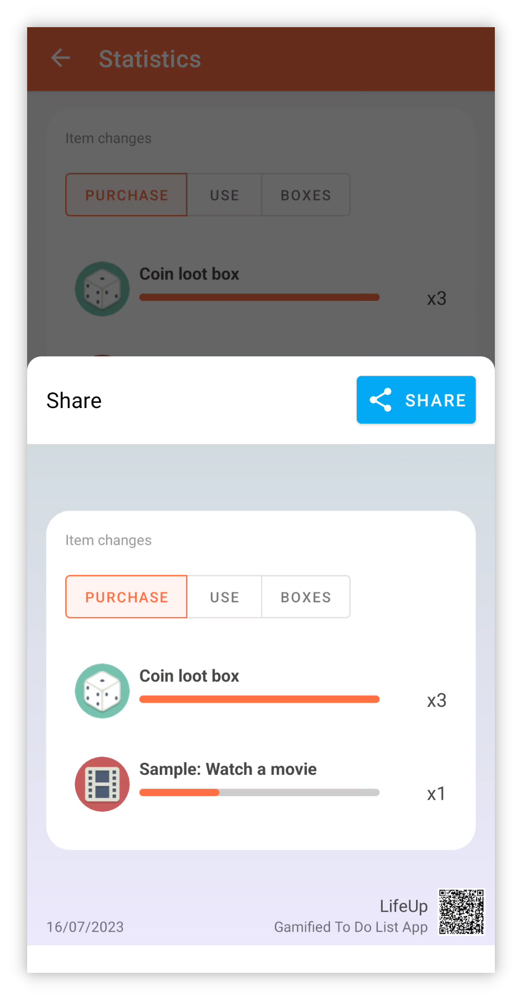

Welcome to share your LifeUp journey with the community!

Now you just need to long press the data statistics card you want to share, and you can create a share card, and share it to other apps with one tap.

------

### 🏆**New app widgets**

#### Shop list widgets

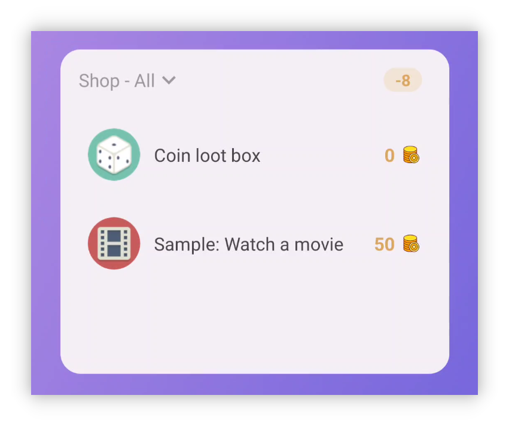

This update introduces two shop list widgets that are suitable for large and small sizes.

Now you can purchase and use them right on the desktop~

> Note: The current one is the “shop” widget, not the “inventory” widget.
>
> Although it allows you to buy and use items, it doesn’t let you view the items in the “inventory” directly.

 

And this time the shop list is like the task list,

**You can choose different lists for each widget.**

 

If you tap on the background area at the top, you can also quickly jump to the shop page within the app.

#### Daily exp changes widget

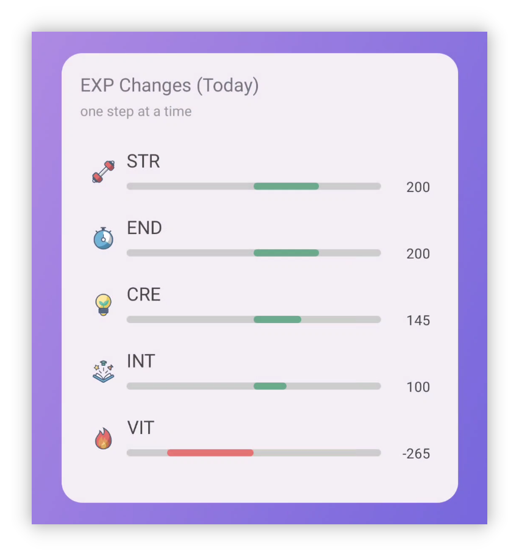

With this widget, you can see the summary data of your daily experience value changes on the launcher.

------

## 🖥️Desktop

### ✨Automatic connection

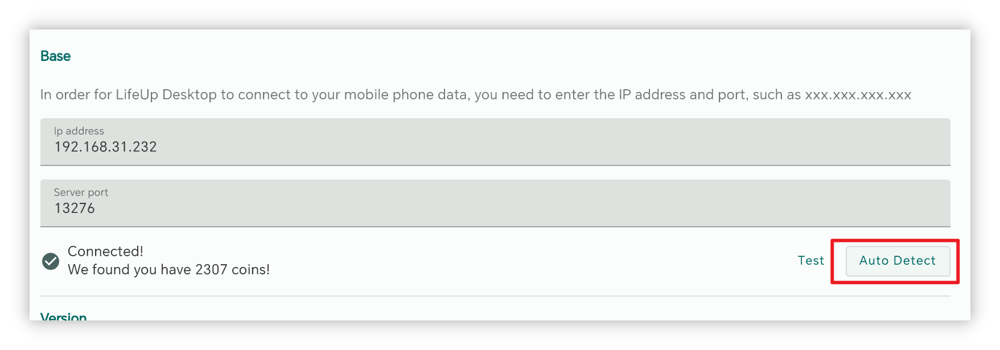

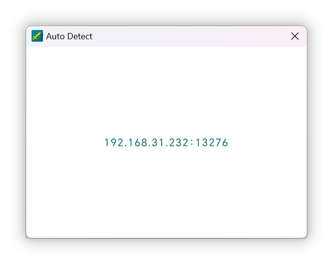

According to user feedback, filling in the IP is a major factor that hinders users from using the desktop version.

This update brings the function of automatically detecting the IP of LifeUp Cloud Server.

 

The prerequisite for using this function:

- Download v1.3.0 of LifeUp Cloud (you can get it from Google Play updates or our GitHub pages).

You can automatically detect the corresponding IP address on the desktop version, no need to fill it in manually anymore.

> After testing, this feature is currently mainly verified on the Windows side.
>
> MacOS side may not support automatic detection yet.

------

### 🚀**Export feelings to markdown**

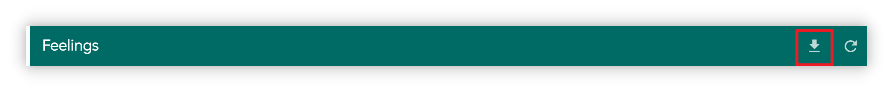

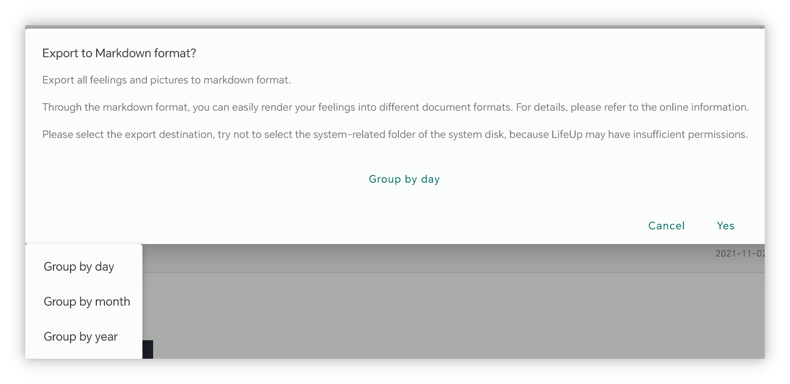

The desktop version now supports exporting feelings as markdown format.

And it supports grouping and exporting in multiple ways, and the impressions will also include complete image attachments.

With the markdown format, you can easily use **third-party tools** to render and convert to pdf, word and other formats again.

------

### **✏️Add task**

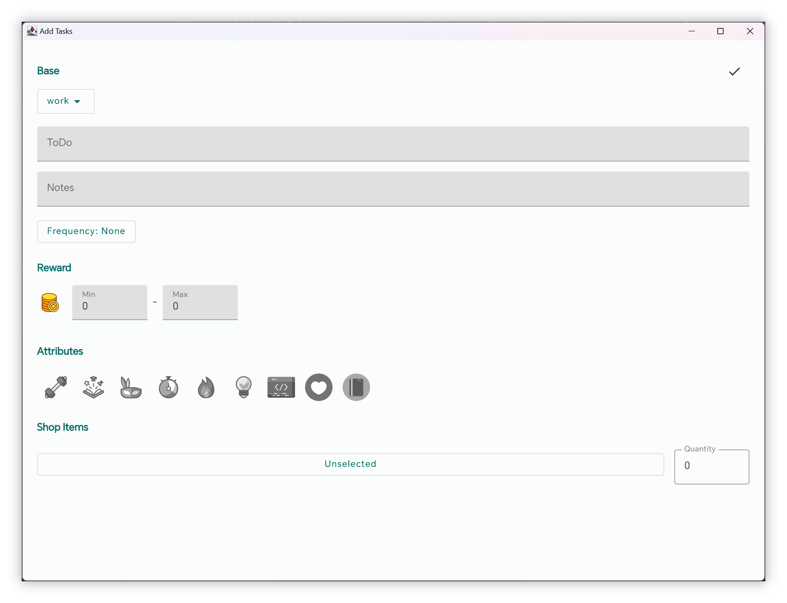

With the help of the API capabilities built earlier, the desktop version now supports creating simple tasks.

The current settings have not been able to cover all the options in the app, but they are enough to create simple tasks.

Subsequent versions will also continue to enhance the options for creating tasks and support editing tasks, etc.

------

### 🖥️**MacOS installation package**

Starting from version 1.1.0, we will also start releasing MacOS installation packages.

After a simple test, the functions of the Mac OS version are basically normal.

For detail, please also check [🖥LifeUp Desktop (lifeupapp.fun)](https://docs.lifeupapp.fun/en/#/guide/api_desktop)

### **Release Notes**

#### LifeUp Android app

**1.92.0-rc02 (2023/07/16)**

**🐛Fix**

1. Fix the issue that the shop widget may not work when jumping to other apps (executing API)
2. Fix the occasional abnormality when switching lists in the shop widget
3. Fix the issue that the shop widget does not hide sold out or non-purchasable items according to the app settings
4. Fix the issue that the shop widget may not respond when clicking on a certain item
5. Fix some rare crash issues

**1.92.0-rc01 (2023/07/11)**

**✨Features**

1. Statistics 2.0
2. Share card

**♻️Optimization**

1. Now you can set prices for “non-purchasable” items and use them for scenarios such as returns
2. When you turn off “Set task penalty separately” in the settings, the penalty button will no longer be displayed
3. Optimize the UI of subtasks in team details
4. Optimize the UI of impressions

**🐛Fix**

1. Fix the issue that when the attribute clipping style is changed to “rounded rectangle”, the edit icon may show the old icon for a long time

#### **LifeUp-Desktop**

**v1.1.0 (2023/06/25)**

**🚀Features**

1. Support automatic check of “LifeUp Cloud ” IP address and connection (requires LifeUp Cloud v1.3.0)
2. Support adding tasks, but the options currently supported are limited (Fixed [#6](https://github.com/Ayagikei/LifeUp-Desktop/issues/6))
3. Support exporting impressions as markdown format (Fixed [#5](https://github.com/Ayagikei/LifeUp-Desktop/issues/5))
4. Add Traditional Chinese language text
5. Add MacOS release version
6. Support for checking updates

**🔧Optimization and bug fixes**

1. Fix the problem that the achievement subcategories cannot be displayed correctly
2. Fix the problem that some icons cannot be displayed correctly (requires LifeUp v1.91.3 version)
3. Fix the title mismatch problem (Fixed [#8](https://github.com/Ayagikei/LifeUp-Desktop/issues/8))
4. Add shortcuts option for Windows installer (Fixed [#13](https://github.com/Ayagikei/LifeUp-Desktop/issues/13))
5. Improve the way of getting window size, adapt to resolutions lower than 1080p

#### **LifeUp Cloud**

**v1.3.0 (2023/06/25)**

**🚀Features**

1. Support registering mDNS service to enable desktop to automatically discover its IP (requires desktop v1.1.0)
2. Added result values for APIs invoked via ContentProvider.

**🔧Improvements**

1. Increased the click range of the scan QR code button
2. Fixed ActivityNotFound crash