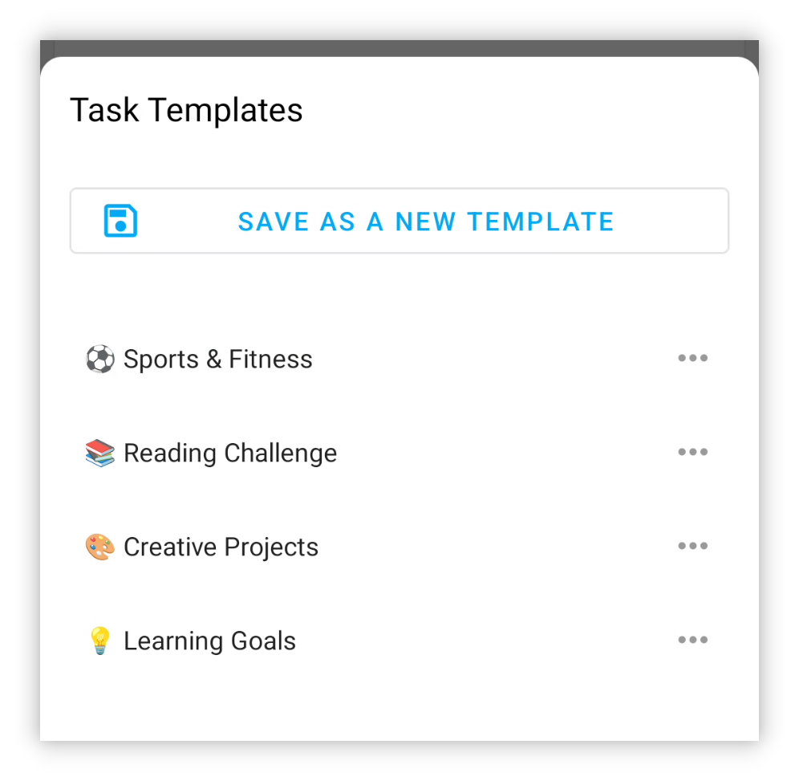
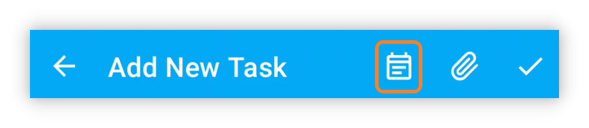
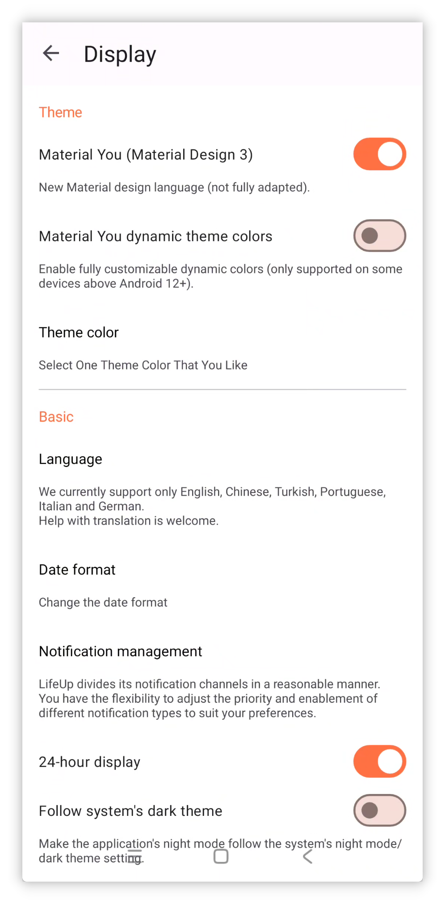
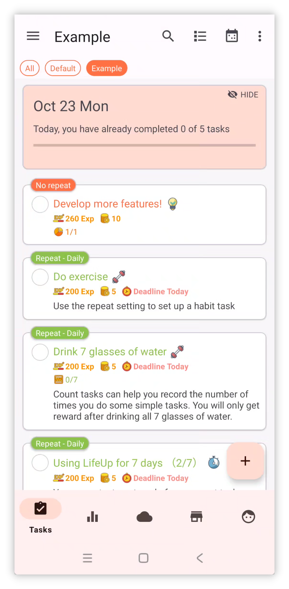
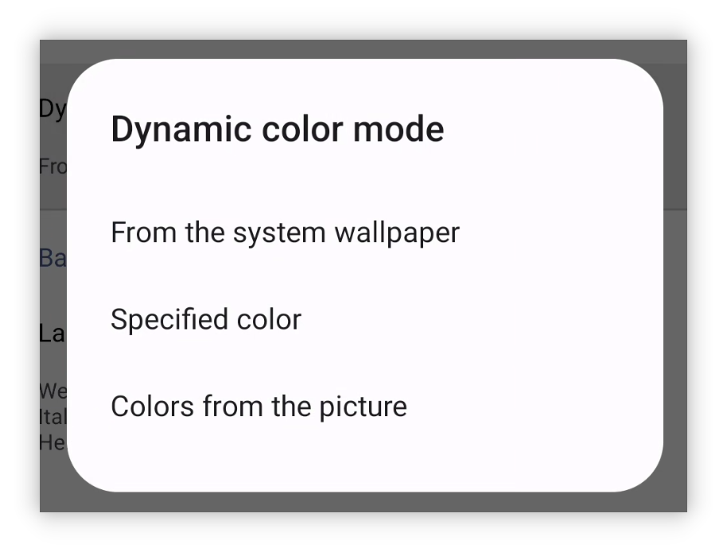
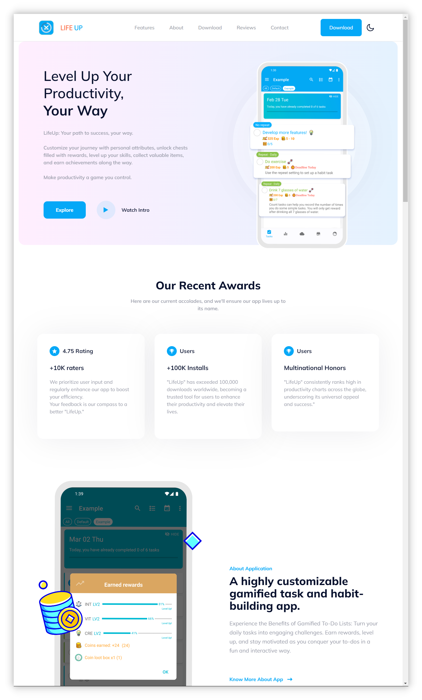
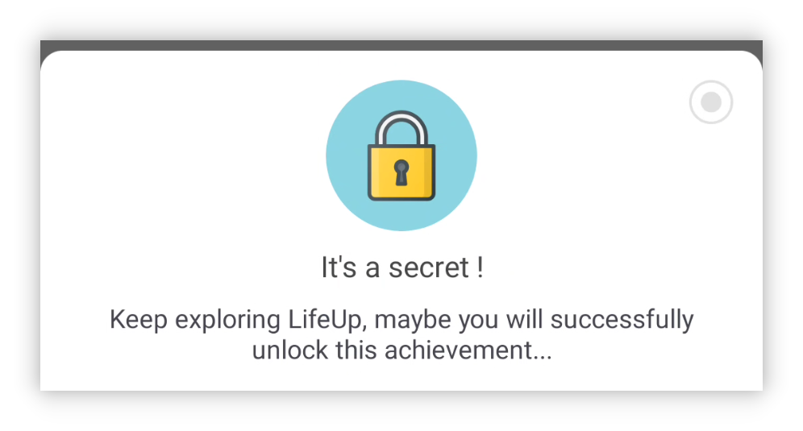

## v1.93.0 - Task Templates and Material 3

## 🚀Introduction

At LifeUp, we've been closely listening to our users' feedback, and our recent efforts have been dedicated to enhancing some of the most requested features. We're committed to refining your LifeUp experience based on your valuable input.

Moreover, we're diligently advancing along our development roadmap, aiming to bring you even more exciting updates in the future. Your trust and support are what drive us to continually improve.

In addition to these improvements, we're actively exploring technologies like Flutter and KMM, opening doors to new possibilities that will further elevate your LifeUp experience. Stay tuned for these exciting developments as we continue to grow and evolve. 🚀🔍

**This update brings task templates, secret achievements, and full adaptation to the new design language Material You, among other features.**

**Some functional modules, such as feelings and APIs, have also seen improvements and optimizations.**

If you have any questions or suggestions, feel free to contact us at 📫[lifeup@ulives.io](mailto:lifeup@ulives.io) or submit an issue on GitHub (https://github.com/Ayagikei/LifeUp/issues)

---

## I. 📋 Task Templates

This version introduces built-in task templates. It eliminates the need to create tasks indirectly using "Copy Task" and APIs.

When creating or editing tasks, users can save the current settings as templates.

In the future, when creating tasks, you can import previous reward settings, task settings, and more with a single click.

### 📕 How to Use?

When creating or editing tasks, click the Task Templates button in the top bar.

Task templates will record most of your settings, but currently do not include the deadline.

## II. 🎨 Material You Theme

This version fully adapts to the Material You design language (theme).

This design language is more modern and offers a cleaner appearance. It's also one of the officially promoted UI styles for the future.

Moreover, Material You's core feature is that "everyone can have a different theme color."

This allows "LifeUp" to introduce new mechanisms such as dynamic theme colors based on wallpaper and custom theme colors. (Note: Device support is required.)

### 📕 How to Use?

As shown in the images above, open the sidebar, go to Settings, and click Display to adjust the related options.

If your device does not support dynamic theme colors, you can still choose from preset theme colors.

But if your device supports dynamic theme colors, you can enable this feature and customize your desired theme colors with high flexibility:

## IV. 🌐New Official Website

We've launched a new landing page that makes sharing "LifeUp" with your friends easier than ever.

Simply visit [lifeup.ulives.io](https://lifeup.ulives.io) to get a sneak peek of what "LifeUp" has to offer.

## III. ✨ More Features

**UI Theme**

1. Fully adapt to Material Design 3.
2. Support customization of Material Design 3 theme colors, including custom colors, colors from wallpaper, and colors from images.
3. Improve some animation effects, such as pop-ups.
4. Optimize edge-to-edge (immersive) adaptation effects.

**Tasks**

1. Support task templates.
2. Statistics on the details page support switching based on time criteria and optimize default options.
3. The history page supports searching for task names and adjusts the related UI and interactions.

**Achievements**

1. Support secret achievements.
2. When adding achievements, support "Continue Adding Next Achievement."

**Attributes**

1. Support hiding attributes.

**Pomodoro Timer**

1. Support editing time records.
2. In the Pomodoro page, support task completion (long press on the selected task while in pause mode).

**Feelings**

1. Support adding Feelings directly on the Feelings page.

**API**

1. Add the "use_item" API.
2. Add the "random" API.
3. Add the "edit_exp" API.
4. The "item" API now supports adjusting parameters such as "action_text," "disable_use," and "title_color_string."
5. The "shop_settings" API supports the "silent" parameter.
6. Support the "time" placeholder. Now you can set tasks with dates like "due tomorrow" or "due next month" without the need for automation tools.

------

In addition to these features, we have addressed a variety of reported issues and made some bug fixes. For more details, please refer to the following update log.

### ♻️ Optimizations

1. Added prefixes to some places displaying data IDs.
2. Optimized the display of team activities.
3. Attempted to address the issue where some Toast notifications were too long to fully display.
4. Improved the logic for widget completion in teams, ensuring consistency with in-app behavior.
5. Statistics page: After selecting a "Custom" time range, clicking "Custom" again now triggers a reselection of dates.
6. Ensured compatibility with Harmony OS 4 for progress bar notifications to display action buttons.
7. Enhanced the interaction logic of notification requests.
8. Addressed the issue where the input method could obstruct input for "Repeat Count."
9. Now, when creating tasks, the user's choice of non-specific start times (such as automatic or due today) is recorded. When editing, these options are restored, rather than specific times, to avoid discrepancies in edited times.
10. When creating tasks, if unexpected warnings about duplicates occur, they will now also be displayed in the "Check for Duplicates" pop-up.
11. Added Indonesian language support.
12. Updated translations.

## 🐛 Bug Fixes

1. Fixed the issue where, in certain cases, the world module could become stuck loading (spinning indefinitely).
2. Fixed the issue where, in certain cases, the shop/warehouse could keep displaying loading (spinning indefinitely).
3. Fixed issues that could occur when calling APIs with UI content via a content provider.
4. Fixed issues with task sorting that did not meet expectations.
5. Fixed the issue where data on the statistics page was incorrect after selecting a "Custom" time range.
6. Fixed the issue where pop-ups for notification requests did not support scrolling.
7. Fixed the issue where, in certain cases, the world module search displayed all content.
8. Fixed the issue where the "Show Completed" option also displayed frozen tasks.
9. Fixed issues with calculating average values on the statistics page.

## Special Thanks to our GitHub Contributors, Email Feedback Heroes, and Crowdin Translation Contributors

We extend our deepest gratitude to the users who have actively participated by submitting GitHub issues, reaching out to us through email to provide feedback, and dedicating their time to contribute translations on Crowdin.

Your combined efforts have been crucial in shaping the "LifeUp" experience for our global community. You've helped us enhance the app's functionality and accessibility, and your contributions are truly invaluable.

As we work together to make "LifeUp" even better, we want to express our heartfelt thanks for your unwavering support and collaboration. 🙏📧🌍