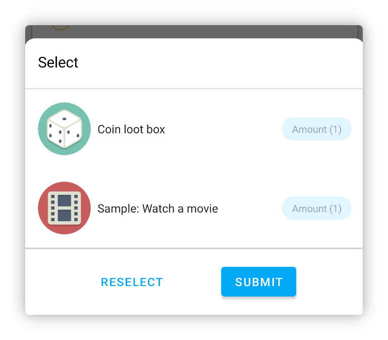
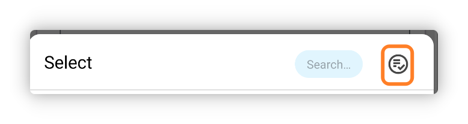
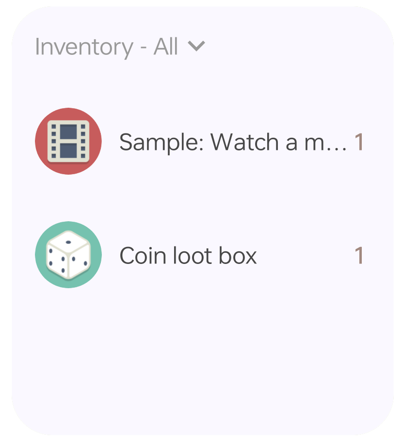
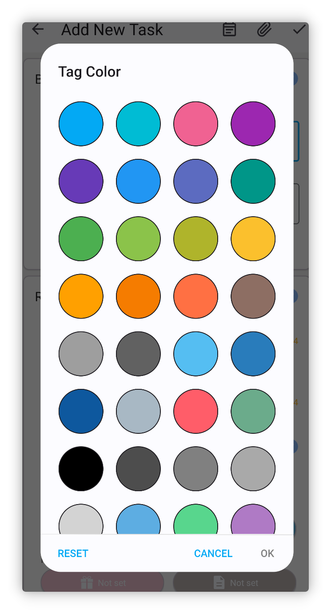
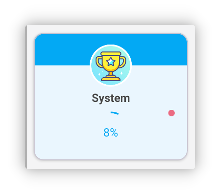
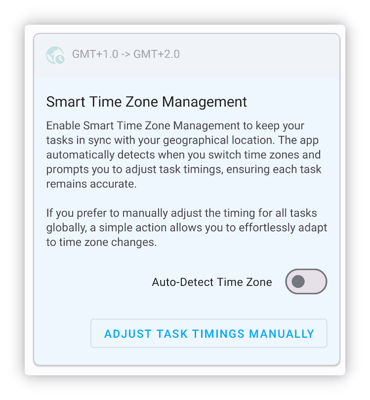
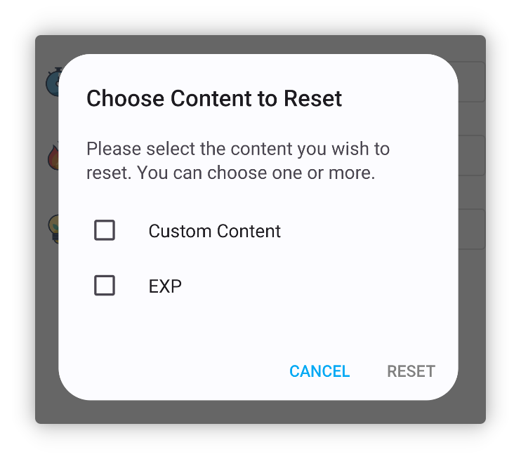

<h1 align="center" padding="100">v1.94.0 Multiple Item Rewards</h1>

## Introduction

This update primarily introduces features like multiple item rewards and inventory widgets, along with numerous optimizations, performance improvements, and bug fixes.

**📧How to provide feedback?**

If you have any questions or suggestions or bug report, feel free to contact us at 📫[lifeup@ulives.io](mailto:lifeup@ulives.io) or submit an issue on GitHub (https://github.com/Ayagikei/LifeUp/issues)

## 1. ✅Multiple Item Rewards

Now, in LifeUp, you can select multiple items in various places. You no longer need to set up opening boxes or crafting to achieve multiple rewards.

For example, you can:

- Directly set multiple item rewards for a task
- Choose multiple items when setting up box opening, then set the probabilities all at once
- Directly set multiple item rewards for achievements and subtasks

 

### 📕How to Use?

Click the multi-select button at the top when selecting items.

> Please note that some scenarios may only support single selection.

## 2. 🔧Inventory Widgets

This version introduces two sizes of inventory widgets.

Now, you can directly view and quickly use the items in your inventory from your desktop.

 

### 🚀 Optimizations and Problem Solving

Despite launching the store widget several versions ago, we gradually encountered some crashes or other issues.

For instance, due to the widget system's transmission limits, having too many items might cause the app to crash, or list switching issues, or custom image loading failures.

In this version, we have found suitable solutions. Now, store and inventory widgets should be able to display a large number of items, and we have tested store widgets with nearly 1000 items to still be functional and load properly (of course, this is not recommended).

 

### 📕How to Use?

Usually, you can create a widget by long-pressing the system desktop.

If you are using a device like Xiaomi or Redmi (MIUI/HyperOS), adding widgets in MIUI/HyperOS is somewhat hidden, please consult the compatibility configuration document on how to add widgets.

## 3. ✨More Features

**UI Themes**

1. Custom (task, item text) colors now include more preset values
2. Adapted to Android 14's monochrome adaptive icon feature
3. Added more language adaptations (Google Play version)

**Achievements**

1. If there are achievements with unclaimed rewards, a small red dot will now be shown on the achievement list.

**Tasks**

1. Subtasks for penalty tasks will now execute the penalty logic properly
2. Added "Smart Time Zone Management," if you are involved in cross-time-zone work, LifeUp also supports automatic detection of time zone changes and supports global time adjustments
3. The statistics basis on the details page now remembers the last selection, and we optimized some default values in certain scenarios
4. Optimized the grace handling of continuous task completion days on the "My" page, now if you forget to complete a task one day, catching up can still continue the streak

**Attributes**

1. Supports deleting experience records
2. Supports resetting the experience of an individual attribute

**Widgets**

1. Now, clicking the blank space in the store or inventory widgets directly enters the list the widget points to, instead of the last list
2. Task widgets now display the progress of count tasks

**API**

1. Added an API to edit Pomodoro records
2. Completing tasks API now also properly handles penalty tasks
3. Completing tasks API now also supports processing count tasks (adds `count` parameter)
4. Completing tasks API now supports a reward coefficient parameter
5. Adjusting items API now supports changing the item list id
6. Creating, adjusting items API supports sorting criteria parameter
7. Jump API now supports jumping to the use item popup
8. Unified some parameter definitions, like `itemId` -> `item_id`
9. Added broadcast notifications for starting, pausing, and ending a stopwatch
10. Adjusting items API's `title_color_string` now supports passing an empty string to restore the default value
11. Completing tasks broadcast now includes list id
12. Opening boxes, crafting now also triggers the use item broadcast

------

In addition to this, we have fixed a large number of issues and some bug fixes reported in recent times.

Details can be found in the update log below~

### ♻️Optimizations

1. Adding or editing tasks now includes a warning if no attribute is selected and experience is entered
2. Optimized upload retry records
3. Optimized the title display and input restrictions on the custom level page
4. Optimized the performance and timing issues of undoing tasks that have been repeated extensively
5. Refactored the use item popup, calendar interface logic, etc.
6. Optimized the related logic of task reminders, ensuring reminders from deleted or previous data are not issued again
7. Optimized waiting copy in the backup interface
8. Images selected in the custom attribute page are now also added to the history selection
9. Editing Pomodoro records now attempts to correct (increase or decrease) the right number of Pomodoros

### 🐛Bug Fixes

1. Fixed a system achievement related to stats and backups not being triggered normally after restructuring
2. Fixed potential conflicts between random API and toast API widgets with the default toast
3. Fixed the task detail not refreshing in some scenarios when entering from a widget
4. Fixed the potential for errors in multiple box openings in some special situations (preemptively using up item inventory)
5. Fixed the issue of not displaying subtasks in the details page after editing a task without subtasks and adding new ones
6. Fixed some special cases where editing coin rewards was not possible
7. Fixed some cases where claiming team items might not work
8. Fixed MD2 style anomalies in some bottom popups
9. Fixed potential incorrect additional time values in Pomodoro timers
10. Fixed the issue where the color bar in the experience change widget might not display
11. Fixed some tasks not displaying properly in the calendar-in-progress
12. Fixed some list loading issues on the history, Feelings pages
13. Fixed an issue where calling the complete task API twice in quick succession did not allow for two consecutive completions