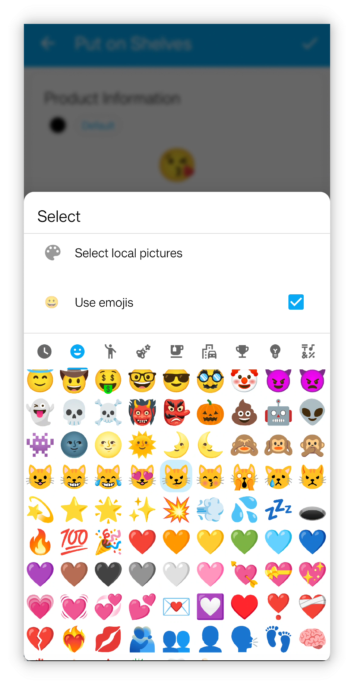
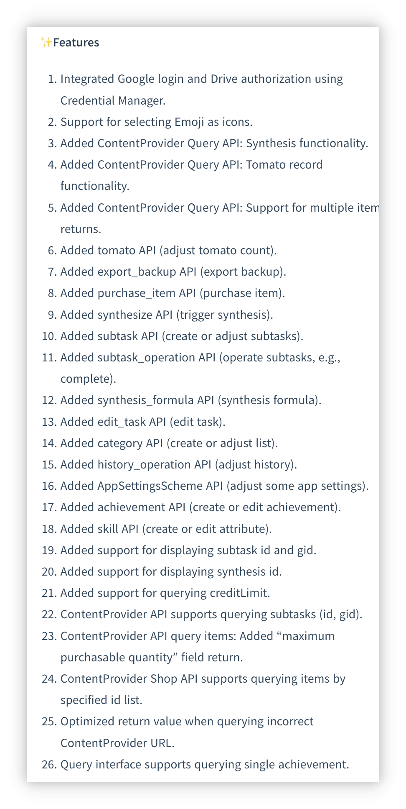
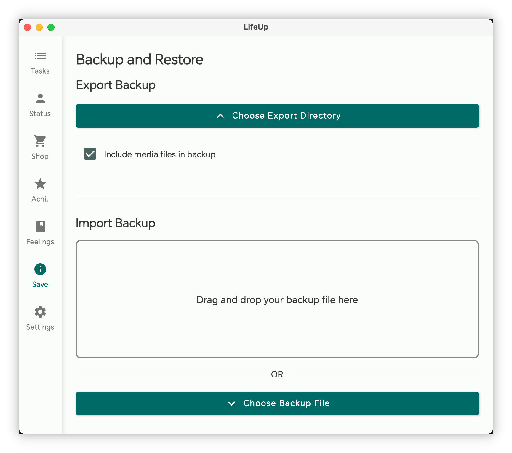
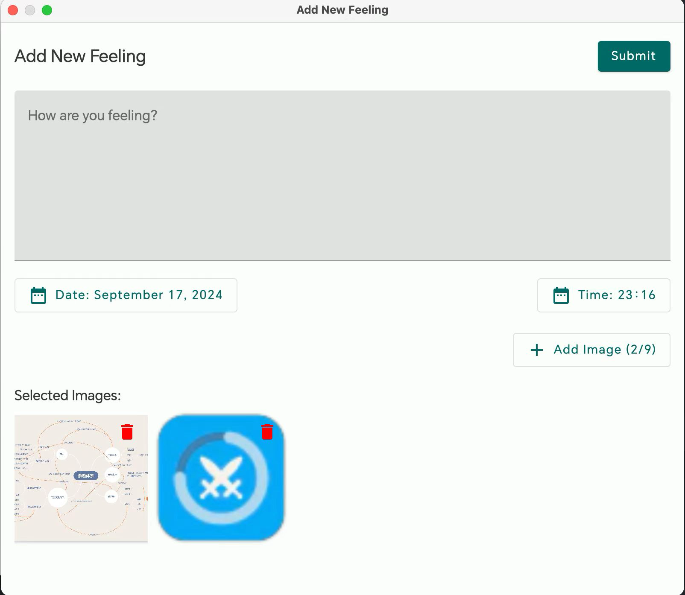
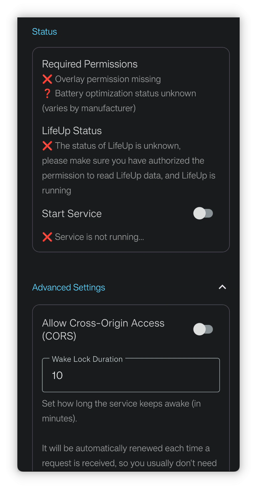
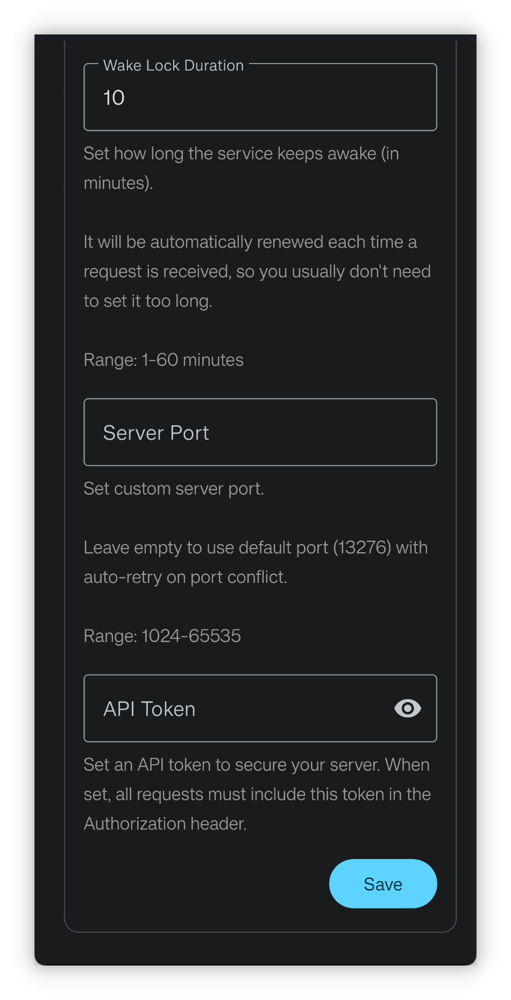

<h1 align="center" padding="100">v1.98.0 API 2.0 & Desktop Client Update</h1>

## Introduction
This is the first release of 2025, with the following major updates:

- Emoji Icon Support: You can now directly use Emojis as icons for items, achievements, and more.

- Second Wave of API Updates: API interfaces now support modifying tasks, editing item effects, achievement unlock conditions, synthesis, and almost all core functionalities.

- LifeUp Cloud and Desktop Client Optimization: Improved automatic connection detection experience; desktop client adds "New Feelings" feature and supports backup data import/export.

## I. Emoji Icons

### 📕How to Use?

- In this version, when selecting icons for items, achievements, etc., you can now directly choose emoji expressions as icons.

## II. Second Wave of API Updates

Since the API functionality was opened in v1.90.0, we're delighted to see many users actively exploring and creating rich content based on the API. Many users started from scratch learning URL-related knowledge and successfully applied the API to create desktop widgets, DIY desktop clients, and even achieved web application integration, which is impressive.

However, due to complex data structures and substantial design and development workload, the first batch of APIs lacked some core functionalities, such as editing tasks, editing items, creating achievements with unlock conditions, and creating items with usage effects. The completion of these features continued until this version.

The design, development, testing, and updates of cloud, desktop clients, and API documentation brought exponentially growing workload, causing the development branch started several months ago to only complete development and testing now.

**But our efforts have borne fruit! Today, the API covers almost all core functionalities of LifeUp. By opening up the API, we hope to make LifeUp more than just an application, but an open platform where users can freely develop, extend, and customize their own gamification systems.**

### 📕How to Use?

- For API usage methods, please refer to our documentation library - Directory - Open Interface section.
- Definitions of new API interfaces have been added to the documentation.

## III. Desktop Client: Archive Feature & Feelings

### Archive

You can now directly export or import backup files on the desktop client.

This will simplify the process of transferring data to other devices and recovery.

### Publish New Feelings

Now supports publishing new feelings from the desktop client, with full support for adding images and setting time features.

⚠️Note: Editing feelings is not supported yet.

### Other Updates

- Optimized connection-related error messages and explanations: clearly indicating whether it's a network issue or due to LifeUp backend not running
- Support for viewing task details
- Support for API Token security validation (optional, requires LifeUp Cloud 2.0.0 version)
- Purchase logic now uses the new "purchase item API" instead of the previous "adjust item quantity API" + "adjust coin amount API". So it can now correctly handle purchase limit logic, maintaining consistency with the app.

This update also serves to demonstrate API capabilities through the desktop client, as all desktop client features are implemented through the API.

## IV. LifeUp Cloud Optimization

> LifeUp Cloud is a tool that exposes API as HTTP interfaces and serves as a bridge for desktop client connection.

We've made numerous optimizations based on feedback about LifeUp Cloud:

- Added status display to quickly detect why desktop client can't connect
- Added advanced settings
  - Allow cross-origin access: useful for accessing LifeUp Cloud's HTTP interfaces using web-based technologies
  - Allow custom service ports
  - Allow setting access tokens: optional security validation measure
- Optimized error return values and specifications for LifeUp Cloud's interfaces
- Optimized service discovery and HTTP service switch logic, desktop client's auto-detection should work better now

## V. Preview

Since this update brings relatively few non-API features, here's a preview of upcoming version content, including features currently under development:

- **Major Feature:** Repeatable achievements
- **Medium Feature:** Text readability optimization for custom backgrounds
  - Originally thought to be a small change, but turned out quite complex
- **Minor Feature:** Add complete and remind later actions to notifications
  - Originally planned to support persistent notifications, but abandoned as newer Android versions no longer support true persistence

## VI. ✨Complete Update Log

### **LifeUp-Android**

**v1.98.0 (2025/01/01)**

**✨Features**

1. Integrated Google login and Drive authorization using Credential Manager.
2. Support for selecting Emoji as icons.
3. Added ContentProvider Query API: Synthesis functionality.
4. Added ContentProvider Query API: Tomato record functionality.
5. Added ContentProvider Query API: Support for multiple item returns.
6. Added tomato API (adjust tomato count).
7. Added export_backup API (export backup).
8. Added purchase_item API (purchase item).
9. Added synthesize API (trigger synthesis).
10. Added subtask API (create or adjust subtasks).
11. Added subtask_operation API (operate subtasks, e.g., complete).
12. Added synthesis_formula API (synthesis formula).
13. Added edit_task API (edit task).
14. Added category API (create or adjust list).
15. Added history_operation API (adjust history).
16. Added AppSettingsScheme API (adjust some app settings).
17. Added achievement API (create or edit achievement).
18. Added skill API (create or edit attribute).
19. Added support for displaying subtask id and gid.
20. Added support for displaying synthesis id.
21. Added support for querying creditLimit.
22. ContentProvider API supports querying subtasks (id, gid).
23. ContentProvider API query items: Added "maximum purchasable quantity" field return.
24. ContentProvider Shop API supports querying items by specified id list.
25. Optimized return value when querying incorrect ContentProvider URL.
26. Query interface supports querying single achievement.

**♻️Optimization**

1. Optimized default custom sorting for newly added items.
2. Optimized default custom sorting for newly added attributes.
3. Added `purchase_limit`, `disable_use`, and `effects` parameters to the "add_item" API.
4. Added `background_alpha`, `items`, `start_time`, `auto_use_item`, `remind_time`, and `pin` parameters to the "add_task" API.
5. Added support for more task frequencies to the "add_task" API.
6. Added support for `effects` and `purchase_limit` parameters to the "item" API.
7. Added support for terminating operations in preceding APIs (e.g., input).
8. Added support for specifying the `signed` parameter for numeric placeholders.
9. Added random number and random decimal placeholders.

### **LifeUp-Desktop**

**v1.2.0 (2025/01/01)**

**🚀Features**
1. Support Archive Management
- Backup to computer
- Restore from computer
- Support drag-and-drop
2. Support Creating New Thoughts
- Support image selection
- Support image sync to mobile
3. Support Task Details View
4. Purchase System Improvements
- Use new "Purchase Items" API
- Keep purchase limits consistent with app
5. Support Optional API Token Validation
6. Multi-platform Support
- Windows
- Linux
- macOS (Apple Silicon)
- macOS (Intel) 🆕
7. Improved error handling and notifications

### **LifeUp Cloud**

**v2.0.0 (2025/01/01)**

**🚀Features**
1. Service Optimization
- Enhanced service discovery logic and compatibility
- More devices support automatic IP detection
- Optimized service start/pause state transitions
- Improved error handling and notifications
2. Security & Performance
- Added optional API Token validation
- Added CORS configuration options
- Support custom port settings
- Support custom wake lock duration
3. UI Enhancement
- Brand new interface design
- Improved overall visual experience
