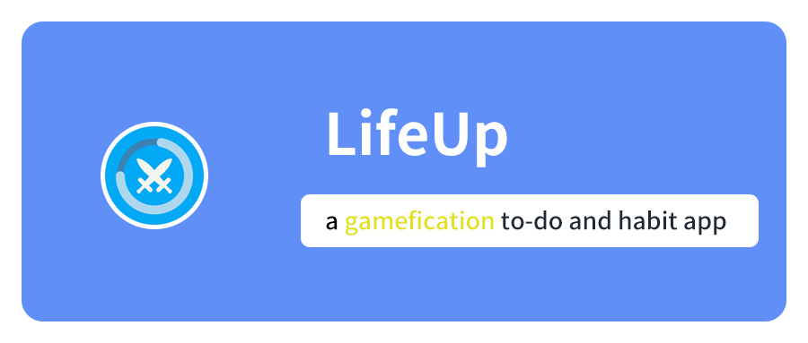

# Welcome to the world of LifeUp!

[中文](https://wiki.lifeupapp.fun/zh-cn/#/guide/hello_lifeup)

## Introduction

?> **Thanks for purchasing and downloading *LifeUp*!**

**LifeUp is a unique gamify To-Do and habit forming android application.**

It is different from some gamify app that is incorporated into the built -in game.

It focuses on using game elements to motivate you to act in real life.

You can customize your attributes, rewards, achievements, synthesis, and even treasure chests in LifeUp.

But this also means that the early settings and learning need for a period of time.

### FAQ before use

But before your use, you may want to know the following information:

- **I downloaded it through Google Play. If I am not satisfied, how can I get a refund?**

  Both we and Google Play know that an app is difficult to satisfy everyone.

  As long as you uninstall the app within a period of time (usually 24 hours), you can get the automatic refund of Google Play.

  If you exceed this time, please contact our mailbox kei.ayagi@gmail.com and provide your GPA order number, we will assist with the refund.

- **Is my data privacy and safety?**

  Yes, you can check [our privacy policy documents](https://wiki.lifeupapp.fun/en/#/introduction/privacy-terms) to get more information.

  TL;DR: Except for the world module (similar to the function of sharing design), other data will not pass through our server, it will only be stored in your device. The same is true of the pictures and other information you choose. **You can also choose offline mode.**

- **Since the server does not store data, how can I back up the data?**

  LifeUp supports export and import data functions.

  You can also set up the WebDAV server, Google Drive or Dropbox for automatic backup.

---

## Features

🚧We're still working on this documents...

---

## Contact Us

If you have any further feedback or questions, or need help with the refund, **please feel free to reach out to us by email at kei.ayagi@gmail.com.**