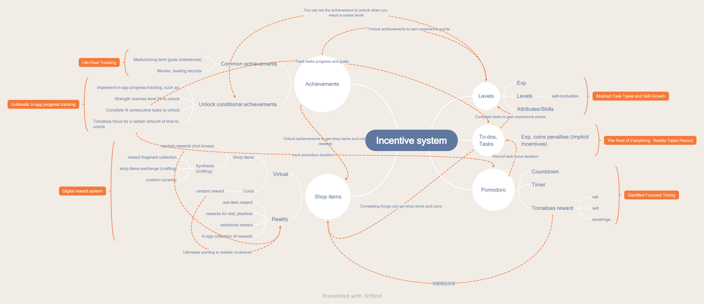

<h1 align="center" padding="100">Welcome to the world of LifeUp!</h1>

 

[中文](https://wiki.lifeupapp.fun/zh-cn/#/guide/hello_lifeup)

## Introduction

?> **Thanks for purchasing and downloading *LifeUp*!**

**LifeUp is a unique gamify To-Do and habit forming android application.**

It is different from some gamify app that is incorporated into the built-in game.

It focuses on using game elements to motivate you to act in real life.

You can customize your attributes, rewards, achievements, synthesis, and even treasure chests in LifeUp.

But this also means that the early settings and learning need for a period of time.

One thing to note is that LifeUp is positioned as a to-do list, habit-forming app, not a calendar app.

### FAQ before use

But before your use, you may want to know the following information:

- **I downloaded it through Google Play. If I am not satisfied, how can I get a refund?**

  We and Google Play understand that an app may not satisfy everyone.

  Before purchasing LifeUp, you can access a 7-day trial version available on our [GitHub](https://github.com/Ayagikei/LifeUp/releases).

  If you are not satisfied with the app and uninstall it within a few dozen hours after purchase, Google Play will typically process an automatic refund within 24 hours.

  If you exceed this automatic refund period (24 hours) but are within 7 days of purchase, you can still contact us at lifeup@ulives.io and provide your GPA order number. We will assist with a manual refund request. Please ensure to use the Gmail address associated with the purchase.

  Refund requests will not be processed after 7 days from the purchase date.

  Please note that leaving a review on Google Play will not assist with the refund process. Without key information, we cannot help with refunds through app reviews on Google Play.

  

- **Is my data privacy and safety?**

  Definitely, We value your privacy!

  You can check [our privacy policy documents](https://wiki.lifeupapp.fun/en/#/introduction/privacy-terms)
  to get more information.
  
  TL;DR: Except for the world module (similar to the function of sharing design), other data will
  not pass through our server, it will only be stored in your device. The same is true of the
  pictures and other information you choose. **You can also choose offline mode.**
  
- **Since the server does not store data, how can I back up the data?**

  LifeUp supports export and import data functions.

  You can also set up the WebDAV server, Google Drive or Dropbox for automatic backup.

- **Do I have to log in? Or when I log in, it is prompted that the network is abnormal?**

  No! LifeUp is an *offline-first* app.

  Logging in is only used to access the "World" module, which lets you view teams, items, and random
  tasks created by others.

  If you are unable to log in, it may be due to a problem with your local network, or an abnormality
  with our server.

  You can try switching network and DNS first.

  If you think there is a problem with our server, you can send us an email to confirm.

  You can also try using offline mode directly, which will also give you access to most of LifeUp's
  features!

- **How to configure task notifications and background running?**

  LifeUp supports notification and calendar event reminders.

  Due to Android's battery limitations, **and additional aggressive battery optimization measures by some phone manufacturers**, the default notification reminder require additional user configuration to take effect.

  You can also try switching to Calendar Event Reminders, which only requires granting Calendar permissions.

  > *But some other features (like Pomodoro) may also need to be configured to run in the background.

  For more information, please check this document: https://wiki.lifeupapp.fun/en/index.html#/guide/background_running

- **How can I view more FAQs about app usage?**

  You can always find the link of **the FAQ page** in the app-`sidebar`-`Q&A`.

  Or you could just remember our website:

  https://wiki.lifeupapp.fun/en/#/guide/faq

  > If you use a computer, you can get a better reading experience.

---

## Incentive system

## Features

> 🚧We're still working on this sections... There may be problems with grammar, incorrect picture language, etc. Corrections are welcome.

There are a lot of examples and guidelines in the app right now.

For higher customization and more feature support, *LifeUp* will have a certain threshold for getting
started.

But don't panic, the vast majority of them are optional.

**You can focus only on the options you need with minimal usage.** And gradually learn more options
to unlock more usages.

It's like playing a game and gradually improving your skills! :D

<h3 align="center" padding="100" id="task">I. Tasks</h2>

Tasks are the cornerstone of everything. Set yourself tasks, set rewards, and try to challenge yourself! 

 

We define a task as something that you can realistically accomplish.

So the task module is purely a `recording` tool to assist you in recording the reality of `completion` and to assist you in reward and punishment control.

It is not responsible for taking on some automated operations. But you can use the `achievement` module to track the progress of the tasks.

#### # Quick Start
1. **Todos**
    The non-repetitive task is also known as a general to-do list.
    You only need to enter the `todo` content to create this kind of task.

2. **Habits**

  Repetitive tasks are generally used for habit formation, such as `waking up early` and `reading every day`.

  Generally, you only need to enter the `todo` and `Repeat frequency`.

 

#### # Advanced Usage
##### 0. Repeat concepts
**Deadline time**

`Deadline time` refers to the point in time when **the current task** triggers task failure and penalties, which can also be interpreted as the point in time when it refreshes, rather than the point in time when the entire repeat task ends.

> In *LifeUp*, you need to manually `delete` to end the task; if you want to achieve an end after completing 30 repeats, you can check the `target number (of repeats)` setting.

For daily tasks, it is usually sufficient to keep the default ``23:59:59`` for the current day.

Of course, **you can also adjust that time if you are used to completing in the early hours of the next morning (e.g., until `2 am the next day`).**

 

!> **"No deadline"** means that the task will not automatically expire and repeat. In most scenarios, you only need to keep the default deadline and do not need to set it to "No deadline".

 

**Start time**

It is used to limit the time when the todo starts to show.

Or, for **repeating tasks** limit the period for completing (e.g., limit the waking up early tasks to 6:00 am).

For typical use cases, you can just keep them as default.

 

**Repeat**

Tasks perform *repeat* logic when they are completed, given up, or overdue.

LifeUp will **automatically** calculate the `start time,` `deadline time`, and `reminder time` for the next task circle based on your repeat frequency settings.

 

**Target times**

Represents how many repetition cycles the task needs to execute.

If the task is a daily task, it is equivalent to representing `how many` days you completed the task.

 

**Count tasks**

Counting tasks are used to help you record actions that need to be repeated in a repeating cycle.

For example, the 7 in `drink 7 glasses of water` is a count.

 

##### 1. Task templates
You can create your own task templates using the `Freeze` + `Copy` functions.

For example, you can create a motion-related task and `freeze` it.

When you need to create similar tasks, you can directly `copy` this template and edit it for use.

 

##### 2. Archiving tasks

You can use the `Freeze` + `List Archive` functions to achieve similar functionality to task archiving.

 

#### # Details

> WIP...

 

#### # Linkage

Matters can be linked to almost any other function.
- **Attributes:**
   You get experience points for completing tasks, but you get a penalty for failing them.
- **Shop:**
   Get coins or shop items for completion.
- **Achievements:**
  Set the unlock condition of custom achievements to complete the task for a certain number of times.
- **Pomodoro:**
   Associate a task with a Pomodoro, and record the time you focus on the task and the number of Pomodoros you get.
- **Feelings:**
   Complete tasks to record feelings: with daily tasks to achieve diary, with unlimited tasks to record notes at any time.

---

<h3 align="center" padding="100" id="skills">II. Attributes</h2>

Quantify your capabilities and growth in the abstract

 

#### # Quick Start

Attributes are an abstract self-driven incentive system.

The point of attributes is to quantify growth, allowing you to visualize your development with a unique perspective while completing your tasks, thus motivating you to work harder.

In another layer of meaning, attributes will divide multiple dimensions. Witnessing the difference in the growth of attributes can also make you think about whether to try more areas.

Its concept is similar to the game version of the `10,000 hours law` that counts by experience value.

You can create the attributes and skills you want to work on, witness and rejoice in your growth, and implement unique self-rewards with the `Achievements` feature.

1. **Built-in Attributes:**

  *LifeUp* has six primary built-in attributes.

  You can use them and try to work your way up to upgrade them!

  Also, refer to the level deviation between attributes and improve your weak aspects.

2. **Self-built attributes or skills**.

  In *LifeUp*, you can fully customize your own attributes or skills!

  For example: `Fishing`, `Programming`, `Reading`.

 

#### # Details

- WIP

 

#### # Linkage
> Linkage already described in other modules is not repeated here
- **Achievements:**
   A certain attribute reaches a certain level to unlock the achievement.
- **Pomodoro:**
   Eat tomatoes to gain experience points.
- **Shop**.
   Create items that affect the amount of experience points.

---

<h3 align="center" padding="100" id="shop">III. Shop</h2>

Highly customizable self reward and penalty systems. 

 

Set a price for your quests and rewards.

Complete your tasks, earn coins and buy rewards to motivate yourself to keep working hard.

#### # Quick Start
##### Item Type
Broadly speaking, they can be divided into two categories of goods.

**1. Realistic rewards.**

The application can assist in records, purchases, and limits. However, your exact implementation of the rewards requires realistic actions.

Broadly, they can be divided into.

- In-kind rewards (such as a computer, a mouse)
- Rest and recreation time/time bonus
- ...

For example, "take a five-minute break", "watch a movie", "buy a bottle of otaku happy water".

**2. in-app rewards.**

You can achieve in-app data rewards by combining them with "Use Effects."

Such as rewarding a certain amount of coins, experience value, randomly opening boxes (loot boxes) to extract other rewards, etc.

Such rewards can also be paired with realistic rewards to achieve various effects.

?> Using random to increase the uncertainty of the reward can significantly increase the incentive effect.

 

##### Don't know what items to set up?

You can go to the `World`-`Market` module to refer to and import items created by others.

If you see an icon you like, you can click the `Menu (three dots)`-`Icons` button to add the icon to your local area.

 

##### Inventory

The inventory can be used as a staging area to store temporarily unused rewards.

For a simple example, let's say you purchase a "see a movie" reward.

If you don't want to implement this reward yet, leave the `Use` option unchecked at the time of purchase, and then the item will be automatically stored in the inventory.

Also,

- The item rewards for tasks and achievements will also be automatically placed here.
- Items containing special operations (such as synthesis and unboxing) will also be forced into the inventory first.

 

#### # Advanced Usage

##### 0. Setting up the loot boxes.

 

Randomness is a great way to motivate you!

In *LifeUp*, you can create your own loot box.

> Loot boxes in *LifeUp* is based on real probability calculation, there will be no pseudo-random floating effect in the game. **It is recommended to set the probability higher than real game.**

 

##### 1. Synthesis (crafting).

Click the `flask` icon on the Shop page to enter the synthesis system.

The synthesis system can be used to implement arbitrary item exchanges.

For example, it can be used to achieve `multi-currency`, `multi-item` rewards, or with `loot boxes` to achieve complex collections of `fishing`, `card upgrades`.

For example.
- `line` + `bait` + `fishing place` -> `🐟 blind box`
- `Locked box` (get it by signing in daily) + `Key` (probability of getting it by completing the task) -> `Loot Boxes`
- ...

The usefulness of the synthesis system depends on your imagination (you can find more uses in  `3. Make your own currency` and `4. Collect five blessings (Gourd boy saves grandpa)` below).

 

##### 2. Multi-item rewards.

**After updating to version 1.94.0, you will be able to set multiple item rewards for tasks or achievements. The following are some alternatives from the previous versions that are still applicable.**

Only one type of item reward can be set by default for a Tasks.

But you can package multiple items into one treasure chest.

This also facilitates the sharing of commodity rewards between multiple tasks.

For example.
- Use the open box fixed reward mechanism: task rewards ` treasure box `, open ` treasure box ` fixed rewards `item A`, `item B`.
- Use the synthesis system: Tasks to reward a `Treasure Chest`, then to use `Treasure Chest` in the synthesis system to get `item A`,  `item B`.

 

##### 3. Custom Currency.

The default coins may not meet all kinds of needs.

You can use the `Synthesis` system to build your  currency and Shop.

 

Realization.
- Sports Quest->Reward `Sports Coins` ->Use `Sports Coins` to synthesize `Sports` rewards
- `Tomatoes` -> `Tomato Coins` ->Synthesis of exclusive items

 

##### 4. Card collections

Collect a set of cards to exchange for very rare rewards?

 

The short version is.
` Complete the quest to get a blind box of shards `->` Get a random type of sha

 

#### # Details

-WIP

 

#### # Linkage
The linkage has been described in other modules and is not repeated here
- **Achievements:**
   Purchase and use an item a certain number of times to unlock achievements.
   Synthesis of unique items to obtain achievements.
   Reward certain non-purchasable items through achievements.
- **Pomodoro:**
   Redeem a particular item with tomatoes.
- **World:**
   You can share the items you create or directly import the items created by others.

---

<h3 align="center" padding="100" id="achievements">IV. Achievements</h3>

Medium and large goals, milestones, automated progress tracking

 

#### # Quick Start
**1. Normal Achievements**.

Normal achievements refer to achievements that **do not set unlocking conditions**, they require manual clicking to complete, which is somewhat similar to the tasks.

Normal achievements can set icons. And after unlocking, its display will also be retained.

So it is recommended for scenes like `Milestones`, `Long-term goals`, `Life goals` and so on.

For example.
- Try it once 🎣
- Arriving at XX places for one trip
- 20 years old!
- 🎓 Graduated
- First paper release
- ...

**2. Conditional Achievements**.

To create this type of achievement, you just need to set the unlock conditions for it.

*LifeUp* will automatically track and calculate progress of the conditions. The achievement will be unlocked when you complete all unlock conditions.

 

**Tens of various aspects of achievement unlocking conditions are currently supported within the app, such as:**
- Total number of tasks completed
- Number of consecutive tasks completed
- Number of times to use the product
- Number of synthetic commodities
- Focus on a particular task for a certain length of time
- Wait...

 

#### # Details
- WIP

 

#### # Linkage
> Linkage already described in other modules is not repeated here
- Progress tracking support for almost all modules (tasks, shop, Pomodoro)
- You can write a feeling when you complete the achievement.

---

<h3 align="center" padding="100" id="pomodoro">V. Pomodoro</h2>

Gamified Pomodoros like you've never experienced before, which, with the ability to eat and sell your tomato rewards and a well-established timing system

 

#### # Quick Start
The Pomodoro is based on the tomato timer method, which in short means working in combination with work (25 minutes of work and 5 minutes of rest).

*LifeUp*'s Pomodoro is a secondary module, with simple functions and other modules as the main focus. However, there is still plenty of room for improvement, and we will continue to improve the statistics and other features.

 

##### Pomodoro countdown
> To use the countdown properly, please make sure you have configured according to `compatibility configuration`.

By default,  `LifeUp` is in the Pomodoro timer state.
Before you use it, you can go to the settings to adjust `working time`, `rest time`, `interval`, etc.

You get one tomato for each complete work section completed.

Each timing needs to be turned on manually for reminder purposes.

 

##### Positive Timer
Click the `Clock` icon in the upper right corner of the tomato page to switch to positive timing mode.

> Click again to switch back to countdown mode.

**The role of the buttons for positive timing from left to right:**
- Give up
- Pause
- Sum up the reward

 

##### Associated tasks

When doing tomato timing, you can associate the timing with a task.

The timing records generated by the association are also bound to the task.

Later you can check the task's details page to see the task's `Duration of Focus` and `Number of Tomatoes Gained` information.

If it is a repeated task, it supports viewing the current focus record and the accumulated focus record separately.

With this feature, you can achieve **simple 1w hour statistics** or maybe something else.

 

##### Add timing manually

You can add any time period to the tomato timer log.

And you can set the tasks associated with the timer.

 

##### Uses of Tomato

 

- Eating: Gain experience value (default stamina)
- Sell: Get coins
- Exchange: Obtaining specific items

#### # Details

##### > Not available yet

 

#### # Linkage
The linkage has been described in other modules and is not repeated here

- **Tasks:**
   When you start the timer, you can specify the task you are focusing on and count the focus time for the task.
   
- **Shop:**
   Eat or exchange tomatoes to get coins for shop item rewards
   
- **Achievements:**
  Achievement support tracks information such as the number of hours of focus on a particular type of task, the cumulative number of tomatoes earned, etc.
  
- **API:**
  Use automation tools + API to intercept notifications from other timing software and add timing logs

---

<h3 align="center" padding="100" id="feelings">VI. Feelings</h2>

Simple text and picture records. Reflect on the past and look to the future.

 

#### # Quick Start

The Feelings function is a sub-module of *LifeUp*, providing only a short text and picture recording function.

! > Each feeling is currently limited to 750 characters and 9 images.

The following are ways to create Feelings.

- When you turn on the Feelings switch for the task, the Feelings input box will pop up automatically when you complete the task
- When you turn on the Feelings switch for the achievement, the Feelings input box will pop up automatically when you receive the achievement reward
- When you complete the **Team Tasks**, a Feelings input box will pop up by default, and the sentiment of the team Tasks will be automatically posted to the world module publicly
- You can proactively add Feelings notes to any task record at any time on the `History`, `Calendar-Ended` pages (overdue and abandoned tasks are also supported)
- You can proactively add your Feelings at any time on the achievement page, just to **long press** on any achievement

 

##### Simple Diary

You can create a daily task and enable the Feelings function for it, as a simple daily diary trigger.

 

##### Keep track of your Feelings

You can create an infinite task and enable the Feelings function for it to record your feelings at any time.

And since the Feelings supports filtering by repeat tasks, you can also create multiple unlimited tasks of different types to record different categories of Feelings.

 

#### # Details

-

#### # Linkage
- Record feelings about tasks
- Record feelings about achievements

 

<h3 align="center" padding="100" id="feelings">VII. World</h2>

There are enough social apps in the world. Here, there is no communication element. Just your little world to share moments and designs.

 

#### # Quick Start

##### Team

Work with team members to complete certain habits.

For example, the "early to bed, early to rise" challenge.

There is no social element here, so there is no need to worry about any interruptions.

 

##### Moments

Here, you can browse other users **who have completed team tasks** and posted their Feelings on completion.

You can also follow some positive users, observe their progress and use it to passive motivate yourself.

 

##### Market

Don't know what item rewards to create? Or need to learn how to create advanced rewards using API features? Or it would help you find some nice icons.

You can always import items created by other users in the Market and modify them locally to customize them for your own rewards.

 

##### Random Taskss

Don't know what tasks you want to do when you are lost?

Feel free to come to this module to receive invitations to random tasks.

Complete a small meaningful task with your hands~

For example, pack your things, talk to your loved ones, and take photos to document the good life.

 

#### # Details

-

#### # Linkage

- **Tasks:**
  - Join or create a team and get team tasks
  - Receive random tasks
- **Feelings:**
  Complete team tasks and post your Feelings publicly to the Moments module
- **Shop:**
  - Importing products created by other users
  - Add product icons created by other users

 

---

<h3 align="center" padding="100" id="api">VIII. Open Interface (API)</h2>

Open in both directions (external apps <--> LifeUp), automate your LifeUp and create endless linkage possibilities~

#### # Quick Start

**Open Interface** is an advanced feature in `LifeUp`.

With it, you can achieve

- Linking external applications using items (opening external applications, triggering actions of external applications)
- Using items affects the values in `LifeUp`, such as the ATM rate, the probability of a items being in a certain box.
- External applications are linked to provide rewards for your `LifeUp`. For example, in the example there is a Wordle Guess the Word web game, and when you guess it, you will get 10 coins in *LifeUp*.
- External automation tools are linked to determine location, wake up, swipe NFC cards, automate tasks, penalties, record focus time for other applications, and more...

 

##### Import items

It may sound complicated, but if you do not need customization.

You can import API items directly in **World**-**Markets**-**(Link, API, Automation)** tab and use them directly.

 

#### # Details

[Click here for a detailed description of the open interface](/guide/api)

#### # Linkage use

- The API functionality can be tried in conjunction with almost any module, please see the interface documentation for details.
- External applications, web pages: In addition, the API function can be linked with external applications and web pages, so you are welcome to participate in secondary development.
- Automation tools: You can work with Tasker and Macrodroid automation tools to achieve automation functions.

 

## Contact Us

If you have any further feedback or questions, or need help with the refund, **please feel free to reach out to us by email at lifeup@ulives.io.**

In most cases, we will get back to you within 48 hours.

However, it cannot be ruled out that special circumstances (such as email spam filtering or our oversight) may cause us to miss some emails. If you do not receive a response, please consider resending your email.

For a more reliable way to reach us and provide feedback, we recommend using the [GitHub issues page](https://github.com/Ayagikei/LifeUp/issues).

