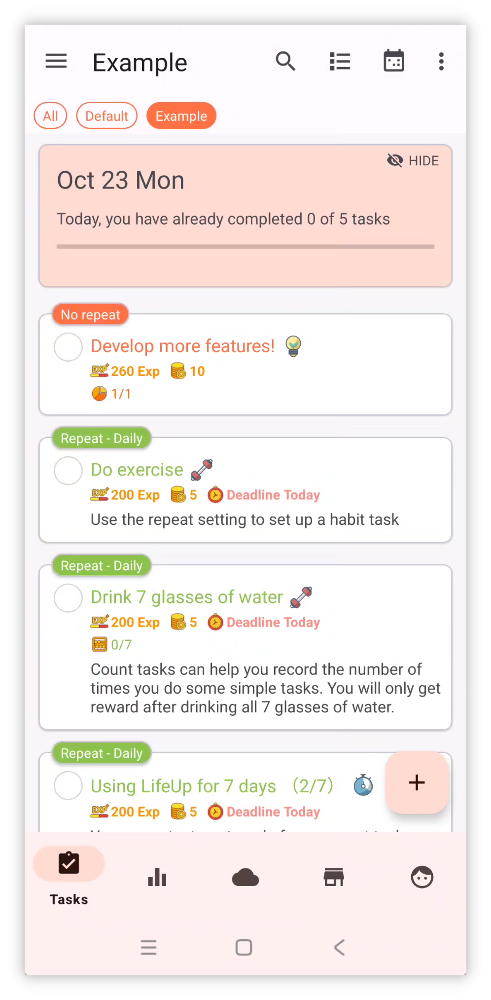
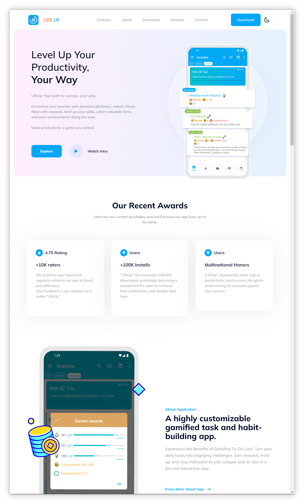

## v1.93.0 - Plantillas de Tareas y Material 3

## 🚀Introducción

En LifeUp hemos escuchado de cerca los comentarios de nuestros usuarios, y nuestros esfuerzos recientes se han dedicado a mejorar algunas de las funciones más solicitadas. Estamos comprometidos a perfeccionar tu experiencia con LifeUp basándonos en tu valiosa opinión.

Además, avanzamos diligentemente en nuestra hoja de ruta de desarrollo, con el objetivo de traerte actualizaciones aún más emocionantes en el futuro. Tu confianza y apoyo son lo que nos impulsa a mejorar continuamente.

Además de estas mejoras, exploramos activamente tecnologías como Flutter y KMM, abriendo puertas a nuevas posibilidades que elevarán aún más tu experiencia con LifeUp. Mantente atento a estos desarrollos mientras seguimos creciendo y evolucionando. 🚀🔍

**Esta actualización trae plantillas de Tareas, Logros secretos y adaptación completa al nuevo lenguaje de diseño Material You, entre otras funciones.**

**Algunos módulos funcionales, como Reflexiones y APIs, también han recibido mejoras y optimizaciones.**

Si tienes preguntas o sugerencias, contáctanos en 📫[lifeup@ulives.io](mailto:lifeup@ulives.io) o envía un issue en GitHub (https://github.com/Ayagikei/LifeUp/issues)

---

## I. 📋 Plantillas de Tareas

Esta versión introduce plantillas de Tareas integradas. Elimina la necesidad de crear Tareas indirectamente usando «Copiar Tarea» y APIs.

Al crear o editar Tareas, los usuarios pueden guardar la configuración actual como plantilla.

En el futuro, al crear Tareas, podrás importar configuraciones de Recompensas, ajustes de Tareas y más con un solo clic.

### 📕 ¿Cómo usar?

Al crear o editar Tareas, haz clic en el botón Plantillas de Tareas en la barra superior.

Las plantillas de Tareas registran la mayoría de tus ajustes, pero actualmente no incluyen la fecha límite.

## II. 🎨 Tema Material You

Esta versión se adapta por completo al lenguaje de diseño Material You (tema).

Este lenguaje de diseño es más moderno y ofrece una apariencia más limpia. También es uno de los estilos de interfaz promovidos oficialmente para el futuro.

Además, la característica principal de Material You es que «cada persona puede tener un color de tema diferente».

Esto permite que «LifeUp» introduzca nuevos mecanismos como colores de tema dinámicos basados en el fondo de pantalla y colores de tema personalizados. (Nota: se requiere compatibilidad del dispositivo.)

### 📕 ¿Cómo usar?

Como se muestra en las imágenes anteriores, abre la barra lateral, ve a Ajustes y haz clic en Pantalla para ajustar las opciones relacionadas.

Si tu dispositivo no admite colores de tema dinámicos, aún puedes elegir entre colores de tema predefinidos.

Pero si tu dispositivo admite colores de tema dinámicos, puedes activar esta función y personalizar los colores de tema que desees con gran flexibilidad:

## IV. 🌐Nuevo sitio web oficial

Hemos lanzado una nueva página de inicio que facilita compartir «LifeUp» con tus amigos más que nunca.

Simplemente visita [lifeup.ulives.io](https://lifeup.ulives.io) para echar un vistazo a lo que «LifeUp» tiene para ofrecer.

## III. ✨ Más funciones

**Tema de interfaz**

1. Adaptación completa a Material Design 3.
2. Soporte de personalización de colores de tema de Material Design 3, incluidos colores personalizados, colores del fondo de pantalla y colores de imágenes.
3. Mejora de algunos efectos de animación, como los popups.
4. Optimización de los efectos de adaptación edge-to-edge (inmersivo).

**Tareas**

1. Soporte de plantillas de Tareas.
2. Las estadísticas en la página de detalles admiten cambio según criterios de tiempo y optimizan las opciones predeterminadas.
3. La página de historial admite buscar nombres de Tareas y ajusta la interfaz e interacciones relacionadas.

**Logros**

1. Soporte de Logros secretos.
2. Al añadir Logros, soporte de «Continuar añadiendo el siguiente Logro».

**Atributos**

1. Soporte para ocultar Atributos.

**Temporizador Pomodoro**

1. Soporte para editar registros de tiempo.
2. En la página de Pomodoro, soporte para completar Tareas (mantener pulsada la Tarea seleccionada en modo pausa).

**Reflexiones**

1. Soporte para añadir Reflexiones directamente en la página de Reflexiones.

**API**

1. Añadida la API «use_item».
2. Añadida la API «random».
3. Añadida la API «edit_exp».
4. La API «item» ahora admite ajustar parámetros como «action_text», «disable_use» y «title_color_string».
5. La API «shop_settings» admite el parámetro «silent».
6. Soporte del marcador de posición «time». Ahora puedes configurar Tareas con fechas como «vence mañana» o «vence el próximo mes» sin necesidad de herramientas de automatización.

------

Además de estas funciones, hemos abordado diversos problemas reportados y realizado algunas correcciones de errores. Para más detalles, consulta el siguiente registro de actualizaciones.

### ♻️ Optimizaciones

1. Añadidos prefijos en algunos lugares que muestran id de datos.
2. Optimizada la visualización de actividades de equipo.
3. Intento de resolver el problema de que algunas notificaciones Toast eran demasiado largas para mostrarse por completo.
4. Mejorada la lógica de completado de widgets en equipos, asegurando consistencia con el comportamiento en la App.
5. Página de estadísticas: tras seleccionar un rango de tiempo «Personalizado», hacer clic de nuevo en «Personalizado» ahora activa una nueva selección de fechas.
6. Asegurada compatibilidad con Harmony OS 4 para que las notificaciones de barra de progreso muestren botones de acción.
7. Mejorada la lógica de interacción de solicitudes de notificación.
8. Abordado el problema de que el método de entrada podía obstruir la entrada de «Repetir conteo».
9. Ahora, al crear Tareas, se registra la elección del usuario de horas de inicio no específicas (como automático o vence hoy). Al editar, se restauran estas opciones en lugar de horas específicas, para evitar discrepancias en las horas editadas.
10. Al crear Tareas, si ocurren advertencias inesperadas sobre duplicados, también se mostrarán en el popup «Comprobar duplicados».
11. Añadido soporte de idioma indonesio.
12. Actualizadas las traducciones.

## 🐛 Correcciones de errores

1. Corregido el problema de que, en ciertos casos, el módulo Mundo podía quedarse cargando indefinidamente.
2. Corregido el problema de que, en ciertos casos, la Tienda/almacén podía seguir mostrando carga indefinidamente.
3. Corregidos problemas que podían ocurrir al llamar APIs con contenido de interfaz mediante content provider.
4. Corregidos problemas de ordenación de Tareas que no cumplían las expectativas.
5. Corregido el problema de que los datos en la página de estadísticas eran incorrectos tras seleccionar un rango de tiempo «Personalizado».
6. Corregido el problema de que los popups de solicitud de notificación no admitían desplazamiento.
7. Corregido el problema de que, en ciertos casos, la búsqueda del módulo Mundo mostraba todo el contenido.
8. Corregido el problema de que la opción «Mostrar completadas» también mostraba Tareas congeladas.
9. Corregidos problemas con el cálculo de valores promedio en la página de estadísticas.

## Agradecimientos especiales a nuestros colaboradores de GitHub, héroes del feedback por email y colaboradores de traducción en Crowdin

Extendemos nuestra más profunda gratitud a los usuarios que han participado activamente enviando issues en GitHub, contactándonos por email para dar feedback y dedicando su tiempo a contribuir traducciones en Crowdin.

Sus esfuerzos combinados han sido cruciales para dar forma a la experiencia «LifeUp» de nuestra comunidad global. Han ayudado a mejorar la funcionalidad y accesibilidad de la App, y sus contribuciones son verdaderamente invaluables.

Mientras trabajamos juntos para hacer «LifeUp» aún mejor, queremos expresar nuestro sincero agradecimiento por su apoyo y colaboración inquebrantables. 🙏📧🌍
