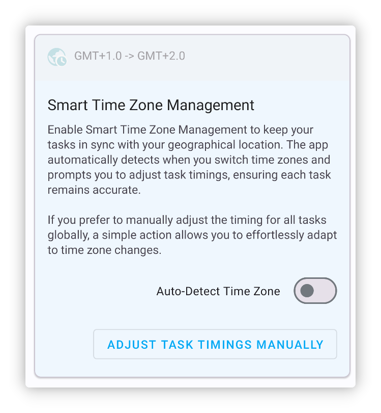

<h1 align="center" padding="100">v1.94.0 Recompensas de múltiples Objetos</h1>

## Introducción

Esta actualización introduce principalmente funciones como recompensas de múltiples Objetos y widgets de Inventario, junto con numerosas optimizaciones, mejoras de rendimiento y correcciones de errores.

**📧¿Cómo enviar comentarios?**

Si tienes preguntas, sugerencias o quieres informar de un error, contáctanos en 📫[lifeup@ulives.io](mailto:lifeup@ulives.io) o envía un issue en GitHub (https://github.com/Ayagikei/LifeUp/issues)

## 1. ✅Recompensas de múltiples Objetos

Ahora, en LifeUp, puedes seleccionar múltiples Objetos en varios lugares. Ya no necesitas configurar la apertura de cajas o la fabricación para lograr múltiples Recompensas.

Por ejemplo, puedes:

- Configurar directamente múltiples Objetos como Recompensas de una Tarea
- Elegir múltiples Objetos al configurar la apertura de cajas y establecer las probabilidades de una sola vez
- Configurar directamente múltiples Objetos como Recompensas de Logros y subtareas

 

### 📕¿Cómo usar?

Haz clic en el botón de selección múltiple en la parte superior al seleccionar Objetos.

> Ten en cuenta que algunos escenarios pueden admitir solo selección individual.

## 2. 🔧Widgets de Inventario

Esta versión introduce dos tamaños de widgets de Inventario.

Ahora puedes ver y usar rápidamente los Objetos de tu Inventario directamente desde el escritorio.

 

### 🚀 Optimizaciones y resolución de problemas

A pesar de lanzar el widget de Tienda hace varias versiones, gradualmente encontramos algunos cierres inesperados u otros problemas.

Por ejemplo, debido a los límites de transmisión del sistema de widgets, tener demasiados Objetos podía provocar que la App se cerrara, problemas al cambiar de lista o fallos al cargar imágenes personalizadas.

En esta versión hemos encontrado soluciones adecuadas. Ahora, los widgets de Tienda e Inventario deberían poder mostrar una gran cantidad de Objetos, y hemos probado widgets de Tienda con casi 1000 Objetos que siguen siendo funcionales y cargan correctamente (aunque no se recomienda).

 

### 📕¿Cómo usar?

Normalmente puedes crear un widget manteniendo pulsado el escritorio del sistema.

Si usas un dispositivo como Xiaomi o Redmi (MIUI/HyperOS), añadir widgets en MIUI/HyperOS está algo oculto; consulta el documento de configuración de compatibilidad sobre cómo añadir widgets.

## 3. ✨Más funciones

**Temas de interfaz**

1. Los colores personalizados (texto de Tareas, Objetos) incluyen ahora más valores predefinidos
2. Adaptación al icono adaptativo monocromático de Android 14
3. Más adaptaciones de idioma (versión de Google Play)

**Logros**

1. Si hay Logros con Recompensas sin reclamar, ahora se mostrará un pequeño punto rojo en la lista de Logros.

**Tareas**

1. Las subtareas de Tareas con penalización ahora ejecutan correctamente la lógica de penalización
2. Añadida «Gestión inteligente de zona horaria»; si trabajas en distintas zonas horarias, LifeUp también admite detectar automáticamente cambios de zona horaria y ajustes globales de hora
3. La base estadística en la página de detalles ahora recuerda la última selección, y optimizamos algunos valores predeterminados en ciertos escenarios
4. Optimizado el manejo de gracia de los días consecutivos de completado de Tareas en la página «Yo»; ahora, si olvidas completar una Tarea un día, recuperarla puede mantener la racha

**Atributos**

1. Admite eliminar registros de experiencia
2. Admite restablecer la experiencia de un Atributo individual

**Widgets**

1. Ahora, al hacer clic en el espacio en blanco de los widgets de Tienda o Inventario, se entra directamente en la lista a la que apunta el widget, en lugar de la última lista
2. Los widgets de Tareas ahora muestran el progreso de las Tareas de conteo

**API**

1. Añadida una API para editar registros de Pomodoro
2. La API de completar Tareas ahora también maneja correctamente las Tareas con penalización
3. La API de completar Tareas ahora también admite procesar Tareas de conteo (añade el parámetro `count`)
4. La API de completar Tareas ahora admite un parámetro de coeficiente de Recompensa
5. La API de ajuste de Objetos ahora admite cambiar el id de lista de Objetos
6. Las APIs de crear y ajustar Objetos admiten el parámetro de criterio de ordenación
7. La API jump ahora admite saltar al popup de usar Objeto
8. Unificadas algunas definiciones de parámetros, como `itemId` → `item_id`
9. Añadidas notificaciones broadcast al iniciar, pausar y finalizar un cronómetro
10. El `title_color_string` de la API de ajuste de Objetos ahora admite pasar una cadena vacía para restaurar el valor predeterminado
11. El broadcast de completar Tareas ahora incluye el id de lista
12. Abrir cajas y fabricar también activan ahora el broadcast de usar Objeto

------

Además de esto, hemos corregido una gran cantidad de problemas y algunos errores reportados recientemente.

Los detalles se encuentran en el registro de actualizaciones a continuación~

### ♻️Optimizaciones

1. Añadir o editar Tareas ahora incluye una advertencia si no se selecciona ningún Atributo y se introduce experiencia
2. Optimizados los registros de reintento de subida
3. Optimizada la visualización del título y las restricciones de entrada en la página de nivel personalizado
4. Optimizado el rendimiento y los problemas de temporización al deshacer Tareas que se han repetido extensamente
5. Refactorizado el popup de usar Objeto, la lógica de la interfaz del calendario, etc.
6. Optimizada la lógica relacionada con los recordatorios de Tareas, asegurando que no se emitan de nuevo recordatorios de datos eliminados o anteriores
7. Optimizado el texto de espera en la interfaz de respaldo
8. Las imágenes seleccionadas en la página de Atributo personalizado también se añaden ahora al historial de selección
9. Editar registros de Pomodoro ahora intenta corregir (aumentar o disminuir) el número correcto de Pomodoros

### 🐛Correcciones de errores

1. Corregido un Logro del sistema relacionado con estadísticas y respaldos que no se activaba normalmente tras la reestructuración
2. Corregidos posibles conflictos entre widgets de API random y toast con el toast predeterminado
3. Corregido que el detalle de la Tarea no se actualizaba en algunos escenarios al entrar desde un widget
4. Corregida la posibilidad de errores en múltiples aperturas de cajas en situaciones especiales (uso preventivo del Inventario de Objetos)
5. Corregido el problema de no mostrar subtareas en la página de detalles tras editar una Tarea sin subtareas y añadir nuevas
6. Corregidos algunos casos especiales en los que no era posible editar Recompensas de monedas
7. Corregidos algunos casos en los que reclamar Objetos de equipo podía no funcionar
8. Corregidas anomalías de estilo MD2 en algunos popups inferiores
9. Corregidos posibles valores de tiempo adicional incorrectos en temporizadores Pomodoro
10. Corregido el problema de que la barra de color en el widget de cambio de experiencia podía no mostrarse
11. Corregidas algunas Tareas que no se mostraban correctamente en el calendario en curso
12. Corregidos algunos problemas de carga de listas en las páginas de historial y Reflexiones
13. Corregido un problema en el que llamar a la API de completar Tarea dos veces seguidas no permitía dos completados consecutivos
