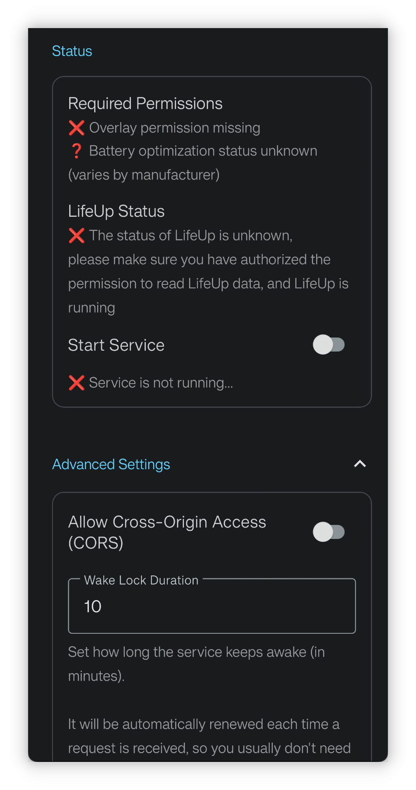

<h1 align="center" padding="100">v1.98.0 API 2.0 y actualización del cliente de escritorio</h1>

## Introducción
Esta es la primera versión de 2025, con las siguientes actualizaciones principales:

- Soporte de iconos Emoji: ahora puedes usar Emojis directamente como iconos de Objetos, Logros y más.

- Segunda oleada de actualizaciones de la API: las interfaces de la API ahora admiten modificar Tareas, editar efectos de Objetos, condiciones de desbloqueo de Logros, Síntesis y casi todas las funcionalidades principales.

- Optimización de LifeUp Cloud y del cliente de escritorio: mejora de la detección automática de conexión; el cliente de escritorio añade la función «Nuevas Reflexiones» y admite importar/exportar datos de respaldo.

## I. Iconos Emoji

### 📕¿Cómo usar?

- En esta versión, al seleccionar iconos para Objetos, Logros, etc., ahora puedes elegir directamente expresiones emoji como iconos.

## II. Segunda oleada de actualizaciones de la API

Desde que se abrió la funcionalidad de la API en v1.90.0, nos alegra ver que muchos usuarios exploran activamente y crean contenido enriquecido basado en la API. Muchos empezaron desde cero aprendiendo conocimientos relacionados con URL y aplicaron con éxito la API para crear widgets de escritorio, clientes de escritorio DIY e incluso lograron integración con aplicaciones web, lo cual es impresionante.

Sin embargo, debido a estructuras de datos complejas y una carga considerable de diseño y desarrollo, el primer lote de APIs carecía de algunas funcionalidades principales, como editar Tareas, editar Objetos, crear Logros con condiciones de desbloqueo y crear Objetos con efectos de uso. La finalización de estas funciones continuó hasta esta versión.

El diseño, desarrollo, pruebas y actualizaciones de la nube, los clientes de escritorio y la documentación de la API supusieron una carga de trabajo que creció exponencialmente, por lo que la rama de desarrollo iniciada hace varios meses solo completó desarrollo y pruebas ahora.

**¡Pero nuestros esfuerzos han dado frutos! Hoy, la API cubre casi todas las funcionalidades principales de LifeUp. Al abrir la API, esperamos que LifeUp sea más que una aplicación: una plataforma abierta donde los usuarios puedan desarrollar, ampliar y personalizar libremente sus propios sistemas de gamificación.**

### 📕¿Cómo usar?

- Para los métodos de uso de la API, consulta nuestra biblioteca de documentación → Directorio → sección Interfaz abierta.
- Se han añadido definiciones de las nuevas interfaces de la API a la documentación.

## III. Cliente de escritorio: función de archivo y Reflexiones

### Archivo

Ahora puedes exportar o importar archivos de respaldo directamente en el cliente de escritorio.

Esto simplificará el proceso de transferir datos a otros dispositivos y de recuperación.

### Publicar nuevas Reflexiones

Ahora admite publicar nuevas Reflexiones desde el cliente de escritorio, con soporte completo para añadir imágenes y configurar funciones de tiempo.

⚠️Nota: aún no se admite editar Reflexiones.

### Otras actualizaciones

- Mensajes de error y explicaciones relacionados con la conexión optimizados: indican claramente si se trata de un problema de red o de que el backend de LifeUp no está en ejecución
- Soporte para ver detalles de Tareas
- Soporte para validación de seguridad de API Token (opcional, requiere LifeUp Cloud 2.0.0)
- La lógica de compra ahora usa la nueva API «purchase item» en lugar de la anterior API «adjust item quantity» + API «adjust coin amount». Así puede manejar correctamente la lógica de límite de compra, manteniendo consistencia con la App.

Esta actualización también sirve para demostrar las capacidades de la API a través del cliente de escritorio, ya que todas las funciones del cliente de escritorio se implementan mediante la API.

## IV. Optimización de LifeUp Cloud

> LifeUp Cloud es una herramienta que expone la API como interfaces HTTP y actúa como puente para la conexión del cliente de escritorio.

Hemos realizado numerosas optimizaciones basadas en los comentarios sobre LifeUp Cloud:

- Añadida visualización de estado para detectar rápidamente por qué el cliente de escritorio no puede conectarse
- Añadidos ajustes avanzados
  - Permitir acceso cross-origin: útil para acceder a las interfaces HTTP de LifeUp Cloud con tecnologías web
  - Permitir puertos de servicio personalizados
  - Permitir configurar tokens de acceso: medida de validación de seguridad opcional
- Optimizados los valores de error devueltos y las especificaciones de las interfaces de LifeUp Cloud
- Optimizada la lógica de descubrimiento de servicio y del interruptor del servicio HTTP; la detección automática del cliente de escritorio debería funcionar mejor ahora

## V. Avance

Como esta actualización trae relativamente pocas funciones que no sean de API, aquí hay un avance del contenido de las próximas versiones, incluidas funciones actualmente en desarrollo:

- **Función principal:** Logros repetibles
- **Función media:** Optimización de legibilidad del texto para fondos personalizados
  - Originalmente parecía un cambio pequeño, pero resultó bastante complejo
- **Función menor:** Añadir acciones de completar y recordar más tarde a las notificaciones
  - Originalmente se planeó soportar notificaciones persistentes, pero se abandonó porque las versiones más recientes de Android ya no admiten persistencia real

## VI. ✨Registro completo de actualizaciones

### **LifeUp-Android**

**v1.98.0 (2025/01/01)**

**✨Funciones**

1. Integración de inicio de sesión con Google y autorización de Drive mediante Credential Manager.
2. Soporte para seleccionar Emoji como iconos.
3. Añadida API ContentProvider Query: funcionalidad de Síntesis.
4. Añadida API ContentProvider Query: funcionalidad de registro de tomate.
5. Añadida API ContentProvider Query: soporte para devolver múltiples Objetos.
6. Añadida API de tomate (ajustar conteo de tomates).
7. Añadida API export_backup (exportar respaldo).
8. Añadida API purchase_item (comprar Objeto).
9. Añadida API synthesize (activar Síntesis).
10. Añadida API subtask (crear o ajustar subtareas).
11. Añadida API subtask_operation (operar subtareas, p. ej. completar).
12. Añadida API synthesis_formula (fórmula de Síntesis).
13. Añadida API edit_task (editar Tarea).
14. Añadida API category (crear o ajustar lista).
15. Añadida API history_operation (ajustar historial).
16. Añadida API AppSettingsScheme (ajustar algunos ajustes de la App).
17. Añadida API achievement (crear o editar Logro).
18. Añadida API skill (crear o editar Atributo).
19. Añadido soporte para mostrar id y gid de subtareas.
20. Añadido soporte para mostrar id de Síntesis.
21. Añadido soporte para consultar creditLimit.
22. La API ContentProvider admite consultar subtareas (id, gid).
23. API ContentProvider de consulta de Objetos: añadido campo de retorno «cantidad máxima comprable».
24. La API ContentProvider de la Tienda admite consultar Objetos por lista de id especificada.
25. Optimizado el valor de retorno al consultar una URL incorrecta de ContentProvider.
26. La interfaz de consulta admite consultar un Logro individual.

**♻️Optimización**

1. Optimizado el orden personalizado predeterminado para Objetos recién añadidos.
2. Optimizado el orden personalizado predeterminado para Atributos recién añadidos.
3. Añadidos parámetros `purchase_limit`, `disable_use` y `effects` a la API «add_item».
4. Añadidos parámetros `background_alpha`, `items`, `start_time`, `auto_use_item`, `remind_time` y `pin` a la API «add_task».
5. Añadido soporte para más frecuencias de Tareas a la API «add_task».
6. Añadido soporte para parámetros `effects` y `purchase_limit` a la API «item».
7. Añadido soporte para terminar operaciones en APIs anteriores (p. ej. entrada).
8. Añadido soporte para especificar el parámetro `signed` en marcadores de posición numéricos.
9. Añadidos marcadores de posición de número aleatorio y decimal aleatorio.

### **LifeUp-Desktop**

**v1.2.0 (2025/01/01)**

**🚀Funciones**
1. Soporte de gestión de archivos
- Respaldo en el ordenador
- Restaurar desde el ordenador
- Soporte de arrastrar y soltar
2. Soporte para crear nuevas Reflexiones
- Soporte de selección de imágenes
- Soporte de sincronización de imágenes con el móvil
3. Soporte de vista de detalles de Tareas
4. Mejoras del sistema de compra
- Usar la nueva API «Purchase Items»
- Mantener los límites de compra consistentes con la App
5. Soporte de validación opcional de API Token
6. Soporte multiplataforma
- Windows
- Linux
- macOS (Apple Silicon)
- macOS (Intel) 🆕
7. Mejora del manejo de errores y notificaciones

### **LifeUp Cloud**

**v2.0.0 (2025/01/01)**

**🚀Funciones**
1. Optimización del servicio
- Lógica de descubrimiento de servicio y compatibilidad mejoradas
- Más dispositivos admiten detección automática de IP
- Optimizadas las transiciones de estado de inicio/pausa del servicio
- Mejora del manejo de errores y notificaciones
2. Seguridad y rendimiento
- Añadida validación opcional de API Token
- Añadidas opciones de configuración CORS
- Soporte de configuración de puerto personalizado
- Soporte de duración personalizada de wake lock
3. Mejora de la interfaz
- Diseño de interfaz completamente nuevo
- Mejora de la experiencia visual general
