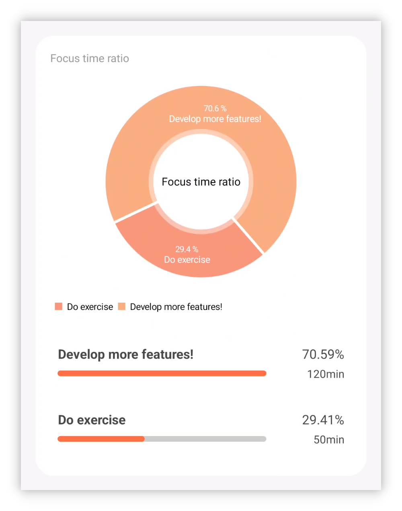
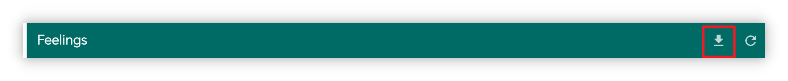

## v1.92.0 - Nouvelles statistiques, bureau mis à jour, plus de widgets

**Merci d'utiliser LifeUp !**

Voici quelques mises à jour récentes couvrant v1.91.1–v1.92.0.

Nous espérons que ces mises à jour vous seront utiles pour votre usage et votre productivité.

Si vous avez des questions ou des suggestions, contactez-nous à 📫[lifeup@ulives.io](mailto:lifeup@ulives.io) ou soumettez un issue sur GitHub (https://github.com/Ayagikei/LifeUp/issues

---

## 🔖Aperçu

### 📱App Android

1. 📈**Nouvelles statistiques**
2. 🏆**Nouveaux widgets App** : widget Objets Boutique et widget changement de Points d'Expérience
3. ✨**Nouvelle fonctionnalité** : prise en charge du masquage de la liste Boutique/Inventaire

### 🖥️Bureau

1. ✨**Connexion automatique**
2. 🚀**Exporter les Émotions en markdown**
3. 🖥️**Package d'installation macOS**

## 📱Mises à jour de l'App Android

### 🏆Nouvelles statistiques

Les statistiques et la revue des données ne sont pas seulement une étape importante pour améliorer notre productivité, mais aussi une source d'inspiration et de retours.

En revoyant nos efforts, nous pouvons voir nos progrès et Succès avec des données, et identifier aussi les problèmes et les axes d'amélioration.

Pour cela, nous avons lancé [Statistics 2.0], qui vous offre diverses analyses de données intrigantes.

 

#### ❓Comment utiliser ?

Pour accéder aux nouvelles statistiques, mettez à jour vers v1.92.0, allez sur la page [Statistics], puis appuyez sur le bouton [Click to view new statistics] en haut.

 

#### 📊Éléments statistiques

Statistics 2.0 fournit une analyse de données pour divers modules : du pourcentage de Tâches de Concentration dans les tomates, au nombre moyen de tomates par jour, aux variations quotidiennes des Attributs, aux enregistrements d'achat d'Objets, à l'état de complétion des Tâches, et plus encore.

 

#### ⏰Filtre temporel

Il prend en charge un filtrage de plage temporelle **flexible** : vous pouvez facilement consulter les données du jour, de la semaine, du mois, de l'année ou d'une plage personnalisée.

Votre LifeUp doit être adapté à vous : pas besoin d'attendre la fin de l'année pour voir le résumé annuel, ni de craindre de le perdre chaque année.

Dans LifeUp, vous pouvez accéder aux **résumés annuels des années passées** à tout moment. Curieux de vos données de résumé annuel 2022~ Mettez à jour et essayez !

 

#### 👥Partage

Partagez votre parcours LifeUp avec la communauté !

Il suffit d'appuyer longuement sur la carte statistique que vous souhaitez partager pour créer une carte de partage et la partager vers d'autres apps en un tap.

------

### 🏆**Nouveaux widgets App**

#### Widgets liste Boutique

Cette mise à jour introduit deux widgets de liste Boutique adaptés aux grandes et petites tailles.

Vous pouvez désormais acheter et utiliser directement sur le bureau~

> Note : il s'agit actuellement du widget « boutique », pas du widget « inventaire ».
>
> Bien qu'il permette d'acheter et d'utiliser des Objets, il ne permet pas de consulter directement les Objets de l'« inventaire ».

 

Et cette fois, la liste Boutique est comme la liste de Tâches :

**Vous pouvez choisir des listes différentes pour chaque widget.**

 

Si vous appuyez sur la zone d'arrière-plan en haut, vous pouvez aussi accéder rapidement à la page Boutique dans l'App.

#### Widget changements quotidiens de Points d'Expérience

Avec ce widget, vous voyez sur le lanceur le résumé des changements quotidiens de vos Points d'Expérience.

------

## 🖥️Bureau

### ✨Connexion automatique

D'après les retours utilisateurs, la saisie de l'IP est un facteur majeur qui freine l'utilisation de la version bureau.

Cette mise à jour apporte la détection automatique de l'IP du serveur LifeUp Cloud.

 

Prérequis pour utiliser cette fonction :

- Télécharger v1.3.0 de LifeUp Cloud (via les mises à jour Google Play ou nos pages GitHub Releases).

Vous pouvez détecter automatiquement l'adresse IP correspondante sur la version bureau, sans saisie manuelle.

> Après tests, cette fonctionnalité est surtout vérifiée côté Windows.
>
> Côté macOS, la détection automatique n'est peut-être pas encore prise en charge.

------

### 🚀**Exporter les Émotions en markdown**

La version bureau prend désormais en charge l'export des Émotions au format markdown.

Elle prend en charge le regroupement et l'export de plusieurs façons, et les impressions incluront aussi les pièces jointes d'images complètes.

Avec le format markdown, vous pouvez facilement utiliser des **outils tiers** pour le rendu et la conversion en pdf, word et autres formats.

------

### **✏️Ajouter une Tâche**

Grâce aux capacités API développées plus tôt, la version bureau prend désormais en charge la création de Tâches simples.

Les paramètres actuels ne couvrent pas encore toutes les options de l'App, mais suffisent pour créer des Tâches simples.

Les versions suivantes continueront d'enrichir les options de création de Tâches et la prise en charge de l'édition de Tâches, etc.

------

### 🖥️**Package d'installation macOS**

À partir de la version 1.1.0, nous publions aussi des packages d'installation macOS.

Après un test simple, les fonctions de la version macOS sont globalement normales.

Pour les détails, consultez aussi [🖥LifeUp Desktop (lifeupapp.fun)](https://docs.lifeupapp.fun/en/#/guide/api_desktop)

### **Notes de version**

#### App LifeUp Android

**1.92.0-rc02 (2023/07/16)**

**🐛Corrections**

1. Correction du widget Boutique pouvant ne pas fonctionner lors du saut vers d'autres apps (exécution d'API)
2. Correction d'anomalies occasionnelles lors du changement de liste dans le widget Boutique
3. Correction du widget Boutique ne masquant pas les Objets épuisés ou non achetables selon les paramètres de l'App
4. Correction du widget Boutique ne répondant parfois pas au clic sur un Objet
5. Correction de rares plantages

**1.92.0-rc01 (2023/07/11)**

**✨Fonctionnalités**

1. Statistics 2.0
2. Carte de partage

**♻️Optimisations**

1. Vous pouvez désormais définir des prix pour les Objets « non achetables » et les utiliser pour des scénarios comme les retours
2. Lorsque vous désactivez « Définir la pénalité de Tâche séparément » dans les paramètres, le bouton pénalité n'est plus affiché
3. Interface des sous-tâches dans les détails d'équipe optimisée
4. Interface des impressions optimisée

**🐛Corrections**

1. Correction du problème où l'icône d'édition pouvait afficher longtemps l'ancienne icône lorsque le style de découpage d'Attribut était changé en « rectangle arrondi »

#### **LifeUp-Desktop**

**v1.1.0 (2023/06/25)**

**🚀Fonctionnalités**

1. Prise en charge de la vérification automatique de l'adresse IP et de la connexion « LifeUp Cloud » (nécessite LifeUp Cloud v1.3.0)
2. Prise en charge de l'ajout de Tâches, avec des options encore limitées (Corrigé [#6](https://github.com/Ayagikei/LifeUp-Desktop/issues/6))
3. Prise en charge de l'export des impressions au format markdown (Corrigé [#5](https://github.com/Ayagikei/LifeUp-Desktop/issues/5))
4. Texte en chinois traditionnel ajouté
5. Version macOS ajoutée
6. Prise en charge de la vérification des mises à jour

**🔧Optimisations et corrections de bugs**

1. Correction de l'affichage incorrect des sous-catégories de Succès
2. Correction de l'affichage incorrect de certaines icônes (nécessite LifeUp v1.91.3)
3. Correction du problème de titre incorrect (Corrigé [#8](https://github.com/Ayagikei/LifeUp-Desktop/issues/8))
4. Option de raccourcis ajoutée pour l'installateur Windows (Corrigé [#13](https://github.com/Ayagikei/LifeUp-Desktop/issues/13))
5. Amélioration de la récupération de la taille de fenêtre, adaptation aux résolutions inférieures à 1080p

#### **LifeUp Cloud**

**v1.3.0 (2023/06/25)**

**🚀Fonctionnalités**

1. Prise en charge de l'enregistrement du service mDNS pour permettre au bureau de découvrir automatiquement son IP (nécessite bureau v1.1.0)
2. Valeurs de résultat ajoutées pour les API invoquées via ContentProvider.

**🔧Améliorations**

1. Zone cliquable du bouton scan QR code augmentée
2. Plantage ActivityNotFound corrigé
