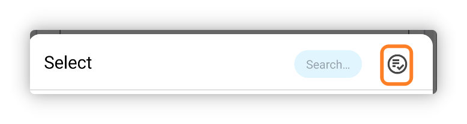

<h1 align="center" padding="100">v1.94.0 Récompenses multi-Objets</h1>

## Introduction

Cette mise à jour introduit principalement des fonctionnalités comme les Récompenses multi-Objets et les widgets d'Inventaire, ainsi que de nombreuses optimisations, améliorations de performances et corrections de bugs.

**📧Comment envoyer des retours ?**

Si vous avez des questions, des suggestions ou un rapport de bug, contactez-nous à 📫[lifeup@ulives.io](mailto:lifeup@ulives.io) ou soumettez un issue sur GitHub (https://github.com/Ayagikei/LifeUp/issues)

## 1. ✅Récompenses multi-Objets

Dans LifeUp, vous pouvez désormais sélectionner plusieurs Objets à divers endroits. Plus besoin de configurer l'ouverture de boîtes ou la fabrication pour obtenir plusieurs Récompenses.

Par exemple, vous pouvez :

- Définir directement plusieurs Objets comme Récompenses d'une Tâche
- Choisir plusieurs Objets lors de la configuration de l'ouverture de boîtes, puis définir les probabilités en une seule fois
- Définir directement plusieurs Objets comme Récompenses de Succès et de sous-tâches

 

### 📕Comment utiliser ?

Cliquez sur le bouton de sélection multiple en haut lors de la sélection d'Objets.

> Notez que certains scénarios ne prennent en charge que la sélection unique.

## 2. 🔧Widgets d'Inventaire

Cette version introduit deux tailles de widgets d'Inventaire.

Vous pouvez désormais consulter et utiliser rapidement les Objets de votre Inventaire directement depuis le bureau.

 

### 🚀 Optimisations et résolution de problèmes

Malgré le lancement du widget Boutique il y a plusieurs versions, nous avons progressivement rencontré des plantages ou d'autres problèmes.

Par exemple, en raison des limites de transmission du système de widgets, un trop grand nombre d'Objets pouvait faire planter l'App, ou provoquer des problèmes de changement de liste, ou des échecs de chargement d'images personnalisées.

Dans cette version, nous avons trouvé des solutions adaptées. Les widgets Boutique et Inventaire devraient pouvoir afficher un grand nombre d'Objets ; nous avons testé des widgets Boutique avec près de 1000 Objets, toujours fonctionnels (ce n'est bien sûr pas recommandé).

 

### 📕Comment utiliser ?

En général, vous pouvez créer un widget en appuyant longuement sur le bureau système.

Si vous utilisez un appareil Xiaomi ou Redmi (MIUI/HyperOS), l'ajout de widgets dans MIUI/HyperOS est un peu caché ; consultez le document de configuration de compatibilité pour savoir comment ajouter des widgets.

## 3. ✨Autres fonctionnalités

**Thèmes d'interface**

1. Les couleurs personnalisées (texte des Tâches, Objets) incluent davantage de valeurs prédéfinies
2. Adaptation à la fonction d'icône adaptative monochrome d'Android 14
3. Davantage d'adaptations linguistiques (version Google Play)

**Succès**

1. Si des Succès ont des Récompenses non réclamées, un petit point rouge s'affiche désormais sur la liste des Succès.

**Tâches**

1. Les sous-tâches des Tâches de pénalité exécutent désormais correctement la logique de pénalité
2. « Gestion intelligente des fuseaux horaires » ajoutée ; si vous travaillez entre fuseaux horaires, LifeUp détecte automatiquement les changements et prend en charge les ajustements horaires globaux
3. La base statistique de la page de détails mémorise désormais la dernière sélection ; nous avons optimisé certaines valeurs par défaut dans certains scénarios
4. Gestion de grâce optimisée pour les jours consécutifs de complétion de Tâches sur la page « Moi » : si vous oubliez une Tâche un jour, rattraper peut maintenir la série

**Attributs**

1. Prise en charge de la suppression des enregistrements de Points d'Expérience
2. Prise en charge de la réinitialisation des Points d'Expérience d'un Attribut individuel

**Widgets**

1. Un clic sur l'espace vide des widgets Boutique ou Inventaire ouvre directement la liste pointée par le widget, et non la dernière liste
2. Les widgets de Tâches affichent désormais la progression des Tâches de comptage

**API**

1. API d'édition des enregistrements Pomodoro ajoutée
2. L'API de complétion de Tâches gère désormais correctement les Tâches de pénalité
3. L'API de complétion de Tâches prend en charge le traitement des Tâches de comptage (paramètre `count` ajouté)
4. L'API de complétion de Tâches prend en charge un paramètre de coefficient de Récompense
5. L'API d'ajustement d'Objets prend en charge le changement de l'id de liste d'Objets
6. Les API de création et d'ajustement d'Objets prennent en charge le paramètre de critère de tri
7. L'API jump prend en charge le saut vers la fenêtre contextuelle d'utilisation d'Objet
8. Unification de certaines définitions de paramètres, par ex. `itemId` → `item_id`
9. Notifications broadcast ajoutées pour le démarrage, la pause et la fin d'un chronomètre
10. Le `title_color_string` de l'API d'ajustement d'Objets accepte désormais une chaîne vide pour restaurer la valeur par défaut
11. Le broadcast de complétion de Tâches inclut désormais l'id de liste
12. L'ouverture de boîtes et la fabrication déclenchent désormais aussi le broadcast d'utilisation d'Objet

------

En outre, nous avons corrigé un grand nombre de problèmes et de bugs signalés récemment.

Les détails figurent dans le journal de mise à jour ci-dessous~

### ♻️Optimisations

1. L'ajout ou l'édition de Tâches affiche désormais un avertissement si aucun Attribut n'est sélectionné et que des Points d'Expérience sont saisis
2. Enregistrements de nouvelle tentative d'upload optimisés
3. Affichage du titre et restrictions de saisie optimisés sur la page de Niveau personnalisé
4. Performances et problèmes de timing optimisés lors de l'annulation de Tâches répétées de nombreuses fois
5. Refactorisation de la fenêtre contextuelle d'utilisation d'Objet, de la logique de l'interface calendrier, etc.
6. Logique des rappels de Tâches optimisée, pour éviter de réémettre des rappels de données supprimées ou antérieures
7. Texte d'attente optimisé dans l'interface de sauvegarde
8. Les images sélectionnées sur la page d'Attribut personnalisé sont aussi ajoutées à l'historique de sélection
9. L'édition des enregistrements Pomodoro tente désormais de corriger (augmenter ou diminuer) le bon nombre de Pomodoros

### 🐛Corrections de bugs

1. Correction d'un Succès système lié aux statistiques et sauvegardes qui ne se déclenchait pas normalement après restructuration
2. Correction de conflits potentiels entre les widgets API aléatoire et toast API avec le toast par défaut
3. Correction du non-rafraîchissement des détails de Tâche dans certains scénarios lors de l'entrée depuis un widget
4. Correction d'erreurs potentielles lors de multiples ouvertures de boîtes dans certaines situations (consommation préalable de l'Inventaire d'Objets)
5. Correction du non-affichage des sous-tâches sur la page de détails après édition d'une Tâche sans sous-tâches puis ajout de nouvelles
6. Correction de certains cas où l'édition des Récompenses en pièces n'était pas possible
7. Correction de certains cas où la réclamation d'Objets d'équipe pouvait échouer
8. Correction d'anomalies de style MD2 dans certaines fenêtres contextuelles inférieures
9. Correction de valeurs de temps supplémentaire potentiellement incorrectes dans les minuteurs Pomodoro
10. Correction du non-affichage possible de la barre de couleur dans le widget de changement de Points d'Expérience
11. Correction de Tâches ne s'affichant pas correctement dans le calendrier en cours
12. Correction de problèmes de chargement de liste sur les pages historique et Émotions
13. Correction d'un problème où appeler l'API complete task deux fois rapidement n'autorisait pas deux complétions consécutives
