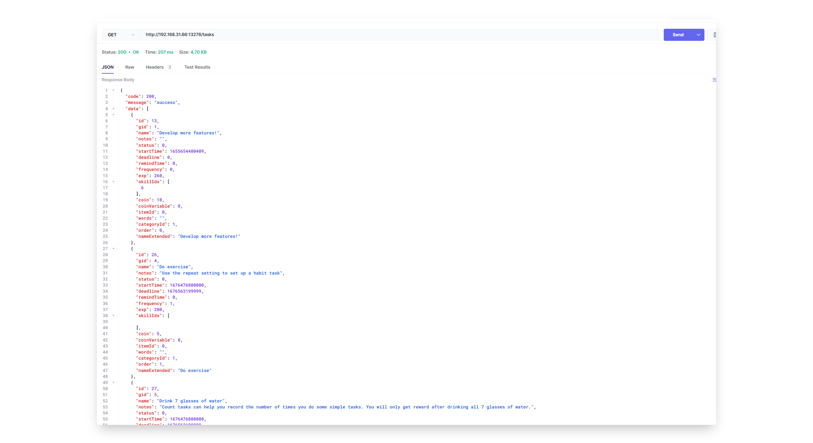
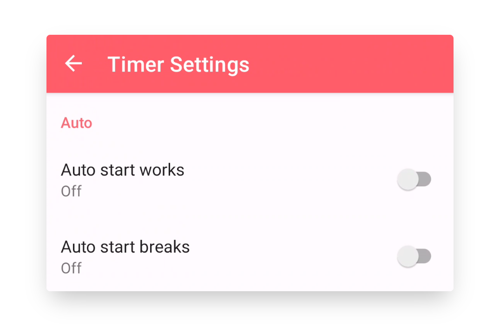

## v1.91.0 - Widget Status, Gradien Level Kustom, Desktop Sederhana

> [DEV] Yang baru di v1.91: Widget Status, Gradien Level Kustom, Desktop Sederhana

> Kami di sini untuk memperkenalkan pembaruan v1.91. Terima kasih banyak kepada pengelola komunitas LifeUp di Reddit jangka panjang! :D Maaf kami tidak punya cukup sumber daya untuk melacak semua komunitas, jadi kami terutama menangani masukan dari 📧 dan GitHub. Jika Anda memiliki pertanyaan atau saran, hubungi kami di 📫[lifeup@ulives.io](mailto:lifeup@ulives.io) atau kirim issue di GitHub (https://github.com/Ayagikei/LifeUp/issues).

Maaf karena semua orang telah menunggu cukup lama.

Karena berbagai hal, kemajuan pengembangan dan pembelajaran secara keseluruhan tertunda sejak akhir tahun. Dan dengan dukungan semua orang, saya juga berhasil memperbarui peralatan pengembangan, serta menyiapkan komputer desktop. Ini membuat pengembangan, debugging, dan rilis kami lebih efisien.

Baru-baru ini, kami akhirnya kembali ke status pembaruan normal. Versi 1.91 akan membawa beberapa pembaruan sesuai "Rencana Pengembangan" sebelumnya. **v1.91 dirilis secara bertahap; jika Anda belum menerima pembaruan, Anda perlu menunggu sebentar.**

Kami berencana memperkenalkan Google Calendar terintegrasi di v1.91. Namun, kami menghadapi banyak hambatan teknis dalam proses pengembangan aktual. Agar dapat merilis lebih banyak pembaruan secepatnya, kami sementara memutuskan untuk menundanya dan fokus mengembangkan fitur lain terlebih dahulu sebelum kembali mengembangkan integrasi Google Calendar. Kami minta maaf kepada pengguna yang menantikan integrasi Google Calendar di v1.91. Tetapi kami akan terus mengerjakan integrasi Google Calendar.

Sekalian, kami juga mencoba sesuatu yang baru: pengembangan klien desktop LAN. **Tetapi perhatikan bahwa klien desktop masih sangat sederhana dan bergantung pada data mobile.** 

---

## 🔖Ringkasan

1. **🏆Widget:** Widget status baru (batch pertama)
2. **📈Atribut:** Gradien Level yang dapat disesuaikan
3. **✨Multi-platform:** Versi Desktop LAN
4. **✏️API:** Query Data Daftar Lengkap dan API Lainnya
5. **🍅Timer Tomat:** Mulai otomatis timing kerja dan istirahat
6. **🚀Lainnya:** Optimasi performa
7. **Changelog lengkap**

## 🏆Widget: Widget Status Baru (Batch Pertama)

Pembaruan ini membawa serangkaian widget terkait properti dan koin, termasuk:

- Koin (Kecil, Besar, Target)
- Daftar Properti (Kecil, Besar)

Dan ini baru batch pertama; kami akan segera mengembangkan lebih banyak widget.

### 📝Cara menggunakan

Biasanya, tekan lama atau cubit launcher sistem untuk menambahkan widget.

------

## 📈Atribut: Gradien Level Kustom

Di versi v1.91, Anda dapat menyesuaikan gradien Level, yaitu Poin Pengalaman yang dibutuhkan untuk setiap Level.

Anda dapat memilih Tantangan lebih tinggi atau kurva pertumbuhan lebih mulus sesuai preferensi; kini terserah Anda.

Jika Anda hanya ingin melihat tabel Level bawaan, Anda juga dapat membuka halaman itu untuk memeriksanya.

### 📝Cara menggunakan

Sidebar → Pengaturan → Lanjutan → Level Kustom

------

## ✨Multi-Platform: Desktop

Selama periode ini, kami juga mencoba sesuatu yang baru, dan dengan pembaruan API baru, kami memungkinkan query berbagai data daftar detail.

Kami telah mengembangkan **perangkat lunak desktop LAN open source sepenuhnya（https://github.com/Ayagikei/LifeUp-Desktop）** yang dapat terhubung ke ponsel Anda dan menampilkan berbagai data daftar, serta mendukung beberapa operasi sederhana: membeli produk, menyelesaikan Tugas, mengekspor gambar refleksi dan melihatnya dengan browser gambar sistem.

Perangkat lunak secara teori mendukung Windows, Linux, dan macOS.

⚠ Perhatikan bahwa desktop masih dalam tahap pengembangan awal.

Kami akan terus memelihara dan menambahkan lebih banyak fungsi, seperti menambahkan Tugas melalui desktop, menyesuaikan antarmuka untuk interaksi, mengekspor refleksi dalam format markdown, dll.

### 📝Cara menggunakan

Untuk detail, lihat bagian "Sidebar → Pengaturan → Labs → LifeUp Cloud".

Juga periksa dokumentasi kami: [LifeUp Desktop🖥 (lifeupapp.fun)](https://docs.lifeupapp.fun/en/#/guide/api_desktop).

## ✏️API: Query Data Daftar Lengkap dan API Lainnya

**Antarmuka Data**

Sebagai fondasi sumber data untuk klien desktop, kami menyediakan antarmuka query data lengkap di versi ini.

Jika Anda pengembang Android, Anda dapat menggunakan **LifeUp SDK** kami untuk query berbagai data di App LifeUp.

Jika Anda pengembang jenis lain, Anda dapat menggunakan protokol HTTP untuk memanggil API "LifeUp Cloud". Ini juga praktik yang digunakan di klien desktop.

Jika Anda tidak tahu tentang pengembangan, jangan khawatir:

1. Pertama, kini adalah kesempatan belajar terbaik.

2. Kedua, API data di atas terbuka, artinya pengembang komunitas dapat menggunakan data ini untuk pengembangan sekunder.

Misalnya, mereka dapat merancang halaman daftar Tugas, halaman Toko, dan melakukan pengembangan sekunder yang lebih kompleks (seperti fungsi diskon, jual beli turnip).

Hasil pengembangan sekunder juga dapat menguntungkan semua pengguna.

Antarmuka spesifik akan ditambahkan ke dokumentasi API nanti.

**Peningkatan Antarmuka API Lainnya**

Penambahan

- Setor dan tarik ATM
- Atur "Nonaktifkan Pembelian" untuk Item
- Atur "Warna Tag" untuk Tugas
- Atur saldo ATM langsung
- Query sederhana untuk detail Item tertentu
- Tambahkan tombol ketiga dan opsi operasi ke antarmuka "confirm_dialog"

Perubahan Perilaku

- Popup API confirm_dialog, jika teks atau operasi beberapa tombol tidak disediakan, tombol tidak akan ditampilkan.

  Ini memberi fleksibilitas lebih tinggi dalam kontrol popup, misalnya Anda dapat mengatur popup hanya teks tanpa tombol untuk menampilkan teks dan bahasa motivasi.

- API penalti, di versi sebelumnya, maksimum 100 Item dapat dikurangi untuk barang, dan kini batas diperluas hingga 9 digit.

### 📝 Penggunaan

Periksa dokumentasi API dan repositori GitHub kami:

[LifeUp Cloud☁️ (lifeupapp.fun)](https://docs.lifeupapp.fun/en/#/guide/api_cloud)

https://github.com/Ayagikei/LifeUp-SDK

------

## 🍅Tomat: Timing Kerja dan Istirahat Otomatis

Versi ini juga memperkenalkan fungsi mulai otomatis jam Pomodoro.

Pastikan ponsel Anda telah **dikonfigurasi kompatibilitas** agar sistem tidak mengganggu operasi jam Pomodoro.

Perhatikan bahwa setelah mengaktifkan "Mulai Istirahat Otomatis", fungsi hitung mundur tambahan asli akan dinonaktifkan.

### 📝 Penggunaan

Buka Tomat → halaman pengaturan pojok kanan atas.

------

## 🚀Lainnya: Optimasi Performa

Melalui masukan pengguna dan pengumpulan data online, kami menemukan bahwa efisiensi beberapa query data di App LifeUp akan turun signifikan jika jumlah data besar.

Untuk App daftar tugas, stabilitas dan jangka panjang sangat penting.

Oleh karena itu, di versi ini, kami melakukan serangkaian optimasi untuk skenario dengan jumlah data besar. Optimasi ini dapat meningkatkan kecepatan loading sebagian besar halaman daftar (terutama halaman daftar tugas).

Kami akan terus mengoptimalkan untuk skenario ini.

## Log Pembaruan Lengkap

**1.91.0-alpha01 (2023/02/13)**

**✨Fitur**

1. Mendukung gradien Level kustom.
2. Menambahkan batch awal widget:
   - Koin (kecil, besar, target)
   - Atribut (kecil, besar)

1. Mendukung query sebagian besar detail data di LifeUp melalui Content Provider API, termasuk:
   - Menawarkan versi baru "LifeUp Cloud".
   - Menyediakan versi desktop rudimenter pertama (Windows, Linux, macOS) untuk penggunaan jaringan lokal.

1. Mendukung penghapusan multi-pilih untuk catatan timer tomat.
2. Mendukung pengaturan mulai otomatis istirahat dan kerja untuk jam tomat.
3. Peningkatan API dan penambahan field, termasuk:
   - Setor dan tarik ATM.
   - Mengatur apakah menonaktifkan pembelian Item.
   - Mengatur warna label untuk Tugas.
   - Mengatur saldo ATM langsung.
   - Query sederhana untuk detail produk tertentu.
   - Menambahkan tombol ketiga dan opsi operasi ke antarmuka popup.

**♻️Optimasi**

1. Meningkatkan kecepatan query, pemrosesan, dan performa saat menangani jumlah data besar.
2. Memperbaiki margin salah untuk ikon adaptif.
3. Mengoptimalkan efek tampilan catatan timer tomat.
4. Meningkatkan interaksi saat memulihkan cadangan.
5. Menambahkan tampilan UI untuk mendapatkan lisensi melalui Google Play (untuk versi uji coba gratis GitHub).
6. Memberi prompt untuk menonaktifkan fitur impor satu klik jika file cadangan yang dipilih bukan dari LifeUp saat mengimpor langsung dari sistem file.
7. Menutup metode input otomatis saat mencari barang di popup pemilihan produk.
8. Perubahan perilaku API, termasuk:
   - Popup API Confirm_dialog. Jika teks atau operasi tombol tertentu tidak disediakan, tombol tidak akan ditampilkan. Ini memberi fleksibilitas lebih besar dalam kontrol popup, misalnya Anda dapat mengatur popup hanya teks tanpa tombol untuk menampilkan teks dan bahasa motivasi.
   - API Penalti. Di versi sebelumnya, hanya dapat mengurangi hingga 100 Item, kini batas diperluas hingga 9 digit.

**🐛Perbaikan Bug**

1. Memperbaiki masalah bahwa halaman timer tomat menampilkan "loading" di akhir dalam keadaan tertentu.
2. Memperbaiki crash yang disebabkan library pihak ketiga tertentu.
3. Memperbaiki masalah bahwa App crash saat menempatkan jam tomat di bar navigasi bawah karena popup prompt.
4. Memperbaiki tampilan abnormal nilai Atribut saat melihat profil pengguna lain.
5. Memperbaiki masalah bahwa event API dan notifikasi untuk penurunan Level Atribut tidak dikirim dengan benar.
6. Memperbaiki beberapa masalah interaksi dengan halaman edit tekan lama.
7. Memperbaiki beberapa margin abnormal di halaman manajemen gambar dan Sintesis.
8. Memperbaiki beberapa popup yang tidak dapat di-scroll, menyebabkan penggunaan abnormal dalam mode landscape.

**✨Rilis Khusus: LifeUp Cloud v1.1.1 (2023/02/13)**

1. Mendukung operasi baca dan otorisasi untuk informasi Content Provider.
2. Saat startup layanan, meminta wake lock agar dapat merespons meski layar terkunci.
3. Menambahkan serangkaian antarmuka untuk Content Provider.

**✨Rilis Khusus: LifeUp Desktop v1.0.1 (2023/02/13)**

Rilis awal, dirancang untuk digunakan bersama "LifeUp Cloud" dan App mobile.

Mendukung operasi berikut:

- Query daftar Tugas, daftar, Item, Pencapaian, dan Perasaan.
- Membeli Item, dan menyelesaikan Tugas.
- Mendukung menggunakan browser gambar desktop untuk melihat gambar Perasaan yang diperbesar.

## Ulang Tahun ke-4

Semoga Anda menikmati pembaruan ini!

Sudah 4 tahun sejak kami mulai mengembangkan LifeUp, dan kami akan terus membawa lebih banyak pembaruan dan optimasi ke LifeUp.

Tetapi kami juga sadar bahwa pembelian sekali bayar tidak terlalu ramah untuk pemeliharaan jangka panjang App. Tapi jangan khawatir, kami juga pendukung pembelian sekali bayar.

Kami sangat ingin punya kesempatan mengerjakan pengembangan LifeUp secara penuh waktu. Tetapi LifeUp masih App yang sangat niche saat ini. Karena keterbatasan waktu, di versi terbaru, kami merancang berbagai API agar komunitas dapat ikut membangun lebih banyak fungsi LifeUp.

Jika Anda merasa LifeUp membantu Anda dan jika Anda bersedia membelikan secangkir kopi untuk pengembang di halaman about, atau merekomendasikan LifeUp ke teman dan komunitas Anda, semua ini akan berperan dalam pemeliharaan jangka panjang kami, dan juga membawa kami selangkah lebih dekat ke pengembangan penuh waktu.

Terima kasih lagi telah menggunakan LifeUp!
