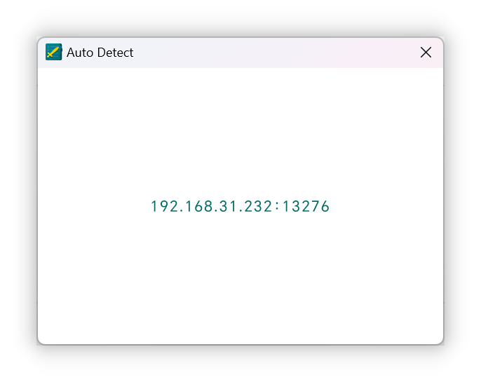
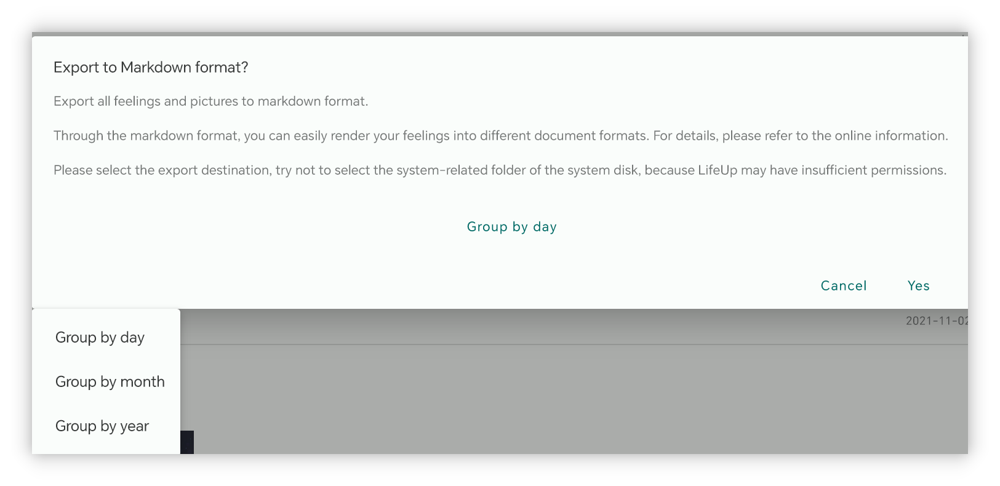

## v1.92.0 - Statistik desain baru, desktop diperbarui, lebih banyak widget

**Terima kasih telah menggunakan LifeUp!**

Berikut beberapa pembaruan terbaru yang mencakup v1.91.1–v1.92.0.

Kami harap pembaruan ini membantu penggunaan dan produktivitas Anda.

Jika Anda memiliki pertanyaan atau saran, hubungi kami di 📫[lifeup@ulives.io](mailto:lifeup@ulives.io) atau kirim issue di GitHub (https://github.com/Ayagikei/LifeUp/issues

---

## 🔖Ringkasan

### 📱App Android

1. 📈**Statistik desain baru**
2. 🏆**Widget App baru**: widget item Toko dan widget perubahan Poin Pengalaman
3. ✨**Fitur baru**: mendukung menyembunyikan daftar Toko/Inventaris

### 🖥️Desktop

1. ✨**Koneksi otomatis**
2. 🚀**Ekspor Perasaan ke markdown**
3. 🖥️**Paket instalasi macOS**

## 📱Pembaruan App Android

### 🏆Statistik desain baru

Statistik dan tinjauan data bukan hanya langkah penting untuk meningkatkan produktivitas kita, tetapi juga sumber inspirasi dan masukan.

Dengan meninjau usaha kita, kita dapat melihat progres dan Pencapaian dengan data, sekaligus mengidentifikasi masalah dan area perbaikan.

Untuk itu, kami meluncurkan [Statistik 2.0], yang menawarkan berbagai wawasan data menarik.

 

#### ❓Cara menggunakan?

Untuk mengakses statistik baru, upgrade ke versi v1.92.0, buka halaman [Statistik], lalu ketuk tombol [Klik untuk melihat statistik baru] di bagian atas.

 

#### 📊Item statistik

Statistik 2.0 akan memberikan analisis data untuk berbagai modul: dari persentase Tugas fokus di tomat, rata-rata jumlah tomat per hari, perubahan harian Atribut, catatan pembelian Item, status penyelesaian Tugas, dan lainnya.

 

#### ⏰Filter waktu

Dan mendukung filter rentang waktu yang **fleksibel**; Anda dapat dengan mudah melihat data harian, mingguan, bulanan, tahunan, atau rentang waktu kustom.

LifeUp Anda seharusnya disesuaikan untuk Anda; Anda tidak perlu menunggu akhir tahun untuk melihat ringkasan tahunan, juga tidak perlu khawatir kehilangan ringkasan tahunan setiap tahun.

Di LifeUp, Anda dapat mengakses **ringkasan tahunan tahun-tahun sebelumnya** kapan saja. Penasaran dengan data ringkasan tahunan 2022 Anda~ Segera perbarui dan coba!

 

#### 👥Bagikan

Silakan bagikan perjalanan LifeUp Anda dengan komunitas!

Kini Anda cukup tekan lama kartu statistik data yang ingin dibagikan, lalu buat kartu bagikan dan bagikan ke App lain dengan satu ketukan.

------

### 🏆**Widget App baru**

#### Widget daftar Toko

Pembaruan ini memperkenalkan dua widget daftar Toko yang cocok untuk ukuran besar dan kecil.

Kini Anda dapat membeli dan menggunakannya langsung di desktop~

> Catatan: Yang ini adalah widget "Toko", bukan widget "Inventaris".
>
> Meskipun memungkinkan Anda membeli dan menggunakan Item, widget ini tidak memungkinkan Anda melihat Item di "Inventaris" secara langsung.

 

Dan kali ini daftar Toko seperti daftar Tugas,

**Anda dapat memilih daftar berbeda untuk setiap widget.**

 

Jika Anda mengetuk area latar di bagian atas, Anda juga dapat langsung melompat ke halaman Toko di App.

#### Widget perubahan Poin Pengalaman harian

Dengan widget ini, Anda dapat melihat data ringkasan perubahan nilai Poin Pengalaman harian di launcher.

------

## 🖥️Desktop

### ✨Koneksi otomatis

Menurut masukan pengguna, mengisi IP adalah faktor utama yang menghambat penggunaan versi desktop.

Pembaruan ini membawa fungsi deteksi otomatis IP LifeUp Cloud Server.

 

Prasyarat menggunakan fungsi ini:

- Unduh v1.3.0 LifeUp Cloud (dapat diperoleh dari pembaruan Google Play atau halaman GitHub kami).

Anda dapat mendeteksi alamat IP yang sesuai secara otomatis di versi desktop, tidak perlu mengisinya manual lagi.

> Setelah pengujian, fitur ini saat ini terutama terverifikasi di sisi Windows.
>
> Sisi macOS mungkin belum mendukung deteksi otomatis.

------

### 🚀**Ekspor Perasaan ke markdown**

Versi desktop kini mendukung mengekspor Perasaan sebagai format markdown.

Dan mendukung pengelompokan dan ekspor dalam berbagai cara; kesan juga akan menyertakan lampiran gambar lengkap.

Dengan format markdown, Anda dapat dengan mudah menggunakan **alat pihak ketiga** untuk merender dan mengonversi ke pdf, word, dan format lain lagi.

------

### **✏️Tambah Tugas**

Dengan bantuan kemampuan API yang dibangun sebelumnya, versi desktop kini mendukung membuat Tugas sederhana.

Pengaturan saat ini belum mencakup semua opsi di App, tetapi cukup untuk membuat Tugas sederhana.

Versi berikutnya juga akan terus meningkatkan opsi pembuatan Tugas dan mendukung mengedit Tugas, dll.

------

### 🖥️**Paket instalasi macOS**

Mulai versi 1.1.0, kami juga akan mulai merilis paket instalasi macOS.

Setelah pengujian sederhana, fungsi versi Mac OS pada dasarnya normal.

Untuk detail, lihat juga [🖥LifeUp Desktop (lifeupapp.fun)](https://docs.lifeupapp.fun/en/#/guide/api_desktop)

### **Catatan Rilis**

#### LifeUp Android app

**1.92.0-rc02 (2023/07/16)**

**🐛Perbaikan**

1. Memperbaiki masalah bahwa widget Toko mungkin tidak berfungsi saat melompat ke App lain (menjalankan API)
2. Memperbaiki abnormalitas sesekali saat beralih daftar di widget Toko
3. Memperbaiki masalah bahwa widget Toko tidak menyembunyikan Item habis terjual atau tidak dapat dibeli sesuai pengaturan App
4. Memperbaiki masalah bahwa widget Toko mungkin tidak merespons saat mengetuk Item tertentu
5. Memperbaiki beberapa masalah crash langka

**1.92.0-rc01 (2023/07/11)**

**✨Fitur**

1. Statistik 2.0
2. Kartu bagikan

**♻️Optimasi**

1. Kini Anda dapat mengatur harga untuk Item "tidak dapat dibeli" dan menggunakannya untuk skenario seperti pengembalian
2. Saat Anda mematikan "Atur penalti Tugas secara terpisah" di pengaturan, tombol penalti tidak lagi ditampilkan
3. Mengoptimalkan UI subtugas di detail tim
4. Mengoptimalkan UI kesan

**🐛Perbaikan**

1. Memperbaiki masalah bahwa saat gaya clipping Atribut diubah ke "rounded rectangle", ikon edit mungkin menampilkan ikon lama cukup lama

#### **LifeUp-Desktop**

**v1.1.0 (2023/06/25)**

**🚀Fitur**

1. Mendukung pemeriksaan otomatis alamat IP dan koneksi "LifeUp Cloud" (memerlukan LifeUp Cloud v1.3.0)
2. Mendukung menambahkan Tugas, tetapi opsi yang didukung saat ini terbatas (Fixed [#6](https://github.com/Ayagikei/LifeUp-Desktop/issues/6))
3. Mendukung mengekspor kesan sebagai format markdown (Fixed [#5](https://github.com/Ayagikei/LifeUp-Desktop/issues/5))
4. Menambahkan teks bahasa Tionghoa Tradisional
5. Menambahkan versi rilis macOS
6. Mendukung pemeriksaan pembaruan

**🔧Optimasi dan perbaikan bug**

1. Memperbaiki masalah bahwa sub-kategori Pencapaian tidak dapat ditampilkan dengan benar
2. Memperbaiki masalah bahwa beberapa ikon tidak dapat ditampilkan dengan benar (memerlukan LifeUp v1.91.3)
3. Memperbaiki masalah ketidakcocokan judul (Fixed [#8](https://github.com/Ayagikei/LifeUp-Desktop/issues/8))
4. Menambahkan opsi pintasan untuk installer Windows (Fixed [#13](https://github.com/Ayagikei/LifeUp-Desktop/issues/13))
5. Meningkatkan cara mendapatkan ukuran jendela, menyesuaikan resolusi di bawah 1080p

#### **LifeUp Cloud**

**v1.3.0 (2023/06/25)**

**🚀Fitur**

1. Mendukung mendaftarkan layanan mDNS agar desktop dapat menemukan IP secara otomatis (memerlukan desktop v1.1.0)
2. Menambahkan nilai hasil untuk API yang dipanggil via ContentProvider.

**🔧Peningkatan**

1. Memperluas area klik tombol scan QR code
2. Memperbaiki crash ActivityNotFound
