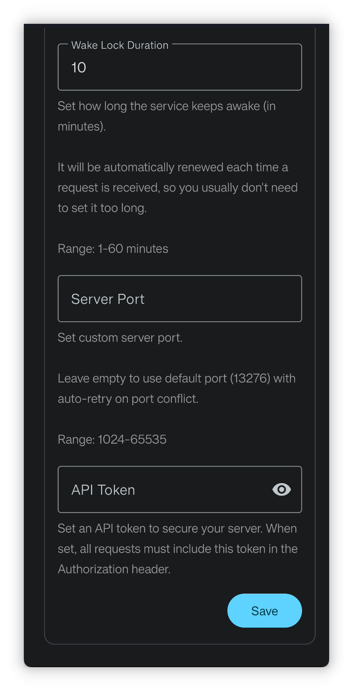

<h1 align="center" padding="100">v1.98.0 API 2.0 & Pembaruan Klien Desktop</h1>

## Pengantar
Ini adalah rilis pertama tahun 2025, dengan pembaruan utama berikut:

- Dukungan Ikon Emoji: Anda kini dapat langsung menggunakan Emoji sebagai ikon untuk Item, Pencapaian, dan lainnya.

- Gelombang Kedua Pembaruan API: Antarmuka API kini mendukung mengubah Tugas, mengedit efek Item, kondisi buka kunci Pencapaian, Sintesis, dan hampir semua fungsi inti.

- Optimasi LifeUp Cloud dan Klien Desktop: Meningkatkan pengalaman deteksi koneksi otomatis; klien desktop menambahkan fitur "Perasaan Baru" dan mendukung impor/ekspor data cadangan.

## I. Ikon Emoji

### 📕Cara Menggunakan?

- Di versi ini, saat memilih ikon untuk Item, Pencapaian, dll., Anda kini dapat langsung memilih ekspresi emoji sebagai ikon.

## II. Gelombang Kedua Pembaruan API

Sejak fungsionalitas API dibuka di v1.90.0, kami senang melihat banyak pengguna aktif mengeksplorasi dan membuat konten kaya berbasis API. Banyak pengguna mulai dari nol mempelajari pengetahuan terkait URL dan berhasil menerapkan API untuk membuat widget desktop, klien desktop DIY, bahkan integrasi aplikasi web — sangat mengesankan.

Namun, karena struktur data yang kompleks dan beban desain serta pengembangan yang substansial, batch API pertama kekurangan beberapa fungsi inti, seperti mengedit Tugas, mengedit Item, membuat Pencapaian dengan kondisi buka kunci, dan membuat Item dengan efek penggunaan. Penyelesaian fitur-fitur ini berlanjut hingga versi ini.

Desain, pengembangan, pengujian, dan pembaruan cloud, klien desktop, dan dokumentasi API membawa beban kerja yang tumbuh eksponensial, sehingga cabang pengembangan yang dimulai beberapa bulan lalu baru selesai pengembangan dan pengujian sekarang.

**Tetapi usaha kami membuahkan hasil! Kini, API mencakup hampir semua fungsi inti LifeUp. Dengan membuka API, kami berharap LifeUp bukan hanya App, melainkan platform terbuka di mana pengguna dapat dengan bebas mengembangkan, memperluas, dan menyesuaikan sistem gamifikasi mereka sendiri.**

### 📕Cara Menggunakan?

- Untuk cara penggunaan API, lihat perpustakaan dokumentasi kami → Direktori → bagian Antarmuka Terbuka.
- Definisi antarmuka API baru telah ditambahkan ke dokumentasi.

## III. Klien Desktop: Fitur Arsip & Perasaan

### Arsip

Anda kini dapat langsung mengekspor atau mengimpor file cadangan di klien desktop.

Ini akan menyederhanakan proses transfer data ke perangkat lain dan pemulihan.

### Publikasikan Perasaan Baru

Kini mendukung publikasi Perasaan baru dari klien desktop, dengan dukungan penuh menambahkan gambar dan mengatur fitur waktu.

⚠️Catatan: Mengedit Perasaan belum didukung.

### Pembaruan Lainnya

- Mengoptimalkan pesan error dan penjelasan terkait koneksi: dengan jelas menunjukkan apakah masalah jaringan atau karena backend LifeUp tidak berjalan
- Mendukung melihat detail Tugas
- Mendukung validasi keamanan API Token (opsional, memerlukan LifeUp Cloud versi 2.0.0)
- Logika pembelian kini menggunakan API "purchase item" baru, bukan API "adjust item quantity" + "adjust coin amount" sebelumnya. Sehingga kini dapat menangani logika batas pembelian dengan benar, menjaga konsistensi dengan App.

Pembaruan ini juga berfungsi untuk mendemonstrasikan kemampuan API melalui klien desktop, karena semua fitur klien desktop diimplementasikan melalui API.

## IV. Optimasi LifeUp Cloud

> LifeUp Cloud adalah alat yang mengekspos API sebagai antarmuka HTTP dan berfungsi sebagai jembatan untuk koneksi klien desktop.

Kami melakukan banyak optimasi berdasarkan masukan tentang LifeUp Cloud:

- Menambahkan tampilan status untuk mendeteksi dengan cepat mengapa klien desktop tidak dapat terhubung
- Menambahkan pengaturan lanjutan
  - Izinkan akses cross-origin: berguna untuk mengakses antarmuka HTTP LifeUp Cloud menggunakan teknologi berbasis web
  - Izinkan port layanan kustom
  - Izinkan mengatur access token: langkah validasi keamanan opsional
- Mengoptimalkan nilai return error dan spesifikasi untuk antarmuka LifeUp Cloud
- Mengoptimalkan logika service discovery dan saklar layanan HTTP; deteksi otomatis klien desktop seharusnya bekerja lebih baik sekarang

## V. Pratinjau

Karena pembaruan ini membawa relatif sedikit fitur non-API, berikut pratinjau konten versi mendatang, termasuk fitur yang sedang dikembangkan:

- **Fitur Utama:** Pencapaian yang dapat diulang
- **Fitur Menengah:** Optimasi keterbacaan teks untuk latar belakang kustom
  - Awalnya dianggap perubahan kecil, ternyata cukup kompleks
- **Fitur Minor:** Menambahkan aksi selesai dan ingatkan nanti ke notifikasi
  - Awalnya direncanakan mendukung notifikasi persisten, tetapi ditinggalkan karena versi Android lebih baru tidak lagi mendukung persistensi sejati

## VI. ✨Log Pembaruan Lengkap

### **LifeUp-Android**

**v1.98.0 (2025/01/01)**

**✨Fitur**

1. Mengintegrasikan login Google dan otorisasi Drive menggunakan Credential Manager.
2. Mendukung memilih Emoji sebagai ikon.
3. Menambahkan ContentProvider Query API: fungsionalitas Sintesis.
4. Menambahkan ContentProvider Query API: fungsionalitas catatan tomat.
5. Menambahkan ContentProvider Query API: mendukung beberapa return Item.
6. Menambahkan tomato API (sesuaikan jumlah tomat).
7. Menambahkan export_backup API (ekspor cadangan).
8. Menambahkan purchase_item API (beli Item).
9. Menambahkan synthesize API (picu Sintesis).
10. Menambahkan subtask API (buat atau sesuaikan subtugas).
11. Menambahkan subtask_operation API (operasikan subtugas, misalnya selesai).
12. Menambahkan synthesis_formula API (formula Sintesis).
13. Menambahkan edit_task API (edit Tugas).
14. Menambahkan category API (buat atau sesuaikan daftar).
15. Menambahkan history_operation API (sesuaikan riwayat).
16. Menambahkan AppSettingsScheme API (sesuaikan beberapa pengaturan App).
17. Menambahkan achievement API (buat atau edit Pencapaian).
18. Menambahkan skill API (buat atau edit Atribut).
19. Menambahkan dukungan menampilkan id dan gid subtugas.
20. Menambahkan dukungan menampilkan id Sintesis.
21. Menambahkan dukungan query creditLimit.
22. ContentProvider API mendukung query subtugas (id, gid).
23. ContentProvider API query Item: menambahkan return field "jumlah maksimum dapat dibeli".
24. ContentProvider Shop API mendukung query Item berdasarkan daftar id tertentu.
25. Mengoptimalkan nilai return saat query URL ContentProvider salah.
26. Antarmuka query mendukung query Pencapaian tunggal.

**♻️Optimasi**

1. Mengoptimalkan pengurutan kustom default untuk Item baru.
2. Mengoptimalkan pengurutan kustom default untuk Atribut baru.
3. Menambahkan parameter `purchase_limit`, `disable_use`, dan `effects` ke API "add_item".
4. Menambahkan parameter `background_alpha`, `items`, `start_time`, `auto_use_item`, `remind_time`, dan `pin` ke API "add_task".
5. Menambahkan dukungan lebih banyak frekuensi Tugas ke API "add_task".
6. Menambahkan dukungan parameter `effects` dan `purchase_limit` ke API "item".
7. Menambahkan dukungan menghentikan operasi di API sebelumnya (misalnya input).
8. Menambahkan dukungan menentukan parameter `signed` untuk placeholder numerik.
9. Menambahkan placeholder angka acak dan desimal acak.

### **LifeUp-Desktop**

**v1.2.0 (2025/01/01)**

**🚀Fitur**
1. Mendukung Manajemen Arsip
- Cadangkan ke komputer
- Pulihkan dari komputer
- Mendukung drag-and-drop
2. Mendukung Membuat Pikiran Baru
- Mendukung pemilihan gambar
- Mendukung sinkronisasi gambar ke mobile
3. Mendukung Tampilan Detail Tugas
4. Peningkatan Sistem Pembelian
- Menggunakan API "Purchase Items" baru
- Menjaga batas pembelian konsisten dengan App
5. Mendukung Validasi API Token Opsional
6. Dukungan Multi-platform
- Windows
- Linux
- macOS (Apple Silicon)
- macOS (Intel) 🆕
7. Peningkatan penanganan error dan notifikasi

### **LifeUp Cloud**

**v2.0.0 (2025/01/01)**

**🚀Fitur**
1. Optimasi Layanan
- Logika service discovery dan kompatibilitas ditingkatkan
- Lebih banyak perangkat mendukung deteksi IP otomatis
- Transisi status mulai/jeda layanan dioptimalkan
- Penanganan error dan notifikasi ditingkatkan
2. Keamanan & Performa
- Menambahkan validasi API Token opsional
- Menambahkan opsi konfigurasi CORS
- Mendukung pengaturan port kustom
- Mendukung durasi wake lock kustom
3. Peningkatan UI
- Desain antarmuka baru
- Pengalaman visual keseluruhan ditingkatkan
