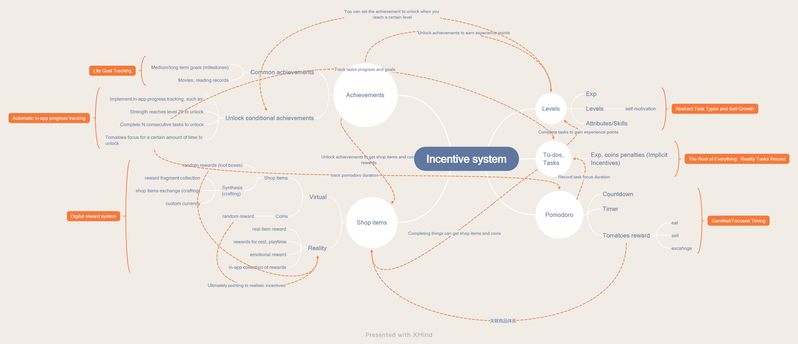

<h1 align="center" padding="100">Selamat datang di dunia LifeUp!</h1>

 

[中文](https://wiki.lifeupapp.fun/zh-cn/#/guide/hello_lifeup)

## Pengantar

> [!TIP]
> **Terima kasih telah membeli dan mengunduh *LifeUp*!**

**LifeUp adalah aplikasi Android unik untuk daftar tugas dan pembentukan kebiasaan yang digamifikasi.**

Berbeda dari beberapa aplikasi gamifikasi yang sudah menyertakan game bawaan.

LifeUp fokus menggunakan elemen game untuk memotivasi Anda bertindak di kehidupan nyata.

Anda dapat menyesuaikan Atribut, Hadiah, Pencapaian, Sintesis, bahkan peti harta karun di LifeUp.

Namun, ini juga berarti pengaturan awal dan kurva pembelajaran mungkin membutuhkan waktu.

Perlu diingat: LifeUp diposisikan sebagai aplikasi daftar tugas dan pembentukan kebiasaan, bukan aplikasi kalender.

### FAQ sebelum digunakan

Sebelum memulai, Anda mungkin ingin mengetahui informasi berikut:

- **Saya mengunduhnya melalui Google Play. Jika tidak puas, bagaimana cara refund?**

  Kami dan Google Play memahami bahwa sebuah aplikasi mungkin tidak cocok untuk semua orang.

  Sebelum membeli LifeUp, Anda dapat mengakses versi uji coba 7 hari yang tersedia di [GitHub](https://github.com/Ayagikei/LifeUp/releases) kami.

  Jika Anda tidak puas dengan App dan mencopot pemasangannya dalam beberapa puluh jam setelah pembelian, Google Play biasanya akan memproses refund otomatis dalam 24 jam.

  Jika melewati periode refund otomatis (24 jam) tetapi masih dalam 7 hari sejak pembelian, Anda tetap dapat menghubungi kami di lifeup@ulives.io dan memberikan nomor pesanan GPA Anda. Kami akan membantu permintaan refund manual. Pastikan menggunakan alamat Gmail yang terkait dengan pembelian.

  Permintaan refund tidak akan diproses setelah 7 hari sejak tanggal pembelian.

  Perlu diingat bahwa meninggalkan ulasan di Google Play tidak akan membantu proses refund. Tanpa informasi kunci, kami tidak dapat membantu refund melalui ulasan App di Google Play.

  

- **Apakah data saya pribadi dan aman?**

  Tentu saja. Kami menghargai privasi Anda!

  Anda dapat memeriksa [dokumen kebijakan privasi kami](https://wiki.lifeupapp.fun/en/#/introduction/privacy-terms)
  untuk informasi lebih lanjut.
  
  TL;DR: Kecuali modul Dunia (mirip fungsi berbagi desain), data lainnya
  tidak melewati server kami; hanya disimpan di perangkat Anda. Hal yang sama berlaku untuk
  gambar dan informasi lain yang Anda pilih. **Anda juga dapat memilih mode offline.**
  
- **Karena server tidak menyimpan data, bagaimana cara backup data?**

  LifeUp mendukung fungsi ekspor dan impor data.

  Anda juga dapat mengatur server WebDAV, Google Drive, atau Dropbox untuk backup otomatis.

- **Apakah saya harus login? Atau mengapa saya mendapat error jaringan saat login?**

  Tidak! LifeUp adalah App *offline-first*.

  Login hanya digunakan untuk mengakses modul «Dunia», yang memungkinkan Anda melihat tim, Item, dan Tugas
  acak yang dibuat oleh pengguna lain.

  Jika Anda tidak dapat login, mungkin karena masalah jaringan lokal atau anomali
  pada server kami.

  Anda dapat mencoba mengganti jaringan dan DNS terlebih dahulu.

  Jika Anda merasa ada masalah pada server kami, Anda dapat mengirim email untuk konfirmasi.

  Anda juga dapat langsung mencoba mode offline, yang juga memberi Anda akses ke sebagian besar
  fitur LifeUp!

- **Bagaimana mengonfigurasi notifikasi Tugas dan berjalan di latar belakang?**

  LifeUp mendukung pengingat notifikasi dan acara kalender.

  Karena batasan baterai Android, **dan langkah optimasi baterai agresif tambahan dari beberapa produsen ponsel**, pengingat notifikasi default memerlukan konfigurasi tambahan dari pengguna agar berfungsi.

  Anda juga dapat mencoba beralih ke Pengingat Acara Kalender, yang hanya memerlukan izin Kalender.

  > *Namun beberapa fitur lain (seperti Pomodoro) mungkin juga perlu dikonfigurasi agar berjalan di latar belakang.

  Untuk informasi lebih lanjut, silakan lihat dokumen ini: https://wiki.lifeupapp.fun/en/index.html#/guide/background_running

- **Bagaimana saya dapat melihat FAQ lebih lanjut tentang penggunaan App?**

  Anda selalu dapat menemukan tautan ke **halaman FAQ** di App melalui `bilah sisi` → `Tanya Jawab`.

  Atau cukup ingat situs web kami:

  https://wiki.lifeupapp.fun/en/#/guide/faq

  > Jika Anda menggunakan komputer, Anda akan mendapat pengalaman membaca yang lebih baik.

---

## Sistem insentif

## Fitur

> 🚧 Bagian ini masih diperbaiki. Anda mungkin melihat masalah tata bahasa atau tangkapan layar dalam bahasa lain. Koreksi sangat diterima.

Sudah ada banyak contoh dan panduan di dalam App.

Karena *LifeUp* mendukung kustomisasi mendalam, ada kurva pembelajaran kecil di awal.

Kabar baiknya, sebagian besar opsi lanjutan bersifat opsional.

**Anda dapat memulai dengan pengaturan minimal** dan menambahkan opsi lebih lanjut langkah demi langkah.

Anggap saja seperti game: Anda naik Level alur kerja seiring waktu.

<h3 align="center" padding="100" id="task">I. Tugas</h3>

Tugas adalah fondasi dari segalanya. Tetapkan Tugas, atur Hadiah, dan coba tantang diri Anda!

 

Di LifeUp, Tugas adalah sesuatu yang dapat Anda selesaikan secara realistis.

Modul Tugas terutama berfungsi sebagai alat `pencatatan`. Modul ini membantu melacak penyelesaian nyata dan menghubungkannya dengan Hadiah atau penalti.

Modul ini tidak dirancang untuk mengotomatisasi segalanya. Anda dapat menggunakan modul `Pencapaian` untuk melacak progres dari waktu ke waktu.

#### # Mulai Cepat
1. **Todo**
    Tugas tidak berulang, mirip item daftar tugas biasa.
    Biasanya, cukup memasukkan isi `todo`.

2. **Kebiasaan**

  Tugas berulang biasanya digunakan untuk kebiasaan, seperti `bangun pagi` atau `membaca setiap hari`.

  Dalam kebanyakan kasus, Anda hanya perlu mengatur `todo` dan `Frekuensi pengulangan`.

 

#### # Penggunaan Lanjutan
##### 0. Konsep Pengulangan
**Waktu tenggat**

`Waktu tenggat` adalah saat **siklus saat ini** dianggap gagal dan penalti diterapkan. Ini juga saat siklus diperbarui, bukan saat seluruh Tugas berulang berakhir.

> Di *LifeUp*, Anda perlu secara manual `menghapus` untuk mengakhiri Tugas; jika ingin berakhir setelah menyelesaikan 30 pengulangan, Anda dapat mencentang pengaturan `jumlah target (pengulangan)`.

Untuk Tugas harian, default ``23:59:59`` biasanya sudah cukup.

Anda dapat menyesuaikannya jika biasanya menyelesaikan Tugas setelah tengah malam (misalnya, hingga `2:00 AM`).

 

> [!WARNING]
> **«Tanpa tenggat»** berarti Tugas tidak akan otomatis kedaluwarsa dan diulang. Di sebagian besar skenario, Anda hanya perlu mempertahankan tenggat default dan tidak perlu mengatur ke «Tanpa tenggat».

 

**Waktu mulai**

Gunakan ini untuk mengontrol kapan Tugas muncul.

Untuk **Tugas berulang**, ini juga dapat membatasi jendela penyelesaian yang valid (misalnya, Tugas bangun sebelum pukul 6:00).

Untuk penggunaan umum, nilai default biasanya sudah cukup.

 

**Pengulangan**

Tugas menjalankan logika *pengulangan* setelah selesai, ditinggalkan, atau terlambat.

LifeUp akan **secara otomatis** menghitung `waktu mulai`, `waktu tenggat`, dan `waktu pengingat` siklus berikutnya berdasarkan pengaturan frekuensi pengulangan Anda.

 

**Jumlah target**

Ini menunjukkan berapa banyak siklus pengulangan yang harus dijalankan Tugas.

Untuk Tugas harian, ini pada dasarnya `berapa` hari Anda ingin menyelesaikannya.

 

**Tugas hitung**

Tugas hitung membantu melacak tindakan yang diulang dalam satu siklus.

Misalnya, angka 7 dalam `minum 7 gelas air` adalah nilai hitung.

 

##### 1. Template Tugas
Anda dapat membuat template Tugas sendiri menggunakan fungsi `Bekukan` + `Copy`.

Misalnya, Anda dapat membuat Tugas terkait olahraga dan `membekukannya`.

Saat perlu membuat Tugas serupa, Anda dapat langsung `menyalin` template ini dan mengeditnya untuk digunakan.

 

##### 2. Mengarsipkan Tugas

Anda dapat menggunakan fungsi `Bekukan` + `List Archive` untuk mencapai fungsionalitas serupa pengarsipan Tugas.

 

#### # Detail

> WIP...

 

#### # Keterkaitan

Tugas dapat ditautkan ke hampir semua fungsi lain.
- **Atribut:**
   Anda mendapat Poin Pengalaman saat menyelesaikan Tugas, tetapi mendapat penalti jika gagal.
- **Toko:**
   Dapatkan koin atau Item Toko saat menyelesaikan.
- **Pencapaian:**
  Atur kondisi buka kunci Pencapaian kustom untuk menyelesaikan Tugas sejumlah kali tertentu.
- **Pomodoro:**
   Kaitkan Tugas dengan Pomodoro, dan catat waktu Fokus pada Tugas serta jumlah Pomodoro yang diperoleh.
- **Perasaan:**
   Selesaikan Tugas untuk mencatat Perasaan: dengan Tugas harian untuk membuat diary, dengan Tugas tanpa batas untuk mencatat catatan kapan saja.

---

<h3 align="center" padding="100" id="skills">II. Atribut</h3>

Kuantifikasi kemampuan dan pertumbuhan Anda secara abstrak

 

#### # Mulai Cepat

Atribut adalah sistem insentif abstrak yang digerakkan diri.

Inti Atribut adalah mengkuantifikasi pertumbuhan, memungkinkan Anda memvisualisasikan perkembangan dengan perspektif unik sambil menyelesaikan Tugas, sehingga memotivasi Anda bekerja lebih keras.

Dalam lapisan makna lain, Atribut membagi banyak dimensi. Melihat perbedaan pertumbuhan Atribut juga dapat membuat Anda berpikir apakah perlu mencoba lebih banyak bidang.

Konsepnya mirip versi gamifikasi dari `aturan 10.000 jam` yang dihitung berdasarkan nilai pengalaman.

Anda dapat membuat Atribut dan Keterampilan yang ingin ditingkatkan, menyaksikan dan merayakan pertumbuhan, serta menerapkan Hadiah diri unik dengan fitur `Pencapaian`.

1. **Atribut bawaan:**

  *LifeUp* memiliki enam Atribut utama bawaan.

  Anda dapat menggunakannya dan berusaha naik Level!

  Juga, perhatikan perbedaan Level antar Atribut dan tingkatkan aspek yang lemah.

2. **Atribut atau Keterampilan buatan sendiri**.

  Di *LifeUp*, Anda dapat sepenuhnya menyesuaikan Atribut atau Keterampilan sendiri!

  Misalnya: `Memancing`, `Pemrograman`, `Membaca`.

 

#### # Detail

- WIP

 

#### # Keterkaitan
> Keterkaitan yang sudah dijelaskan di modul lain tidak diulang di sini
- **Pencapaian:**
   Atribut tertentu mencapai Level tertentu untuk membuka kunci Pencapaian.
- **Pomodoro:**
   Makan tomat untuk mendapat Poin Pengalaman.
- **Toko**.
   Buat Item yang memengaruhi jumlah Poin Pengalaman.

---

<h3 align="center" padding="100" id="shop">III. Toko</h3>

Sistem Hadiah dan penalti diri yang sangat dapat disesuaikan.

 

Tetapkan harga untuk misi dan Hadiah Anda.

Selesaikan Tugas, dapatkan koin, dan beli Hadiah untuk memotivasi diri terus bekerja keras.

#### # Mulai Cepat
##### Jenis Item
Secara luas, Item dapat dibagi menjadi dua kategori barang.

**1. Hadiah realistis.**

App dapat membantu pencatatan, pembelian, dan batas. Namun, implementasi Hadiah yang sebenarnya memerlukan tindakan di kehidupan nyata.

Secara luas, dapat dibagi menjadi:

- Hadiah barang (seperti komputer, mouse)
- Waktu istirahat dan rekreasi / bonus waktu
- ...

Misalnya: «istirahat lima menit», «menonton film», «membeli sebotol soda».

**2. Hadiah dalam App.**

Anda dapat mencapai Hadiah data dalam App dengan menggabungkannya dengan «Efek Penggunaan».

Seperti memberi Hadiah sejumlah koin, nilai pengalaman, membuka Kotak Jarahan untuk mendapat Hadiah acak, dll.

Hadiah ini juga dapat dipasangkan dengan Hadiah realistis untuk mencapai berbagai efek.

> [!TIP]
> Menggunakan acak untuk meningkatkan ketidakpastian Hadiah dapat meningkatkan efek insentif secara signifikan.

 

##### Tidak yakin Item apa yang harus dibuat?

Anda dapat pergi ke modul `Dunia`-`Pasar` untuk merujuk dan mengimpor Item yang dibuat orang lain.

Jika melihat ikon yang Anda suka, klik tombol `Menu (tiga titik)`-`Icons` untuk menambahkan ikon ke area lokal Anda.

 

##### Inventaris

Inventaris dapat digunakan sebagai area penampungan sementara untuk menyimpan Hadiah yang belum digunakan.

Contoh sederhana: Anda membeli Hadiah «menonton film».

Jika belum ingin menggunakan Hadiah ini, biarkan opsi `Use` tidak dicentang saat pembelian, lalu Item akan otomatis disimpan di Inventaris.

Juga,

- Hadiah Item dari Tugas dan Pencapaian juga akan otomatis ditempatkan di sini.
- Item yang berisi operasi khusus (seperti Sintesis dan unboxing) juga akan dipaksa masuk Inventaris terlebih dahulu.

 

#### # Penggunaan Lanjutan

##### 0. Mengatur Kotak Jarahan.

 

Keacakan adalah cara bagus untuk memotivasi Anda!

Di *LifeUp*, Anda dapat membuat Kotak Jarahan sendiri.

> Kotak Jarahan di *LifeUp* berdasarkan perhitungan probabilitas nyata; tidak akan ada efek pseudo-random mengambang seperti di game. **Disarankan mengatur probabilitas lebih tinggi dari game nyata.**

 

##### 1. Sintesis (crafting).

Klik ikon `labu Erlenmeyer` di halaman Toko untuk masuk ke sistem Sintesis.

Sistem Sintesis dapat digunakan untuk implementasi pertukaran Item sembarang.

Misalnya, dapat digunakan untuk mencapai Hadiah `multi-mata uang`, `multi-Item`, atau dengan `Kotak Jarahan` untuk koleksi kompleks `memancing`, `upgrade kartu`.

Misalnya:
- `senar` + `umpan` + `tempat memancing` → `🐟 kotak blind box`
- `Kotak terkunci` (dapatkan dengan check-in harian) + `Kunci` (probabilitas didapat saat menyelesaikan Tugas) → `Kotak Jarahan`
- ...

Kegunaan sistem Sintesis bergantung pada imajinasi Anda (Anda dapat menemukan lebih banyak kegunaan di `3. Buat mata uang sendiri` dan `4. Kumpulkan lima berkah (Anak labu selamatkan kakek)` di bawah).

 

##### 2. Hadiah multi-Item.

**Setelah memperbarui ke versi 1.94.0, Anda dapat mengatur Hadiah multi-Item untuk Tugas atau Pencapaian. Berikut beberapa alternatif dari versi sebelumnya yang masih berlaku.**

Secara default, hanya satu jenis Hadiah Item yang dapat diatur untuk satu Tugas.

Namun Anda dapat mengemas beberapa Item ke dalam satu peti harta karun.

Ini juga memudahkan berbagi Hadiah barang antar beberapa Tugas.

Misalnya:
- Gunakan mekanisme Hadiah tetap saat buka kotak: Tugas memberi Hadiah `peti harta karun`, buka `peti harta karun` Hadiah tetap `Item A`, `Item B`.
- Gunakan sistem Sintesis: Tugas memberi Hadiah `Peti Harta Karun`, lalu gunakan `Peti Harta Karun` di sistem Sintesis untuk mendapat `Item A`, `Item B`.

 

##### 3. Mata Uang Kustom.

Koin default mungkin tidak memenuhi semua kebutuhan.

Anda dapat menggunakan sistem `Sintesis` untuk membangun mata uang dan Toko sendiri.

 

Implementasi:
- Misi Olahraga → Hadiah `Koin Olahraga` → Gunakan `Koin Olahraga` untuk mensintesis Hadiah `Olahraga`
- `Tomat` → `Koin Tomat` → Sintesis Item eksklusif

 

##### 4. Koleksi kartu

Kumpulkan satu set kartu untuk ditukar dengan Hadiah sangat langka?

 

Versi singkatnya:
`Selesaikan misi untuk mendapat kotak blind box pecahan` → `Dapatkan jenis pecahan acak`

 

#### # Detail

- WIP

 

#### # Keterkaitan
Keterkaitan sudah dijelaskan di modul lain dan tidak diulang di sini
- **Pencapaian:**
   Beli dan gunakan Item sejumlah kali tertentu untuk membuka kunci Pencapaian.
   Sintesis Item unik untuk memperoleh Pencapaian.
   Beri Hadiah Item tertentu yang tidak dapat dibeli melalui Pencapaian.
- **Pomodoro:**
   Tukar Item tertentu dengan tomat.
- **Dunia:**
   Anda dapat membagikan Item yang Anda buat atau langsung mengimpor Item yang dibuat orang lain.

---

<h3 align="center" padding="100" id="achievements">IV. Pencapaian</h3>

Tujuan menengah dan besar, milestone, pelacakan progres otomatis

 

#### # Mulai Cepat
**1. Pencapaian normal**.

Pencapaian normal mengacu pada Pencapaian yang **tidak mengatur kondisi buka kunci**; memerlukan klik manual untuk menyelesaikan, agak mirip Tugas.

Pencapaian normal dapat mengatur ikon. Dan setelah dibuka kuncinya, tampilannya juga akan dipertahankan.

Jadi direkomendasikan untuk skenario seperti `Milestone`, `Tujuan jangka panjang`, `Tujuan hidup`, dan sejenisnya.

Misalnya:
- Coba sekali 🎣
- Tiba di XX tempat dalam satu perjalanan
- 20 tahun!
- 🎓 Lulus
- Rilis paper pertama
- ...

**2. Pencapaian bersyarat**.

Untuk membuat jenis Pencapaian ini, cukup atur kondisi buka kuncinya.

*LifeUp* akan secara otomatis melacak dan menghitung progres kondisi. Pencapaian akan dibuka kuncinya saat Anda menyelesaikan semua kondisi buka kunci.

 

**Saat ini App mendukung puluhan kondisi buka kunci Pencapaian dari berbagai aspek, seperti:**
- Jumlah total Tugas selesai
- Jumlah Tugas selesai berturut-turut
- Jumlah penggunaan produk
- Jumlah barang sintesis
- Fokus pada Tugas tertentu selama waktu tertentu
- Dan lainnya...

 

#### # Detail
- WIP

 

#### # Keterkaitan
> Keterkaitan yang sudah dijelaskan di modul lain tidak diulang di sini
- Pelacakan progres untuk hampir semua modul (Tugas, Toko, Pomodoro)
- Anda dapat menulis Perasaan saat menyelesaikan Pencapaian.

---

<h3 align="center" padding="100" id="pomodoro">V. Pomodoro</h3>

Pomodoro gamifikasi seperti yang belum pernah Anda alami, dengan kemampuan makan dan menjual Hadiah tomat serta sistem penghitungan waktu yang matang

 

#### # Mulai Cepat
Pomodoro berdasarkan metode timer tomat, yang singkatnya berarti bekerja bergantian dengan istirahat (25 menit kerja dan 5 menit istirahat).

Pomodoro *LifeUp* adalah modul sekunder, dengan fungsi sederhana dan modul lain sebagai fokus utama. Namun masih ada ruang perbaikan, dan kami akan terus meningkatkan statistik serta fitur lainnya.

 

##### Hitung mundur Pomodoro
> Untuk menggunakan hitung mundur dengan benar, pastikan Anda telah mengonfigurasi sesuai `konfigurasi kompatibilitas`.

Secara default, `LifeUp` berada dalam status timer Pomodoro.
Sebelum digunakan, Anda dapat pergi ke pengaturan untuk menyesuaikan `waktu kerja`, `waktu istirahat`, `interval`, dll.

Anda mendapat satu tomat untuk setiap sesi kerja yang selesai.

Setiap penghitungan waktu perlu diaktifkan manual untuk keperluan pengingat.

 

##### Timer positif
Klik ikon `Jam` di pojok kanan atas halaman tomat untuk beralih ke mode penghitungan positif.

> Klik lagi untuk kembali ke mode hitung mundur.

**Peran tombol penghitungan positif dari kiri ke kanan:**
- Menyerah
- Jeda
- Ringkas Hadiah

 

##### Tugas terkait

Saat melakukan penghitungan tomat, Anda dapat mengaitkan penghitungan dengan Tugas.

Catatan penghitungan yang dihasilkan dari kaitan juga terikat pada Tugas.

Nanti Anda dapat memeriksa halaman detail Tugas untuk melihat informasi `Durasi Fokus` dan `Jumlah Tomat Diperoleh`.

Jika Tugas berulang, mendukung melihat catatan Fokus saat ini dan catatan Fokus akumulatif secara terpisah.

Dengan fitur ini, Anda dapat mencapai **statistik 10.000 jam sederhana** atau hal lain.

 

##### Tambahkan penghitungan manual

Anda dapat menambahkan periode waktu apa pun ke log timer tomat.

Dan Anda dapat mengatur Tugas yang terkait dengan timer.

 

##### Kegunaan Tomat

 

- Makan: dapatkan nilai pengalaman (stamina default)
- Jual: dapatkan koin
- Tukar: dapatkan Item tertentu

#### # Detail

##### > Belum tersedia

 

#### # Keterkaitan
Keterkaitan sudah dijelaskan di modul lain dan tidak diulang di sini

- **Tugas:**
   Saat memulai timer, Anda dapat menentukan Tugas yang sedang difokuskan dan menghitung waktu Fokus untuk Tugas.
   
- **Toko:**
   Makan atau tukar tomat untuk mendapat koin guna Hadiah Item Toko
   
- **Pencapaian:**
  Pencapaian mendukung pelacakan informasi seperti jumlah jam Fokus pada jenis Tugas tertentu, jumlah akumulatif tomat yang diperoleh, dll.
  
- **API:**
  Gunakan alat otomasi + API untuk mencegat notifikasi dari software penghitungan lain dan menambahkan log penghitungan

---

<h3 align="center" padding="100" id="feelings">VI. Perasaan</h3>

Catatan teks dan gambar sederhana. Renungkan masa lalu dan lihat ke masa depan.

 

#### # Mulai Cepat

Fungsi Perasaan adalah submodul *LifeUp* yang hanya menyediakan pencatatan teks dan gambar singkat.

> [!WARNING]
> Setiap Perasaan saat ini dibatasi 750 karakter dan 9 gambar.

Berikut cara membuat Perasaan.

- Saat Anda mengaktifkan saklar Perasaan untuk Tugas, kotak input Perasaan akan muncul otomatis saat menyelesaikan Tugas
- Saat Anda mengaktifkan saklar Perasaan untuk Pencapaian, kotak input Perasaan akan muncul otomatis saat menerima Hadiah Pencapaian
- Saat menyelesaikan **Tugas Tim**, kotak input Perasaan akan muncul secara default, dan Perasaan Tugas Tim akan otomatis diposting ke modul Dunia secara publik
- Anda dapat secara proaktif menambahkan catatan Perasaan ke catatan Tugas apa pun kapan saja di halaman `Sejarah`, `Calendar-Ended` (Tugas terlambat dan ditinggalkan juga didukung)
- Anda dapat secara proaktif menambahkan Perasaan kapan saja di halaman Pencapaian; cukup **tekan lama** Pencapaian apa pun

 

##### Diary sederhana

Anda dapat membuat Tugas harian dan mengaktifkan fungsi Perasaan untuknya, sebagai pemicu diary harian sederhana.

 

##### Lacak Perasaan Anda

Anda dapat membuat Tugas tanpa batas dan mengaktifkan fungsi Perasaan untuk mencatat perasaan kapan saja.

Dan karena Perasaan mendukung filter berdasarkan Tugas berulang, Anda juga dapat membuat beberapa Tugas tanpa batas dengan tipe berbeda untuk mencatat kategori Perasaan yang berbeda.

 

#### # Detail

-

#### # Keterkaitan
- Catat Perasaan tentang Tugas
- Catat Perasaan tentang Pencapaian

 

<h3 align="center" padding="100" id="world">VII. Dunia</h3>

Sudah cukup banyak aplikasi sosial di dunia. Di sini, tidak ada elemen komunikasi. Hanya dunia kecil Anda untuk berbagi momen dan desain.

 

#### # Mulai Cepat

##### Tim

Bekerja sama dengan anggota tim untuk menyelesaikan kebiasaan tertentu.

Misalnya, Tantangan «tidur dan bangun pagi».

Tidak ada elemen sosial di sini, jadi tidak perlu khawatir akan gangguan.

 

##### Momen

Di sini, Anda dapat menjelajahi pengguna lain **yang telah menyelesaikan Tugas tim** dan memposting Perasaan mereka saat menyelesaikan.

Anda juga dapat mengikuti pengguna positif, mengamati progres mereka, dan menggunakannya untuk memotivasi diri secara pasif.

 

##### Pasar

Tidak tahu Hadiah Item apa yang harus dibuat? Atau perlu belajar membuat Hadiah lanjutan menggunakan fitur API? Atau butuh ikon yang bagus?

Anda selalu dapat mengimpor Item yang dibuat pengguna lain di Pasar dan memodifikasinya secara lokal untuk menyesuaikannya sebagai Hadiah Anda sendiri.

 

##### Tugas Acak

Tidak tahu Tugas apa yang ingin dilakukan saat bingung?

Silakan datang ke modul ini untuk menerima undangan Tugas acak.

Selesaikan Tugas kecil yang bermakna dengan tangan Anda~

Misalnya, berkemas, berbicara dengan orang tersayang, dan mengambil foto untuk mendokumentasikan kehidupan yang baik.

 

#### # Detail

-

#### # Keterkaitan

- **Tugas:**
  - Bergabung atau buat tim dan dapatkan Tugas tim
  - Terima Tugas acak
- **Perasaan:**
  Selesaikan Tugas tim dan posting Perasaan Anda secara publik ke modul Momen
- **Toko:**
  - Impor produk yang dibuat pengguna lain
  - Tambahkan ikon produk yang dibuat pengguna lain

 

---

<h3 align="center" padding="100" id="api">VIII. Antarmuka Terbuka (API)</h3>

Terbuka dua arah (aplikasi eksternal ↔ LifeUp), otomatisasi LifeUp Anda dan ciptakan kemungkinan keterkaitan tanpa batas~

#### # Mulai Cepat

**Antarmuka Terbuka** adalah fitur lanjutan di `LifeUp`.

Dengan fitur ini, Anda dapat mencapai

- Menghubungkan aplikasi eksternal menggunakan Item (membuka aplikasi eksternal, memicu tindakan aplikasi eksternal)
- Menggunakan Item memengaruhi nilai di `LifeUp`, seperti tarif ATM, probabilitas Item berada di kotak tertentu.
- Menghubungkan aplikasi eksternal untuk memberi Hadiah bagi `LifeUp` Anda. Misalnya, dalam contoh ada game web Wordle tebak kata, dan saat menebak benar Anda mendapat 10 koin di *LifeUp*.
- Menghubungkan alat otomasi eksternal untuk menentukan lokasi, bangun, gesek kartu NFC, otomatisasi Tugas, penalti, mencatat waktu Fokus untuk aplikasi lain, dan lainnya...

 

##### Impor Item

Mungkin terdengar rumit, tetapi jika Anda tidak perlu kustomisasi.

Anda dapat mengimpor Item API langsung di tab **Dunia**-**Pasar**-**(Link, API, Automation)** dan menggunakannya langsung.

 

#### # Detail

[Klik di sini untuk deskripsi detail antarmuka terbuka](/guide/api)

#### # Penggunaan Keterkaitan

- Fungsionalitas API dapat dicoba bersama hampir semua modul; lihat dokumentasi antarmuka untuk detail.
- Aplikasi eksternal, halaman web: selain itu, fungsi API dapat dihubungkan dengan aplikasi eksternal dan halaman web, jadi Anda dipersilakan berpartisipasi dalam pengembangan sekunder.
- Alat otomasi: Anda dapat bekerja dengan alat otomasi Tasker dan Macrodroid untuk mencapai fungsi otomasi.

 

## Hubungi Kami

Jika Anda memiliki masukan atau pertanyaan lebih lanjut, atau butuh bantuan refund, **silakan hubungi kami melalui email di lifeup@ulives.io.**

Dalam kebanyakan kasus, kami akan membalas dalam 48 jam.

Namun, tidak dapat dikesampingkan bahwa keadaan khusus (seperti filter spam email atau kelalaian kami) dapat membuat kami melewatkan beberapa email. Jika Anda tidak menerima balasan, pertimbangkan untuk mengirim ulang email Anda.

Untuk cara yang lebih andal menghubungi kami dan memberikan masukan, kami merekomendasikan menggunakan [halaman issues GitHub](https://github.com/Ayagikei/LifeUp/issues).
