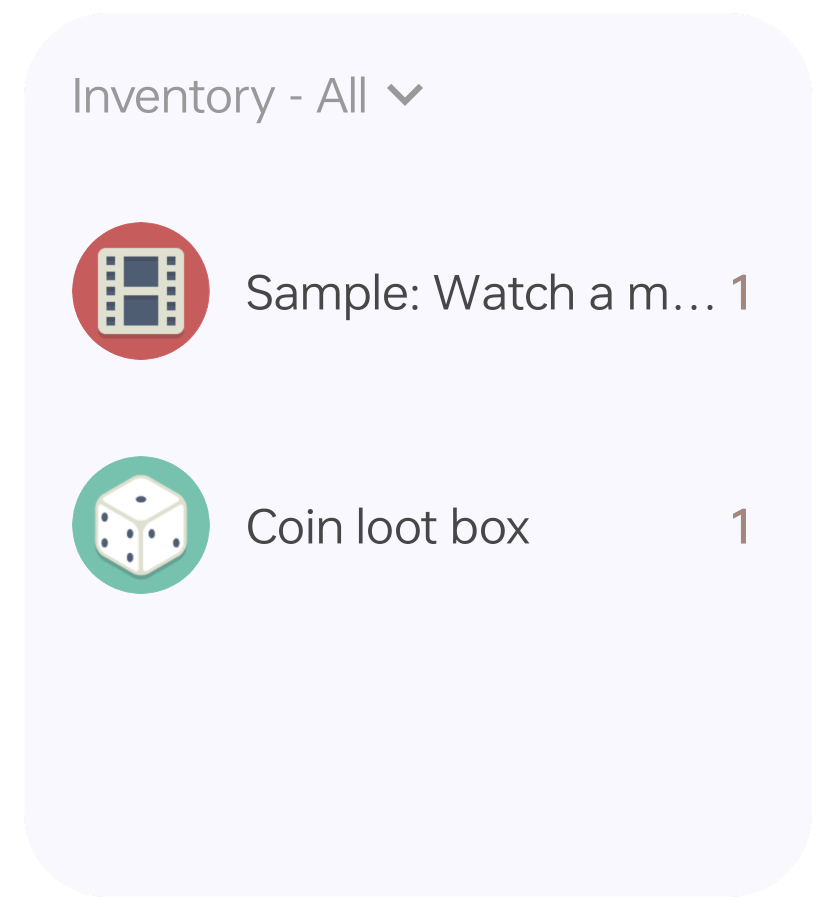
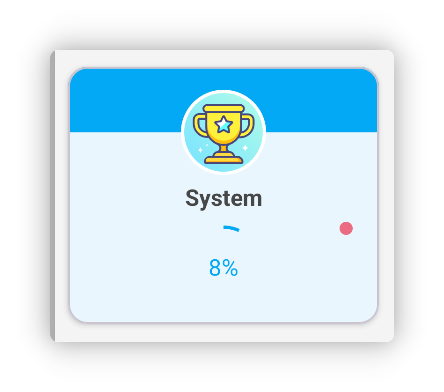

<h1 align="center" padding="100">v1.94.0 Ricompense di più Oggetti</h1>

## Introduzione

Questo aggiornamento introduce soprattutto Ricompense di più Oggetti e widget Inventario, con numerose ottimizzazioni, miglioramenti prestazioni e correzioni bug.

**📧Come inviare feedback?**

Per domande, suggerimenti o segnalazioni bug: 📫[lifeup@ulives.io](mailto:lifeup@ulives.io) o issue su GitHub (https://github.com/Ayagikei/LifeUp/issues)

## 1. ✅Ricompense di più Oggetti

Ora in LifeUp puoi selezionare più Oggetti in vari punti. Non serve più aprire casse o Sintesi per ottenere Ricompense multiple.

Ad esempio puoi:

- Impostare direttamente più Oggetti Ricompensa per un Compito
- Scegliere più Oggetti aprendo una cassa, poi impostare le probabilità insieme
- Impostare direttamente più Oggetti Ricompensa per Obiettivi e sottocompiti

 

### 📕Come usare?

Clicca il pulsante selezione multipla in alto quando selezioni Oggetti.

> Nota: alcuni scenari supportano solo selezione singola.

## 2. 🔧Widget Inventario

Questa versione introduce due dimensioni di widget Inventario.

Ora puoi vedere e usare rapidamente gli Oggetti in Inventario dal desktop.

 

### 🚀 Ottimizzazioni e risoluzione problemi

Dopo il widget Negozio di versioni fa, abbiamo incontrato crash e altri problemi.

Ad esempio, per limiti di trasmissione del sistema widget, troppi Oggetti potevano far crashare l'App, o problemi cambio elenco o caricamento immagini personalizzate.

In questa versione abbiamo trovato soluzioni adatte. Widget Negozio e Inventario dovrebbero gestire molti Oggetti; abbiamo testato widget Negozio con quasi 1000 Oggetti ancora funzionanti (sconsigliato in uso reale).

 

### 📕Come usare?

Di solito crei un widget con pressione lunga sul desktop di sistema.

Su dispositivi Xiaomi o Redmi (MIUI/HyperOS), aggiungere widget è un po' nascosto: consulta il documento configurazione compatibilità.

## 3. ✨Altre funzioni

**Temi UI**

1. Colori personalizzati (testo Compito, Oggetto) con più valori preimpostati
2. Adattamento icona adattiva monocromatica Android 14
3. Più adattamenti linguistici (versione Google Play)

**Obiettivi**

1. Se ci sono Obiettivi con Ricompense non riscattate, compare un puntino rosso nell'elenco Obiettivi.

**Compiti**

1. I sottocompiti dei Compiti penalità eseguono correttamente la logica penalità
2. Aggiunta «Gestione fuso orario intelligente»: LifeUp rileva cambi fuso e supporta regolazioni orarie globali
3. La base statistiche nella pagina dettagli ricorda l'ultima selezione; ottimizzati valori predefiniti in alcuni scenari
4. Ottimizzata gestione grazia giorni consecutivi completamento Compiti in «Il mio profilo»: recuperando un giorno saltato la serie continua

**Attributi**

1. Supporto eliminazione record Punti Esperienza
2. Supporto reset Punti Esperienza di un singolo Attributo

**Widget**

1. Cliccando lo spazio vuoto nei widget Negozio o Inventario si entra nell'elenco puntato dal widget, non nell'ultimo elenco
2. I widget Compiti mostrano il progresso dei Compiti a conteggio

**API**

1. Aggiunta API modifica record Pomodoro
2. API completamento Compiti gestisce correttamente Compiti penalità
3. API completamento Compiti supporta Compiti a conteggio (parametro `count`)
4. API completamento Compiti supporta coefficiente Ricompensa
5. API modifica Oggetti supporta cambio id elenco Oggetti
6. API creazione/modifica Oggetti supporta parametro criteri ordinamento
7. API jump supporta salto al popup uso Oggetto
8. Unificate alcune definizioni parametri, es. `itemId` → `item_id`
9. Aggiunte notifiche broadcast avvio, pausa e fine cronometro
10. API modifica Oggetti: `title_color_string` supporta stringa vuota per ripristinare predefinito
11. Broadcast completamento Compiti include id elenco
12. Apertura casse e Sintesi attivano anche broadcast uso Oggetto

------

Inoltre abbiamo corretto molti problemi segnalati di recente.

Dettagli nel changelog seguente~

### ♻️Ottimizzazioni

1. Aggiungendo o modificando Compiti, avviso se nessun Attributo è selezionato ma sono inseriti Punti Esperienza
2. Ottimizzati record retry upload
3. Ottimizzati display titolo e restrizioni input pagina Livello personalizzato
4. Ottimizzate prestazioni e tempistica annullamento Compiti ripetuti molte volte
5. Refactoring popup uso Oggetto, logica calendario, ecc.
6. Ottimizzata logica promemoria Compiti: niente promemoria da dati eliminati o precedenti
7. Ottimizzato testo attesa interfaccia backup
8. Immagini selezionate pagina Attributo personalizzato aggiunte anche alla cronologia selezione
9. Modificando record Pomodoro si tenta di correggere (aumentare o diminuire) il numero giusto di pomodori

### 🐛Correzioni bug

1. Corretto Obiettivo di sistema su statistiche e backup non attivato dopo ristrutturazione
2. Corretti conflitti potenziali widget API random e toast con toast predefinito
3. Corretto dettaglio Compito non aggiornato entrando da widget in alcuni scenari
4. Corretto errore aprendo più casse in situazioni speciali (consumo anticipato Inventario)
5. Corretto mancata visualizzazione sottocompiti in dettagli dopo modifica Compito senza sottocompiti e aggiunta nuovi
6. Corretti casi speciali in cui non si potevano modificare Ricompense monete
7. Corretti casi in cui riscatto Oggetti squadra poteva fallire
8. Corrette anomalie stile MD2 in alcuni popup inferiori
9. Corretti valori tempo aggiuntivo errati nei timer Pomodoro
10. Corretto barra colore widget variazione Punti Esperienza che poteva non comparire
11. Corretti Compiti non visualizzati correttamente nel calendario in corso
12. Corretti problemi caricamento elenco in cronologia e pagina Riflessioni
13. Corretto che chiamare due volte di seguito l'API completamento Compito non permetteva due completamenti consecutivi
