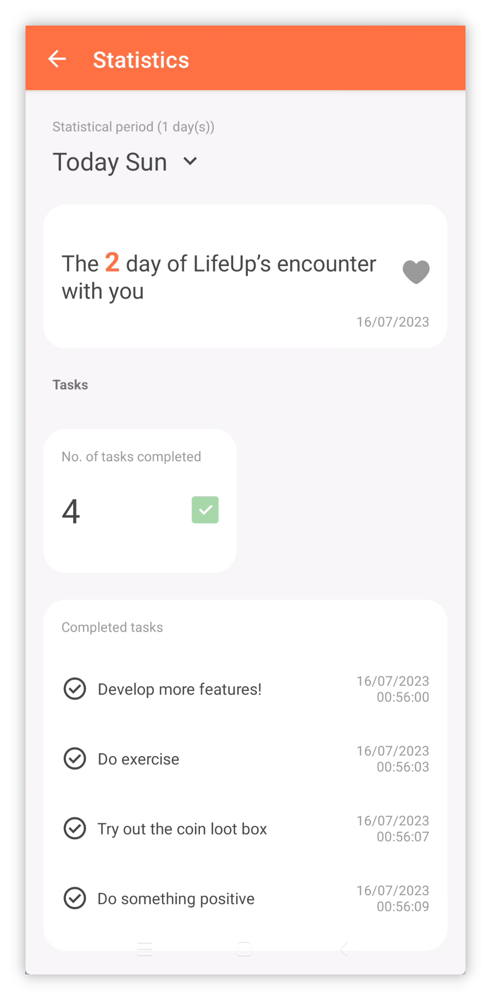
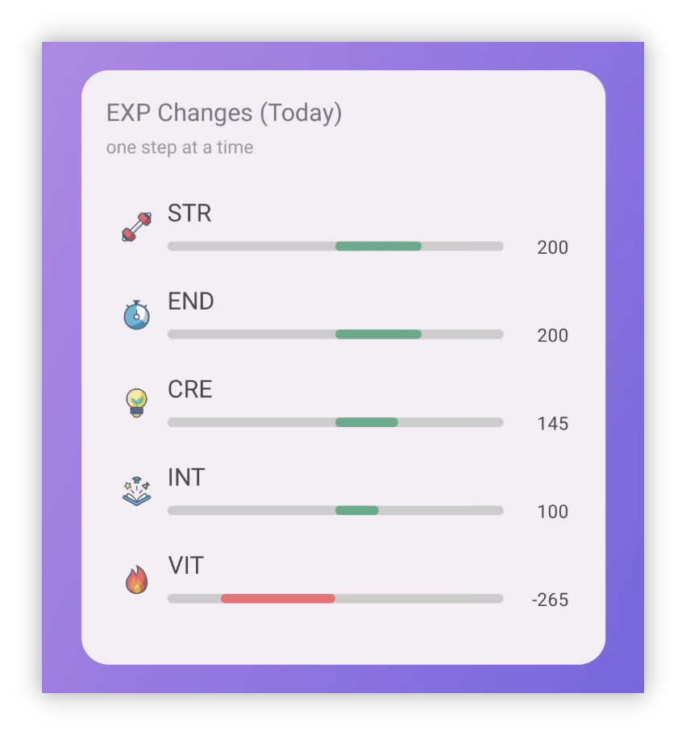

## v1.92.0 - 新デザインの統計、デスクトップ更新、ウィジェット追加

**LifeUp をご利用いただき、ありがとうございます！**

v1.91.1〜v1.92.0 をカバーする最近の更新内容です。

これらの更新が、ご利用と生産性の向上に役立てば幸いです。

ご質問やご提案があれば、📫[lifeup@ulives.io](mailto:lifeup@ulives.io) までお気軽にご連絡いただくか、GitHub（https://github.com/Ayagikei/LifeUp/issues）で Issue を提出してください。

---

## 🔖概要

### 📱Android App

1. 📈**新デザインの統計**
2. 🏆**新 App ウィジェット**：ショップアイテムウィジェットと経験値変化ウィジェット
3. ✨**新機能**：ショップ／インベントリリストの非表示に対応

### 🖥️デスクトップ

1. ✨**自動接続**
2. 🚀**気分を Markdown でエクスポート**
3. 🖥️**macOS インストールパッケージ**

## 📱Android App の更新

### 🏆新デザインの統計

統計とデータの振り返りは、生産性向上の重要なステップであると同時に、インスピレーションとフィードバックの源でもあります。

努力を振り返ることで、データから進捗と実績を確認でき、改善点や課題も見つけられます。

そのために [Statistics 2.0] を公開しました。さまざまな興味深いデータインサイトを提供します。

 

#### ❓使い方

新しい統計にアクセスするには、v1.92.0 にアップグレードし、[統計] ページを開き、上部の [新しい統計を表示] ボタンをタップしてください。

 

#### 📊統計項目

Statistics 2.0 は、ポモドーロにおける集中タスクの割合から、1 日あたりの平均ポモドーロ数、属性の日次変化、アイテムの購入記録、タスクの完了状況まで、各モジュールのデータ分析を提供します。

 

#### ⏰時間フィルター

**柔軟な**時間範囲フィルターにも対応しており、日、週、月、年、またはカスタム時間範囲のデータを簡単に確認できます。

LifeUp はあなた向けにカスタマイズされるべきです。年末まで年間サマリーを待つ必要も、毎年失われる心配もありません。

LifeUp では、**過去の年間サマリー**にいつでもアクセスできます。2022 年の年間サマリーデータが気になりませんか？ ぜひアップデートして試してみてください！

 

#### 👥共有

コミュニティと LifeUp の旅を共有してください！

共有したいデータ統計カードを長押しするだけで、共有カードを作成し、ワンタップで他の App に共有できます。

------

### 🏆**新 App ウィジェット**

#### ショップリストウィジェット

今回の更新では、大サイズと小サイズに適した 2 種類のショップリストウィジェットを追加しました。

デスクトップから直接購入・使用できます。

> 注：現在のものは「ショップ」ウィジェットであり、「インベントリ」ウィジェットではありません。
>
> 購入と使用はできますが、「インベントリ」内のアイテムを直接閲覧することはできません。

 

今回のショップリストはタスクリストと同様、

**各ウィジェットごとに異なるリストを選べます。**

 

上部の背景エリアをタップすると、App 内のショップページに素早くジャンプできます。

#### 日次経験値変化ウィジェット

このウィジェットで、ランチャー上に 1 日の経験値変化のサマリーデータを表示できます。

------

## 🖥️デスクトップ

### ✨自動接続

ユーザーフィードバックによると、IP の入力がデスクトップ版利用の大きな障壁でした。

今回の更新で、LifeUp Cloud Server の IP を自動検出する機能を追加しました。

 

この機能を使う前提条件：

- LifeUp Cloud v1.3.0 をダウンロード（Google Play の更新または GitHub Releases から入手可能）。

デスクトップ版で対応する IP アドレスを自動検出でき、手動入力は不要になりました。

> テストの結果、この機能は現時点では主に Windows 側で検証されています。
>
> macOS 側では自動検出がまだ非対応の可能性があります。

------

### 🚀**気分を Markdown でエクスポート**

デスクトップ版で気分を Markdown 形式でエクスポートできるようになりました。

複数の方法でグループ化してエクスポートでき、気分には完全な画像添付も含まれます。

Markdown 形式なら、**サードパーティツール**で簡単にレンダリングし、PDF や Word などに再変換できます。

------

### **✏️タスク追加**

以前構築した API 機能のおかげで、デスクトップ版でシンプルなタスクの作成が可能になりました。

現時点の設定は App 内のすべてのオプションをカバーできていませんが、シンプルなタスクの作成には十分です。

今後のバージョンでも、タスク作成オプションの拡充やタスク編集などに対応していきます。

------

### 🖥️**macOS インストールパッケージ**

バージョン 1.1.0 から、macOS インストールパッケージもリリースします。

簡単なテストの結果、Mac OS 版の機能は基本的に正常です。

詳細は [🖥LifeUp Desktop (lifeupapp.fun)](https://docs.lifeupapp.fun/en/#/guide/api_desktop) もご確認ください。

### **リリースノート**

#### LifeUp Android App

**1.92.0-rc02 (2023/07/16)**

**🐛修正**

1. 他 App へジャンプ（API 実行）時にショップウィジェットが動作しない場合がある問題を修正
2. ショップウィジェットでリスト切り替え時にたまに異常になる問題を修正
3. App 設定に従って売り切れまたは購入不可アイテムを非表示にしないショップウィジェットの問題を修正
4. 特定アイテムをタップしてもショップウィジェットが反応しない場合がある問題を修正
5. まれなクラッシュ問題を修正

**1.92.0-rc01 (2023/07/11)**

**✨機能**

1. Statistics 2.0
2. 共有カード

**♻️最適化**

1. 「購入不可」アイテムに価格を設定可能に（返品などのシナリオ向け）
2. 設定で「タスクペナルティを個別設定」をオフにすると、ペナルティボタンが表示されなくなる
3. チーム詳細のサブタスク UI を最適化
4. 気分の UI を最適化

**🐛修正**

1. 属性クリッピングスタイルを「角丸長方形」に変更した際、編集アイコンが長時間古いアイコンを表示する場合がある問題を修正

#### **LifeUp-Desktop**

**v1.1.0 (2023/06/25)**

**🚀機能**

1. 「LifeUp Cloud」の IP アドレスと接続の自動チェックに対応（LifeUp Cloud v1.3.0 が必要）
2. タスク追加に対応（現時点で対応オプションは限定的）（[#6](https://github.com/Ayagikei/LifeUp-Desktop/issues/6) を修正）
3. 気分を Markdown 形式でエクスポートに対応（[#5](https://github.com/Ayagikei/LifeUp-Desktop/issues/5) を修正）
4. 繁体中国語テキストを追加
5. macOS リリース版を追加
6. 更新チェックに対応

**🔧最適化とバグ修正**

1. 実績サブカテゴリが正しく表示されない問題を修正
2. 一部アイコンが正しく表示されない問題を修正（LifeUp v1.91.3 が必要）
3. タイトル不一致の問題を修正（[#8](https://github.com/Ayagikei/LifeUp-Desktop/issues/8) を修正）
4. Windows インストーラーにショートカットオプションを追加（[#13](https://github.com/Ayagikei/LifeUp-Desktop/issues/13) を修正）
5. ウィンドウサイズ取得方法を改善。1080p 未満の解像度に対応

#### **LifeUp Cloud**

**v1.3.0 (2023/06/25)**

**🚀機能**

1. mDNS サービス登録に対応。デスクトップが IP を自動検出可能に（デスクトップ v1.1.0 が必要）
2. ContentProvider 経由で呼び出した API の結果値を追加。

**🔧改善**

1. QR コードスキャンボタンのタップ範囲を拡大
2. ActivityNotFound クラッシュを修正
