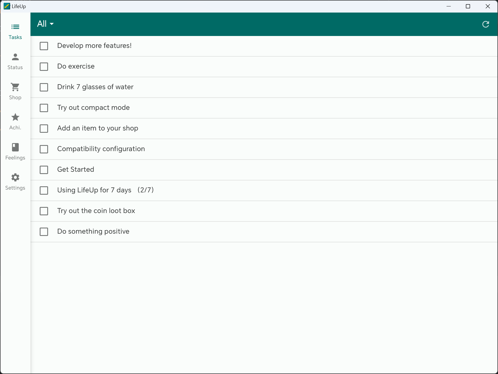

## v1.91.0 - 상태 위젯, 커스텀 레벨 그라데이션, 간단한 데스크톱

> [DEV] v1.91의 새 기능: 상태 위젯, 커스텀 레벨 그라데이션, 간단한 데스크톱

> v1.91 업데이트를 소개합니다. LifeUp Reddit 커뮤니티를 오랫동안 유지해 주신 분들께 감사드립니다! :D 모든 커뮤니티를 추적할 리소스가 부족해 📧 및 GitHub 피드백을 주로 처리합니다. 질문이나 제안이 있으면 📫[lifeup@ulives.io](mailto:lifeup@ulives.io)로 연락하거나 GitHub(https://github.com/Ayagikei/LifeUp/issues)에 이슈를 제출해 주세요.

오래 기다리게 해 죄송합니다.

여러 사정으로 연말 이후 전반적인 개발 및 학습 진행이 지연되었습니다. 여러분의 지원 덕분에 개발 장비도 성공적으로 업그레이드했고, 데스크톱 컴퓨터도 구축했습니다. 이를 통해 개발, 디버깅, 릴리스가 더 효율적입니다.

최근 드디어 정상 업데이트 상태로 돌아왔습니다. 버전 1.91은 이전 "개발 로드맵"에 따라 일부 업데이트를 가져옵니다. **v1.91은 점진적으로 출시 중이며, 업데이트를 받지 못했다면 잠시 기다려 주세요.**

v1.91에서 통합 Google Calendar를 도입할 계획이었습니다. 하지만 실제 개발 과정에서 많은 기술적 장애물을 만났습니다. 더 빨리 업데이트를 출시하기 위해 일시적으로 연기하고 다른 기능 개발에 집중한 뒤 Google Calendar 통합으로 돌아오기로 했습니다. v1.91에서 Google Calendar 통합을 기대하셨던 사용자분께 죄송합니다. Google Calendar 통합 작업은 계속 진행하겠습니다.

참고로 LAN 데스크톱 클라이언트 개발이라는 새로운 시도도 했습니다. **하지만 데스크톱 클라이언트는 아직 매우 기초적이며 모바일 데이터에 의존합니다.**

---

## 🔖개요

1. **🏆위젯:** 새로운 상태 위젯(1차 배치)
2. **📈속성:** 커스터마이즈 가능한 레벨 그라데이션
3. **✨멀티 플랫폼:** LAN 데스크톱 버전
4. **✏️API:** 전체 목록 데이터 조회 및 추가 API
5. **🍅토마토 타이머:** 작업 및 휴식 타이밍 자동 시작
6. **🚀기타:** 성능 최적화
7. **전체 변경 로그**

## 🏆위젯: 새 상태 위젯(1차 배치)

이번 업데이트는 속성 및 코인 관련 위젯 시리즈를 가져옵니다:

- 코인(소형, 대형, 목표)
- 속성 목록(소형, 대형)

이것은 1차 배치일 뿐이며, 곧 더 많은 위젯을 개발할 예정입니다.

### 📝사용 방법

보통 시스템 런처를 길게 누르거나 핀치하여 위젯을 추가합니다.

------

## 📈속성: 커스텀 레벨 그라데이션

v1.91에서는 레벨 그라데이션, 즉 각 레벨에 필요한 경험치를 커스터마이즈할 수 있습니다.

선호에 따라 더 높은 도전 또는 더 부드러운 성장 곡선을 선택할 수 있으며, 이제 여러분이 결정합니다.

내장 레벨 표만 확인하고 싶다면 해당 페이지에서 확인할 수도 있습니다.

### 📝사용 방법

사이드바 → 설정 → 고급 → 커스텀 레벨

------

## ✨멀티 플랫폼: 데스크톱

이 기간 동안 새로운 API 업데이트와 함께 다양한 상세 목록 데이터를 조회할 수 있게 되었고, 새로운 시도를 했습니다.

**완전 오픈소스(https://github.com/Ayagikei/LifeUp-Desktop)** LAN 데스크톱 소프트웨어를 개발하여 휴대폰에 연결하고 다양한 목록 데이터를 표시하며, 일부 간단한 작업을 지원합니다: 상품 구매, 작업 완료, 감정 사진 내보내기 및 시스템 사진 브라우저로 보기.

소프트웨어는 이론상 Windows, Linux, macOS를 지원합니다.

⚠️ 데스크톱은 아직 초기 개발 단계입니다.

데스크톱을 통한 작업 추가, 상호작용을 위한 인터페이스 적응, markdown 형식으로 감정 내보내기 등 더 많은 기능을 계속 추가할 예정입니다.

### 📝사용 방법

자세한 내용은 "사이드바 → 설정 → Labs → LifeUp Cloud" 섹션을 참고하세요.

문서도 확인하세요: [LifeUp Desktop🖥 (lifeupapp.fun)](https://docs.lifeupapp.fun/en/#/guide/api_desktop).

## ✏️API: 전체 목록 데이터 조회 및 추가 API

**데이터 인터페이스**

데스크톱 클라이언트의 데이터 소스 기반으로, 이번 버전에서 완전한 데이터 조회 인터페이스를 제공합니다.

Android 개발자라면 **LifeUp SDK**로 LifeUp App의 다양한 데이터를 조회할 수 있습니다.

다른 유형의 개발자라면 HTTP 프로토콜로 "LifeUp Cloud" API를 호출할 수 있습니다. 데스크톱 클라이언트에서도 이 방식을 사용합니다.

개발을 모른다면 걱정하지 마세요:

1. 먼저, 지금이 최고의 학습 기회입니다.

2. 둘째, 위 데이터 API는 공개되어 있어 커뮤니티 개발자가 이 데이터로 2차 개발을 할 수 있습니다.

예를 들어 작업 목록 페이지, 상점 페이지를 디자인하고, 더 복잡한 2차 개발(할인, 무 매매 기능 등)을 수행할 수 있습니다.

2차 개발 결과도 모든 사용자에게 이익이 됩니다.

구체적인 인터페이스는 나중에 API 문서에 추가됩니다.

**기타 API 인터페이스 개선**

추가

- ATM 입출금
- 아이템 "구매 비활성화" 설정
- 작업 "태그 색상" 설정
- ATM 잔액 직접 설정
- 지정 아이템 세부 정보 간단 조회
- "confirm_dialog" 인터페이스에 세 번째 버튼 및 작업 옵션 추가

동작 변경

- confirm_dialog 팝업 API에서 일부 버튼의 텍스트나 작업이 제공되지 않으면 해당 버튼이 표시되지 않습니다.

  팝업 제어의 유연성이 높아집니다. 예를 들어 텍스트와 동기 부여 문구만 표시하는 버튼 없는 팝업을 설정할 수 있습니다.

- penalty 벌칙 API에서 과거 버전에는 최대 100개 아이템만 차감할 수 있었으나, 이제 한도가 9자리로 확장되었습니다.

### 📝 사용법

API 문서 및 GitHub 저장소를 확인하세요:

[LifeUp Cloud☁️ (lifeupapp.fun)](https://docs.lifeupapp.fun/en/#/guide/api_cloud)

https://github.com/Ayagikei/LifeUp-SDK

------

## 🍅토마토: 작업 및 휴식 타이밍 자동 시작

이번 버전에서는 포모도로 시계 자동 시작 기능도 도입합니다.

시스템이 포모도로 시계 작동을 방해하지 않도록 휴대폰에 **호환성 설정**이 되어 있는지 확인하세요.

"휴식 자동 시작"을 켜면 기존 추가 카운트다운 기능은 비활성화됩니다.

### 📝 사용법

포모도로 → 오른쪽 상단 설정 페이지로 이동하세요.

------

## 🚀기타: 성능 최적화

사용자 피드백과 온라인 데이터 수집을 통해 LifeUp App의 일부 데이터 조회 효율이 대량 데이터 상황에서 현저히 저하됨을 확인했습니다.

할 일 도구 App에서 안정성과 장기 사용은 매우 중요합니다.

따라서 이번 버전에서 대량 데이터 시나리오에 대한 일련의 최적화를 진행했습니다. 대부분의 목록 페이지(특히 할 일 목록 페이지) 로딩 속도가 크게 향상됩니다.

이러한 시나리오에 대한 최적화를 계속 진행하겠습니다.

## 전체 업데이트 로그

**1.91.0-alpha01 (2023/02/13)**

**✨기능**

1. 커스텀 레벨 그라데이션 지원.
2. 초기 위젯 배치 추가:
   - 코인(소형, 대형, 목표)
   - 속성(소형, 대형)

1. Content Provider API를 통해 LifeUp의 대부분 데이터 세부 정보 조회 지원, 포함:
   - 새 버전 "LifeUp Cloud" 제공.
   - 로컬 네트워크용 기초적인 1차 데스크톱 버전(Windows, Linux, macOS) 제공.

1. 포모도로 타이머 기록 다중 선택 삭제 지원.
2. 포모도로 시계 휴식 및 작업 자동 시작 설정 지원.
3. API 개선 및 필드 추가, 포함:
   - ATM 입출금.
   - 아이템 구매 비활성화 설정.
   - 작업 라벨 색상 설정.
   - ATM 잔액 직접 설정.
   - 지정 상품 세부 정보 간단 조회.
   - 팝업 인터페이스에 세 번째 버튼 및 작업 옵션 추가.

**♻️최적화**

1. 대량 데이터 처리 시 조회, 처리 속도 및 성능 개선.
2. 적응형 아이콘의 잘못된 여백 수정.
3. 포모도로 타이머 기록 표시 효과 최적화.
4. 백업 복원 시 상호작용 개선.
5. Google Play를 통한 라이선스 획득 UI 표시 추가(GitHub 무료 체험판용).
6. 파일 시스템에서 직접 가져올 때 선택한 백업 파일이 LifeUp 것이 아니면 원클릭 가져오기 기능 비활성화 안내 제공.
7. 상품 선택 팝업에서 상품 검색 시 입력법 자동 닫기.
8. API 동작 변경, 포함:
   - Confirm_dialog 팝업 API. 특정 버튼 텍스트나 작업이 제공되지 않으면 해당 버튼이 표시되지 않음. 팝업 제어 유연성 향상, 예: 텍스트와 동기 부여 문구만 표시하는 버튼 없는 팝업 설정 가능.
   - Penalty API. 이전 버전에는 최대 100개 아이템만 차감 가능, 이제 한도가 9자리로 확장.

**🐛버그 수정**

1. 특정 상황에서 포모도로 타이머 페이지 끝에 "로딩"이 표시되는 문제 수정.
2. 특정 서드파티 라이브러리로 인한 충돌 수정.
3. 프롬프트 팝업으로 인해 하단 탐색 모음에 포모도로 시계를 배치할 때 App 충돌 문제 수정.
4. 다른 사용자 프로필 탐색 시 속성 값 비정상 표시 문제 수정.
5. 속성 레벨 감소 API 이벤트 및 알림이 올바르게 전송되지 않는 문제 수정.
6. 길게 누르기 편집 페이지의 일부 상호작용 문제 수정.
7. 이미지 관리 및 합성 페이지의 일부 비정상 여백 수정.
8. 일부 팝업 창이 스크롤되지 않아 가로 모드에서 비정상 사용되는 문제 수정.

**✨특별 릴리스: LifeUp Cloud v1.1.1 (2023/02/13)**

1. Content Provider 정보 읽기 및 권한 부여 작업 지원.
2. 서비스 시작 중 화면 잠금 상태에서도 응답할 수 있도록 wake lock 요청.
3. Content Provider용 일련의 인터페이스 추가.

**✨특별 릴리스: LifeUp Desktop v1.0.1 (2023/02/13)**

초기 릴리스, "LifeUp Cloud" 및 모바일 App과 함께 사용하도록 설계.

다음 작업 지원:

- 작업, 목록, 아이템, 업적, 감정 목록 조회.
- 아이템 구매 및 작업 완료.
- 데스크톱 이미지 브라우저로 감정 확대 이미지 보기 지원.

## 4주년

업데이트를 즐겨 주세요!

LifeUp 개발을 시작한 지 4년이 되었으며, LifeUp에 더 많은 업데이트와 최적화를 계속 가져올 것입니다.

하지만 일회성 구매가 App의 장기 유지보수에 그리 친화적이지 않다는 것도 깨달았습니다. 걱정하지 마세요, 우리도 일회성 구매의 지지자입니다.

LifeUp 개발에 전념할 기회를 갖고 싶습니다. 하지만 LifeUp은 아직 매우 틈새 App입니다. 시간 부족으로 최근 버전에서는 커뮤니티가 LifeUp의 더 많은 기능 구축에 참여할 수 있도록 다양한 API를 설계했습니다.

LifeUp이 도움이 된다고 생각하고 소개 페이지에서 개발자에게 커피 한 잔을 사주거나 친구와 커뮤니티에 LifeUp을 추천해 주시면 장기 유지보수에 도움이 되며, 풀타임 개발에 한 걸음 더 가까워집니다.

LifeUp을 이용해 주셔서 다시 한번 감사드립니다!
