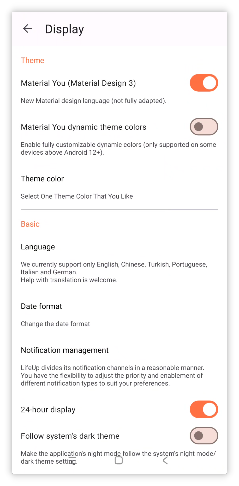

## v1.93.0 - 작업 템플릿 및 Material 3

## 🚀소개

LifeUp에서는 사용자 피드백을 면밀히 듣고 있으며, 최근 노력은 가장 많이 요청된 기능 중 일부를 개선하는 데 집중했습니다. 소중한 의견을 바탕으로 LifeUp 경험을 계속 다듬겠습니다.

또한 개발 로드맵을 따라 부지런히 진행 중이며, 앞으로 더 흥미로운 업데이트를 가져올 것입니다. 여러분의 신뢰와 지원이 우리가 계속 개선하는 원동력입니다.

이러한 개선 외에도 Flutter, KMM 같은 기술을 적극 탐색하여 LifeUp 경험을 더욱 높일 새로운 가능성의 문을 열고 있습니다. 성장하고 진화하는 우리와 함께 이런 흥미로운 발전을 기대해 주세요. 🚀🔍

**이번 업데이트는 작업 템플릿, 비밀 업적, 새 디자인 언어 Material You 완전 적응 등 기능을 가져옵니다.**

**감정, API 같은 기능 모듈도 개선 및 최적화가 이루어졌습니다.**

질문이나 제안이 있으면 📫[lifeup@ulives.io](mailto:lifeup@ulives.io)로 연락하거나 GitHub(https://github.com/Ayagikei/LifeUp/issues)에 이슈를 제출해 주세요.

---

## I. 📋 작업 템플릿

이번 버전은 내장 작업 템플릿을 도입합니다. "작업 복사"와 API를 사용해 간접적으로 작업을 만들 필요가 없습니다.

작업 생성 또는 편집 시 현재 설정을 템플릿으로 저장할 수 있습니다.

앞으로 작업을 만들 때 이전 보상 설정, 작업 설정 등을 한 번의 탭으로 가져올 수 있습니다.

### 📕 사용 방법?

작업 생성 또는 편집 시 상단 바의 작업 템플릿 버튼을 클릭하세요.

작업 템플릿은 대부분의 설정을 기록하지만, 현재 마감일은 포함하지 않습니다.

## II. 🎨 Material You 테마

이번 버전은 Material You 디자인 언어(테마)에 완전히 적응합니다.

이 디자인 언어는 더 현대적이고 깔끔한 외관을 제공합니다. 미래에 공식적으로 홍보하는 UI 스타일 중 하나이기도 합니다.

또한 Material You의 핵심 기능은 "모든 사람이 다른 테마 색상을 가질 수 있다"는 것입니다.

이를 통해 "LifeUp"은 배경화면 기반 동적 테마 색상, 커스텀 테마 색상 같은 새로운 메커니즘을 도입할 수 있습니다. (참고: 기기 지원 필요.)

### 📕 사용 방법?

위 이미지처럼 사이드바를 열고 설정 → 표시로 이동하여 관련 옵션을 조정하세요.

기기가 동적 테마 색상을 지원하지 않으면 사전 설정 테마 색상 중에서 선택할 수 있습니다.

기기가 동적 테마 색상을 지원하면 이 기능을 활성화하고 원하는 테마 색상을 높은 유연성으로 커스터마이즈할 수 있습니다:

## IV. 🌐새 공식 웹사이트

친구들과 "LifeUp"을 공유하기 더 쉬워진 새 랜딩 페이지를 출시했습니다.

[lifeup.ulives.io](https://lifeup.ulives.io)를 방문하면 "LifeUp"이 제공하는 것을 미리 볼 수 있습니다.

## III. ✨ 더 많은 기능

**UI 테마**

1. Material Design 3에 완전 적응.
2. 커스텀 색상, 배경화면 색상, 이미지 색상을 포함한 Material Design 3 테마 색상 커스터마이즈 지원.
3. 팝업 등 일부 애니메이션 효과 개선.
4. edge-to-edge(몰입형) 적응 효과 최적화.

**작업**

1. 작업 템플릿 지원.
2. 세부 정보 페이지 통계가 시간 기준 전환 지원 및 기본 옵션 최적화.
3. 기록 페이지에서 작업 이름 검색 지원 및 관련 UI와 상호작용 조정.

**업적**

1. 비밀 업적 지원.
2. 업적 추가 시 "다음 업적 계속 추가" 지원.

**속성**

1. 속성 숨기기 지원.

**포모도로 타이머**

1. 시간 기록 편집 지원.
2. 포모도로 페이지에서 작업 완료 지원(일시 정지 모드에서 선택된 작업 길게 누르기).

**감정**

1. 감정 페이지에서 직접 감정 추가 지원.

**API**

1. "use_item" API 추가.
2. "random" API 추가.
3. "edit_exp" API 추가.
4. "item" API가 "action_text," "disable_use," "title_color_string" 등 매개변수 조정 지원.
5. "shop_settings" API가 "silent" 매개변수 지원.
6. "time" 플레이스홀더 지원. 이제 자동화 도구 없이 "내일 마감" 또는 "다음 달 마감" 같은 날짜로 작업을 설정할 수 있습니다.

------

이 기능 외에도 다양한 보고된 문제를 해결하고 버그 수정을 진행했습니다. 자세한 내용은 아래 업데이트 로그를 참고하세요.

### ♻️ 최적화

1. 데이터 ID를 표시하는 일부 위치에 접두사 추가.
2. 팀 활동 표시 최적화.
3. 일부 Toast 알림이 너무 길어 완전히 표시되지 않는 문제 해결 시도.
4. 팀 위젯 완료 로직 개선, App 내 동작과 일치 보장.
5. 통계 페이지: "사용자 지정" 시간 범위 선택 후 "사용자 지정"을 다시 클릭하면 날짜 재선택 트리거.
6. Harmony OS 4와 진행률 표시줄 알림의 작업 버튼 표시 호환성 보장.
7. 알림 요청 상호작용 로직 향상.
8. "반복 횟수" 입력 시 입력법이 입력을 가리는 문제 해결.
9. 작업 생성 시 사용자의 비특정 시작 시간(자동 또는 오늘 마감 등) 선택 기록. 편집 시 특정 시간이 아닌 이런 옵션 복원하여 편집 시간 불일치 방지.
10. 작업 생성 시 예상치 못한 중복 경고 발생 시 "중복 확인" 팝업에도 표시.
11. 인도네시아어 지원 추가.
12. 번역 업데이트.

## 🐛 버그 수정

1. 특정 경우 월드 모듈이 로딩(무한 회전)에 멈출 수 있는 문제 수정.
2. 특정 경우 상점/창고가 로딩(무한 회전)을 계속 표시할 수 있는 문제 수정.
3. content provider를 통해 UI 콘텐츠가 포함된 API 호출 시 발생할 수 있는 문제 수정.
4. 기대에 맞지 않는 작업 정렬 문제 수정.
5. "사용자 지정" 시간 범위 선택 후 통계 페이지 데이터가 잘못된 문제 수정.
6. 알림 요청 팝업이 스크롤을 지원하지 않는 문제 수정.
7. 특정 경우 월드 모듈 검색이 모든 콘텐츠를 표시하는 문제 수정.
8. "완료 표시" 옵션이 동결된 작업도 표시하는 문제 수정.
9. 통계 페이지 평균값 계산 문제 수정.

## GitHub 기여자, 이메일 피드백 영웅, Crowdin 번역 기여자에게 특별 감사

GitHub 이슈 제출, 이메일 피드백, Crowdin 번역 기여에 시간을 할애해 주신 사용자분께 깊은 감사를 드립니다.

여러분의 노력은 전 세계 커뮤니티를 위한 "LifeUp" 경험 형성에 결정적이었습니다. App 기능과 접근성 향상에 도움을 주셨으며, 기여는 정말 소중합니다.

"LifeUp"을 더 좋게 만들기 위해 함께 노력하는 동안, 변함없는 지원과 협력에 진심으로 감사드립니다. 🙏📧🌍
