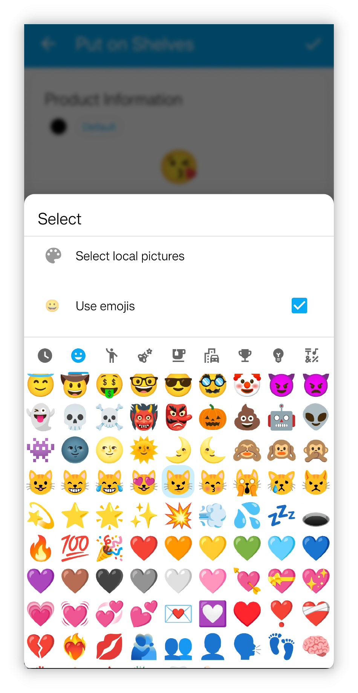

<h1 align="center" padding="100">v1.98.0 API 2.0 및 데스크톱 클라이언트 업데이트</h1>

## 소개
2025년 첫 릴리스이며, 다음 주요 업데이트가 포함됩니다:

- 이모지 아이콘 지원: 아이템, 업적 등에 이모지를 아이콘으로 직접 사용할 수 있습니다.

- API 2차 업데이트: API 인터페이스가 작업 수정, 아이템 효과 편집, 업적 해금 조건, 합성 및 거의 모든 핵심 기능 수정을 지원합니다.

- LifeUp Cloud 및 데스크톱 클라이언트 최적화: 자동 연결 감지 경험 개선; 데스크톱 클라이언트에 "새 감정" 기능 추가 및 백업 데이터 가져오기/내보내기 지원.

## I. 이모지 아이콘

### 📕사용 방법?

- 이번 버전에서 아이템, 업적 등의 아이콘 선택 시 이모지 표정을 아이콘으로 직접 선택할 수 있습니다.

## II. API 2차 업데이트

v1.90.0에서 API 기능이 공개된 이후, 많은 사용자가 API를 적극 탐색하고 풍부한 콘텐츠를 만들어 주셔 기쁩니다. 많은 분이 URL 관련 지식을 처음부터 배워 API를 데스크톱 위젯, DIY 데스크톱 클라이언트에 적용했고, 웹 App 연동까지 달성하셨습니다. 인상적입니다.

하지만 복잡한 데이터 구조와 상당한 설계·개발 작업량으로 1차 API 배치에는 작업 편집, 아이템 편집, 해금 조건이 있는 업적 생성, 사용 효과가 있는 아이템 생성 같은 핵심 기능이 부족했습니다. 이런 기능의 완성은 이번 버전까지 이어졌습니다.

클라우드, 데스크톱 클라이언트, API 문서의 설계, 개발, 테스트, 업데이트로 작업량이 기하급수적으로 증가하여, 몇 달 전 시작한 개발 브랜치가 이제야 개발과 테스트를 완료했습니다.

**하지만 노력의 결실을 맺었습니다! 오늘 API는 LifeUp의 거의 모든 핵심 기능을 다룹니다. API를 공개함으로써 LifeUp을 단순한 App이 아니라, 사용자가 자유롭게 개발·확장·커스터마이즈할 수 있는 개방형 플랫폼으로 만들고자 합니다.**

### 📕사용 방법?

- API 사용 방법은 문서 라이브러리 → 디렉터리 → 공개 인터페이스 섹션을 참고하세요.
- 새 API 인터페이스 정의가 문서에 추가되었습니다.

## III. 데스크톱 클라이언트: 아카이브 기능 및 감정

### 아카이브

데스크톱 클라이언트에서 백업 파일을 직접 내보내거나 가져올 수 있습니다.

다른 기기로 데이터를 옮기고 복구하는 과정이 간소화됩니다.

### 새 감정 게시

데스크톱 클라이언트에서 새 감정 게시를 지원하며, 이미지 추가 및 시간 기능 설정을 완전히 지원합니다.

⚠️참고: 감정 편집은 아직 지원되지 않습니다.

### 기타 업데이트

- 연결 관련 오류 메시지 및 설명 최적화: 네트워크 문제인지 LifeUp 백엔드가 실행 중이 아닌 것인지 명확히 표시
- 작업 세부 정보 보기 지원
- API Token 보안 검증 지원(선택, LifeUp Cloud 2.0.0 버전 필요)
- 구매 로직이 이전 "아이템 수량 조정 API" + "코인 금액 조정 API" 대신 새 "아이템 구매 API" 사용. 구매 한도 로직을 올바르게 처리하여 App과 일관성 유지

이번 업데이트는 데스크톱 클라이언트를 통해 API 기능을 시연하는 역할도 합니다. 데스크톱 클라이언트의 모든 기능은 API를 통해 구현됩니다.

## IV. LifeUp Cloud 최적화

> LifeUp Cloud는 API를 HTTP 인터페이스로 노출하고 데스크톱 클라이언트 연결의 다리 역할을 하는 도구입니다.

LifeUp Cloud에 대한 피드백을 바탕으로 수많은 최적화를 진행했습니다:

- 상태 표시 추가로 데스크톱 클라이언트 연결 불가 원인 빠르게 감지
- 고급 설정 추가
  - 교차 출처 접근 허용: 웹 기반 기술로 LifeUp Cloud HTTP 인터페이스 접근에 유용
  - 커스텀 서비스 포트 허용
  - 접근 토큰 설정 허용: 선택적 보안 검증 조치
- LifeUp Cloud 인터페이스의 오류 반환 값 및 규격 최적화
- 서비스 검색 및 HTTP 서비스 전환 로직 최적화, 데스크톱 클라이언트 자동 감지가 더 잘 작동

## V. 미리보기

이번 업데이트는 API 외 기능이 상대적으로 적으므로, 현재 개발 중인 기능을 포함한 향후 버전 콘텐츠 미리보기:

- **주요 기능:** 반복형 업적
- **중간 기능:** 커스텀 배경의 텍스트 가독성 최적화
  - 작은 변경일 줄 알았지만 꽤 복잡함
- **소규모 기능:** 알림에 완료 및 나중에 알림 작업 추가
  - 지속 알림 지원을 원래 계획했으나, 최신 Android 버전에서 진정한 지속성을 더 이상 지원하지 않아 포기

## VI. ✨전체 업데이트 로그

### **LifeUp-Android**

**v1.98.0 (2025/01/01)**

**✨기능**

1. Credential Manager를 사용한 Google 로그인 및 Drive 권한 부여 통합.
2. 아이콘으로 Emoji 선택 지원.
3. ContentProvider Query API 추가: 합성 기능.
4. ContentProvider Query API 추가: 포모도로 기록 기능.
5. ContentProvider Query API 추가: 다중 아이템 반환 지원.
6. tomato API 추가(포모도로 수 조정).
7. export_backup API 추가(백업 내보내기).
8. purchase_item API 추가(아이템 구매).
9. synthesize API 추가(합성 트리거).
10. subtask API 추가(하위 작업 생성 또는 조정).
11. subtask_operation API 추가(하위 작업 작업, 예: 완료).
12. synthesis_formula API 추가(합성 공식).
13. edit_task API 추가(작업 편집).
14. category API 추가(목록 생성 또는 조정).
15. history_operation API 추가(기록 조정).
16. AppSettingsScheme API 추가(일부 App 설정 조정).
17. achievement API 추가(업적 생성 또는 편집).
18. skill API 추가(속성 생성 또는 편집).
19. 하위 작업 id 및 gid 표시 지원 추가.
20. 합성 id 표시 지원 추가.
21. creditLimit 조회 지원 추가.
22. ContentProvider API가 하위 작업(id, gid) 조회 지원.
23. ContentProvider API 아이템 조회: "최대 구매 가능 수량" 필드 반환 추가.
24. ContentProvider Shop API가 지정 id 목록으로 아이템 조회 지원.
25. 잘못된 ContentProvider URL 조회 시 반환 값 최적화.
26. 조회 인터페이스가 단일 업적 조회 지원.

**♻️최적화**

1. 새로 추가된 아이템의 기본 커스텀 정렬 최적화.
2. 새로 추가된 속성의 기본 커스텀 정렬 최적화.
3. "add_item" API에 `purchase_limit`, `disable_use`, `effects` 매개변수 추가.
4. "add_task" API에 `background_alpha`, `items`, `start_time`, `auto_use_item`, `remind_time`, `pin` 매개변수 추가.
5. "add_task" API에 더 많은 작업 빈도 지원 추가.
6. "item" API에 `effects` 및 `purchase_limit` 매개변수 지원 추가.
7. 선행 API(예: input)에서 작업 종료 지원 추가.
8. 숫자 플레이스홀더에 `signed` 매개변수 지정 지원 추가.
9. 난수 및 난수 소수 플레이스홀더 추가.

### **LifeUp-Desktop**

**v1.2.0 (2025/01/01)**

**🚀기능**
1. 아카이브 관리 지원
- 컴퓨터로 백업
- 컴퓨터에서 복원
- 드래그 앤 드롭 지원
2. 새 감정 만들기 지원
- 이미지 선택 지원
- 모바일로 이미지 동기화 지원
3. 작업 세부 정보 보기 지원
4. 구매 시스템 개선
- 새 "아이템 구매" API 사용
- App과 구매 한도 일관성 유지
5. 선택적 API Token 검증 지원
6. 멀티 플랫폼 지원
- Windows
- Linux
- macOS (Apple Silicon)
- macOS (Intel) 🆕
7. 오류 처리 및 알림 개선

### **LifeUp Cloud**

**v2.0.0 (2025/01/01)**

**🚀기능**
1. 서비스 최적화
- 서비스 검색 로직 및 호환성 향상
- 더 많은 기기가 IP 자동 감지 지원
- 서비스 시작/일시 정지 상태 전환 최적화
- 오류 처리 및 알림 개선
2. 보안 및 성능
- 선택적 API Token 검증 추가
- CORS 구성 옵션 추가
- 커스텀 포트 설정 지원
- 커스텀 wake lock 지속 시간 설정 지원
3. UI 향상
- 완전히 새로운 인터페이스 디자인
- 전반적인 시각적 경험 개선
