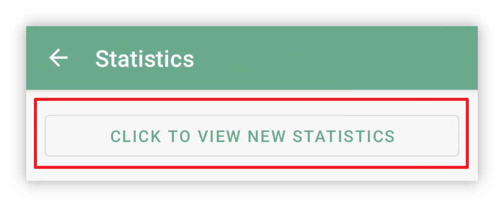
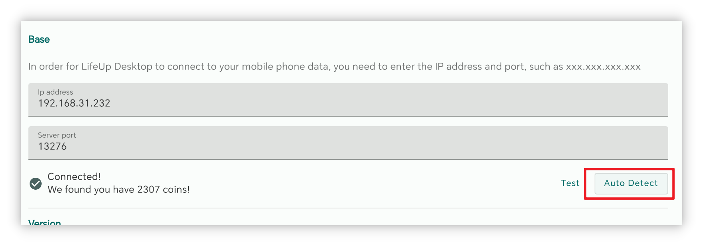
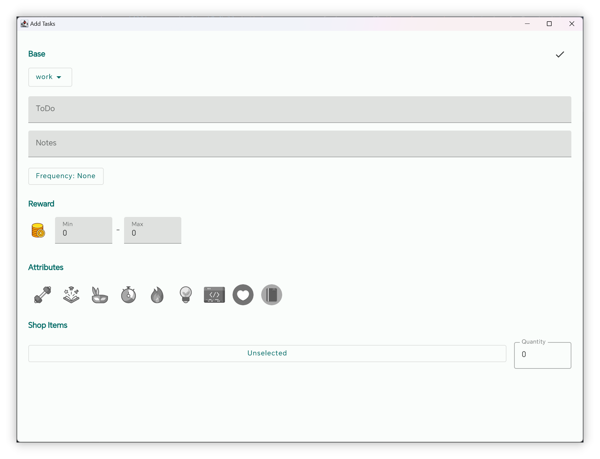

## v1.92.0 - Estatísticas redesenhadas, desktop atualizado, mais widgets

**Obrigado por usar o LifeUp!**

Aqui estão algumas atualizações recentes que cobrem v1.91.1–v1.92.0.

Esperamos que essas atualizações sejam úteis para seu uso e produtividade.

Se tiver dúvidas ou sugestões, entre em contato em 📫[lifeup@ulives.io](mailto:lifeup@ulives.io) ou envie um issue no GitHub (https://github.com/Ayagikei/LifeUp/issues

---

## 🔖Visão geral

### 📱App Android

1. 📈**Estatísticas redesenhadas**
2. 🏆**Novos widgets do App**: widget de Itens da Loja e widget de alteração de Pontos de Experiência
3. ✨**Novo recurso**: suporte para ocultar a lista da Loja/Inventário

### 🖥️Desktop

1. ✨**Conexão automática**
2. 🚀**Exportar Reflexões para markdown**
3. 🖥️**Pacote de instalação para macOS**

## 📱Atualizações do App Android

### 🏆Estatísticas redesenhadas

Estatísticas e revisão de dados não são apenas um passo importante para melhorar nossa produtividade, mas também uma fonte de inspiração e feedback.

Ao revisar nossos esforços, podemos ver nosso progresso e Conquistas com dados, e também identificar problemas e áreas de melhoria.

Para isso, lançamos [Estatísticas 2.0], que oferece diversos insights de dados interessantes.

 

#### ❓Como usar?

Para acessar as novas estatísticas, atualize para a versão v1.92.0, vá à página [Estatísticas] e toque no botão [Clique para ver as novas estatísticas] no topo.

 

#### 📊Itens de estatísticas

Estatísticas 2.0 fornecerá análise de dados para diversos módulos: da porcentagem de Tarefas com Foco nos Pomodoros, à média de Pomodoros por dia, às alterações diárias de Atributos, aos registros de compra de Itens, ao status de conclusão de Tarefas, e mais.

 

#### ⏰Filtro de tempo

E suporta filtragem de intervalo de tempo **flexível** — você pode visualizar facilmente os dados do dia, semana, mês, ano ou intervalo personalizado.

Seu LifeUp deve ser feito para você; não precisa esperar até o fim do ano para ver o resumo anual, nem se preocupar em perder o resumo anual todo ano.

No LifeUp, você pode acessar os **resumos anuais dos anos anteriores** a qualquer momento. Curioso sobre seus dados do resumo anual de 2022~? Atualize e experimente!

 

#### 👥Compartilhar

Compartilhe sua jornada LifeUp com a comunidade!

Agora basta pressionar e segurar o cartão de estatísticas que deseja compartilhar para criar um cartão de compartilhamento e enviá-lo a outros apps com um toque.

------

### 🏆**Novos widgets do App**

#### Widgets de lista da Loja

Esta atualização introduz dois widgets de lista da Loja, adequados para tamanhos grande e pequeno.

Agora você pode comprar e usar Itens direto na tela inicial~

> Nota: O atual é o widget da "Loja", não o widget do "Inventário".
>
> Embora permita comprar e usar Itens, não permite visualizar os Itens do "Inventário" diretamente.

 

Desta vez a lista da Loja é como a lista de Tarefas:

**Você pode escolher listas diferentes para cada widget.**

 

Se tocar na área de fundo no topo, também pode ir rapidamente à página da Loja no App.

#### Widget de alterações diárias de Pontos de Experiência

Com este widget, você vê na tela inicial um resumo das alterações diárias de Pontos de Experiência.

------

## 🖥️Desktop

### ✨Conexão automática

Segundo feedback de usuários, preencher o IP é um fator importante que impede o uso da versão desktop.

Esta atualização traz a detecção automática do IP do LifeUp Cloud Server.

 

Pré-requisito para usar esta função:

- Baixe o v1.3.0 do LifeUp Cloud (pelas atualizações do Google Play ou nossas páginas do GitHub).

Você pode detectar automaticamente o endereço IP correspondente na versão desktop, sem precisar preencher manualmente.

> Após testes, este recurso foi verificado principalmente no Windows.
>
> No macOS, a detecção automática pode ainda não ser suportada.

------

### 🚀**Exportar Reflexões para markdown**

A versão desktop agora suporta exportar Reflexões em formato markdown.

Suporta agrupamento e exportação de várias formas, e as Reflexões incluirão anexos de imagem completos.

Com o formato markdown, você pode usar facilmente **ferramentas de terceiros** para renderizar e converter novamente para pdf, word e outros formatos.

------

### **✏️Adicionar Tarefa**

Com a ajuda das capacidades da API construídas anteriormente, a versão desktop agora suporta criar Tarefas simples.

As configurações atuais ainda não cobrem todas as opções do App, mas são suficientes para criar Tarefas simples.

Versões posteriores continuarão a ampliar as opções de criação de Tarefas e suportar edição de Tarefas, etc.

------

### 🖥️**Pacote de instalação para macOS**

A partir da versão 1.1.0, também começaremos a lançar pacotes de instalação para macOS.

Após um teste simples, as funções da versão macOS estão basicamente normais.

Para detalhes, consulte também [🖥LifeUp Desktop (lifeupapp.fun)](https://docs.lifeupapp.fun/en/#/guide/api_desktop)

### **Notas da versão**

#### App Android LifeUp

**1.92.0-rc02 (2023/07/16)**

**🐛Correção**

1. Corrigir o problema em que o widget da Loja pode não funcionar ao ir para outros apps (executando API)
2. Corrigir anormalidade ocasional ao alternar listas no widget da Loja
3. Corrigir o problema em que o widget da Loja não oculta Itens esgotados ou não compráveis conforme as configurações do App
4. Corrigir o problema em que o widget da Loja pode não responder ao tocar em certo item
5. Corrigir alguns crashes raros

**1.92.0-rc01 (2023/07/11)**

**✨Recursos**

1. Estatísticas 2.0
2. Cartão de compartilhamento

**♻️Otimização**

1. Agora você pode definir preços para Itens "não compráveis" e usá-los em cenários como devoluções
2. Ao desligar "Definir penalidade de Tarefa separadamente" nas configurações, o botão de penalidade não será mais exibido
3. Otimizar a UI de subtarefas nos detalhes da equipe
4. Otimizar a UI de Reflexões

**🐛Correção**

1. Corrigir o problema em que, quando o estilo de recorte de Atributo muda para "retângulo arredondado", o ícone de edição pode mostrar o ícone antigo por muito tempo

#### **LifeUp-Desktop**

**v1.1.0 (2023/06/25)**

**🚀Recursos**

1. Suporte à verificação automática do endereço IP e conexão do "LifeUp Cloud" (requer LifeUp Cloud v1.3.0)
2. Suporte à adição de Tarefas, mas as opções suportadas atualmente são limitadas (Corrigido [#6](https://github.com/Ayagikei/LifeUp-Desktop/issues/6))
3. Suporte à exportação de Reflexões em formato markdown (Corrigido [#5](https://github.com/Ayagikei/LifeUp-Desktop/issues/5))
4. Adicionar texto em chinês tradicional
5. Adicionar versão de lançamento para macOS
6. Suporte à verificação de atualizações

**🔧Otimização e correções de bugs**

1. Corrigir o problema em que subcategorias de Conquistas não eram exibidas corretamente
2. Corrigir o problema em que alguns ícones não eram exibidos corretamente (requer LifeUp v1.91.3)
3. Corrigir problema de título inconsistente (Corrigido [#8](https://github.com/Ayagikei/LifeUp-Desktop/issues/8))
4. Adicionar opção de atalhos no instalador Windows (Corrigido [#13](https://github.com/Ayagikei/LifeUp-Desktop/issues/13))
5. Melhorar a forma de obter o tamanho da janela, adaptar a resoluções abaixo de 1080p

#### **LifeUp Cloud**

**v1.3.0 (2023/06/25)**

**🚀Recursos**

1. Suporte ao registro de serviço mDNS para o desktop descobrir automaticamente seu IP (requer desktop v1.1.0)
2. Adicionados valores de resultado para APIs invocadas via ContentProvider.

**🔧Melhorias**

1. Aumentada a área clicável do botão de escanear QR code
2. Corrigido crash ActivityNotFound
