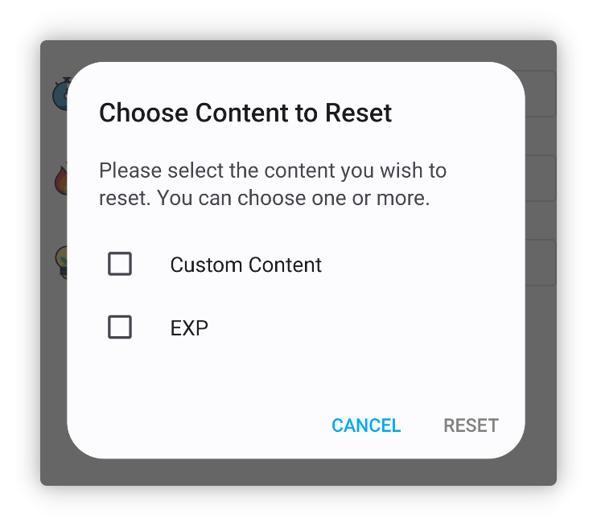

<h1 align="center" padding="100">v1.94.0 Recompensas de múltiplos Itens</h1>

## Introdução

Esta atualização introduz principalmente recursos como Recompensas de múltiplos Itens e widgets do Inventário, além de numerosas otimizações, melhorias de desempenho e correções de bugs.

**📧Como enviar feedback?**

Se tiver dúvidas, sugestões ou quiser reportar um bug, entre em contato em 📫[lifeup@ulives.io](mailto:lifeup@ulives.io) ou envie um issue no GitHub (https://github.com/Ayagikei/LifeUp/issues)

## 1. ✅Recompensas de múltiplos Itens

Agora, no LifeUp, você pode selecionar múltiplos Itens em diversos lugares. Não é mais necessário configurar abertura de caixas ou Síntese para obter múltiplas Recompensas.

Por exemplo, você pode:

- Definir diretamente múltiplas Recompensas de Itens para uma Tarefa
- Escolher múltiplos Itens ao configurar abertura de caixa e definir as probabilidades de uma vez
- Definir diretamente múltiplas Recompensas de Itens para Conquistas e subtarefas

 

### 📕Como usar?

Clique no botão de multiseleção no topo ao selecionar Itens.

> Observe que alguns cenários podem suportar apenas seleção única.

## 2. 🔧Widgets do Inventário

Esta versão introduz dois tamanhos de widgets do Inventário.

Agora você pode visualizar e usar rapidamente os Itens do Inventário direto na tela inicial.

 

### 🚀 Otimizações e resolução de problemas

Apesar de termos lançado o widget da Loja há várias versões, gradualmente encontramos alguns crashes ou outros problemas.

Por exemplo, devido aos limites de transmissão do sistema de widgets, ter muitos Itens podia causar crash do App, ou problemas de alternância de listas, ou falhas no carregamento de imagens personalizadas.

Nesta versão, encontramos soluções adequadas. Agora, widgets da Loja e do Inventário devem exibir um grande número de Itens; testamos widgets da Loja com quase 1000 Itens ainda funcionais e carregando corretamente (claro, não é recomendado).

 

### 📕Como usar?

Normalmente, você pode criar um widget pressionando e segurando a tela inicial do sistema.

Se usar um dispositivo como Xiaomi ou Redmi (MIUI/HyperOS), adicionar widgets no MIUI/HyperOS é um pouco escondido; consulte o documento de configuração de compatibilidade sobre como adicionar widgets.

## 3. ✨Mais recursos

**Temas da UI**

1. Cores personalizadas (texto de Tarefa, item) agora incluem mais valores predefinidos
2. Adaptado ao recurso de ícone adaptativo monocromático do Android 14
3. Adicionadas mais adaptações de idioma (versão Google Play)

**Conquistas**

1. Se houver Conquistas com Recompensas não resgatadas, um pequeno ponto vermelho será exibido na lista de Conquistas.

**Tarefas**

1. Subtarefas de Tarefas de penalidade agora executam a lógica de penalidade corretamente
2. Adicionado "Gerenciamento inteligente de fuso horário"; se você trabalha em fusos diferentes, o LifeUp também suporta detecção automática de mudanças de fuso e ajustes globais de horário
3. A base estatística na página de detalhes agora lembra a última seleção, e otimizamos alguns valores padrão em certos cenários
4. Otimizado o tratamento de tolerância de dias consecutivos de conclusão de Tarefas na página "Meu"; agora, se esquecer de concluir uma Tarefa um dia, recuperar ainda pode continuar a sequência

**Atributos**

1. Suporte à exclusão de registros de Pontos de Experiência
2. Suporte à redefinição dos Pontos de Experiência de um Atributo individual

**Widgets**

1. Agora, tocar no espaço em branco nos widgets da Loja ou do Inventário entra diretamente na lista apontada pelo widget, em vez da última lista
2. Widgets de Tarefas agora exibem o progresso de Tarefas de contagem

**API**

1. Adicionada API para editar registros do Pomodoro
2. A API de conclusão de Tarefas agora também trata Tarefas de penalidade corretamente
3. A API de conclusão de Tarefas agora também suporta processamento de Tarefas de contagem (adiciona parâmetro `count`)
4. A API de conclusão de Tarefas agora suporta parâmetro de coeficiente de Recompensa
5. A API de ajuste de Itens agora suporta alteração do id da lista de Itens
6. APIs de criação e ajuste de Itens suportam parâmetro de critério de ordenação
7. A API de salto agora suporta ir ao pop-up de usar item
8. Unificadas algumas definições de parâmetros, como `itemId` → `item_id`
9. Adicionadas notificações broadcast para iniciar, pausar e encerrar cronômetro
10. `title_color_string` da API de ajuste de Itens agora suporta string vazia para restaurar o valor padrão
11. Broadcast de conclusão de Tarefas agora inclui id da lista
12. Abertura de caixas e Síntese agora também disparam o broadcast de usar item

------

Além disso, corrigimos um grande número de problemas e bugs reportados recentemente.

Detalhes podem ser encontrados no changelog abaixo~

### ♻️Otimizações

1. Adicionar ou editar Tarefas agora inclui aviso se nenhum Atributo for selecionado e Pontos de Experiência forem inseridos
2. Otimizados registros de nova tentativa de upload
3. Otimizada a exibição do título e restrições de entrada na página de Nível personalizado
4. Otimizado desempenho e problemas de timing ao desfazer Tarefas repetidas extensivamente
5. Refatorado pop-up de usar item, lógica da interface de calendário, etc.
6. Otimizada a lógica relacionada a lembretes de Tarefas, garantindo que lembretes de dados excluídos ou anteriores não sejam emitidos novamente
7. Otimizado texto de espera na interface de backup
8. Imagens selecionadas na página de Atributo personalizado agora também são adicionadas ao histórico de seleção
9. Editar registros do Pomodoro agora tenta corrigir (aumentar ou diminuir) o número correto de Pomodoros

### 🐛Correções de bugs

1. Corrigida Conquista do sistema relacionada a estatísticas e backups que não era acionada normalmente após reestruturação
2. Corrigidos conflitos potenciais entre widgets de API random e toast API com o toast padrão
3. Corrigido detalhe da Tarefa não atualizando em alguns cenários ao entrar por um widget
4. Corrigido potencial de erros em múltiplas aberturas de caixa em situações especiais (uso antecipado do Inventário de Itens)
5. Corrigido problema de não exibir subtarefas na página de detalhes após editar Tarefa sem subtarefas e adicionar novas
6. Corrigidos alguns casos especiais em que editar Recompensas de moedas não era possível
7. Corrigidos alguns casos em que resgatar Itens de equipe podia não funcionar
8. Corrigidas anomalias de estilo MD2 em alguns pop-ups inferiores
9. Corrigidos valores de tempo adicional potencialmente incorretos em timers Pomodoro
10. Corrigido problema em que a barra de cor no widget de alteração de Pontos de Experiência podia não exibir
11. Corrigidas algumas Tarefas não exibidas corretamente no calendário em andamento
12. Corrigidos alguns problemas de carregamento de listas nas páginas de histórico e Reflexões
13. Corrigido problema em que chamar a API de conclusão de Tarefa duas vezes em rápida sucessão não permitia duas conclusões consecutivas
