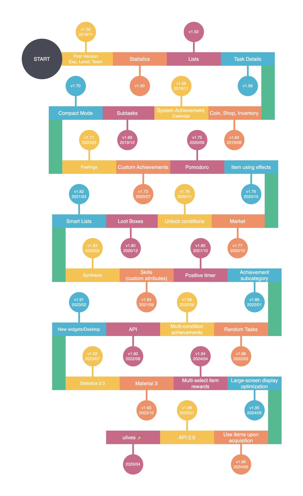

# Примечания к выпуску

## Хронология

## Примечания

| Платформа         | Версия                 | Дата обновления             |
| :---------------- |:-----------------------|:----------------------------|
| LifeUp-Android    | v1.105.3              | 2026/08/26                  |
| LifeUp-iOS        | check [feature/ulives] | 🎉Доступно альтернативное приложение |
| LifeUp-Desktop    | v1.2.0                 | 2025/01/01                  |
| LifeUp Cloud(SDK) | v2.1.1                 | 2026/06/16                  |

(Часть перевода выполнена машинным/ИИ-переводом и может быть неточной)

<!-- tabs:start -->

### **LifeUp-Android**

**v1.105.3 (2026/08/26)**

**🐛 Исправления ошибок**

1. **Исправлено аномальное завершение Задачи после локального преобразования командной задачи в задачу с таймером.**

**v1.105.2 (2026/08/24)**

**🐛 Исправления ошибок**

1. **Исправлено отображение пустого списка в выборе Задач при выбранном умном списке.**
2. **Исправлено отображение в поиске умного списка Задач, не входящих в этот список.**

**v1.105.1 (2026/08/19)**

**✨ Новые функции**

1. **Пользовательские звуковые эффекты можно отключать по сценам**: отключите один сигнал, не затрагивая остальные; предпросмотр по-прежнему воспроизводится для проверки звука.

**♻️ Оптимизация**

1. **Более понятные подсказки по резервному копированию при недоступности сервисов Google Play**: если Google Drive нельзя использовать, App объясняет причину и предлагает локальный файл, Dropbox или WebDAV.

**🐛 Исправления ошибок**

1. **Исправлено отсутствие реакции на «Отменить» на странице «Завершено» календаря.**
2. **Исправлено восстановление (или сохранение пустых) лимитов покупки/использования при редактировании Предмета.**

**v1.105.0 (2026/08/04)**

**ℹ️ Важное примечание**

1. **Минимальная поддерживаемая версия — Android 6.0**: для проактивной поддержки функций и требований поведения новых версий Android минимальная версия повышена с Android 5.0 до Android 6.0. Пользователи Android 5.x не смогут установить или обновиться до этой версии.

**✨ Новые функции**

1. **Добавлен URL Scheme API для управления Pomodoro**: можно запрашивать статус, выбирать Задачу, а также запускать, ставить на паузу, пропускать, прерывать или завершать сессии Pomodoro/счётчика времени.
2. **Улучшен механизм пользовательской сортировки Задач**: новый механизм упорядочивания сохраняет пользовательский порядок при копировании, завершении, отмене и в других пограничных случаях.

**♻️ Оптимизация**

1. **Добавлена поддержка predictive back в Android**: редакторы Задач, Магазина, Синтеза и Достижений теперь поддерживают системный жест predictive back.
2. **Улучшена инициализация входа через Facebook**: SDK инициализируется при запросе входа, улучшена обработка состояний ошибок.

**🐛 Исправления ошибок**

1. **Исправлено неожиданное перезаписывание существующих полей запросами URL Scheme на редактирование**: пропущенные поля сохраняют прежние значения; недопустимые параметры наград или связей больше не очищают существующие данные.
2. **Исправлено отображение заголовков уведомлений положительного таймера, не соответствующих выбранной Задаче в некоторых пограничных случаях.**
3. **Исправлено отсутствие обновления RGB-предпросмотра после первой вставленной шестнадцатеричной цветовой величины.**
4. **Исправлено отсутствие теней на панели выбора на страницах деталей Синтеза и Достижений.**

**v1.104.6 (2026/07/19, Google Play)**

**🐛 Исправления ошибок**

1. **Исправлено некорректное восстановление сессий Pomodoro после неожиданной остановки App или службы таймера**: действительные сессии восстанавливаются корректно, недействительное устаревшее состояние очищается.
2. **Исправлены повторные запросы после смены системного часового пояса**: после подтверждения корректировки время Задач обновляется без повторного показа того же запроса.

**v1.104.5 (2026/07/17)**

**🐛 Исправления ошибок**

1. **Исправлена проблема в релизной сборке v1.104.4, из-за которой открытие страницы Pomodoro могло вызывать сбой App.**

**v1.104.4 (2026/07/17)**

**✨ Новые функции**

1. **Предметы теперь поддерживают ограничения покупки/использования по диапазону Очков опыта Атрибутов**: задайте минимальные и максимальные условия Очков опыта, чтобы контролировать, можно ли купить, использовать или и то и другое.
2. **Новое условие Достижения — завершить Задачи суммарно N раз за день**: в отличие от существующего условия по разным Задачам, это условие учитывает каждое действительное завершение Задачи за день, включая повторные завершения одной и той же Задачи.

**♻️ Оптимизация**

1. **Перестроен процесс расчёта и восстановления Pomodoro**: состояние таймера, записи Фокуса и расчёт Наград теперь следуют единому процессу. Восстановление надёжнее при завершении процесса App, что снижает пограничные случаи вроде потери времени Фокуса. Если заметите неожиданные изменения поведения, напишите нам на lifeup@ulives.io.
2. **Более плавное редактирование количества в рецептах Синтеза**: нажмите на существующий ингредиент или результат, чтобы сразу изменить количество, без повторного выбора того же Предмета. При необходимости Предмет можно выбрать заново.
3. **Pomodoro теперь можно открыть в альбомной ориентации прямо с главной страницы**: удобнее просматривать и управлять таймером в горизонтальной раскладке.

**v1.104.3 (2026/07/09)**

**✨ Новые функции**

1. **Новое руководство «Быстрая настройка» на экране приветствия**: две новые страницы (5 и 6) после вводных карточек позволяют настроить разрешения уведомлений, способ напоминаний, стиль интерфейса (Material 2/3) и отображение в режиме нескольких окон прямо при первом запуске — с карточками в стиле аккордеона. Все параметры можно изменить позже в Настройках.

**♻️ Оптимизация**

1. **Обновлён вводный текст страницы приветствия**: страницы 1–4 переписаны, чтобы лучше передать ключевую ценность App: пользовательские Задачи → рост характеристик → система Наград → связь с миром.
2. **Диалог Синтеза переработан как нижняя панель**: материалы и результаты отображаются в вертикальной сетке — раскладка стала чище и понятнее.
3. **Более быстрая загрузка данных при переключении между списками дел, изменении порядка сортировки или переключении группировки**.

**🐛 Исправления ошибок**

1. **Исправлены дублирующиеся уведомления «Достижение разблокировано»** для некоторых системных Достижений.
2. **Исправлен неточный подсчёт для Достижения «Завершить N разных Задач за день»**: бесконечные Задачи больше не исключаются; многократное завершение одной Задачи в тот же день теперь считается как одна.
3. **Исправлено случайное смещение кнопки добавления (+) в списке Задач с правильной позиции**.
4. **Исправлено отсутствие фильтрации архивных Задач в умных списках при отключённой группировке «По списку»**.

**v1.104.2 (2026/07/03)**

**✨ Новые функции**

1. **«Дней использования» переименовано в «Дней вместе» на странице статистики**: нажмите на карточку, чтобы настроить дату начала и задать свою годовщину. Описания связанных условий Достижений также обновлены с формулировкой «вместе».
2. **В меню резервного копирования добавлен пункт «Резервная копия и отправка»**: отправляйте файлы резервных копий напрямую в другие приложения через системную панель «Поделиться».
3. **API эффекта Лутбокса v2**: новый маршрут `loot_box/v2` поддерживает точное сопоставление Предметов через `sub_amount`, добавление/удаление Предметов и независимое управление режимами количества и вероятности.

**♻️ Оптимизация**

1. **URL Scheme теперь приоритизирует точное совпадение имён** при редактировании товаров Магазина, Лутбоксов или подзадач, переходя к нечёткому совпадению только при отсутствии точного — предотвращая непреднамеренные правки.
2. **В боковой панели «FAQ» переименовано в «Notice» в английской версии**: китайская версия уже была «公告» и не изменилась.
3. **Эффекты ripple кнопок теперь соответствуют радиусу скругления везде**: анимации ripple на скруглённых элементах больше не выходят за границы углов — нажатия ощущаются аккуратнее по всему App.

**🐛 Исправления ошибок**

1. **Исправлено отсутствие автообновления счётчика помидоров на странице Pomodoro после добавления или редактирования записи.**
2. **Исправлено периодическое отсутствие всплывающего сообщения о заработанных помидорах после добавления записи Pomodoro.**
3. **Исправлен расчёт помидоров в вручную добавленных записях Pomodoro по текущей выбранной Задаче вместо Задачи, указанной в записи**: расчёт теперь использует длительность Фокуса, заданную для Задачи, фактически выбранной в записи. Если для разных Задач заданы разные длительности Фокуса, вручную записанные помидоры будут точнее.
4. **Исправлено некорректное отображение «количества завершений» для неограниченных Задач в истории**: теперь показывается порядковый номер за день (например, «N-й раз за день»).
5. **Исправлено отсутствие мотивационного текста штрафной Задачи** — теперь он появляется после выполнения штрафа.

**v1.104.1 (2026/06/17)**

**✨ Новые функции**

1. **Расширены параметры экспорта резервной копии**: при создании ручной резервной копии новая нижняя панель позволяет выбрать, включать ли медиафайлы, конфиденциальную информацию аккаунта (состояние входа, учётные данные WebDAV и т. д.) и изображения emoji — удобно для отправки «очищенной» копии. В разделе автоматического резервного копирования добавлены три соответствующих постоянных переключателя.
2. **Улучшен выбор Задачи для Pomodoro**: задачи с таймером теперь отображаются первыми в выборе Задач с текущим прогрессом Фокуса (длительность Фокуса / целевая длительность / процент). Переключатель позволяет включать или отключать приоритет задач с таймером для быстрого доступа.
3. **Переработана страница «О приложении»**: структура разделена на «Ссылки», «Обратная связь», «Сообщество» и «Разработчик» с новыми пунктами для сайта, журнала выпусков, FAQ и документации API. Пользователям упрощённого китайского добавлен пункт Tencent Channel, зарубежным пользователям — доступ к сообществу GitHub Issues/Discussions.
4. **Удаление подписчиков**: теперь можно удалять подписчиков на странице участников команды.
5. **Улучшен селектор Атрибутов в Магазине**: в диалог ввода опыта/эффекта Магазина добавлена кнопка выбора Атрибутов с быстрой фильтрацией по группе Навыков и пакетным множественным выбором — удобнее при большом числе Атрибутов.

**♻️ Оптимизация**

1. **Статистика Pomodoro теперь поддерживает переключение формата времени**: нажмите на область статистики Pomodoro на странице деталей Задачи, чтобы переключаться между «часы/минуты», «дни/часы/минуты» и «всего минут».
2. **Более понятное состояние завершения подзадач**: завершённые подзадачи теперь отображаются с зачёркиванием — различие между выполненным и ожидающим стало заметнее.
3. **Исправлена сортировка записей Pomodoro**: записи Pomodoro теперь сортируются по времени окончания по убыванию.

**🐛 Исправления ошибок**

1. **Исправлен текст кнопки снятия в банкомате на нескольких языках**: исправлено неправильное использование герундия в тексте кнопки снятия в некоторых локалях.
2. **Исправлено поведение при отправке товара Магазина без входа в аккаунт**: устранено аномальное поведение при отправке товаров Магазина без авторизации.
3. **Исправлено состояние отображения выбора в диалоге выбора цвета**: исправлена проблема, когда диалог показывал неверное выбранное состояние.

**v1.104.0 (2026/05/23)**

**✨ Новые функции**

1. **Задачи со счётчиком теперь поддерживают пропорциональный расчёт Наград в реальном времени**: полезно для Задач, которые можно выполнять несколько раз в гибкие моменты внутри цикла, например привычек несколько раз в неделю. При изменении прогресса счётчика LifeUp может начислять или откатывать опыт, монеты и Награды Предметов по текущему прогрессу, не дожидаясь финального завершения.
2. **Инструменты истории на странице деталей Задачи стали мощнее**: при выборе даты в календаре истории теперь показывается счётчик за этот день, можно добавлять, редактировать или пакетно создавать записи истории.
3. **Чувства и Предметы лучше связаны**: из деталей Предмета можно перейти к связанным Чувствам, а на странице Чувств добавлена фильтрация по товару Магазина.
4. **Теперь записывается время завершения подзадач**: LifeUp фиксирует, когда каждая подзадача завершена, подготавливая данные для будущей поддержки API и LifeUp Cloud.

**♻️ Оптимизация**

1. **Более точные фильтры видимости товаров Магазина**: помимо распроданных товаров теперь можно скрывать товары с отключённой покупкой, с лимитом покупки или временно недоступные по цене. Виджеты Магазина следуют тем же правилам.
2. **Поиск и обновление списка Задач стали стабильнее**: обычный поиск по списку может включать завершённые Задачи, видимые по настройкам; обновление повторяющихся Задач и пользовательская сортировка в списке «Все» стабильнее при большом числе Задач.
3. **Статистика истории на странице деталей Задачи теперь следует выбранной дате**: для Задач со счётчиком и неограниченных Задач используются разные уровни цвета карты вклада по количеству завершений за каждый день. Месячная, годовая, за всё время и серийная статистика под историей также рассчитывается от выбранной даты, а не всегда от сегодняшних данных.
4. **Более интуитивная алфавитная сортировка**: алфавитная сортировка во всех модулях теперь следует естественному числовому порядку — имена с числами упорядочиваются по числовому значению, а не посимвольно.
5. **Улучшено поведение ввода в настройках Магазина**: активное поле прокручивается над экранной клавиатурой.
6. **Более надёжная обработка системной тёмной темы**: исправлены гонки состояний между следованием системной теме и ручным переключением ночного режима.
7. **Расширена поддержка URL Scheme API**: добавление/редактирование Задачи теперь поддерживает семантику `no_deadline`, API Задач со счётчиком — флаг расчёта в реальном времени.
8. **Более понятные записи истории процентов**: записи процентов банкомата и кредита теперь показывают основную сумму и дни начисления — проще проверить источник процентов.

**🐛 Исправления ошибок**

1. **Исправлена статистика Достижений на странице «Моя страница»**: при скрытых системных Достижениях счётчики Достижений следуют тому же правилу видимости.
2. **Исправлена формулировка записей истории**: записи об отказе больше не показываются с формулировкой штрафа за просрочку.
3. **Исправлена обработка длинного текста в URL Scheme API**: длинные описания Навыков и Достижений больше не обрезаются слишком рано.

**v1.103.6 (2026/05/10)**

**🐛 Исправления ошибок**

1. **Исправлено отсутствие сброса подсказки интервала длинного перерыва к начальному состоянию сессии Фокуса после нажатия «Сдаться».**
2. **Исправлена проблема, когда дополнительный таймер Фокуса мог оставаться видимым и продолжать отсчёт после нажатия «Сдаться».**

**v1.103.5 (2026/05/10)**

**🐛 Исправления ошибок**

1. **Исправлено запаздывание обновления подсказки длинного перерыва Pomodoro после естественного завершения рабочей сессии.**
2. **Исправлена проблема, когда таймер Pomodoro мог показывать старый интервал длинного перерыва на 2 сессии до открытия настроек Pomodoro вместо значения по умолчанию — 4 сессии.**

**v1.103.4 (2026/05/05)**

**🐛 Исправления ошибок**

1. **Исправлена проблема, из-за которой Задачи могли исчезать при аномальном прерывании в замороженном состоянии в некоторых пограничных сценариях.**

**v1.103.3 (2026/05/05)**

**ℹ️ Примечание к выпуску**

1. **Эта версия была пропущена и не выпускалась публично.**

**v1.103.2 (2026/04/30)**

**🐛 Исправления ошибок**

1. **Исправлена проблема совместимости, из-за которой поля ввода могли не появляться при редактировании ограничений покупки или использования Предмета на некоторых языках или на экранах меньшего размера.**
2. **Исправлена проблема, когда использование Предмета могло ошибочно вызывать диалог штрафа.**

**v1.103.1 (2026/04/25)**

**🐛 Исправления ошибок**

1. **Исправлено аномальное поведение, когда эффект использования Предмета изменяет его собственное количество**
2. **Исправлены некоторые сбои и проблемы с задержками, зафиксированные в продакшене**
3. **Исправлено некорректное заполнение количества при редактировании эффекта «Изменить количество Предмета»**

**v1.103.0 (2026/04/12)**

**✨ Новые функции**

1. **Атрибуты теперь поддерживают подкатегории и быстрое перемещение**: можно группировать Атрибуты нагляднее и быстрее перемещать Атрибут в целевую группу.
2. **Более плавное взаимодействие при выборе Атрибутов**: редактирование Задач, потоки, связанные с Наградами, и другие селекторы Атрибутов удобнее при большом числе Атрибутов.
3. **Предметы теперь поддерживают ограничения покупки/использования**: лимиты могут применяться к покупке, использованию или обоим действиям с более богатыми условиями — время, разблокированные Достижения, завершённые Задачи, количество Предметов в Инвентаре, диапазоны Уровней Атрибутов.
4. **В Достижениях добавлено больше встроенных вариантов сортировки**: помимо пользовательского порядка списки Достижений поддерживают сортировку по алфавиту, времени завершения и времени создания.
5. **Достижения поддерживают быстрое перемещение в подкатегории**: эффективнее перемещать одно или несколько Достижений в целевую подкатегорию.
6. **В обработку просрочки добавлен пункт справки**: в диалог просрочки добавлена справка, а при переключении просроченной Задачи обратно в «завершено» изменения Наград отображаются нагляднее.

**♻️ Оптимизация**

1. **Групповое отображение Атрибутов стало понятнее**: страница статуса и диалоги описания Атрибутов представляют сгруппированные Атрибуты структурированнее.
2. **Взаимодействия с Атрибутами стали согласованнее**: групповое отображение и поведение выбора унифицированы в диалогах Атрибутов и связанных потоках редактирования.
3. **Редактирование ограничений Предметов стало понятнее**: более богатые типы ограничений проще настраивать и просматривать.
4. **Отрисовка строки состояния и верхней панели стабильнее на нескольких страницах**: верхние области на страницах вроде Магазина, Мира, Поиска, Статуса, Достижений, «Моя страница» и WebDAV ведут себя согласованнее при прокрутке, в тёмном режиме и с Material You.
5. **Раскладка Атрибутов на странице статуса лучше обрабатывает длинный текст**: длинные имена Атрибутов и метки Уровней теперь помещаются надёжнее, в том числе на узких экранах или при крупном тексте.

**🐛 Исправления ошибок**

1. **Исправлена проблема вариации gid при копировании**: исправлена проблема, когда копии Задач, созданные из разовых или бесконечных просроченных Задач, имели несогласованные gid.
2. **Исправлен неработающий флажок «Случайно» при выборе Атрибутов**: исправлена проблема, когда в некоторых полях выбора Атрибутов отображался неработающий флажок «Случайно».
3. **Исправлены проблемы позиционирования баннера Наград**: исправлена проблема, когда баннеры Наград неправильно позиционировались, перекрывались или «прыгали» в некоторых сценариях (особенно при завершении Задачи).
4. **Исправлен неточный предпросмотр/данные анимации Наград при просрочке в некоторых случаях**: при переключении просроченной Задачи обратно в «завершено» изменения Очков опыта, монет и Предметов отображаются точнее, без путаницы в значениях.
5. **Исправлены перенос/смещение раскладки Уровней на странице статуса в некоторых случаях**: раскладка стабильнее при длинных именах Атрибутов или длинных метках Уровней.
6. **Исправлено переключение страниц, когда в списке Синтеза мало элементов**: теперь можно надёжнее проводить горизонтально от пустых областей при коротком содержимом списка.
7. **Исправлен сбой при получении Наград Достижения в особых случаях**: исправлен потенциальный сбой при получении Наград Достижения в некоторых пограничных случаях.

**v1.102.11 (2026/04/02)**

**🐛 Исправления ошибок**

1. **Исправлены периодические сбои расчёта и аномалии обновления Задач со счётчиком на главной странице.**

**v1.102.10 (2026/03/24)**

**🐛 Исправления ошибок**

1. **Исправлена проблема, когда скрытые списки формул Синтеза нельзя было долго нажимать для редактирования или удаления формул.**

**v1.102.9 (2026/03/23)**

**♻️ Оптимизация**

1. **Обновлено правило отключения нижней навигации**: на уровне взаимодействия пользователям больше не разрешено отключать все модули нижней навигации.

**🐛 Исправления ошибок**

1. **Исправлен сбой при запуске**: исправлена проблема, когда App мог падать при запуске после отключения всех модулей нижней навигации.

**v1.102.8 (2026/03/23)**

**✨ Новые функции**

1. **Сброс раскладки модулей по умолчанию**: на страницу конфигурации модулей добавлена кнопка «Восстановить раскладку по умолчанию».
2. **Новое широковещательное событие формулы Синтеза**: добавлено широковещательное событие API `app.lifeup.synthesis.complete`, отправляемое при успешном завершении формулы Синтеза.
3. **Поиск в «Мире» поддерживает фильтрацию по тегам источника**: раздел «Мир» теперь может искать по тегам источника, например фильтровать элементы API в Showcase перед поиском.

**♻️ Оптимизация**

1. **Улучшена типографика всплывающего окна разблокировки Достижения**: улучшена отрисовка шрифтов и снижены проблемы раскладки при крупных системных размерах шрифта.
2. **Улучшена логика скрытия модулей**: уточнено поведение скрытия, чтобы Достижения, связанные с модулем «Мир», корректно показывались или скрывались.
3. **Скорректировано поведение назначения случайных Задач по умолчанию**: вновь созданные случайные Задачи больше не назначаются автоматически списку по умолчанию — избегается незаметное назначение.

**🐛 Исправления ошибок**

1. **Исправлен редкий сбой при обновлении списка Задач**.
2. **Исправлена проблема заголовка в API Чувств**: исправлена проблема, когда API не мог корректно предоставить заголовок Чувств, что также могло влиять на заголовки Предметов.
3. **Исправлены проблемы альбомной раскладки Pomodoro**.
4. **Исправлен тип метки времени окончания в API истории Задач**.
5. **Добавлены отсутствующие поля ответа API**: прогресс Задачи, статус завершения, условия окончания повторения и связанные поля теперь возвращаются корректно.
6. **Исправлены устаревшие значения на странице деталей Задачи со счётчиком**: значения обновляются сразу после изменения Задачи со счётчиком.
7. **Исправлена проблема, которая могла вызывать аномальную длительность записей Pomodoro**.
8. **Исправлено отсутствие немедленной перестройки главной страницы после перехода в офлайн-режим**: ранее раздел «Мир» мог неожиданно оставаться видимым.
9. **Исправлена проблема загрузки на странице случайных Задач**: в некоторых случаях страница могла зависать в состоянии загрузки.

**v1.102.2 - v1.102.7 (2026/02/03)**

**♻️ Оптимизация**

1. **Руководство по добавлению виджетов + улучшения текста**: добавлены инструкции по добавлению виджетов и уточнены связанные тексты и подсказки.

**🐛 Исправления ошибок**

1. **Исправлена блокировка Pomodoro при аномальных данных**: страница Pomodoro больше не зависает/замирает при наличии аномальных данных.
2. **Исправлена рассинхронизация дополнительного таймера после выключения экрана**: таймер «добавить время» остаётся синхронизированным после выключения экрана или сна устройства.
3. **Исправлен выбор списка по умолчанию для новых Задач**: улучшена обработка при создании Задач из умных списков, особенно если список по умолчанию архивирован (теперь корректный откат).

**v1.102.1 (2026/01/27)**

**✨ Новые функции**

1. **Масштабирование предпросмотра изображений**: восстановлена функция масштабирования изображений, потерянная при рефакторинге страниц — удобнее просматривать детали изображений.

**🐛 Исправления ошибок**

1. **Оптимизация памяти WebDAV**: исправлена проблема, когда загрузка через WebDAV могла потреблять чрезмерно много памяти и вызывать сбои или проблемы с производительностью.
2. **Обновление изображений на странице «Размышления»**: исправлена ошибка, когда отредактированные изображения на странице «Размышления» не обновлялись сразу.

**v1.102.0 (2026/01/25, replaced by v1.102.1 during rolling release)**

**✨ Новые функции**

1. **Менеджер звуков**: импорт, предпросмотр, удаление и повторное использование звуковых эффектов, а также использование их как эффектов использования Предметов.
2. **Магазин: новые эффекты использования Предметов**: добавлены случайные Очки опыта, изменение запасов, воспроизведение звука; улучшен процесс настройки.
3. **Задачи с таймером**: новый тип Задач с ожидаемой длительностью Фокуса; завершите Задачу после достижения цели таймера.
4. **Параметры начала недели**: выбор понедельника / субботы / воскресенья — календарь и статистика следуют выбору.
5. **Пропуск обучения**: возможность пропустить руководство при первом запуске.
6. **Ввод emoji для значков**: введите emoji (включая составные) для быстрого создания значка.
7. **Календарь: открытие деталей будущих повторяющихся Задач**: нажатие на повторяющуюся Задачу на будущую дату теперь корректно открывает её детали.
8. **Для опытных пользователей: расширения API**: URL Scheme API добавляет/расширяет CRUD шаблонов Задач, условия окончания повторения, навигацию фильтра Синтеза и многое другое.

**♻️ Оптимизация**

1. **Улучшения производительности и плавности**: оптимизированы доступ к данным и стратегии индексирования — списки Задач, история Инвентаря и статистика плавнее при больших объёмах данных.
2. **Лучший UX настройки эффектов Предметов**: улучшены взаимодействия выбора и отображения эффектов, уточнены диалоги и визуал значков.
3. **Улучшения локализации**: заполнены отсутствующие переводы на нескольких языках.

**🐛 Исправления ошибок**

1. **Исправлен сброс эффекта обратного отсчёта при редактировании**: исправлена проблема, когда подтверждение отредактированного эффекта обратного отсчёта сбрасывало значение на 1.
2. **Исправлено отсутствие автоматического использования Наград Предметов командных Задач**: исправлена проблема, когда автоматическое использование не срабатывало после получения Наград Предметов для командных Задач.
3. **Исправлено отсутствие запроса «записать Чувства» после Лутбокса / Синтеза**: исправлена проблема, когда диалог Чувств мог не появляться после открытия Лутбоксов или простого Синтеза, если у Предмета есть эффект «записать Чувства».
4. **Исправлено отсутствие диалогов расчёта при ручном завершении на странице Pomodoro**: исправлена проблема, когда ручное завершение Задачи на странице Pomodoro могло пропускать диалоги расчёта Наград/Чувств; восстановлено долгое нажатие для завершения по заголовку Задачи.
5. **Исправлен неработающий фильтр сворачивания виджета**: исправлен фильтр виджета умного списка «Сворачивать Задачи, которые ещё не начались».
6. **Исправлен редкий сбой**: исправлен сбой из-за сохранения слишком большого объёма состояния в некоторых ситуациях.
7. **Исправлена навигация из календаря к деталям будущих Задач**: исправлены сбои при открытии деталей будущих повторяющихся Задач из календаря.
8. **Исправлены проблемы с повторяющимися Задачами Эббингауза**: исправлены аномальные этапы и непреднамеренная повторная генерация в редких случаях; добавлена защита верхней границы.

**v1.101.8 (2026/01/12)**

**🐛 Исправления ошибок**

1. **Исправлена настройка условий окончания повторения**: устранена проблема, когда нельзя было задать условие окончания для частоты «Каждые 2 дня» или пользовательской «Каждые N дней».
2. **Исправлена аномальная длительность таймера Pomodoro**: исправлена проблема, когда таймер мог работать значительно дольше ожидаемого из-за системного сна или заморозки процесса при неправильно отключённой оптимизации батареи.

**v1.101.7 (2026/01/11)**

**🐛 Исправления ошибок**

1. **Исправлена проблема, которая могла аномально сокращать длительность таймера Pomodoro**.

**v1.101.6 (2026/01/10)**

**🐛 Исправления ошибок**

1. **Исправлены аномалии, связанные с переключением системной тёмной темы**.

**v1.101.5 (2026/01/08)**

**♻️ Оптимизация**

1. **Оптимизировано переключение системной тёмной темы**: исправлены проблемы, когда App мог не переключать тему автоматически вместе с системными настройками.
2. **Оптимизирован выбор Атрибутов для Наград**: улучшена обработка случаев, когда в «Наградах за постоянство», «Пошаговых Наградах» и «Наградах за лайки» не выбран Атрибут. Поддерживается снятие выбора Атрибутов; исправлены проблемы с некорректным начислением Очков опыта.
3. **Оптимизация конфигурации производительности**: оптимизированы внутренние конфигурации для потенциального улучшения производительности App.

**🐛 Исправления ошибок**

1. **Исправлены запросы статистики и отображение диаграмм**: скорректированы условия запроса статистики времени завершения Задач; устранены проблемы с неточными данными диаграмм.
2. **Исправлено взаимодействие в диалоге настроек виджета**: исправлена ошибка, когда в диалоге настроек фильтра Задач виджета отсутствовала кнопка «Подтвердить».
3. **Исправлена синхронизация количества Задач**: исправлена проблема, когда количество Задач на главном экране не обновлялось корректно после изменения на странице деталей Задачи.
4. **Исправлена обработка «Использование Предмета» в API Чувств**: исправлена некорректная обработка типов «Использование Предмета» в API Чувств.
5. **Исправлена навигация из календаря к деталям**: устранено несколько проблем при переходе из календаря к деталям Задачи.

**v1.101.4 (2025/12/30)**

**♻️ Оптимизация**

1. **Оптимизирована логика обнаружения обновлений для участников**: участникам предлагается переключиться на «канал стабильной версии для участников», чтобы получать наиболее стабильный функциональный опыт.
2. **Сокращено число ненужных сетевых запросов**: дополнительная экономия трафика пользователей и снижение нагрузки на сервер.

**🐛 Исправления ошибок**

1. **Исправлено обновление прогресса Достижений (приоритет)**: устранена ошибка, из‑за которой прогресс Достижений не срабатывал корректно после завершения записей Pomodoro.

**v1.101.3 (2025/12/14)**

**🐛 Исправления ошибок**

1. **Исправлено, что опция «Срок сегодня» некорректно игнорировала смещение срока на следующий день.**

**v1.101.2 (2025/12/13)**

**🐛 Исправления ошибок**

1. **Исправлен сброс состояния поиска при возврате на страницы Магазина, Инвентаря или Задач.**
2. **Исправлен сбой, связанный с лимитами `AlarmManager`** (около 500 одновременных будильников).
3. **Исправлены сбои, связанные с динамическими цветами, диалогами часового пояса и всплывающими меню.**
4. **Оптимизирована отправка отчётов о сбоях**: распространённые сетевые ошибки игнорируются.

**v1.101.1 (2025/12/01)**

**🐛 Исправления ошибок**

1. **Исправлены потенциальные сбои из‑за ошибок форматирования переводов.**

**v1.101.0 (2025/11/29)**

**✨ Новые функции**

1. **Фильтр Предметов в Синтезе**: фильтрация Синтеза по Предметам для более быстрого поиска и управления.
2. **Детали Предмета → рецепт Синтеза**: просмотр рецепта Синтеза Предмета прямо на странице деталей Предмета.
3. **Магазин → вход в Синтез**: если Предмет можно использовать в Синтезе, рядом с кнопкой покупки появляется кнопка Синтеза.
4. **Фильтры истории Инвентаря**: добавлены фильтры по дате, Предметам и описанию.
5. **Диалог «Что нового»**: диалог с основными нововведениями версии при первом запуске после обновления.
6. **Время Фокуса Pomodoro для каждой Задачи**: переработана логика Pomodoro; поддерживается пользовательская длительность Фокуса для каждой Задачи.
7. **Эффект использования Предмета: «Записать Чувства после использования»**; страница Чувств также поддерживает фильтрацию по Предмету.
8. **Широковещательные события жизненного цикла Pomodoro (API)**: добавлены события широковещания жизненного цикла.
9. **Простой query API**: теперь поддерживает получение деталей одной Задачи.
10. **Автоинкремент Задач со счётчиком**: поддерживается автоматическое увеличение.
11. **Окончание повторения по дате**: Задачи теперь поддерживают завершение повторения в указанную дату.
12. **Улучшены настройки виджетов рабочего стола**: улучшена встроенная страница настроек виджетов — каждый поддерживаемый виджет можно предпросмотреть и, если система позволяет, быстро добавить на главный экран.

**♻️ Оптимизация**

1. **UX управления списками + тёмная тема**: доработаны взаимодействия и тёмная тема; список «Все» теперь показывает отключённое состояние удаления вместо недоступного действия.
2. **Страница настроек Магазина**: вынесена на отдельную страницу и доступна из основных настроек.
3. **Фон Задачи по умолчанию**: уточнена формулировка в диалоге справки.
4. **Индикатор «Быстрое завершение»**: при включении страница Задач показывает индикатор состояния «Быстрое завершение» вверху.
5. **Запоминание сворачивания по спискам**: состояние сворачивания/разворачивания сохраняется для каждого списка, чтобы «Все» не влиял на дневной список.
6. **Диалог просроченных Задач (тёмная тема)**: улучшены стили тёмной темы при обработке просроченных Задач.
7. **Логика кнопки фильтра Чувств**: отображается только для типов, поддерживающих фильтрацию (Предметы/Задачи).
8. **Сценарий «только локальные Задачи» в команде**: улучшено взаимодействие при сборе только локальных Задач.
9. **Доработан UI страницы Синтеза**: улучшены раскладка и визуальная обратная связь на странице Синтеза.
10. **Доработаны взаимодействия с Предметами**: упрощены связанные с Предметами действия для более отзывчивого интерфейса.

**🐛 Исправления ошибок**

1. **Исправлено некорректное отображение верхней панели фильтров после фильтрации на странице истории.**
2. **Исправлено, что негативные Задачи в некоторых случаях могли рассчитывать штраф с неверным коэффициентом 1×.**
3. **Исправлено, что выбор Задачи в таймере Pomodoro в определённых условиях мог терять опцию «Отменить выбор».**
4. **Исправлено несколько проблем с следованием системной тёмной теме.**
5. **Исправлено отсутствие всплывающего окна Награды, когда виджет завершал Задачу со счётчиком.**

**v1.100.6 (2025/11/08)**

**🐛 Исправления ошибок**

1. **Исправлен сбой при выборе Предметов, если фокус ввода переполнялся из‑за внешних клавиатур/геймпадов**; эффективность исправления проверяется.
2. **Исправлен диалог управления часовым поясом**: теперь можно прокрутить до нижнего содержимого и кнопок.

**v1.100.5 (2025/09/28)**

**✨ Новые функции**

1. **Пользовательские звуковые эффекты теперь поддерживают выбор встроенных звуков**: доступ к библиотеке встроенных аудиоэффектов для более удобной настройки.
2. **Расширена фильтрация Синтеза**: на странице Синтеза добавлен фильтр «Показывать только синтезируемые» для лучшего управления Предметами.
3. **Поддержка emoji в API**: API Предметов, Атрибутов и Достижений теперь поддерживают прямой ввод emoji.
4. **Улучшено создание команд**: при создании команд можно выбирать целевые списки.
5. **Копирование командных Задач**: поддерживается копирование командных Задач как локальных без членства в команде.
6. **Расширение API Задач**: добавлена поддержка параметра состояния «светлый шрифт заметки» в API, связанных с Задачами.

**♻️ Оптимизация**

1. **Улучшена логика «Отменить изменения»**: оптимизирован диалог подтверждения при редактировании Предметов, Синтеза, Достижений и списков Достижений — появляется только при реальных изменениях.
2. **Условия разблокировки Достижений**: условия разблокировки теперь по умолчанию развёрнуты для лучшей видимости.
3. **Повышена производительность Синтеза**: оптимизирована производительность запросов на странице деталей Синтеза.
4. **Стабильность Toast API**: улучшены стабильность и надёжность вызовов Toast API.
5. **Завершение командных Задач**: улучшен процесс завершения с лучшей обработкой ошибок и подсказками пользователю.
6. **Перетаскивание на странице Синтеза**: улучена прокрутка к краю при пользовательской сортировке Предметов.
7. **Сбор командных Задач**: улучшен сценарий после сбора командных Задач с переходом к соответствующим спискам.
8. **Напоминания календаря**: улучшена логика напоминаний календаря для большей надёжности.

**🐛 Исправления ошибок**

1. **Исправлено, что пользовательские фоны старых версий некорректно использовали глобальное значение «светлый шрифт заметки» по умолчанию.**
2. **Исправлена адаптация строки состояния на странице пользовательских звуковых эффектов.**
3. **Исправлено возможное перекрытие описания Достижения кнопками разблокировки.**
4. **Исправлены проблемы прокрутки при сортировке перетаскиванием на странице деталей Синтеза.**
5. **Исправлено периодическое исчезновение кнопки поиска, когда модуль «Мир» размещён в боковой панели.**
6. **Попытка исправить аномалии следования системному ночному режиму.**
7. **Попытка исправить проблему, когда последовательное завершение командных Задач могло приводить к дублированию Задач.**
8. **Исправлен сбой функции Чувств при разблокировке Достижений.**

**v1.100.4 (2025/09/07)**

**♻️ Оптимизация**

1. **Улучшена отправка отчётов о сбоях**: расширены сбор и отправка данных о сбоях для лучшего анализа и отладки.

**🐛 Исправления ошибок**

1. **Исправлен сбой, вызванный Facebook SDK.**

**v1.100.3 (2025/09/06)**

**🐛 Исправления ошибок**

1. **Исправлено, что поиск не работал при выборе Предметов.**

**v1.100.2 (2025/09/05)**

**🐛 Исправления ошибок**

1. **Исправлено, что в некоторых ситуациях при создании или редактировании Предметов в Магазине нельзя было выбрать список по умолчанию.**

**v1.100.1 (2025/09/03)**

**✨ Новые функции**

1. **Цвет шрифта для пользовательского фона**: добавлена поддержка пользовательского цвета шрифта заметки для дополнительной персонализации интерфейса.
2. **Расширены эффекты использования Предметов**: эффекты случайного уменьшения монет теперь также поддерживают функцию «Ограничить использование».

**♻️ Оптимизация**

1. **Оптимизированы напоминания календаря**: добавлены опции настройки длительности вставляемых событий напоминаний календаря.
2. **Оптимизировано редактирование Задач**: улучшена логика всплывающего окна «Отменить изменения» — больше не показывается при выходе без правок.
3. **Обновлена многоязычная локализация**: обновлены локализованные тексты на нескольких языках.

**🐛 Исправления ошибок**

1. **Исправлено, что страница конфигурации совместимости и страница настроек напоминаний не адаптировались к тёмной теме.**
2. **Попытка исправить сбои, связанные с всплывающими окнами и фокусом метода ввода на нескольких страницах**, для повышения стабильности App.
3. **Исправлено, что при редактировании Достижений нельзя было изменить автоматическое использование Предметов.**

**v1.100.0-alpha (2025/07/29)**

**✨ Новые функции**

1. **Pomodoro, Очки опыта, история Инвентаря, детали монет**: добавлен переход на соответствующую страницу статистики одним нажатием.
2. **Поддержка более гибких настроек событий напоминаний** (за X минут до начала или срока).
3. **Поддержка скрытия списков Синтеза.**
4. **Поддержка изменения Атрибутов для пошаговых и постоянных Наград.**
5. **Настройка функциональных модулей боковой панели** (например, размещение Магазина и сообщества в боковой панели или скрытие ненужных модулей).
6. **Добавлена экспериментальная опция «Режим низких ограничений»**: ослабляет числовые лимиты в App (Очки опыта, разряды монет, число Атрибутов, доступных для Задач и т. д.).
7. **Оптимизированы UI и логика взаимодействия всплывающего окна обработки просроченных Задач.**
8. **Добавлено описание опций автоматического использования Предметов.**
9. **Поддержка дополнительных повторяемых условий разблокировки**:
   - Ежедневное получение дерева Pomodoro.
   - Ежедневное время Фокуса Pomodoro.
   - Ежедневное завершение N разных Задач.
   - Ежедневное использование определённого Предмета N раз.
   - Ежедневное завершение определённой Задачи N раз.
10. **Опции умных списков перенесены во всплывающее окно управления списками** (кнопка списка вверху страницы списка Задач).
11. **Добавлена опция «Быстрое завершение»**: при включении завершение Задач пропускает все всплывающие окна.
12. **Расширена область применения пользовательских иконок монет**; теперь поддерживаются монохромные иконки (например, иконки монет вверху Магазина).
13. **На странице деталей Предмета отображается список, к которому он относится** — проще подтвердить владение Предметом из Инвентаря.
14. **При редактировании рецептов Синтеза**: поддерживаются сортировка перетаскиванием и редактирование Предметов по нажатию.
15. **Добавлен API для прямого редактирования количества монет.**
16. **Query API поддерживает запрос информации Pomodoro** (количество Pomodoro).
17. **Ослаблены числовые лимиты некоторых API** (API по умолчанию — с низкими ограничениями).
18. **Переработан и оптимизирован механизм расчёта прогресса условий Достижений**: улучшена производительность расчёта и скорость обновления прогресса.

**♻️ Оптимизация**

1. **Оптимизированы дни постоянства на странице «Моё»**; поддерживается ручной пересчёт по нажатию.
2. **Исправлены проблемы RTL-раскладки на странице календаря**; начало недели установлено на **«понедельник»** (ранее — воскресенье).
3. **Групповое отображение в умных списках Задач и Магазина** поддерживает сворачивание/разворачивание по меткам групп.
4. **При разворачивании завершённых, не начатых и замороженных Задач внизу списка** соответствующие метки также появляются вверху.
5. **Иконки Предметов, импортированные из модуля «Мир», сохраняются локально** — избегается невозможность загрузки офлайн.
6. **Во всплывающем окне выбора списка теперь отображаются умные списки.**
7. **Оптимизирована логика списка по умолчанию для командных и случайных Задач**: если список по умолчанию архивирован, по умолчанию выбирается первый список.
8. **Оптимизирована логика обработки просроченных Задач со счётчиком**: при достижении счётчика по умолчанию статус **«Завершено»**.

**🐛 Исправления ошибок**

1. **Исправлено, что состояние флажка «автоматически использовать Предмет» не восстанавливалось корректно при редактировании Достижений.**
2. **Исправлен подсчёт на верхней карточке умного списка**: не исключались Задачи из архивированных списков.
3. **Исправлено глобальное запоминание состояния флажка «автоматически использовать» при покупке Предмета** — теперь независимо для каждого Предмета.
4. **Исправлено, что API разблокировки Достижений в некоторых ситуациях не обновлял прогресс корректно.**
5. **Исправлена логика списка по умолчанию для командных и случайных Задач.**
6. **Обновлены технические зависимости**; целевая версия API повышена до 35 (Android 15).

**Исправления Alpha/Beta-патчей**

1. **Удалены ненужные зависимости и добавлена адаптация к размеру страницы 16K** — **уменьшен размер пакета App**.
2. **Исправлена логика автоматического использования Предметов**: для URL-Предметов используется только 1 Предмет, остальные сохраняются в Инвентаре. (Ранее действовал только 1, но он не сохранялся в Инвентаре — эффект использования терялся)
3. **Исправлено, что повторяемые условия Достижений не могли пересчитать прогресс.**
4. **Исправлено, что файлы резервных копий не включали шаблоны Задач.**
5. **Исправлено, что большинство emoji после восстановления из резервной копии генерировали аномальные иконки.**
6. **Обновлена ссылка на канал QQ для обратной связи в App.**
7. **Добавлена функция широковещания публикации Чувств.**
8. **Переработан интерфейс конфигурации совместимости и настроек метода напоминаний.**
9. **Добавлена опция «Ограничить использование Предмета» для эффектов уменьшения монет.**
10. **Обновления API**: API Задач поддерживает параметры мотивационных сообщений.
11. **Исправлен аномальный верхний отступ на странице настроек по умолчанию для новых Предметов.**

**v1.99.5 (2025/07/29)**

**🐛 Исправления ошибок**

1. **Попытка исправить проблему, когда пользовательские фоны в некоторых ситуациях отображались некорректно.**

**v1.99.3 (2025/06/30)**

**✨ Новые функции**

1. **API подзадач поддерживает относительную корректировку** (`set_type`).
2. **Поддерживается автоматическая очистка просроченных событий напоминаний календаря.**
3. **Оптимизирована логика обработки архивированных списков**:

* Умные списки больше не отображают архивированные Задачи.
- Задачи в архивированных списках по умолчанию не продвигаются автоматически (аналогично замороженному статусу).

**♻️ Оптимизация**

1. **При непрерывном добавлении Задач/Достижений**: автоматическая прокрутка вверх и фокус на поле ввода.
2. **Оптимизирована формулировка, связанная с завершением негативных Задач.**
3. **Оптимизирована логика отображения всплывающего окна «Отменить изменения» на странице редактирования Задачи.**
4. **Оптимизирована длительность событий напоминаний календаря**, чтобы избежать потенциальных проблем на некоторых устройствах.

**🐛 Исправления ошибок**

1. **Исправлено, что виджеты не поддерживали отображение пользовательских иконок монет.**
2. **Исправлено, что страница деталей Задачи не поддерживала отображение Наград из нескольких Предметов.**
3. **Исправлено, что в некоторых сценариях (например, виджеты) могли не соблюдаться правила сортировки списков.**

**v1.99.1-rc02 (2025/06/20)**

**✨ Новые функции**

1. **Поддерживаются повторяемые условия разблокировки Достижений «Завершить N Задач подряд».**
2. **API создания/редактирования Задач теперь поддерживает тип Задачи и относительную корректировку монет/Очков опыта.**
3. **API Достижений поддерживает установку монет и относительную корректировку монет/Очков опыта.**
4. **API поддерживают переход к определённым спискам Достижений и Синтеза.**

**♻️ Оптимизация**

1. **Оптимизирован порядок записей истории Предметов Инвентаря при открытии Лутбоксов.**
2. **Опции фильтра на странице статистики теперь запоминаются.**
3. **Опции страницы фильтра поддерживают операцию «Выбрать все».**
4. **Усилена логика дедупликации при создании Задач.**
5. **Дополнены операции на странице деталей Задачи**: заморозка, корректировка срока.
6. **Поддерживается отображение ID списка Синтеза.**

**🐛 Исправления ошибок**

1. **Исправлено, что предыдущий API Задач не мог создавать/редактировать Задачи Эббингауза.**
2. **Исправлено, что отображение списка Задач и имя списка в верхней панели могли не совпадать при запуске App из виджета списка Задач.**
3. **Исправлено, что текст в карточке простого режима мог отображаться не полностью.**

**v1.99.0 (2025/05/17)**

**✨ Новые функции**

1. **Добавлена поддержка повторяемых типов Достижений**
2. **Добавлены действия напоминаний в уведомлениях**: завершить Задачу, напомнить позже
3. **Пользовательский фон**: добавлена опция улучшения читаемости текста
4. **Добавлена поддержка настройки стиля обрезки иконки Достижения**
5. **Добавлена поддержка настройки опорных дат для ежемесячных/ежегодных Задач**

**♻️ Оптимизация**

1. **Оптимизирована логика расчёта прогресса разблокировки Достижений**
2. **Улучшены взаимодействия при выборе Предметов**
3. **Скорректировано положение кнопки разрешения напоминаний на экранах создания/редактирования Задач**
4. **Оптимизирована логика хранения относительного времени напоминаний**
5. **Разрешена заморозка не повторяющихся и бесконечно повторяющихся Задач**

**🐛 Исправления ошибок**

> Некоторые исправления будут постепенно распространяться в [стабильную версию для участников] и [официальную версию]

1. **Исправлено, что редактирование Достижений могло случайно сбросить прогресс условий разблокировки API**
2. **Исправлено, что Предметы с запасом 0 всё ещё можно было купить через API**
3. **Исправлено, что на странице нового Предмета в некоторых условиях можно было выбрать удалённые списки**
4. **Исправлено, что шаблоны Задач не сохраняли статус автоматически рассчитываемой монетной Награды**
5. **Удалены анимации перехода на странице деталей**, чтобы исправить сбои долгого нажатия
6. **Исправлено, что замороженные Задачи отображались в выборе Задач Pomodoro**
7. **Исправлено, что редактирование Задач некоторыми способами некорректно сбрасывало статус на «не завершено»**
8. **Исправлены проблемы взаимодействия с всплывающими окнами Чувств**

**v1.98.5 (2025/05/01)**

**✨ Новые функции**

1. **Добавлена поддержка опорных дат** (например, конец месяца) для ежемесячных и ежегодных повторяющихся Задач.
2. **Улучшено множественное выделение Предметов**: по умолчанию режим множественного выбора; при повторном выборе восстанавливается предыдущее выделение.

**♻️ Оптимизация**

1. **Добавлена поддержка запоминания настроек относительного времени напоминаний.**
2. **Небольшие оптимизации UI.**

**🐛 Исправления ошибок**

1. **Исправлено, что Предметы всё ещё можно было купить через API при недостаточном запасе в Магазине.**
2. **Исправлено, что шаблоны Задач не восстанавливали автоматические монетные Награды.**
3. **Исправлены периодические сбои долгого нажатия на заголовки Задач.**
4. **Исправлено, что новые Предметы в некоторых условиях могли выбирать удалённые списки.**
5. **Исправлено отсутствие кнопки очистки в поле времени напоминания при редактировании Задач.**

**v1.98.4 (2025/04/14)**

**🐛 Исправления ошибок**

1. **Исправлено, что индикатор прогресса мог не обновляться своевременно после завершения подзадач на странице деталей Задачи.**
2. **Исправлено, что редактирование завершённой Задачи могло некорректно возвращать статус «не завершено».**
3. **Исправлено, что изменение статуса просроченных Задач могло некорректно влиять на целевое количество завершений.**
4. **Исправлено, что логика выбора Задач Pomodoro некорректно отображала замороженные Задачи и архивированные списки.**

**v1.98.3 (2025/02/16)**

**♻️ Оптимизация**

1. **Добавлено предупреждение** при использовании метода уведомлений по умолчанию без разрешения «точные будильники».

**🐛 Исправления ошибок**

1. **Исправлено, что API «завершить Задачу» не работало, когда поле UI было true.**
2. **Исправлено, что покупка и использование определённого количества Предметов могли работать некорректно** (например, 10).
3. **Исправлено, что страница Чувств в некоторых сценариях могла бесконечно показывать «загрузка».**

**v1.98.2 (2025/02/06)**

**🐛 Исправления ошибок**

1. **Исправлено, что при использовании Предмета, уменьшающего Очки опыта, могло отображаться недостаточно Очков опыта, хотя их было достаточно.**
2. **Исправлено, что редактирование скопированного Предмета могло приводить к аномальным дублирующим эффектам использования.**
3. **Исправлено, что вызов API «adjust item» мог приводить к аномальным лимитам покупки.**
4. **Исправлено, что изменение некоторых записей Pomodoro могло аномально уменьшать количество Pomodoro.**

**v1.98.1 (2025/01/14)**

**🐛 Исправления ошибок**

1. **Попытка исправить проблему авторизации входа через Google**, когда данные ограниченного числа аккаунтов не удавалось корректно авторизовать и разобрать.

**v1.98.0 (2025/01/01)**

**✨ Новые функции**

1. Интегрированы вход через Google и авторизация Drive с помощью Credential Manager.
2. Поддержка выбора Emoji в качестве иконок.
3. Добавлен ContentProvider Query API: функциональность Синтеза.
4. Добавлен ContentProvider Query API: функциональность записей Pomodoro.
5. Добавлен ContentProvider Query API: поддержка возврата нескольких Предметов.
6. Добавлен tomato API (корректировка количества Pomodoro).
7. Добавлен export_backup API (экспорт резервной копии).
8. Добавлен purchase_item API (покупка Предмета).
9. Добавлен synthesize API (запуск Синтеза).
10. Добавлен subtask API (создание или корректировка подзадач).
11. Добавлен subtask_operation API (операции с подзадачами, например завершение).
12. Добавлен synthesis_formula API (формула Синтеза).
13. Добавлен edit_task API (редактирование Задачи).
14. Добавлен category API (создание или корректировка списка).
15. Добавлен history_operation API (корректировка истории).
16. Добавлен AppSettingsScheme API (корректировка некоторых настроек App).
17. Добавлен achievement API (создание или редактирование Достижения).
18. Добавлен skill API (создание или редактирование Атрибута).
19. Добавлена поддержка отображения id и gid подзадач.
20. Добавлена поддержка отображения id Синтеза.
21. Добавлена поддержка запроса creditLimit.
22. ContentProvider API поддерживает запрос подзадач (id, gid).
23. ContentProvider API запроса Предметов: добавлен возврат поля «максимальное количество для покупки».
24. ContentProvider Shop API поддерживает запрос Предметов по указанному списку id.
25. Оптимизировано возвращаемое значение при запросе неверного URL ContentProvider.
26. Query-интерфейс поддерживает запрос одного Достижения.

**♻️ Оптимизация**

1. Оптимизирована пользовательская сортировка по умолчанию для новых Предметов.
2. Оптимизирована пользовательская сортировка по умолчанию для новых Атрибутов.
3. В API «add_item» добавлены параметры `purchase_limit`, `disable_use` и `effects`.
4. В API «add_task» добавлены параметры `background_alpha`, `items`, `start_time`, `auto_use_item`, `remind_time` и `pin`.
5. В API «add_task» добавлена поддержка большего числа частот Задач.
6. В API «item» добавлена поддержка параметров `effects` и `purchase_limit`.
7. Добавлена поддержка прерывания операций в предшествующих API (например, ввод).
8. Добавлена поддержка указания параметра `signed` для числовых заполнителей.
9. Добавлены заполнители случайного числа и случайного десятичного числа.

**v1.97.3 (2024/12/16)**

**✨ Новые функции**

1. Добавлено запоминание последнего выбора переключателя «Использовать описание команды как заметки к Задаче».

**♻️ Оптимизация**

1. Оптимизирована производительность, связанная с эффектом использования Предметов.

**🐛 Исправления ошибок**

1. Исправлена проблема сбоя определённых вызовов API: при вызове API Предметов через определённую функцию обратного вызова функция распаковки работает нормально, но внутренняя API-операция добавления Предметов не выполняется.

**1.97.2 (2024/12/08)**

**✨ Новые функции**

1. Добавлена автоматическая генерация Задач через системный механизм WorkManager — чтобы не пропускать создание Задач, когда виджеты не используются и App не запускался более суток.
2. Улучшена обработка исключений API: возвращается единое поле success, информация об исключении передаётся в интерфейс content provider.

**♻️ Оптимизация**

1. Оптимизирована логика генерации времени по умолчанию — повышена точность для ежемесячных и ежегодных Задач.
2. Оптимизирована логика удаления неиспользуемых файлов изображений: добавлен вторичный шаг проверки из базы данных, чтобы предотвратить случайное удаление.

**🐛 Исправления ошибок**

1. Улучшены сообщения об ошибках API, когда сущности не найдены.
2. Исправлены проблемы конкурентного доступа во встроенном загрузчике.
3. Исправлена логика статистики Pomodoro для сценариев с переходом через полночь: записи относятся к периоду времени окончания (ранее записи через полночь нельзя было корректно отнести к дню).
4. Исправлены случаи, когда серия Задач и счётчики завершений за период могли быть некорректными.

**1.97.1 (2024/11/20)**

**✨ Новые функции**

1. Обновлены переводы.
2. Поддерживается автоматическое отображение нескольких Наград-Предметов в заметках.

**♻️ Оптимизация**

1. Оптимизирована обработка сетевых запросов — меньше лишних HTTP-запросов, выше производительность.
2. Оптимизировано отображение Уровня на странице статуса — лучше визуально и информативнее.

**🐛 Исправления ошибок**

1. Исправлен цвет текста счётчика подзадач.
2. Исправлены ошибки расчёта времени для ежемесячных и ежегодных Задач — точное время срабатывания.
3. Исправлены ошибки расчёта времени для ежемесячных и ежегодных подзадач — все подзадачи планируются корректно.
4. Исправлено, что фон Задачи не восстанавливался при восстановлении из шаблона Задачи — настройки фона применяются правильно.

**1.97.0 (2024/10/21)**

**♻️ Оптимизация**

1. Оптимизировано отображение карточек Задач для не начатых Задач.
2. Устранены некоторые проблемы производительности.
3. Оптимизирована страница деталей Задачи: исправлено, что нажатие на название Задачи иногда не вызывало взаимодействие.

**✨ Новые функции**

1. В широковещание API о просрочке Задачи добавлены поля в формате JSON.

**🐛 Исправления ошибок**

1. Исправлен сбой при включении Material 3 при выполнении некоторых UI-связанных API.
2. Удалены устаревшие экспериментальные опции, например переключатель Чувств и переключатель новых Атрибутов.

**🎉1.97.0-rc (2024/09/11)**

**✨ Новые функции**

**Ключевые обновления**

- Это обновление в основном сосредоточено на оптимизации производительности и исправлении ошибок.
- Значительно оптимизирована общая производительность App. Получение списков Задач и различные операции стали плавнее. Целевая версия Android API обновлена до Android 14.

**Прочее**

1. При недостатке монет кнопка покупки Предмета теперь отображается неактивной.
2. Добавлен поиск Достижений по имени в списке Достижений 🔍.
3. Добавлена поддержка настройки размера шрифта в App.
4. Оптимизирована случайная логика «Мир → Случайные Задачи»: реже появляется последняя партия Задач, выбор стал более случайным.
5. Оптимизирована группировка уведомлений — уведомления о разблокировке Атрибутов и Достижений должны группироваться корректно.
6. «Статистика → Поделиться» теперь поддерживает переключение отображения QR-кодов.

**♻️ Оптимизация**

1. Оптимизирована логика сетевого доступа.
2. Добавлен эффект размытия фона для всплывающих окон.
3. Оптимизированы кнопки на страницах Магазина, Инвентаря и витрины — теперь используются официальные стили кнопок Material.
4. Content Provider API запроса истории Задач теперь возвращает время окончания Задачи.
5. Content Provider API запроса истории Задач теперь поддерживает фильтрацию по Group Id Задачи.
6. Обновлены версии многих зависимостей.
7. Goto API теперь поддерживает переход на страницу «Настройки по умолчанию для новых Предметов».
8. При переходе на страницу «Создать Достижение» через Goto API параметр `category_id` теперь обязателен.
9. Добавлены подсказки в App для эффектов ссылок на Задачи, счётные Задачи и Предметы в API.
10. Оптимизированы логика и сообщения об ошибках при проверке обновлений для новых пользователей.
11. Добавлены сообщения загрузки и ошибок для операции удаления аккаунта.
12. Оптимизирована область нажатия для завершения основной Задачи на странице деталей Задачи.
13. Улучшено сообщение об ошибке при импорте резервных копий — строже блокируется импорт недействительных файлов.

**🐛 Исправления ошибок**

1. Исправлено, что при создании новой Задачи, если сначала срабатывало сообщение об пустом содержимом, оно не исчезало автоматически после ввода текста.
2. Исправлено, что кнопка фильтра не отображалась на странице статистики в режиме нижней навигации.
3. Исправлены проблемы раскладки на некоторых устройствах с маленьким экраном и узким соотношением сторон.
4. Исправлено, что Награды подзадач могли некорректно связываться при копировании Задач (проблема с версии 1.96.0).
5. Исправлены сообщения об ошибках при аномальном подключении Dropbox во время автоматического резервного копирования Dropbox.
6. Попытка исправить потребление памяти и сбои при предпросмотре очень больших изображений.
7. Исправлено, что после покупки Предмета и отметки «использовать» данные виджета не обновлялись, если использование не удалось.
8. Исправлено, что редактирование Достижения меняло время завершения и могло ошибочно вызывать уведомления о разблокировке Достижения.
9. Исправлено, что в режиме разделённого экрана на больших экранах при одновременном отображении списка и деталей Задачи завершение Задач, подзадач или обновление счётчиков не синхронизировало обе страницы.
10. Исправлено, что долгое нажатие на просроченные одиночные Задачи в списке не позволяло очистить отображение срока.

**1.96.1(2024/07/11)**

**🐛 Исправления ошибок**

1. Исправлено некорректное отображение количества Предметов-Наград при завершении подзадач (фактические Награды не затронуты).

**🎉1.96.0 - beta01(2024/06/19)**

**✨ Новые функции**

**Ключевые обновления**

1. При завершении Задач или разблокировке Достижений Предметы можно использовать напрямую для срабатывания эффектов.
2. Лимит количества Предметов за одно использование ослаблен до 1000.
3. Покупка Лутбоксов или Предметов Синтеза теперь также поддерживает прямое использование (открытие/Синтез).
4. Командные Задачи теперь поддерживают публикацию Чувств в локальные Чувства.
5. Сторонние URL Scheme в заметках к Задачам теперь поддерживают прямой разбор и переход.
6. Страница истории теперь поддерживает поиск записей по заметкам к Задачам.
7. Добавлена поддержка хронометража исторических Задач.
8. Страница статистики теперь поддерживает фильтрацию по основным категориям.
9. Переработаны всплывающие окна Наград и штрафов Очков опыта Атрибутов: оптимизирована логика лимитов выбора Атрибутов при использовании Предметов, разделены всплывающие окна уменьшения Очков опыта за просрочку.

**♻️ Оптимизация**

1. UI одиночного выбора при выборе Предметов теперь согласован с множественным выбором.
2. Оптимизирована скорость загрузки списка Задач.
3. При добавлении или редактировании Задач срок больше не обязан быть позже текущего времени — удобнее создавать исторические записи.
4. Если включено отображение id данных, во всплывающем окне Чувств теперь также показывается соответствующий id.
5. Оптимизированы проблемы производительности, связанные со всплывающим окном обработки просроченных Задач.
6. Унифицирован порядок кнопок для обратного отсчёта и паузы.
7. Взаимодействие удаления публикаций на странице «Мир → Личный профиль» стало интуитивнее.
8. Оптимизированы эффекты загрузки на страницах Чувств и Достижений.

**🐛 Исправления ошибок**

-

**🎉1.95.0-rc01 (2024/05/24)**

**✨ Новые функции**

**Основные обновления**

1. Поддержка разделённого экрана в App на больших экранах — планшеты и складные устройства.

**♻️ Оптимизация**

1. Виджеты Магазина и Инвентаря теперь поддерживают согласованное обрезание изображений в App.
2. На странице статистики при выборе только одного дня теперь поддерживаются линейные диаграммы.

**🐛 Исправления ошибок**

1. Исправлено некорректное отображение типа Задачи при редактировании API-Задач.
2. Исправлена аномальная статистика завершения, отказа и просрочки Задач на странице статистики.

**1.94.3 (2024/05/10)**

**♻️ Оптимизация**

1. Виджеты теперь пытаются обновить тему при смене системного тёмного режима.
2. Когда модуль «Мир» скрыт, красная точка уведомления системных Достижений больше не учитывает данные модуля «Мир».

**🐛 Исправления ошибок**

1. Исправлен редкий сбой при множественном выборе Предметов.
2. Исправлен редкий сбой, связанный с всплывающими окнами.
3. Исправлено, что виджет Инвентаря мог не обновляться при вызове API изменения Предмета.
4. Исправлено, что виджет Инвентаря мог использовать «непригодные» Предметы.

**1.94.2 (2024/04/26)**

**🐛 Исправления ошибок**

1. Исправлена аномальная логика расчёта текущего счётчика Задач (из-за чего прогресс Задач с целевым числом повторений был неточным).
   - Это исправление откатывает предыдущую оптимизацию производительности отмены Задач; более разумное решение ожидается в будущем.

**1.94.1 (2024/04/22)**

**🐛 Исправления ошибок**

1. Исправлено, что количество Pomodoro считалось на один меньше фактического при использовании секундомера, добавлении времени через API или ручном добавлении записей.
2. Исправлен сбой, когда панель выбора могла мигать и исчезать после выбора Предметов на страницах Магазина/Инвентаря и прокрутки.

**🎉1.94.0 (2024/04/22)**

**Ключевые обновления**

1. Поддержка нескольких Наград-Предметов.
2. Виджеты Инвентаря.

**Темы UI**

1. Пользовательские цвета (текст Задач, Предметов) теперь включают больше предустановленных значений.
2. Адаптация к монохромным адаптивным иконкам Android 14.
3. Добавлено много языковых адаптаций (версия Google Play).

**Достижения**

1. Если есть Достижения с неполученными Наградами, на списке Достижений теперь показывается маленькая красная точка.

**Задачи**

1. Подзадачи штрафных Задач теперь корректно выполняют логику штрафа.
2. Добавлено «Умное управление часовыми поясами»: при работе в разных часовых поясах LifeUp поддерживает автоматическое определение смены часового пояса и глобальную корректировку времени.
3. Основание статистики на странице деталей теперь запоминает последний выбор; оптимизированы некоторые значения по умолчанию.
4. Оптимизирована «льготная» обработка дней непрерывного выполнения на странице «Моё»: если пропустили день, догоняющее выполнение всё равно продолжает серию.

**Атрибуты**

1. Поддерживается удаление записей об Очках опыта.
2. Поддерживается сброс Очков опыта отдельного Атрибута.

**Виджеты**

1. Теперь нажатие на пустое место в виджетах Магазина или Инвентаря сразу открывает список, на который указывает виджет, а не последний список.
2. Виджеты Задач теперь показывают прогресс счётных Задач.

**API**

1. Добавлен API редактирования записей Pomodoro.
2. API завершения Задач теперь корректно обрабатывает штрафные Задачи.
3. API завершения Задач теперь также поддерживает счётные Задачи (добавлен параметр `count`).
4. API завершения Задач теперь поддерживает коэффициент Награды.
5. API изменения Предметов теперь поддерживает смену id списка Предметов.
6. API создания и изменения Предметов поддерживает параметр критерия сортировки.
7. Jump API теперь поддерживает переход к всплывающему окну использования Предмета.
8. Унифицированы некоторые определения параметров, например `itemId` → `item_id`.
9. Добавлены широковещательные уведомления о запуске, паузе и окончании секундомера.
10. Параметр `title_color_string` API изменения Предметов теперь поддерживает пустую строку для восстановления значения по умолчанию.
11. Широковещание завершения Задач теперь включает id списка.
12. Открытие Лутбоксов и Синтез теперь также вызывают широковещание использования Предмета.

**♻️ Оптимизация**

1. При добавлении или редактировании Задач теперь предупреждение, если Атрибут не выбран, но введены Очки опыта.
2. Оптимизированы записи повторных попыток загрузки.
3. Оптимизировано отображение заголовка и ограничения ввода на странице пользовательских Уровней.
4. Оптимизированы производительность и проблемы с таймингом при отмене многократно повторённых Задач.
5. Переработаны всплывающее окно использования Предмета, логика интерфейса календаря и т. д.
6. Оптимизирована логика напоминаний о Задачах — напоминания из удалённых или старых данных не отправляются повторно.
7. Оптимизирован текст ожидания в интерфейсе резервного копирования.
8. Изображения, выбранные на странице пользовательского Атрибута, теперь также добавляются в историю выбора.
9. При редактировании записей Pomodoro теперь предпринимается корректировка (увеличение или уменьшение) нужного количества Pomodoro.

**🐛 Исправления ошибок**

1. Исправлено, что системное Достижение, связанное со статистикой и резервными копиями, не срабатывало нормально после реструктуризации.
2. Исправлены потенциальные конфликты между API random и toast API виджетов со стандартным toast.
3. Исправлено, что детали Задачи не обновлялись в некоторых сценариях при входе из виджета.
4. Исправлена возможность ошибок при многократном открытии Лутбоксов в особых ситуациях (преждевременное исчерпание запаса Предметов).
5. Исправлено отсутствие подзадач на странице деталей после редактирования Задачи без подзадач и добавления новых.
6. Исправлены особые случаи, когда нельзя было редактировать монетные Награды.
7. Исправлены случаи, когда получение командных Предметов могло не работать.
8. Исправлены аномалии стиля MD2 в некоторых нижних всплывающих окнах.
9. Исправлены потенциально некорректные значения дополнительного времени в таймерах Pomodoro.
10. Исправлено, что цветная полоска в виджете изменения Очков опыта могла не отображаться.
11. Исправлено, что некоторые Задачи некорректно отображались в календаре «в процессе».
12. Исправлены проблемы загрузки списков на страницах истории и Чувств.
13. Исправлено, что двойной быстрый вызов API завершения Задачи не позволял два последовательных завершения.

**1.93.3 (2024/01/09)**

**✨ Новые функции**

1. Добавлен API [Чувства].

**♻️ Оптимизация**

1. Расчёт средних показателей на странице статистики теперь исключает будущие даты.
2. После скрытия списка системных Достижений больше нет оповещений о разблокировке системных Достижений.
3. API `goto` обновлён: больше не поддерживает всплывающие окна покупки «непокупаемых» Предметов.
4. Оптимизировано редактирование Задач — исправлено перекрытие поля целевого числа повторений.

**🐛 Исправления ошибок**

1. Исправлен edge-to-edge UI на странице пользовательского Атрибута.
2. Исправлено, что штраф не отменялся, если Задачу сначала пометили как отказанную, а затем завершили на странице истории/календаря.
3. Исправлен стиль нижнего всплывающего окна и нижней системной панели навигации в режиме Material2.
4. Исправлен некорректный цвет рамки поля ввода пункта to-do в ночном режиме.
5. Исправлена проблема отображения после поворота экрана в режиме трёхкнопочной системной навигации.

**1.93.3 (2023/12/02)**

**♻️ Оптимизация**

1. Единообразно добавлен параметр debug в API для упрощения отладки.

**🐛 Исправления ошибок**

1. Исправлено, что выбор «Игнорировать всплывающее напоминание» не работал.
2. Исправлено редактирование Чувств, созданных напрямую на странице Чувств.
3. Исправлено, что при загрузке фото в командную ленту можно было выбрать до 9 изображений, хотя лимит — 3.
4. Исправлено, что API use_item не вызывал эффекты обратного отсчёта или URL при ui=false.
5. Исправлено, что использование Предметов в виджете Магазина могло срабатывать дважды.

**1.93.1 -> 1.93.2 (2023/11/18)**

**♻️ Оптимизация**

1. Оптимизирована логика обновления базы данных — меньше задержек при апгрейде.
2. Оптимизировано значение по умолчанию «Время начала» при редактировании Задач.

**🐛 Исправления ошибок**

1. Исправлено, что редактирование API Предметов приводило к потере эффектов использования.
2. Исправлено, что просроченные и отказанные Задачи со статусом «завершено» не восстанавливали Награды.
3. Исправлена пользовательская сортировка Задач — не соответствовала ожиданиям.
4. Исправлены проблемы отображения и сортировки просроченных одиночных Задач.
5. Исправлено SQL-исключение при фильтрации страницы истории.
6. Исправлено, что в упрощённом режиме повторное нажатие на заголовок Задачи не реагировало.
7. Исправлено, что переименование шаблонов Задач не применялось.

**🎉1.93.0 (2023/10/24)**

**✨ Новые функции**

**Тема UI**

1. Полная адаптация к Material Design 3.
2. Поддержка настройки цветов темы Material Design 3: пользовательские цвета, цвета из обоев и изображений.
3. Улучшены некоторые анимации, например всплывающие окна.
4. Оптимизирована edge-to-edge (иммерсивная) адаптация.

**Задачи**

1. Поддержка шаблонов Задач.
2. Статистика на странице деталей поддерживает переключение по временным критериям; оптимизированы значения по умолчанию.
3. Страница истории поддерживает поиск по именам Задач; обновлены UI и взаимодействие.

**Достижения**

1. Поддержка секретных Достижений.
2. При добавлении Достижений — «Продолжить добавление следующего Достижения».

**Атрибуты**

1. Поддержка скрытия Атрибутов.

**Pomodoro**

1. Поддержка редактирования записей времени.
2. На странице Pomodoro — завершение Задачи (долгое нажатие на выбранную Задачу в режиме паузы).

**Чувства**

1. Поддержка добавления Чувств напрямую на странице Чувств.

**API**

1. Добавлен API «use_item».
2. Добавлен API «random».
3. Добавлен API «edit_exp».
4. API «item» теперь поддерживает параметры «action_text», «disable_use» и «title_color_string».
5. API «shop_settings» поддерживает параметр «silent».
6. Поддержка заполнителя «time»: можно задавать Задачи с датами вроде «срок завтра» или «срок в следующем месяце» без инструментов автоматизации.

**♻️ Оптимизация**

1. Добавлены префиксы в некоторых местах отображения id данных.
2. Оптимизировано отображение активности команд.
3. Попытка исправить, что некоторые Toast-уведомления слишком длинные и не помещаются полностью.
4. Улучшена логика завершения через виджеты в командах — согласованность с поведением в App.
5. Страница статистики: после выбора «Пользовательский» диапазона повторное нажатие «Пользовательский» снова открывает выбор дат.
6. Обеспечена совместимость с Harmony OS 4 для кнопок действий в уведомлениях с прогресс-баром.
7. Улучшена логика взаимодействия запросов разрешений на уведомления.
8. Исправлено перекрытие поля «Число повторений» экранной клавиатурой.
9. При создании Задач теперь запоминается выбор не конкретного времени начала (автоматически, срок сегодня и т. д.); при редактировании восстанавливаются эти опции, а не конкретное время — чтобы избежать расхождений.
10. При создании Задач неожиданные предупреждения о дубликатах теперь также показываются во всплывающем окне «Проверить дубликаты».
11. Добавлена поддержка индонезийского языка.
12. Обновлены переводы.

**🐛 Исправления ошибок**

1. Исправлено, что в некоторых случаях модуль «Мир» мог бесконечно загружаться.
2. Исправлено, что в некоторых случаях Магазин/Инвентарь мог бесконечно показывать загрузку.
3. Исправлены проблемы при вызове API с UI через content provider.
4. Исправлена сортировка Задач — не соответствовала ожиданиям.
5. Исправлено, что данные на странице статистики были некорректны после выбора «Пользовательского» диапазона.
6. Исправлено, что всплывающие окна запроса уведомлений не поддерживали прокрутку.
7. Исправлено, что в некоторых случаях поиск в модуле «Мир» показывал всё содержимое.
8. Исправлено, что опция «Показать завершённые» также показывала замороженные Задачи.
9. Исправлены проблемы расчёта средних значений на странице статистики.

**1.92.2 (2023/08/29)**

**✨ Новые функции**

1. Диаграмма статистики шагов (<https://github.com/Ayagikei/LifeUp/issues/85>)

**♻️ Оптимизация**

1. На новой странице команды добавлено напоминание о текущем и максимальном числе символов.

**🐛 Исправления ошибок**

1. Исправлена проблема, когда LifeUp мог многократно создавать учётные записи напоминаний календаря в особых условиях.
2. Исправлено некорректное отображение кнопки меню редактирования команды.
3. Исправлено, что Pomodoro мог не вызывать вибрационное напоминание в режиме автоматического старта.
4. Исправлено, что уведомление Pomodoro могло ошибочно показывать Предметы Фокуса, когда они не выбраны.

**1.92.1-rc02 - 1.92.1 (2023/08/18)**

**♻️ Оптимизация**

1. Длительность на странице статуса и статистики теперь можно отображать в формате «XX дней XX часов XX минут».

**🐛 Исправления ошибок**

1. Исправлено неожиданное поведение закрытия всплывающего окна разрешения уведомлений на Android 12 и новее.
2. Исправлено, что круговая диаграмма Атрибутов могла отображаться прозрачным цветом и не быть видимой.

**1.92.1-rc01 (2023/08/13)**

> Дата закрытого бета-релиза для участников

**✨ Новые функции**

1. Новая версия статистики объединяет статистические карточки старой версии на одной странице с адаптацией к режиму нижней навигации.

2. Обновлены механизм обновлений в App и функция напоминаний.

   Теперь три канала обновлений: стабильный релиз, стабильная версия закрытой беты для участников и экспериментальная версия закрытой беты — для последующих обновлений участников беты.

3. TargetSdkVersion адаптирован к Android 13 и динамическим запросам разрешения на уведомления.

4. Переработана страница редактирования профиля.

5. В версии Google Play оптимизирован процесс и инструкции выбора входа/офлайн-режима.

**♻️ Оптимизация**

1. Обслуживание и обновление технических зависимостей.
2. Улучшена адаптация WSA и инструкции по входу.
3. При сбое резервного копирования теперь показывается всплывающее окно с причиной — вместо неполного toast.

**🐛 Исправления ошибок**

1. Исправлен потенциальный сбой переполнения при расчётах на странице истории монет.
2. Исправлена возможность проблем меню на странице деталей команды, не соответствующих ожидаемым правам.
3. Попытка исправить отклонение времени в таймере обратного отсчёта.
4. Исправлено прерывание процесса завершения Задачи и исчезновение всплывающего окна написания рефлексии из-за поворота экрана.

**1.92.0-rc02 (2023/07/16)**

**🐛 Исправления ошибок**

1. Исправлено, что виджет Магазина мог не работать при переходе в другие приложения (выполнение API).
2. Исправлена периодическая аномалия при переключении списков в виджете Магазина.
3. Исправлено, что виджет Магазина не скрывал распроданные или непокупаемые Предметы согласно настройкам App.
4. Исправлено, что виджет Магазина мог не реагировать на нажатие определённого Предмета.
5. Исправлены некоторые редкие сбои.

**🎉1.92.0-rc01 (2023/07/11)**

**✨ Новые функции**

1. Статистика 2.0.
2. Карточка «Поделиться».

**♻️ Оптимизация**

1. Теперь можно задавать цены для «непокупаемых» Предметов — для сценариев вроде возврата.
2. При отключении «Задавать штраф Задачи отдельно» в настройках кнопка штрафа больше не отображается.
3. Оптимизирован UI подзадач в деталях команды.
4. Оптимизирован UI впечатлений.

**🐛 Исправления ошибок**

1. Исправлено, что при смене стиля обрезки Атрибута на «скруглённый прямоугольник» иконка редактирования могла долго показывать старую иконку.

**1.91.3-rc04 (2023/06/07)**

**♻️ Оптимизация**

1. API перехода к деталям Задачи теперь поддерживает параметры `task_gid` и `task_name`.
2. Content Provider поддерживает URL удалённой иконки Предмета.
   - Чтобы в будущем исправить проблему некорректного отображения некоторых иконок Предметов на десктопе.

**🐛 Исправления ошибок**

1. Исправлено, что виджет списка Магазина некорректно отображал текущие монеты.

**1.91.3 (2023/06/03)**

**✨ Новые функции**

1. Виджет списка Предметов Магазина (большая и малая версии).
2. Виджет изменений Очков опыта за сегодня.
3. Добавлен API перехода к деталям Задачи.
4. Чувства: поддержка сортировки по возрастанию времени и отображение года.

**♻️ Оптимизация**

1. Теперь можно задавать цены для «непокупаемых» Предметов — для сценариев вроде возврата.
2. При отключении «Независимая настройка штрафа Задачи» в настройках кнопка штрафа больше не отображается.
3. Оптимизирован UI подзадач в деталях команды.
4. Оптимизирован UI впечатлений.

**🐛 Исправления ошибок**

1. Исправлено, что при очистке мотивационных слов при редактировании Задачи нельзя было нажать «Подтвердить» и закрыть окно.
2. Исправлено, что замороженную Задачу нельзя было найти через API.
3. Исправлено, что Магазин и Инвентарь не могли скрыть список по умолчанию.

**1.91.2 (2023/05/09)**

**✨ Новые функции**

1. Списки Магазина и Инвентаря поддерживают отдельную настройку скрытия.
2. API `Goto` теперь поддерживает переход к подстраницам главной (Задачи, статус, Магазин, Инвентарь).
3. Статистика монет на странице статистики теперь поддерживает исключение расходов на покупки.

**♻️ Оптимизация**

1. При создании нового Достижения или редактировании заблокированного Достижения кнопка «Сброс» больше не отображается.
2. Виджет монет теперь поддерживает переход в Магазин по нажатию.
3. При сбое воспроизведения звукового эффекта показывается понятное сообщение об ошибке.

**🐛 Исправления ошибок**

1. Исправлено, что при добавлении записей Pomodoro с прямой установкой времени окончания ожидаемая длительность могла не совпадать.
2. Исправлено, что после правки метки фильтра Задач всплывала клавиатура.
3. Исправлено, что процент ATM не поддерживал установку абсолютного значения через API.
4. Исправлена аномальная загрузка данных на странице истории.
5. Исправлено, что при завершении счётной Задачи через виджет нажатие «Отмена» зависало на прозрачной странице.
6. Исправлено, что страница статистики не обновлялась автоматически в режиме нижней навигации.
7. Исправлена аномалия сбора командных Задач в часовом поясе GMT ±x.5.

**1.91.1 (2023/03/27)**

**✨ Новые функции**

1. В настройки добавлен пункт «Управление уведомлениями».
2. API создания Задачи теперь поддерживает установку фона.
3. Добавлены события широковещания API, связанные с обратным отсчётом Предметов ([New API · Issue #64 · Ayagikei/LifeUp (github.com)](https://github.com/Ayagikei/LifeUp/issues/64)).

**♻️ Оптимизация**

1. Всплывающее окно обратной связи больше не закрывается автоматически при нажатии снаружи.
2. Виджеты больше не принудительно завершают не начатые Задачи.
3. API завершения Задачи больше не принудительно завершает не начатые Задачи при `ui`=true.
4. При отключении индивидуальных коэффициентов штрафа Задач ранее заданные коэффициенты игнорируются — используется глобальное значение.
5. Пробелы в URL, введённых пользователем, удаляются автоматически.
6. При включённой опции «Скрыть непокупаемые Предметы» и создании непокупаемого Предмета показывается подсказка.
7. Если пользователь включил пользовательские Уровни, но не определил ни одного, сброс к встроенной таблице Уровней.
8. Улучшены изображения предпросмотра виджетов.
9. Ввод шагов теперь ограничен числами. (<https://github.com/Ayagikei/LifeUp/issues/75>)
10. При использовании встроенного браузера для ссылок на Предметы префикс «https» больше не обязателен.
11. Добавлены инструкции «Конфигурация совместимости» для функции обратного отсчёта Предметов.

**🐛 Исправления ошибок**

1. Исправлено неожиданное поведение нажатий при выборе Предметов в Магазине и Инвентаре.
2. Исправлено, что неповторяющимся Задачам нельзя было задать срок при добавлении через API.
3. Исправлено, что пользовательские изображения Атрибутов могли не обновляться на некоторых устройствах.
4. Исправлен сбой App из-за пользовательских звуковых эффектов. Реализован новый метод — фоновые звуки стабильнее и потребляют меньше памяти, но воспроизведение может быть медленнее.
5. Исправлен сбой в фоне на Android 12+ без «Игнорировать оптимизацию батареи» при включении автоматического Pomodoro или перерыва.
6. Исправлено, что звуки обратного отсчёта Предметов зависели от настройки звуков Pomodoro.
7. Исправлены ошибки вычислений с плавающей точкой при установке дневной процентной ставки ATM через API.
8. Исправлено, что некоторые изображения не загружались на Android 6.
9. Исправлено, что при восстановлении данных App из более новой версии в более старую сообщения об ошибках отображались некорректно.
10. Исправлено наложение раскладки на странице Pomodoro на некоторых устройствах.

**🎉1.91.0 (2023/02/13-2023/02/26)**

**✨ Новые функции**

1. Поддержка пользовательских градиентов Уровней.
2. Добавлена первая партия виджетов:
   - Монеты (маленький, большой, целевой)
   - Атрибуты (маленький, большой)
3. Поддержка запроса большинства данных LifeUp через Content Provider API, включая:
   - Предложена новая версия «LifeUp Cloud».
   - Предоставлена базовая первая версия десктопного приложения (Windows, Linux, macOS) для локальной сети.
4. Поддержка множественного удаления записей Pomodoro.
5. Поддержка автоматического старта отдыха и работы для Pomodoro.
6. Улучшения API и новые поля, включая:
   - Внесение и снятие монет в ATM.
   - Запрет покупки для Предметов.
   - Цвета меток для Задач.
   - Прямая установка баланса ATM.
   - Простой запрос деталей указанного Предмета.
   - Третья кнопка и вариант действия во всплывающем интерфейсе.

**♻️ Оптимизация**

1. Улучшены скорость запросов, обработка и производительность при больших объёмах данных.
2. Исправлены некорректные отступы адаптивных иконок.
3. Оптимизировано отображение записей Pomodoro.
4. Улучшено взаимодействие при восстановлении резервной копии.
5. Добавлен UI для получения лицензии участника через Google Play.
6. Подсказка отключить импорт в один клик, если выбранный файл резервной копии не из LifeUp при импорте из файловой системы.
7. Клавиатура автоматически закрывается при поиске Предметов во всплывающем окне выбора.
8. Изменения поведения API, включая:
   - API всплывающего окна confirm_dialog: если текст или действие кнопки не заданы, кнопка не отображается — больше гибкости, например текстовое окно без кнопок для мотивационных сообщений.
   - API штрафа: раньше можно было списать не более 100 Предметов, теперь лимит расширен до 9 цифр.

**🐛 Исправления ошибок**

1. Исправлено, что страница Pomodoro в некоторых случаях показывала «загрузка» в конце.
2. Исправлены сбои из-за некоторых сторонних библиотек.
3. Исправлен сбой App при размещении Pomodoro в нижней панели навигации из-за всплывающей подсказки.
4. Исправлено аномальное отображение значений Атрибутов при просмотре профилей других пользователей.
5. Исправлено, что события API и уведомления о понижении Уровня Атрибута отправлялись некорректно.
6. Исправлены проблемы взаимодействия на страницах редактирования по долгому нажатию.
7. Исправлены аномальные отступы на страницах управления изображениями и Синтеза.
8. Исправлены всплывающие окна без прокрутки — некорректное использование в альбомной ориентации.

**✨Special Release: LifeUp Cloud v1.1.1 (2023/02/13)**

1. Поддержка чтения и авторизации операций с информацией Content Provider.
2. При запуске службы запрашивается wake lock, чтобы отвечать даже при заблокированном экране.
3. Добавлен ряд интерфейсов для Content Provider.

**✨Special Release: LifeUp Desktop v1.0.1 (2023/02/13)**

Первый релиз, предназначен для использования вместе с «LifeUp Cloud» и мобильным App.

Поддерживаются следующие операции:

- Запрос Задач, списков, товаров, Достижений, списков Чувств.
- Покупка товаров, завершение Задач.
- Просмотр увеличенных изображений Чувств через браузер изображений на десктопе.

**1.90.7 (2022/11/07)**

**✨ Новые функции**

1. Добавлено: вьетнамский перевод и подпись переводчика (версия Google)
2. Добавлено: способ выбора изображения «Пропустить обрезку», подходит для GIF-анимаций (функция для участников)
3. Добавлено: API удаления Задачи
4. Добавлено: настройка отключения звукового эффекта отказа от Задачи
5. Добавлено: операция MAX-количества при простом Синтезе
6. Поддержка повторной блокировки разблокированных Достижений
7. «Add Product API» поддерживает указание id списка

**♻️ Оптимизация**

1. Улучшено описание удаления истории
2. Лимит Очков опыта изменён с (3/4 знаков) на (4/5 знаков)
3. На странице деталей добавлено отображение коэффициента штрафа
4. Глобально улучшен дизайн взаимодействия с полем выбора даты и времени
5. Во всплывающем окне деталей Достижения цвет иконки теперь различается в зависимости от выполнения условий
6. Изменена иконка ярлыка Pomodoro
7. При создании Задачи из умного списка, если доступен 0 или 1 список, он выбирается автоматически
8. В режиме разработчика отображается id списка Предметов
9. Ограничена длина ввода некоторых частых полей, чтобы избежать сбоев

**🐛 Исправления ошибок**

1. Исправлена аномальная калькуляция Наград при изменении записи истории Предмета в некоторых сценариях
2. Исправлено, что переключатель «Показать архивные» не соответствовал отображению в некоторых сценариях
3. Улучшена логика загрузки данных виджета (может исправить некоторые аномалии)
4. Исправлена автоматическая калькуляция при ручном добавлении записей тайминга — теперь достаточно заполнить любое поле
5. Исправлена аномальная перезагрузка страницы записей тайминга Pomodoro
6. Исправлено, что подзадачи не могли очистить награды товарами
7. Исправлено, что после выбора всех Предметов повторный выбор части не срабатывал
8. Оптимизирован объём памяти для предпросмотра изображений
9. Обновление виджета теперь запускается после изменения порядка списков
10. Оптимизирована проблема зависания интерфейса при некоторых методах резервного копирования

**1.90.6 (2022/10/21)**

**✨ Новые функции**

1. Добавлен API для установки числа шагов на указанную дату
2. Добавлен API для запроса статуса указанных Атрибутов (Очки опыта, Уровень)
3. Поддержка прямого импорта резервных данных из файлового менеджера
4. API, связанные с наградами Предметами, больше не ограничены 99

**♻️ Оптимизация**

1. Оптимизирован эффект анимации перехода при входе на страницу деталей события
2. Оптимизирована страница редактирования Задач, усилен UI-эффект включения штрафа и улучшено руководство
3. Изменены иконки операций на странице тайминга
4. Во всплывающем окне покупки добавлены предупреждения и пояснения для Предметов с отрицательным собственным количеством
5. Оптимизирован эффект immersive status bar на главной странице
6. На странице Pomodoro добавлено напоминание о конфигурации совместимости
7. Улучшена скорость экспорта и восстановления резервных файлов
8. Пояснения к настройке количества на складе
9. Временно удалена настройка [Когда запас товара равен 0, соответствующая Награда Задачи автоматически удаляется].
10. Оптимизирован механизм проверки лицензии с бесплатной пробной версией
11. При выборе закреплённой («Pin») Задачи действие теперь отображается как «Открепить»
12. При переключении на прямой тайминг предупреждение *экспериментальной* функции больше не появляется каждый раз

**🐛 Исправления ошибок**

1. Исправлены аномальные системные границы некоторых страниц или на планшетах
2. Исправлено, что при первом входе в Инвентарь в некоторых случаях отображались неверные данные
3. Исправлено, что при восстановлении повреждённых резервных файлов данные нельзя было восстановить из-за внутренних повреждений (например, изображений)
4. Исправлено, что кнопка «Купить» неожиданно появлялась после долгого нажатия на распроданный Предмет
5. Исправлено, что введение Атрибутов на новой странице команды было устаревшим

**1.90.5 (2022/09/22)**

**♻️ Оптимизация**

1. Адаптация к устройствам с аномальной конвертацией webp (на них обрезанное изображение может быть больше оригинала). После выбора изображения проверяется размер и выполняется вторичное сжатие.
2. Улучшено описание целевых повторений на странице деталей
3. Поддержка накопления времени одним и тем же товаром во время обратного отсчёта
4. Добавлено больше обучающих Задач для новичков
5. Обновлены переводы

**🐛 Исправления ошибок**

1. Исправлена аномалия UI на странице Синтеза
2. Исправлено несколько известных сбоев
3. Улучшена проблема прерывания обратного отсчёта товаров и накопления времени при длительном обратном отсчёте
4. Исправлена аномалия UI всплывающего окна ввода Чувств при завершении Задачи виджетом

**1.90.4 (2022/09/15)**

1. Исправлена аномалия при завершении Задачи виджетом (могла появляться прозрачная страница, операции невозможны)
2. Отключена возможность виджета выбирать изображения из впечатлений

**1.90.3 (2022/09/14)**

1. Исправлена проблема фокуса при сортировке подзадач
2. Улучшен цвет Атрибутов в замороженных/незапущенных Задачах
3. Добавлена трансляция события отказа от Задач
4. Исправлен цвет текста вероятности
5. Улучшены стартовые Задачи (предустановленные)
6. Исправлено, что в диалоге импорта Предметов по умолчанию мог выбираться список «Все»
7. Исправлены проблемы группировки Предметов в Магазине
8. Теперь выдаётся предупреждение при установке необычного времени (время не соответствует частоте повторения).
9. Улучшены правила расчёта Задач в календаре — теперь точнее предсказываются сроки будущих Задач.
10. Исправлено, что завершение в календаре могло рассчитываться для замороженных Задач.
11. Улучшены настройки времени начала по умолчанию при редактировании Задач.
12. Улучшен механизм обнаружения лицензии.
13. Оптимизирована обработка обратного отсчёта Предметов. Запрещено повторное выполнение, чтобы уменьшить неожиданное накопление времени.
14. Исправлена проблема edge-to-edge при использовании виртуальных клавиш на некоторых страницах.
15. Исправлено, что нельзя было выбрать изображение мысли при завершении Задачи виджетом на рабочем столе.

**1.90.2 (2022/08/31)**

**✨ Новые функции**

1. Добавлены события broadcast.
   Теперь можно использовать Tasker/MacroDroid для получения событий вроде использования Предметов, завершения Задач и т. д. и запуска действий Tasker.

   Например: при использовании Предмета запускается смена случайных обоев.
   Теоретически можно реализовать блокировку приложений, игровые сценарии и т. п.

2. Новые API:

- Отказ от Задач
- Заморозка Задач
- Разморозка Задач
- Пустой интерфейс
- Запрос

3. Добавлено возвращаемое значение для API добавления Предмета и Задачи
4. При импорте Предметов с рынка теперь можно выбрать целевой список
5. Адаптация к secondary color Material 3
6. Обновлён перевод, добавлена поддержка корейского языка

**♻️ Улучшения**

1. При пакетном открытии Лутбоксов также отображается вероятность одного товара
2. Оптимизировано отображение UI в ночном режиме
3. Оптимизирована логика взаимодействия всплывающего окна выбора даты и времени. При выборе текущего дня автоматически переключается на выбор времени.
4. При вызове API выбора Предмета и списка всплывающее окно больше нельзя закрыть напрямую (чтобы не терялись вызовы API)
5. Оптимизирована высота по умолчанию некоторых нижних всплывающих окон на планшете в альбомной ориентации
6. Оптимизировано время автоматического закрытия всплывающих окон

**🐛 Исправления ошибок**

1. Исправлена проблема, когда API-поиск Задачи мог не срабатывать в некоторых случаях
2. Исправлен периодический сбой на странице списка Задач
3. Исправлено, что кнопка «Отменить» появлялась при долгом нажатии на обычные неразблокированные Достижения
4. Исправлено, что всплывающее окно деталей Достижения могло отображаться не полностью
5. Исправлена проблема, когда загрузка могла не удаваться из-за аномально большого изображения
6. Исправлено, что own_number и stock_number в API Предметов не поддерживали отрицательные числа
7. Исправлено, что число дней настойчивости на странице «Я» иногда аномально отображалось как 1
8. Исправлено, что иногда отображалось «-x дней назад»
9. Исправлено, что последующие API могли аномально отменяться при пакетных вызовах API
10. Исправлено, что содержимое, введённое в новой команде, могло теряться при уничтожении страницы

**1.90.1 (2022/08/22)**

**🐛 Исправления ошибок**

1. Исправлена проблема параллельности вызовов API
2. Исправлена проблема зависания при множественном выборе товаров (тысячи) 
3. Исправлена аномалия при завершении командной Задачи виджетом
4. Исправлено, что Очки опыта подзадачи не подставлялись при редактировании

**🎉1.90.0 (rc01, rc02) (2022/08/15)**

**✨ Новые функции**

1. Оптимизация настроек Наград Задачи:
   - Корректировка UI настроек Наград
   - Подзадачи поддерживают настройку Очков опыта и наград Предметами
   - Исходная награда «только текст» заменена на отдельную награду «слова»
   - Поддержка установки значения Очков опыта по умолчанию

2. Предметы поддерживают ограничения покупки по Уровню Атрибута.

3. Предмет поддерживает эффект «URL».
   Можно не только переходить на веб-страницы, но и вызывать другие приложения или API LifeUp. Реализуется эффект повышения цены после использования Предмета.

4. **Открытые API.**
   Теперь можно подключать ПО автоматизации или выполнять вторичную разработку.

   [Подробнее см. документацию API.](https://wiki.lifeupapp.fun/en/#/guide/api)

5. Магазин поддерживает просмотр необработанного эффекта подсчёта

6. Оптимизация уведомлений:

   - Уведомление об изменении Уровня Атрибута
   - Уведомление о разблокированном Достижении
   - Оптимизация групп уведомлений

7. Поддержка ручного добавления записей тайминга.

8. Теперь страницу Pomodoro можно добавить в панель навигации

9. Поддержка скрытия списка [Системное Достижение]

10. Целевая версия API адаптирована к Android 12L

11. Оптимизация эффектов погружения

12. App Widgets поддерживают отображение всплывающего окна завершения Задачи

13. Теперь Задачу можно завершить на странице деталей дела

14. Во всплывающем окне просрочки можно задать число счётных Задач

15. Теперь можно редактировать имя командной Задачи

16. Оптимизировано время сетевых запросов модуля «мир», снижен трафик и нагрузка на сервер

**♻️ Улучшения**

1. Ночной режим теперь поддерживает все цвета темы; для каждого цвета темы отдельная настройка ночного цвета, адаптация к Material 3
1. В диалог конфигурации совместимости добавлена ссылка «Оптимизация батареи»
1. В настройках Pomodoro добавлен переключатель «Не выключать экран»
1. Для обратного отсчёта Предмета в паузе добавлены две опции: «Завершить» и «Накопить»
1. При числе целей редактирования больше текущего показывается сообщение об ошибке
1. Отрицательные дела не отображаются в настройках коэффициента штрафа
1. Оптимизирован эффект обновления на странице истории
1. Оптимизирована логика автоматического запуска главной Задачи после завершения подзадачи; обработка перенесена на страницу деталей
1.

**🐛 Исправления ошибок**

1. Исправлено, что кнопка + иногда появлялась на странице моментов
2. Исправлено, что отрицательные Задачи не вызывали диалог Чувств
3. Исправлено, что цель отрицательных Задач не срабатывала
4. Попытка исправить эффект установки «заморозить до …» для командных Задач
5. Исправлено, что изображение на странице Чувств могло отображаться неверно

**1.89.5 (2022/8/5)**

1. Оптимизирована проблема сетевого подключения
2. Обновлён перевод

**1.89.4 (2022/7/13)**

1. Исправлена информация о вопросах Xiaohong Dot
2. Исправлена проблема повторного создания повторяющихся Задач (на этот раз должно быть действительно исправлено .jpg)

**1.89.3 (2022/7/05)**

**♻️ Улучшения**

1. Оптимизировано определение списка с переключателями-слайдерами

**🐛 Исправления ошибок**

1. Исправлена проблема, когда при большом числе условий Достижений расчёт мог не завершаться
2. Исправлено, что напоминание бессрочной Задачи показывало аномальный срок
3. Исправлено, что редактирование фона Предмета влияло на скопированный Предмет после копирования
4. Исправлено, что Навык при редактировании командных Задач мог не наследоваться

**1.89.2 (2022/6/23)**

**♻️ Улучшения**

1. Удалено ненужное разрешение CAMERA
2. Обновлены переводы

**🐛 Исправления ошибок**

1. Исправлены некоторые сбои

**1.89.0-1.89.1 (2022/6/09)**

**✨ Новые функции**

1. Поддержка условных Достижений с многократной разблокировкой
2. В деталях Достижения можно просматривать детали условий и прогресс
3. Теги Задач
4. Повторяющиеся Задачи без срока
5. Скрытие распроданных или с отключённой покупкой Предметов
6. При установке эффекта снижения Очков опыта для Предмета можно ограничить использование
7. Страница Инвентаря поддерживает множественный выбор, выбор всех и пакетный возврат
8. Список Задач по умолчанию поддерживает архивирование
9. Переработаны некоторые страницы: настройки, Q&A, панель инструментов Магазина и страница добавления списков
10. Переработаны некоторые встроенные иконки (иконки карточек Задач по умолчанию, монеты, Очки опыта, иконки Достижений)
11. Хранение изображений перенесено во внешний приватный путь App, чтобы предотвратить случайное удаление файлов

**♻️ Улучшения**

1. На страницу настроек добавлена ссылка на статью [Конфигурация совместимости]
2. Для сброса обратного отсчёта Pomodoro добавлен диалог подтверждения
3. Добавлено описание заморозки Задач
4. Добавлено описание подкатегорий Достижений
5. В офлайн-режиме на странице редактирования профиля добавлена кнопка выхода из офлайн-режима
6. Оптимизирована статистика отрицательных Задач; отображение числа отказов за день и отслеживание Достижений
7. Оптимизирована скорость запуска App
8. Иконки Достижений поддерживают просмотр в увеличенном виде
9. Добавлена статистика лайков (получено) для случайных Задач
10. Унифицирована оптимизация взаимодействия поиска
11. При выборе Предмета переключение на пустой список показывает пустой макет (вместо загрузки)
12. Страница просмотра большого изображения адаптирована к текущим цветам темы
13. Оптимизирован эффект анимации при изменении высоты всплывающего окна выбора Предмета и Задачи
14. В настройках резервного копирования «Удалить локальные данные» также удаляет медиафайлы
15. Унифицирована логика хранения и удаления временных файлов при съёмке
16. Различие между иконкой Предмета по умолчанию и иконкой с ошибкой загрузки
17. Независимая настройка штрафа для Задач теперь включена по умолчанию
18. Оптимизированы обновление, анимация и скорость загрузки страницы Чувств
19. В некоторых всплывающих окнах деталей добавлена кнопка быстрого «Выбрать»
20. При выключении главных переключателей «Звуковые эффекты» и «Вибрация» в расширенных настройках соответствующие пояснения также показываются в настройках Pomodoro
21. Оптимизирована сортировка новых Достижений и подкатегорий
22. Обновлены базовая библиотека и зависимости
23. Оптимизированы метод и скорость расчёта прогресса Достижений
24. Улучшен метод расчёта «целевого (числа повторений)» — следует улучшенной статистике истории, согласован с числом в деталях
25. При вводе числа монет и целевых повторений все текущие значения автоматически выделяются
26. Оптимизировано сообщение об ошибке при аномальной конфигурации WebDAV
27. Оптимизировано сообщение об ошибке при аномальном резервном копировании Google Drive
28. Теперь на странице деталей можно выделять имя Задачи

**🐛 Исправления ошибок**

1. Исправлено, что заданное число делало Награду Задачи недействительной после выполнения логики повторения
2. Исправлена проблема сортировки и группировки страницы Магазина
3. Исправлена аномалия прокрутки вверх/вниз в случайных Задачах в некоторых случаях
4. Исправлено, что статистика Pomodoro на странице статуса была неточной после прямого тайминга в некоторых случаях
5. Исправлено, что логика повторения командных Задач теряла настройку типа счётных Задач
6. Исправлено, что Задача, выбранная Pomodoro, подсвечивалась при выборе Задач, связанных с условиями Достижений
7. Исправлено, что изображение Чувств не хранилось независимо; проблемы отображения
8. Исправлено, что сообщение об ошибке входа могло часто появляться при неудачном входе
9. Некоторые специальные поля ввода для новых Задач, команд и подзадач не должны допускать ввод с клавиатуры — мог вызвать сбой App
10. Оптимизирован способ подсчёта числа завершений неограниченных Предметов в виджетах App, согласован с App
11. Исправлено, что после изменения процентной ставки ATM проценты могли рассчитываться по накопленному времени и новой ставке
12. Исправлено, что замороженные Задачи могли отображаться в умном списке
13. Оптимизировано, что кнопка действия, заблокированная панелью выбора, всё ещё была кликабельна при выборе объектов (Задачи, Предметы Магазина)
14. Исправлено, что смена цвета Предмета не обновляла UI сразу
15. Исправлено, что резкая установка высокой ставки после длительно низкой (не удалось получить 1 монету) могла дать огромные проценты
16. Исправлено, что поле поиска появлялось после завершения Задачи при открытой панели поиска и использовании товара
17. Исправлено, что число завершений за день в App могло не совпадать с виджетом после переименования бесконечной Задачи
18. Исправлены странные анимации при завершении неограниченных Задач
19. Исправлено, что копирование Задачи не копировало фон Задачи
20. Исправлено, что в некоторых случаях условия Достижений выполнены, но Достижение нельзя разблокировать
21. Исправлена аномалия расчёта интервала дат (может затронуть несколько логик)
22. Исправлено, что Чувства не фильтровались автоматически на странице деталей Задачи

**1.88.4 (2022/4/21)**

1. Исправлен сбой при поиске в складе
2. Исправлено нарушение отображения пользовательского фона и страницы истории
3. Исправлено наложение UI при редактировании
4. Исправлено, что количество могло отображаться аномально, когда Достижение награждало товарами
5. Исправлено, что число завершений при расчёте Достижений могло не совпадать с фактическим в особых случаях
6. Исправлено, что заголовок мог исчезать при быстром нажатии на страницу истории
7. При создании или редактировании Задачи после нажатия на свойство нельзя было снова вызвать клавиатуру, нажав на уже активное поле ввода.
8. Исправлен сбой при установке месячного лимита покупки на французском языке

**1.88.3 (2022/4/09)**

1. Исправлено, что после восстановления резервной копии облачное резервное копирование сообщало о конфликте
2. Исправлено, что отредактированное время начала Задачи и время напоминания подзадачи по умолчанию не выбирали введённое время
3. Исправлено, что другие эффекты при пакетном простом Синтезе рассчитывались только один раз
4. Исправлено, что любой Атрибут системного Достижения, достигший 10 Уровня, не учитывался в пользовательском Атрибуте
5. Исправлено аномальное отображение текстового UI на странице «Я» для неучастников

**1.88.2(-)**

> Обновления включены в 1.88.3

**1.88.1 (2022/4/02)**

1. Исправлен сбой, вызванный напоминанием о резервном копировании

**1.88.0 (2022/3/30)**

✨ Функции

1. Добавлена функция обмена «случайными Задачами» в модуле «мир»
2. Счётные Предметы могут опционально задавать коэффициент, влияющий на количество Предметов
3. Поддержка установки процентной ставки по займу
4. Управление изображениями поддерживает фильтрацию неиспользуемых изображений в один клик + выбор всех
5. Поддержка пользовательского размера обрезки изображения (более чёткие иконки, функция для участников)
6. Явное отображение переключателя «Чувства» внутри Достижения
7. Оптимизирован алгоритм сортировки списка «Все»

⚡️ Оптимизация

1. Оптимизированы визуальные эффекты некоторых всплывающих окон
2. Оптимизировано взаимодействие функций резервного копирования/восстановления
3. Оптимизирована скорость загрузки страницы делегирования
4. Значительно оптимизирована скорость загрузки всплывающего окна выбора товара

🐛 Исправления ошибок

1. Исправлено нарушение порядка пользовательского фона
2. Исправлено, что Задача могла создаваться в удалённом списке
3. Исправлены некоторые сбои

**1.87.1（2022/3/07）**

1. В меню сортировки Магазина и Инвентаря явно отображается сортировка «пользовательская»
2. Исправлена возможная аномальная сортировка в Инвентаре
3. На странице обратной связи добавлена кнопка перехода к email-обратной связи
4. Оптимизировано сообщение при сбое восстановления из-за версии базы данных
5. Исправлено, что число монет на карточке компактного режима не отображалось

**1.87.0 official version (2022/3/04)**

1. Исправлено, что пользовательский фон карточки аномально масштабировался в некоторых случаях
2. Исправлено, что при непрерывном получении напоминаний Задачи нажатие на уведомление могло открыть неверные детали Задачи
3. Исправлено, что числа на карточке не обновлялись при свайпе для увеличения счётчика счётной Задачи
4. Добавлены новые обучающие Задачи для некоторых языков

**1.87.0-rc02（2022/2/25）**

1. Улучшена обработка ошибок и подсказки при операциях восстановления
2. Оптимизировано взаимодействие при установке «дня недели» и добавлено предупреждение об аномальной настройке (начало-период не в один день)
3. Оптимизировано цветовое сочетание ночного режима на некоторых страницах
4. Исправлено, что кэш мог отображаться неверно в окне выбора изображений и управлении изображениями
5. Исправлено, что операция «Скачать» во всплывающем окне конфликта резервного копирования не поддерживала Google Drive/Dropbox
6. Исправлено, что поиск в Магазине мог показывать неверные результаты
7. Исправлена проблема закрепления Задачи сверху
8. Исправлены некоторые аномалии UI и текстовые проблемы

**1.87.0-rc01（2022/2/23）**

**✨ Функции**

1. Подкатегории Достижений поддерживают сворачивание
2. Добавлен переключатель стиля Material You (экспериментальный)
3. Инвентарь поддерживает сортировку по Магазину
4. Инвентарь поддерживает операцию «звезда» для товара
5. Магазин поддерживает выбор всех
6. Операции Магазина и Инвентаря поддерживают выбор MAX-количества
7. Задачи поддерживают непрерывное создание
8. Конфигурация Задачи: описание награды товаром автоматически добавляется в заметки карточки (т. е. отображается «Награда: [товар] x1»)
9. Задача поддерживает указанную длительность заморозки

**⚡️ Улучшения**

1. Во всплывающее окно конфликта резервного копирования добавлена кнопка «Пропустить»
2. Версия Play поддерживает французский/польский
3. Напоминание по нажатию на уведомление Задачи теперь поддерживает переход к деталям Задачи
4. При редактировании времени, связанного с Задачей, всплывающее окно по умолчанию указывает на время до редактирования, а не текущее
5. Каждый пункт выбора списка в Магазине поддерживает операции «Переименовать», «Удалить», «Создать»
6. Редизайн UI страницы расширений
7. Добавлено второе подтверждающее всплывающее окно «Удалить учётную запись календаря»
8. Товар больше не снимается с полки автоматически при распродаже
9. Задача «Вставать рано» в примере изменена на штраф 0
10. При получении награды Предметом, если количество отрицательное, теперь появляется предупреждение
11. Оптимизирован случайный алгоритм монет в эффекте использования товара
12. Операция «Отметить выполненным» добавляет звук завершения
13. Оптимизировано отображение UI в ночном режиме
14. Оптимизирована производительность списка Задач

**🐛 Исправления ошибок**

1. Исправлена аномалия текста «не беспокоить» в некоторых языках
2. Исправлено, что иконка товара во всплывающем окне «Возврат» могла отображаться аномально
3. Исправлено, что Задача могла повторно создаваться при быстром завершении
4. Исправлено, что память текущего списка системы «Синтез» могла быть недействительной
5. Исправлено, что вход через QQ мог быть невозможен в альбомной ориентации
6. Исправлено, что при редактировании рецепта в списке [Все] системы «Синтез» рецепт мог исчезнуть из исходного списка
7. Исправлено, что многократное нажатие для завершения бесконечной Задачи могло обнулить отображение числа завершений
8. Исправлено, что интервал резервного копирования нельзя было установить «Ежемесячно»
9. Исправлено, что иконка Очков опыта не отображалась в простом режиме
10. Исправлено, что в управлении изображениями отсутствовали столбцы «Достижения» и «Список Достижений»
11. Исправлено, что страница деталей Задачи не поддерживала отказ от командных Задач
12. Исправлено, что руководство модуля «мир» отображалось неверно
13. Исправлено, что товар мог успешно публиковаться при сбое загрузки изображения, но локальное изображение перезаписывалось
14. Исправлены некоторые редкие сбои и исключения

**1.86.0（2022/1/20）**

**Функции**

1. Подкатегории Достижений: разделение категорий, автоматический подсчёт по категориям
2. Резервное копирование Google Drive
3. Функция управления изображениями (на странице резервного копирования)
4. Эффект случайных монет товара
5. Пакетное копирование Достижений
6. Подсчёт шагов поддерживает многократный ввод шагов и несколько Наград
7. Pomodoro поддерживает настройку обмена товарами
8. Поддержка пользовательского коэффициента скидки при возврате
9. Использование эксклюзивного формата резервной копии (некоторые системы поддерживают прямое открытие и импорт)
10. Простой Синтез поддерживает пакетные операции
11. Добавлена опция пользовательского звукового эффекта: использование товара
12. Новое условие разблокировки Достижения: текущий депозит в ATM
13. Статистика числа раз для отрицательных дел поддерживает страницу деталей
14. Список «Все» поддерживает переименование
15. Унифицированы название и описание каналов уведомлений App

**Улучшения**

1. Приоритет Достижениям, разблокированным, но без полученных Наград
2. Время Фокуса Pomodoro за сегодня на странице статуса отображается в часах по времени.
3. На складе добавлено отображение описания товара
4. При регистрации новой учётной записи появляется диалог подтверждения
5. Поддержка отображения объявлений о техническом обслуживании
6. Добавлен диалог подтверждения «Пропустить» для дополнительного времени Pomodoro
7. Поддержка сохранения данных при удалении App (требуется поддержка системы)
8. Оптимизирована логика резервного копирования и восстановления
9. Оптимизирована логика просрочки одиночных и неограниченных Предметов, поддерживается редактирование
10. Оптимизирована временная база статистики графиков для неограниченных событий — по времени завершения, а не по сроку
11. Карточка компактного режима также показывает время просрочки одиночных и неограниченных Предметов
12. Попытка улучшить работу обратного отсчёта в фоне
13. Оптимизация функции впечатлений:
    - Включено по умолчанию
    - На странице настроек командной Задачи не отображается переключатель «Впечатления», который фактически не действует
    - Удалена запутывающая функция запоминания переключателя Чувств
14. Во всплывающем окне выбора списка товаров и складов увеличено число отображаемых товаров
15. При продолжении тайминга в панели уведомлений эффект вибрации «в процессе» также отменяется
16. Динамический текст в модуле «мир» поддерживает выборочное копирование
17. Оптимизирован эффект анимации обновления данных на странице пользовательских Достижений
18. Оптимизирована логика восстановления — показывается диалог «Загрузка» вместо зависания интерфейса
19. Оптимизирована проблема, когда нижняя кнопка могла быть не видна во «всплывающем окне сбоя»
20. При нажатии на напоминание Задачи теперь переход на страницу списка, где находится Задача
21. Иконка пользовательского Атрибута теперь поддерживает выбор из встроенной библиотеки иконок App
22. Оптимизировано название операции «Прочитать позже» вместо прямого отображения имени App
23. Оптимизировано уведомление о разблокировке Достижения — теперь отображается описание Достижения
24. При входе виджета рабочего стола на главную автоматически переход в модуль «делегирование»
25. Оптимизировано отображение текста после завершения дневного списка
26. Оптимизированы текст и порядок операций эффекта обратного отсчёта товара
27. Когда все Атрибуты скрыты, страница статуса больше не показывает карточку «Атрибут»

**Исправления ошибок**

1. Исправлен редкий сбой при всплывающих окнах разблокировки Достижений
2. Исправлено отображение, когда одна Задача могла занимать несколько строк при пустых виджетах рабочего стола с недостаточной шириной
3. Исправлено, что при первой авторизации упражнений для подсчёта шагов могло отображаться общее число шагов, накопленных датчиком
4. Исправлен сбой или путаница при восстановлении при паузе одного обратного отсчёта и запуске другого
5. Исправлено, что можно было ввести 0-минутный эффект обратного отсчёта товара и вызвать сбой
6. Исправлено, что имя текущего выбранного списка не обновлялось вовремя при переименовании на странице добавления или редактирования Предметов
7. Исправлено аномальное отображение карточек с частотой повторения «ежегодно»
8. Исправлено, что пользовательские монеты не срабатывали вовремя в некоторых случаях
9. Исправлено, что виджеты отображали замороженные Предметы
10. Исправлено, что пользовательское Достижение не показывало подсказку «долгое нажатие»
11. Исправлено, что общие Очки опыта на странице «Я» не учитывали Очки опыта пользовательского Атрибута
12. Исправлено, что страница «Впечатления» после предпросмотра изображения аномально возвращалась наверх
13. Исправлено, что статический ярлык «Pomodoro» переходил только на главную, если App уже запущен в системе MIUI
14. Исправлено, что неучастники тоже могли загружать пользовательские фоны
15. Исправлено, что число монет на странице Магазина не обновлялось вовремя
16. Исправлено, что календарь нельзя было перелистнуть на следующий год
17. Исправлено, что имя списка на виджете не обновлялось вовремя после изменения имени списка

**Release Candidate -> Official Version**

1. Оптимизирована успешность загрузки больших файлов на Google Drive, увеличено число повторов и оптимизирована блочная стратегия
2. Исправлено, что участники могли не видеть кнопку индивидуального пользовательского фона Задачи в не-китайской среде
3. При сбое резервного копирования Google Drive/DropBox переход на страницу резервного копирования вместо страницы конфигурации WebDAV
4. Добавлено описание во всплывающем окне при сбое проверки Google Play и указан путь экспорта данных
5. Ник на странице «Я» меняет цвет в зависимости от статуса участника
6. Устранена проблема ошибки с плавающей точкой процентной ставки ATM в большинстве сценариев
7. При удалении локальных данных также синхронно удаляются пользовательский фон, изображения Атрибутов и файлы звуковых эффектов
8. Исправлена аномалия графика подсчёта шагов
9. Исправлено, что Атрибуты на странице новой Задачи не обновлялись после нажатия кнопки «?» свойства, перехода на страницу настройки Атрибута и возврата
10. При настройке эффекта товара нажатие вне всплывающего окна больше не закрывает его автоматически, чтобы не терять содержимое редактирования
11. Оптимизирована проблема UI на странице настроек товара на иностранных языках (русский текст слишком длинный)
12. Попытка исправить сбой цветного toast на некоторых моделях
13. Исправлено, что кнопку использования всё ещё можно было нажать при выборе страницы склада
14. Исправлена логика отображения просроченных одиночных Задач в умном списке, адаптация к новому способу хранения времени просрочки
15. При выборе склада список переключения должен быть снят с выбора

**1.85.4 (2021/12/08)**

Обычная версия исправления ошибок, следующая функциональная версия ещё в разработке~

1. Исправлено, что иконка монеты виджета по умолчанию в не-тёмном режиме отображалась неверно
2. Исправлено, что анимация прогресс-бара не воспроизводилась нормально при непрерывном повышении/понижении Уровня
3. Исправлено, что число монет на странице склада не обновлялось вовремя
4. Исправлено, что срок мог принудительно меняться при редактировании элемента «день недели»
5. Исправлено, что поворот экрана мог привести к потере информации об изменённых подзадачах при редактировании Предметов
6. Исправлено, что число монет фактически не применялось при создании или редактировании товаров
7. Условия отображения годового числа завершений на странице деталей поправки
8. Оптимизировано хранение изображений в App — не должны сканироваться системным фотоальбомом
9. Оптимизировано описание переключателя Чувств
10. Исправлены некоторые сбои

**1.85.3 (2021/11/18)**

1. Оптимизирован метод расчёта времени тайминга — компенсирует время сна CPU
2. Исправлено, что редактирование иконки при копировании товара приводило к потере иконки исходного товара
3. Другие мелкие исправления ошибок (например, тег команды)

**1.85.2 (2021/11/07)**

1. Исправлено, что записи и Награды не создавались при расчёте после приостановки тайминга
2. Исправлено, что операция «переместить в» в умном списке приводила к неточному отображению списка
3. Исправлено, что отображение текущего значения «Текущее число монет» не соответствовало фактическому расчёту (текущее значение не включало депозиты ATM)
4. Исправлено, что запись и Награда повторялись после окончания работы Pomodoro и двойного нажатия кнопки пропуска подряд

**1.85.1 (2021/11/02)**

0. Исправлена проблема загрузки списка Чувств

**1.85.0 2021/10/20)**
*Функции*

1. Pomodoro поддерживает режим прямого тайминга
2. Вставка нескольких строк текста для быстрого создания подзадач
3. Товар поддерживает операцию копирования
4. Направление свайпа для переключения списка Предметов, поддержка обратного (настройки — Предметы)
5. Поддержка очистки записи получения Pomodoro
6. В Pomodoro добавлена кнопка принудительного переключения горизонтальной/вертикальной ориентации
7. Добавлены условия разблокировки Достижений:
   ● Число товаров, полученных Синтезом
   ● Накопленное количество полученных товаров
   ● Текущее количество товара
   ● Уровень жизни
   ● (Повторяющееся) время Фокуса Задачи
8. Иконка Навыка также поддерживает несколько настроек обрезки
9. Статический ярлык:
   ● Новая Задача
   ● Переход на страницу Pomodoro
10. Расширена настройка звуковых эффектов:
    ● Получение Наград Достижений (включая системные и пользовательские Достижения)
    ● Распаковка
    ● Синтез (включая простой Синтез и Синтез)
    ● Звуковой эффект уведомления
11. Настройка иконки монеты
12. Эффект использования товара поддерживает несколько эффектов изменения Очков опыта
13. Изменения круговой диаграммы Очков опыта — адаптация Навыков
14. Страница истории поддерживает фильтрацию по статусу
15. Функция тега команды

*Улучшения*

1. Когда награда монетами подзадачи равна 0, награда монетами не отображается в деталях
2. Создана новая страница списка Достижений и добавлено руководство «Создать Достижение»
3. Оптимизировано отображение иконок виджетов
4. Завершение подзадач добавляет звуковые эффекты (детали, новые страницы)
5. После ввода содержимого на странице создания или редактирования (Предметы, товары, Достижения, Синтез) при нажатии «назад» появляется диалог подтверждения отмены изменений
6. Оптимизация сортировки при создании товара (при пользовательской сортировке новые товары — в приоритете)
7. При редактировании Предметов/товаров метод ввода не должен открываться автоматически
8. Страница нового Предмета должна поддерживать альбомную ориентацию без потери данных
9. Адаптация цвета темы участника для виджетов рабочего стола
10. Оптимизировано окно выбора товара — сначала отображение, затем асинхронная загрузка данных
11. На вкладке склада также добавлены входы «Синтез» и «ATM»
12. Операции [Отметить выполненным] и [Отменить] при смене статуса в истории возвращены в меню первого уровня
13. Добавлен быстрый вход Pomodoro в деталях события
14. Оптимизация сортировки списка «Все» в Магазине (добавлена опция группировки по списку, только Магазин)
15. После выбора дней недели для повторения срок должен пересчитываться. (Чтобы пользователь не выбрал рабочий день для повторения, а срок остался в субботу и воскресенье.)
16. При возврате на страницу «Делегирование», если кнопка «+» не отображается, отображение запускается.

*Исправления ошибок*

1. Исправлено, что прогресс в списке не обновлялся вовремя, когда страница Достижений была в нижней панели навигации
2. Исправлена проблема переключения состояния исторических Предметов
3. Исправлено отображение просрочки отрицательного обратного отсчёта
4. Достижение с монетами должно учитываться в депозите ATM
5. Исправлено, что при паузе Pomodoro повторный двойной вход в Pomodoro обнулял время
6. Исправлено, что ограничение покупки могло стать недействительным при определённых обстоятельствах
7. Исправлено, что записи обратного отсчёта могли повторяться в редких случаях
8. Исправлено, что быстрое нажатие разных карточек Задач могло оставить содержимое одной карточки пустым после возврата на страницу
9. Корректировка логики автоматического расчёта монет и Очков опыта
10. Исправлены некоторые сбои

**1.84.4 (2021/10/09)**

1. Исправлено, что встроенная иконка могла не отображаться

2. Обновлена Q-группа

**1.84.3 (2021/10)**

1. Обновлены тексты для зарубежного рынка

**1.84.2 (2021/09/26)**

1. Исправлен возможный взаимоблокирующий сбой, вызванный Синтезом

2. Исправлено, что в деталях недоступных товаров отображались аномальные эффекты использования

3. Оптимизирован визуальный эффект скруглённых углов виджетов

**1.84.1 (2021/09/20)**

1. Исправлено, что целевое число повторений нельзя было очистить при редактировании

**1.84.0 (2021/09/19)**

***Функции***

1. Система Навыков (настройка Атрибутов)

   Все исходные механизмы адаптированы к системе настройки Атрибутов, например Атрибуты Достижений достигают условий разблокировки, товары дают Очки опыта в качестве Наград и т. д.

2. Настройка съедобного эффекта Pomodoro — можно менять значение Очков опыта и типы Атрибутов

3. Иконка Магазина поддерживает смену стиля обрезки (настройки Магазина)

4. В деталях товара теперь отображается список эффектов использования

5. Добавлен цвет темы участника #6bab8b

6. Поддержка удаления учётной записи календаря напоминаний

***Улучшения***

1. Страница Pomodoro поддерживает горизонтальное отображение

2. В настройках товара добавлено описание «Сумма займа»

3. Добавлено напоминание о размере файла облачной синхронизации

4. Обновлены зависимости Facebook и Dropbox

5. Частичная оптимизация отображения UI страниц и текста

6. Оптимизировано взаимодействие при создании новых подзадач

***Исправления ошибок***

1. Исправлено, что версия встроенной иконки Атрибута была непоследовательной

2. Исправлено, что быстрое нажатие для открытия коробки могло вызвать повторную распаковку или сбой

3. Исправлено, что напомненные события календаря не удалялись синхронно при удалении Предметов

4. Исправлен аномальный статус после изменения Предмета с «Выполнено» на «Просрочено» на странице истории; исторические данные автоматически восстанавливаются при обновлении до новой версии

5. Исправлено, что текущий выбранный список неверно отмечался в диалоге выбора списка при создании нового товара; убрано отображение списка «Все»

6. Исправлено, что при редактировании другого содержимого и целевого числа повторений редактирование снова завершалось с ошибкой

7. На странице создания Достижения исправлено, что выбор Атрибута нельзя было редактировать и он оставался пустым

8. Другие мелкие исправления ошибок и оптимизации

**1.83.16 (2021/08/20)**

1. Исправлен сбой и отсутствие эффекта при изменении аватара в автономном режиме
2. Оптимизировано взаимодействие при выборе эффекта распаковки товара
3. Исправлена проблема фокуса в некоторых длинных полях ввода текста
4. Исправлено, что в некоторых случаях неверно отображались срок и время напоминания
5. Исправлено, что изменения связанной конфигурации лаконичного режима не вступали в силу сразу

**1.83.15**

1. Поддержка отметки штрафных Задач в виджетах App
2. Исправлено аномальное поведение «сворачивания дел не за семь дней»
3. Верхний предел числа изображений Чувств увеличен до 9
4. На странице входа отображается последний способ входа
5. При отмене штрафа (отметка как выполненного) дополнительная Награда не выдаётся
6. Умный список теперь поддерживает отображение выполненных Предметов
7. Исправлена аномалия автоматического резервного копирования в папку «download» в некоторых случаях
8. Исправлены некоторые проблемы отображения UI

**1.83.14**

1. Исправлено, что Pomodoro мог не записывать длительность при выполнении «пропустить»
2. Исправлено, что штрафные Предметы выполняли логику просрочки и штрафа
3. Исправлены проблемы, связанные с редактированием штрафов
4. Исправлены проблемы выбора изображений в альбомной ориентации
5. Исправлена периодическая ошибка восстановления резервной копии из пользовательского пути

**1.83.8-1.83.13**
Функции

1. Поддержка независимой настройки фона карточки
2. Функция удаления записи теперь поддерживает удаление Чувств, складов и записей тайминга
3. Системные Достижения могут выбирать Награду в виде Очков опыта или монет
4. Поиск событий
5. Поддержка локального автоматического резервного копирования в папку «download» (Android 10 и выше)

Улучшения

1. Улучшен стандартный способ вызова напоминаний уведомлений; теоретически повышает успешность уведомлений на Android 6 и выше
2. Приоритет уведомлений таймера Pomodoro повышен до [Высокий]; улучшена вероятность работы фонового таймера и отображения уведомлений
3. На странице добавлены ссылки на QQ-группу и официальный сайт, оптимизирован UI; QQ поддерживает вступление в группу одним нажатием
4. Улучшено время срабатывания уведомлений о Достижениях — напоминание сразу после срабатывания на главной странице
5. В опции «Фильтр» списка Предметов добавлен флажок «Применить только к текущему списку»; разделены опции списка по умолчанию и «Все»
6. Добавлены анимационные эффекты при Синтезе
7. Обратная связь: расширен канал сообщества Rabbit Xiaochao — удобнее загружать изображения и отслеживать проблемы
8. Добавлено отображение относительного значения в поле ввода счётного Предмета
9. Оптимизировано отображение невыбранных вкладок
10. Убрана случайная подсказка при нажатии на аватар; нажатие открывает личную главную страницу
11. Если награда монетами не задана, отображается «не задано» вместо «0»
12. Если вероятность распаковки ниже 0,01 %, больше не показывается «0,00 %», а «<0,01 %»
13. Переключатель Чувств больше не запоминается и по умолчанию выключен
14. Оптимизирован процесс запроса разрешений календаря и камеры
15. Оптимизированы эффект нажатия и отображение некоторых страниц
16. Оптимизирован способ напоминания календаря; попытка решить проблему удаления учётной записи календаря на некоторых устройствах

Исправления ошибок

1. Исправлен сбой при непрерывной фильтрации на странице Чувств
2. Попытка исправить редкий сбой диалогового окна «из коробки»
3. Исправлено, что при длинном поле ввода нажатие на текст автоматически прокручивало вниз
4. Исправлено, что при создании команды нельзя было задать случайную награду монетами
5. В версии для внутреннего рынка полностью удалены зависимости Firebase
6. Исправлено периодическое исключение при обновлении страницы списка Достижений
7. Исправлен редкий аномальный сбой при выборе встроенной иконки
8. Исправлено, что подзадачи оставались видимыми на странице деталей после удаления всех подзадач
9. Исправлено, что имя списка Синтеза по умолчанию нельзя было редактировать
10. Исправлено, что поле фильтра отображалось на странице профиля
11. Исправлено, что командный Предмет не наследовался после установки награды товаром

**1.83.7 (2021/06/24)**

1. Список сортируется по добавленным монетам
2. На странице руководства добавлен выбор языка
3. Оптимизирована скорость загрузки страницы Достижений
4. QQ-группа изменена на вступление одним нажатием
5. Исправлено, что непрерывное нажатие при распаковке могло несколько раз изменить Инвентарь
6. Исправлено неверное отображение одиночных просроченных Предметов в дневном списке

**1.83.6 (2021/06/22)**

Функции

1. (Участники) Поддержка независимой настройки фона карточки
2. Функция удаления записи теперь поддерживает удаление Чувств, складов и записей тайминга
3. Системные Достижения могут выбирать Награду в виде Очков опыта или монет
4. Поиск событий
5. Поддержка локального автоматического резервного копирования в папку «download» (Android 10 и выше)

Оптимизация

1. Улучшен стандартный способ вызова напоминаний уведомлений; теоретически повышает успешность уведомлений на Android 6 и выше
2. Приоритет уведомлений таймера Pomodoro повышен до [Высокий]; улучшена вероятность работы фонового таймера и отображения уведомлений
3. На странице добавлены ссылки на QQ-группу и официальный сайт, оптимизирован UI; QQ поддерживает вступление в группу одним нажатием
4. Улучшено время срабатывания уведомлений о Достижениях — напоминание сразу после срабатывания на главной странице
5. В опции «Фильтр» списка Предметов добавлен флажок «Применить только к текущему списку»; разделены опции списка по умолчанию и «Все»
6. Добавлены анимационные эффекты при Синтезе
7. Обратная связь: расширен канал сообщества Rabbit Xiaochao — удобнее загружать изображения и отслеживать проблемы
8. Добавлено отображение относительного значения в поле ввода счётного Предмета
9. Оптимизировано отображение невыбранных вкладок
10. Убрана случайная подсказка при нажатии на аватар; нажатие открывает личную главную страницу
11. Если награда монетами не задана, отображается «не задано» вместо «0»
12. Если вероятность распаковки ниже 0,01 %, больше не показывается «0,00 %», а «<0,01 %»

**1.83.0-alpha04 (2021/05/23)**

1. Поддержка свободной настройки, сортировки и отключения нижнего модуля
   Модули будут адаптироваться постепенно; сейчас поддерживаются только некоторые функциональные модули (например Pomodoro; история ещё не адаптирована)
2. К эффекту обратного отсчёта товара добавлен второй режим паузы — остаётся в панели уведомлений и может быть возобновлён в любой момент
    И добавлен значок «экспериментально»
3. При выборе пропуска Pomodoro добавлено напоминание, что Pomodoro получить нельзя
4. Добавлена подсказка для разворачивания и сворачивания примерной Задачи
5. Исправлен сбой, который мог вызвать макет вверху списка на некоторых страницах
6. Оптимизировано сообщение об ошибке сети при отключении сети
7. Оптимизировано напоминание о награде монетами при завершении подзадач — изменено на неблокирующий Toast

**1.83.0-alpha03 (2021/05)**

1. Исправлено, что пустой макет страницы Синтеза мог выходить за экран
2. Исправлено, что имя Атрибута «Charm» на странице создания отображалось неверно
3. Исправлены некоторые проблемы с настройками монет
4. Оптимизирован эффект анимации страницы Достижений для сцены с нижней панелью навигации
    (Адаптировано, но интерфейс ещё не готов — ждите следующих обновлений)
5. Целевая версия SDK обновлена до Android 11
6. Исправлена проблема пустого макета страницы «Moment»
7. Исправлена аномальная логика расчёта процентов

**1.83.0-alpha02 (2021/05/16)**

1. Исправлено, что рецепты Синтеза можно было создавать в списке «Все»
2. После входа в интерфейс системы Синтеза, независимо от текущего списка, фактически отображается содержимое списка «Все».
3. Простое исправление метода расчёта процентов ATM

**1.83.0-alpha01 (2021/05/16)**

1. Полная система Синтеза с реализацией синтеза любого N-в-N
   - Контрольный список
   - Создание/редактирование
   - Диалог Синтеза
   - Ночной режим и многоязычность
   - «Вход» вверху страницы Магазина
2. Рефакторинг внутреннего кода страницы нового Предмета
    Для масштабируемости App мы практически полностью упорядочили код создания новых Предметов; в будущем UI может быть переработан.
    Последующие alpha-обновления также добавят «дату повторения цели», «относительное время напоминания», «штрафные Предметы (будет определено)» и другие функции.
    При проблемах можно в любой момент переключиться на старую версию страницы.

3. Добавлен вход ATM вверху Магазина
4. Вложение Предмета поддерживает до 9 изображений; путь хранения изменён
5. Функция TAG команды
    Реализация встроена, но конкретное содержимое TAG ещё не настроено и пока не отображается

**1.82.16 (2021/05)**

1. Исправлено, что примерные Предметы не выполняли логику просрочки корректно (только для новых пользователей)
2. Исправлено, что число завершений бесконечных Предметов в некоторых сценариях теряло 1 раз

**1.82.15 (2021/05)**

1. Исправлена проблема воспроизведения фонового звукового эффекта

**1.82.14 (2021/05)**

-

**1.82.13 (2021/05)**

1. Исправлено, что неограниченные Предметы могли замедлять загрузку списка и делать счётчик отмен неточным
2. Исправлено, что завершение Задачи в виджете рабочего стола могло несколько раз воспроизводить звук завершения
3. Исправлено, что общий счёт верхних Предметов в умном списке был неточным
4. Поддержка удаления всех локальных данных и удаления учётной записи
5. Исправлено, что редактирование подзадач командных Предметов не наследовалось

**1.82.12 (2021/05)**

1. Исправлена проблема подсчёта при отмене завершения бесконечных Предметов
2. Исправлено, что замороженные Предметы всё ещё напоминались
3. Оптимизировано переключение списков — может ускорить переключение на старых устройствах и добавлены анимации загрузки
4. Исправлено, что пользовательский звук окончания отдыха не действовал; поддержка настройки звука окончания тайминга товара
5. Исправлено, что Pomodoro не учитывал время Фокуса при операции «пропустить»
6. Исправлено, что кнопка паузы обратного отсчёта товара не действовала

**1.82.11 (2021/05)**

1. Исправлена проблема подсчёта при отмене завершения бесконечных Предметов
2. Исправлено, что замороженные Предметы всё ещё напоминались
3. Оптимизировано переключение списков — может ускорить переключение на старых устройствах и добавлены анимации загрузки
4. Исправлено, что пользовательский звук окончания отдыха не действовал; поддержка настройки звука окончания тайминга товара
5. Поддержка русского языка

**1.82.10 (2021/05)**

1. Исправлено, что Pomodoro не учитывал время Фокуса при операции «пропустить»
2. Исправлено, что кнопка паузы обратного отсчёта товара не действовала
3. Перехвачен сбой из-за неудачного создания напоминания календаря

**1.82.9 (2021/05)**

1. Исправлено, что срок скопированного Предмета мог обнуляться и при повторении вызывать сбой
2. Оптимизирована скорость обновления после завершения неограниченных Предметов
2. Исправлена проблема расчёта времени напоминания для командных Задач
3. Исправлено, что завершение свайпом могло оставить анимацию незавершённой и экран пустым
4. Командные Задачи поддерживают отказ свайпом
5. Описание товара в окне покупки поддерживает прокрутку

**1.82.8 (2021/04/28)**

**функции**

1. Добавлено отображение текущей серии завершений
2. Оптимизирован эффект обратного отсчёта товара Магазина; добавлены операции завершения и паузы; при аномальном завершении расчёт в абсолютном времени
3. Поддержка отдельной настройки режима вибрации и переключателя звонка Pomodoro
4. Частично поддерживается предпросмотр будущих сроков текущих событий в календаре
5. Поддержка перезапуска одиночных и неограниченных событий
6. Изменено отображение данных на странице «Я»: «Просрочено» и «Отказ» → «Достижение (разблокировано)» и «Чувства»; на странице статистики отображается число «Просрочено» и «Отказано»
7. Поддержка прямой заявки на создание виджетов со страницы настроек «виджеты рабочего стола» (только Android 8 и выше)

**улучшения**

1. Поддержка просмотра крупных изображений товаров Магазина
2. Оптимизировано энергопотребление, которое могло вызывать подсчёт шагов
3. Исправлены некоторые проблемы отображения при слишком крупном шрифте
4. Оптимизирована отмена неограниченных Предметов
5. Оптимизировано отображение уведомлений Pomodoro и добавлен индикатор прогресса
6. После завершения события удаляется текущее отображаемое напоминание уведомления
7. Оптимизирована статистика доходов и расходов монет
8. Добавлены некоторые руководства и советы для пользователей
9. При редактировании Предметов поддерживается очистка выбора награды товаром
10. При непрерывных сбоях добавлено уведомление «Известные проблемы»
11. Оптимизировано отображение, когда Атрибут не выбран

【исправления】

1. После сортировки списка на главной странице статус должен обновляться сразу
2. Исправлено, что страница деталей не обновляла список подзадач сразу
3. Принудительно исправлен сбой авторизованного входа Weibo
4. Исправлено, что имя Предмета в уведомлении Pomodoro могло отображаться неверно
5. Исправлено, что обратный отсчёт в уведомлении Pomodoro был неточным
6. Исправлено, что окно Награды не появлялось, если у Предмета и Достижения были только товарные Награды
7. Исправлено, что в некоторых случаях нельзя было купить товар за 0 монет
8. Оптимизирован метод расчёта восстановления Предметов Эббингауза
9. Оптимизирован метод расчёта числа завершений сегодня для неограниченных событий

**1.82.7 (2021/04/10)**

1. Исправлено отображение UI при пустых данных на экране [Moments]
2. Размер шрифта снова следует системным настройкам
3. Обновлён английский и португальский перевод

**1.82.5 (2021/04/02)**

1. Исправлены некоторые проблемы с записью Pomodoro
2. Добавлены новые руководства

**1.82.4-alpha01/beta (2021/03/25)**

1. Исправлены Награды Лутбоксов
2. Просмотр Чувств выбранных Задач
3. Очки опыта/случайные монеты в качестве Наград за пользовательское Достижение
4. Задачи в умном списке теперь группируются по списку
5. Ежегодное повторение
6. Другие улучшения и исправления ошибок

**1.82.1 (2021/03/12)**

1. Исправлены некоторые проблемы с умными списками
2. Исправлено, что индикатор прогресса мог не измениться после завершения Задачи
3. Исправлена проблема принудительного завершения счётной Задачи
4. Исправлено отображение «NULL» в нижнем диалоге просрочки

**1.82.0 (2021/03/11)**

1. Умные списки
2. Переработаны иконки Атрибутов
3. Новый эффект Предмета «Обратный отсчёт»
4. Таймер Pomodoro продолжает записывать дополнительное время после завершения; можно обновить время Фокуса и получить дополнительную Награду
5. Счётные Задачи теперь можно принудительно завершить, не достигнув целевого числа
6. Теперь можно завершить не начатую Задачу и выбрать, переносить ли время
7. Другие исправления и улучшения

**1.81.6**

1. Исправлены проблемы с подсказкой напоминания Pomodoro

**1.81.5 (2021/03/02)**

1. Итальянский перевод (частично)
2. Исправлена иконка уведомления
3. Исправлено, что напоминание плохо работало с повторением по дням недели
4. Исправлено, что выбор «сделать фото» не работал
5. Другие мелкие исправления

**1.81.0~1.81.4**

1. Переработаны некоторые UI и анимации
2. Задача автоматически завершается, когда все её подзадачи выполнены
3. Исправлена ошибка множественного изменения Очков опыта
4. Исправлена ошибка восстановления Dropbox
5. Теперь можно вернуть Предмет без получения монет
6. Настройка 12-часового формата времени
7. Заморозка/разморозка нескольких Задач

**1.80.7（2021/01/26)**

1. Добавлена статистика товаров Магазина
2. Переработан диалог описания Атрибутов
3. Пользовательское описание Атрибутов
4. Добавлена настройка компактного режима: скрыть всю дополнительную информацию
5. Исправлена ошибка восстановления из файла резервной копии
6. Другие исправления и улучшения...

**1.80.6（2021/01/22)**

1. Предмет с эффектом Лутбокса теперь можно опубликовать на рынке
2. Новая страница поиска: поиск пользователей по нику
3. Фильтрация командных/рыночных Предметов по диапазону времени
4. Уведомление быстрого добавления Задач
5. Медиафайлы можно игнорировать при резервном копировании.
6. Другие исправления и улучшения...

**1.80.5（2021/01/14)**

1. Открытие 10/50 Лутбоксов одним нажатием
2. Добавлено условие разблокировки [Получить выбранный Предмет указанное число раз из Лутбоксов]
3. Настройки процентной ставки ATM
4. Ввод числа при продаже/поедании помидоров
5. Пользовательский звук окончания таймера отдыха
6. Добавлены некоторые руководства для пользователей
7. Исправлены некоторые проблемы и улучшения

**1.80.4（2021/01/04)**

1. Исправлен сбой на Android 6

**1.80.3（2021/01/04)**

1. Свободная обрезка изображения
2. Просмотр/добавление иконки Предметов на рынке
3. При выборе Задачи/Предмета теперь можно сразу создать новый
4. Поддержка действия COPY для пользовательских Достижений
5. Много исправлений и улучшений

**1.80.0（2020/12/24)**

1. Эффект товара Магазина — Лутбокс!
2. Интеграция резервного копирования Dropbox
3. Настройки компактного режима
4. Добавлена панель истории выбора фото
5. Много исправлений и улучшений

**1.79.x（2020/12)**

1. Ещё 3 настройки условий разблокировки
2. Настройки пользовательских звуковых эффектов
3. Установка награды Предметом для Достижений
4. Страница записей таймера Pomodoro
5. Создание Задачи со страницы календаря
6. 5 новых цветов темы.
7. Много улучшений и исправлений

**1.78.x（2020/11)**

1. Условие разблокировки пользовательских Достижений
2. Пользовательские Очки опыта для Задач
3. Много улучшений и исправлений

**1.77.1（2020/11/05)**

1. Панель переключения списков
2. Переключатель «Показывать выполненные Задачи»
3. Списки теперь можно архивировать
4. Добавлена карточка статуса монет
5. Теперь можно создавать Чувства для пользовательских Достижений
6. Добавлена настройка следования системному ночному режиму

**1.77.0（2020/10/28)**

1. Добавлен модуль Market для сообщества — можно делиться дизайном товара Магазина или импортировать Предмет
2. Исправлена логика месячного повторения
3. Исправлено, что автоматическое резервное копирование WebDAV не работало без хотя бы одного резервного копирования

**1.76.0（2020/10/13)**

1. Монеты подзадачи по умолчанию
2. Добавлены встроенные иконки App для создания товаров Магазина и Достижений
3. Пользовательская цена помидора
4. Глобальная настройка включения звуковых эффектов
5. Чувства теперь можно искать по содержимому Задачи

**1.75.2（Released at 2020/10/05）**

1. Настройка числа монет подзадачи по умолчанию
2. Добавлено более 100 иконок для выбора в качестве иконок товаров Магазина/Достижений
3. Добавлена настройка «Включить звуковой эффект»
4. Фильтрация Чувств по содержимому Задачи и улучшен UI фильтров
5. Создание ярлыков Pomodoro
6. Пользовательские цены продажи помидоров
7. Страница Pomodoro теперь не гасит экран во время обратного отсчёта
8. Исправлены некоторые проблемы

**1.75.1（Released at 2020/09/20）**

1. Исправлено много ошибок в 1.75.0

**1.75.0（Released at 2020/09/16）**

1. Геймификация таймера Pomodoro
2. Пользовательский цвет тега Задачи/списка
3. Автоматическое резервное копирование WebDAV
4. Настройки скрытия модулей
5. Много улучшений и исправлений

**1.74.2（Released at 2020/08/23）**

1. Португальский язык

**1.74.0（Released at 2020/08/13）**

1. ATM: внесение и снятие монет
2. Поддержка выбора товаров Магазина в качестве Награды за Задачу
3. Настройка количества на складе товара Магазина
4. Улучшена анимация и исправлены некоторые ошибки
5. Добавлена подсказка для настройки частоты повторения
6. Ещё... (описание будет обновлено позже)

**1.73.0（Released at 2020/07/26）**

**Функции:**

- Пользовательские Достижения
- Анимация уменьшения Очков опыта
- Редактирование времени завершения записи истории
- Настройка монет подзадачи команды

**Улучшения:**

- Добавлен звуковой эффект монет

**Исправления:**

- Проблема потери настройки монет подзадачи после повторения Задачи

**1.72.1（Released at 2020/06/14）**

**Функции:**

- Очистка данных Достижений

**Улучшения:**

- Лучшее отображение описания товара Магазина

**Исправления:**

- Проблема редактирования изображений товаров Магазина
- Проблема редактирования текста Чувств

**1.72.0（Released at 2020/06/11）**

**Функции:**

- Напоминание подзадачи
- Монеты подзадачи
- Виджет App
  1. Настройка прозрачности
  2. Отображение числа монет
  3. Отображение диалога ввода счётной Задачи
- Выбор времени на странице статистики
- Инвентарь: возврат Предмета
- Поддержка подзадач для команд

**Улучшения:**

- Свайп по счётной Задаче теперь добавляет 1 завершение вместо отметки как выполненной
- Добавлена кнопка «Помочь с переводом»
- Добавлена настройка включения множественной Награды Очков опыта для счётной Задачи

**Исправления:**

- Прозрачная часть PNG после обрезки отображалась чёрной — исправлено
- Виджет App работал ненадёжно на некоторых устройствах — исправлено
- Число монет отображалось на странице деталей при значении 0 — исправлено
- Свайп для завершения (без диалога) показывал страницу неверно — исправлено
- Подзадачу нельзя было создать нажатием ENTER на некоторых устройствах — исправлено

**1.71.3/1.71.4（Released at 2020/04/16）**

**Мелкие исправления иконки и отчёта о сбое**

**1.71.2（Released at 2020/04/14）**

**Функции:**

- Турецкий язык (благодарность **İbrahim DOĞAN** за помощь с переводом)

- Настройка фона и прозрачности карточки Задачи
- Настройка текста кнопки действия Предмета Инвентаря
- Избранное Чувств
- Поиск Чувств

**Улучшения:**

- Новая иконка

- Тип отчёта поддерживает несколько языков
- Улучшен UI страницы настроек
- Улучшен способ переключения цвета темы и языка — перезапуск App больше не нужен
- Улучшена страница обрезки изображения
- Улучшен UI выбора списка
- Добавлено отображение описания товара Магазина в списке товаров Магазина

**Исправления:**

- Дата разблокировки Достижения отображалась неверно — исправлено
- Изображение товара Магазина показывало пустое после удаления файла — исправлено
- Статус подзадач не очищался после просрочки одиночной Задачи — исправлено
- Недостаточно места для отображения степени сложности на странице деталей Задачи — исправлено
- После завершения просроченной Задачи число завершений следующей не увеличивалось — исправлено
- Максимальное число монет отображалось неверно в настройках Задачи по умолчанию — исправлено
- Страница резервного копирования/восстановления данных сделана прокручиваемой
- Свайп для завершения Задачи работал ненадёжно при быстром свайпе нескольких Задач — исправлено
- Виджеты App теперь показывают статус «Заморожено»
- Индикатор прогресса на странице Задач иногда показывал неверный прогресс — исправлено

**Исправления на сервере（2020/4/13）**

- Функция отчёта не работала — исправлено

**v1.71.1 (Released at 2020/03/17)**

**Улучшения:**

- Лучшая анимация индикатора прогресса на странице Задач

**Исправления:**

- Исправлена ошибка, которая могла вызывать сбой при запуске App на некоторых устройствах
- Исправлена ошибка выбора фото

<!-- more -->

**v1.71.0 (Released at 2020/03/13)**

**Функции:**

- Функция Чувств

- Добавлено действие свайпа: завершить Задачу (без диалога)

**Исправления:**

- Состояние карточки Задачи отображалось неверно — исправлено

- Задача после отмены могла исчезнуть при просрочке — исправлено

- Выбранная сортировка отображалась неверно — исправлено

**v1.70.6 (Released at 2020/03/09)**

**Улучшения:**

- Цвета подсказки разблокировки Достижения соответствуют цвету темы

**Исправления:**

- Статус диалога просрочки отображался неверно после нажатия кнопки — исправлено

- COPY не копировал подзадачи — исправлено
- Сбой при использовании «Переместить в...» — исправлено
- Карточка выбора отображалась неверно на некоторых устройствах — исправлено

**v1.70.5 (Released at 2020/03/06)**

**Исправления:**

- Карточка To-Do продолжала загружаться при смене цвета темы или включении/выключении ночного режима

**v1.70.4 (Released at 2020/03/05)**

**Улучшения:**

- Страница Магазина показывает число монет, когда нет Предметов
- Страница деталей монет доступна по нажатию на число монет на странице Магазина
- Улучшен формат текста виджета App на английском
- Страница деталей Задачи доступна по нажатию на Задачу в виджете App

**Исправления:**

- Неверный стиль отображения активности команды

**v1.70.3 (Released at 2020/03/05)**

**Улучшения:**

- Страница Магазина теперь показывает число монет, когда нет Предметов
- Нажатие на число монет на странице Магазина открывает страницу деталей монет
- Улучшен английский формат текста в виджете App
- Нажатие на элемент виджета App открывает страницу деталей Задачи

**Исправления:**

- При фильтре «Сегодня» подсказка внизу «xx Задач(и) ещё не начаты» не показывалась после завершения Задачи — исправлено

**v1.70.3 (Released at 2020/03/05)**

**Важные исправления:**

- Исправлены ошибки ввода числа монет
- Исправлено, что подзадачи не обновлялись корректно
- Исправлено, что нельзя было поставить «нравится» чужой активности
- Исправлено, что виджет App не мог завершать Задачи

**v1.70.2 (Released at 2020/03/04)**

**Функции:**

- Сообщество теперь доступно во всех часовых поясах

- Копирование Задач
- Поддержка редактирования настроек новой Задачи по умолчанию
- Список Магазина

- Улучшены действия виджета App
- Добавлено меню для завершённых Задач на странице календаря

**Улучшения**:

- Улучшены анимации карточки Задачи

- Удалено ненужное разрешение
- Добавлен звук завершения
- Улучшен стиль UI страницы истории
- Добавлен диалог «Потеряны права записи/чтения календаря» при включении системного напоминания календаря без выданных разрешений

**Исправления:**

- Исправлены ошибки счётной Задачи в компактном режиме
- Исправлены ошибки повторяющихся Задач
- Исправлен сбой при удалении подзадач
- Исправлен сбой при вводе неверного URL WebDAV
- Исправлено неверное отображение цвета темы, которое могло возникать после восстановления резервной копии

### **LifeUp-Desktop**

**v1.2.0 (2025/01/01)**

**🚀 Новые функции**

1. **Поддержка управления архивами**

- Резервная копия на компьютер
- Восстановление с компьютера
- Поддержка перетаскивания

2. **Поддержка создания новых Чувств**

- Поддержка выбора изображений
- Синхронизация изображений с мобильным устройством

3. **Просмотр деталей Задачи**
4. **Улучшения системы покупок**

- Использование нового API «Purchase Items»
- Согласование лимитов покупки с App

5. **Поддержка необязательной проверки API Token**
6. **Поддержка нескольких платформ**

- Windows
- Linux
- macOS (Apple Silicon)
- macOS (Intel) 🆕

7. **Улучшена обработка ошибок и уведомления**

**v1.1.1 (2023/08/29)**

**🔧 Оптимизация и исправления ошибок**

1. **Исправлено неожиданное поведение при вводе золотых монет**
2. **Исправлена проблема, из-за которой проверка обновлений могла вызывать сбой App**

**v1.1.0 (2023/06/25)**

**🚀 Новые функции**

1. **Поддержка автоматической проверки IP-адреса и подключения LifeUp Cloud** (требуется LifeUp Cloud v1.3.0)
2. **Поддержка добавления Задач** (пока доступны ограниченные параметры) (исправлено [#6](https://github.com/Ayagikei/LifeUp-Desktop/issues/6))
3. **Поддержка экспорта Чувств в формате Markdown** (исправлено [#5](https://github.com/Ayagikei/LifeUp-Desktop/issues/5))
4. **Добавлен текст на традиционном китайском**
5. **Добавлена версия для macOS**
6. **Поддержка проверки обновлений**

**🔧 Оптимизация и исправления ошибок**

1. **Исправлена проблема некорректного отображения подкатегорий Достижений**
2. **Исправлена проблема некорректного отображения некоторых иконок** (требуется LifeUp v1.91.3)
3. **Исправлена проблема несоответствия заголовков** (исправлено [#8](https://github.com/Ayagikei/LifeUp-Desktop/issues/8))
4. **Добавлена опция ярлыков для установщика Windows** (исправлено [#13](https://github.com/Ayagikei/LifeUp-Desktop/issues/13))
5. **Улучшен способ определения размера окна; адаптация к разрешениям ниже 1080p**

**v1.0.2 (2023/02/20)**

1. **Добавлено более подробное всплывающее окно отчёта об ошибке** [#2](https://github.com/Ayagikei/LifeUp-Desktop/issues/2)
2. **Улучшена конфигурация упаковки**

**v1.0.1 (2023/02/12)**

1. **Первый выпуск**

### **LifeUp Cloud**

**v2.1.1 (2026/06/16)**

**🚀 Новые функции**

1. **В модели данных SDK и ответах HTTP API опубликовано время завершения подзадачи (`endTime`).**

**v2.1.0 (2026/03/22)**

**🚀 Новые функции**

1. **Добавлена поддержка настройки локали и обновления локализации Top-14.**
2. **Для API-Задач опубликованы поля прогресса счётчика и условий окончания повтора.**

**🐛 Исправления ошибок**

1. **Исправлены проблемы совместимости ContentProvider.**
2. **Адаптированы UI Android 15 и поведение запуска сервиса.**

**v2.0.0 (2025/01/01)**

**🚀 Новые функции**

1. **Оптимизация сервиса**

- Улучшена логика обнаружения сервиса и совместимость
- Больше устройств поддерживают автоматическое определение IP
- Оптимизированы переходы состояний запуска/паузы сервиса
- Улучшена обработка ошибок и уведомления

2. **Безопасность и производительность**

- Добавлена необязательная проверка API Token
- Добавлены параметры конфигурации CORS
- Поддержка настройки пользовательского порта
- Поддержка настройки длительности wake lock

3. **Улучшение интерфейса**

- Совершенно новый дизайн интерфейса
- Улучшен общий визуальный опыт

**v1.3.0 (2023/06/25)**

**🚀 Новые функции**

1. **Поддержка регистрации сервиса mDNS для автоматического обнаружения IP на Desktop** (требуется Desktop v1.1.0)
2. **Добавлены значения результатов для API, вызываемых через ContentProvider.**

**🔧 Улучшения**

1. **Увеличена область нажатия кнопки сканирования QR-кода**
2. **Исправлен сбой ActivityNotFound**

**v1.2.0 (2023/03/10)**

1. **Поддержка вызова API через сканирование QR-кода**
2. **Улучшено отображение списка IP**

**v1.1.2 (2023/02/12)**

1. **Поддержка запроса полных данных через Content Provider для функций Desktop**
2. **Стандартизировано содержимое HTTP-ответов**

**v1.0.3-preview (2022/11/22)**

1. **Первый выпуск** (плюс исправления ошибок первого выпуска)

<!-- tabs:end -->
