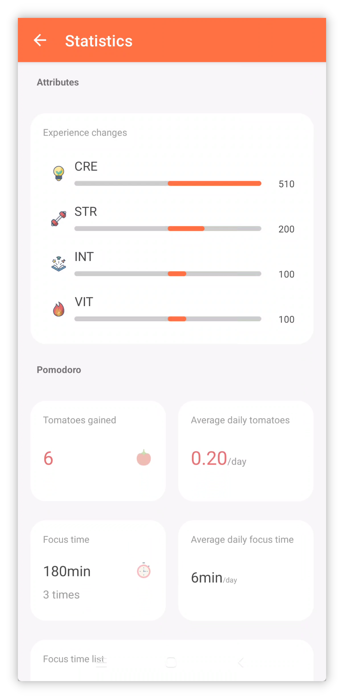
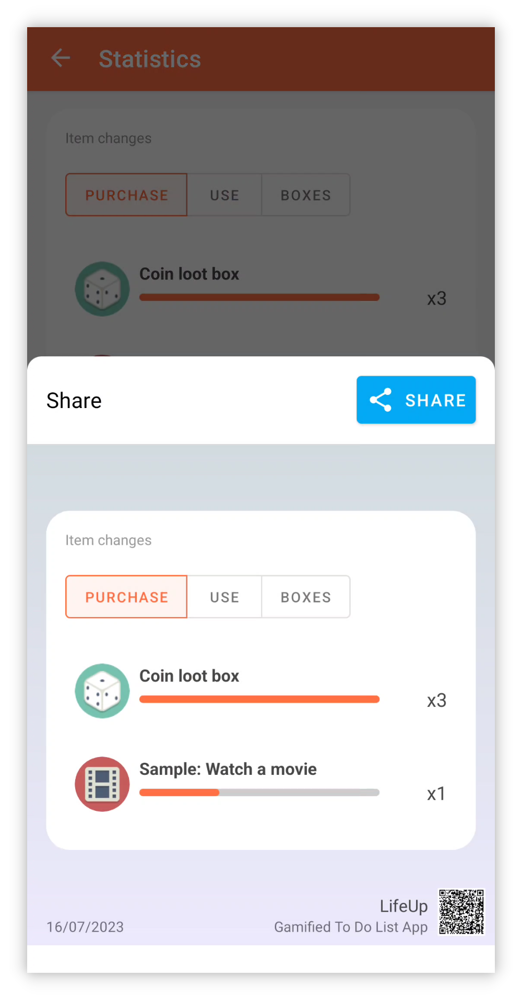

## v1.92.0 — Новая статистика, обновлённый десктоп, больше виджетов

**Спасибо, что пользуетесь LifeUp!**

Ниже — недавние обновления, охватывающие v1.91.1–v1.92.0.

Надеемся, эти обновления будут полезны для вашей работы и продуктивности.

Если у вас есть вопросы или предложения, пишите на 📫[lifeup@ulives.io](mailto:lifeup@ulives.io) или создайте issue на GitHub (https://github.com/Ayagikei/LifeUp/issues

---

## 🔖Обзор

### 📱App для Android

1. 📈**Новая статистика**
2. 🏆**Новые виджеты App**: виджет предметов магазина и виджет изменения опыта
3. ✨**Новая функция**: поддержка скрытия списка магазина/инвентаря

### 🖥️Десктоп

1. ✨**Автоматическое подключение**
2. 🚀**Экспорт чувств в markdown**
3. 🖥️**Установочный пакет macOS**

## 📱Обновления App для Android

### 🏆Новая статистика

Статистика и анализ данных — важный шаг для повышения продуктивности, а также источник вдохновения и обратной связи.

Анализируя свои усилия, можно увидеть прогресс и достижения в цифрах, а также выявить проблемы и области для улучшения.

Для этого мы запустили [Statistics 2.0], которая предлагает разнообразные интересные аналитические данные.

 

#### ❓Как использовать?

Чтобы открыть новую статистику, обновитесь до v1.92.0, перейдите на страницу [Statistics] и нажмите кнопку [Click to view new statistics] вверху.

 

#### 📊Элементы статистики

Statistics 2.0 предоставляет анализ данных для различных модулей: от процента сфокусированных задач в помидорах до среднего числа помидоров в день, ежедневных изменений атрибутов, записей покупок предметов, статуса выполнения задач и многого другого.

 

#### ⏰Фильтр по времени

Поддерживается **гибкая** фильтрация по временному диапазону — легко просматривать данные за день, неделю, месяц, год или произвольный период.

LifeUp должен быть настроен под вас — не нужно ждать конца года для годового итога и не нужно беспокоиться о потере годового итога каждый год.

В LifeUp можно в любой момент открыть **годовые итоги прошлых лет**. Интересно посмотреть данные годового итога за 2022? Скорее обновляйтесь и пробуйте!

 

#### 👥Поделиться

Делитесь своим путём в LifeUp с сообществом!

Теперь достаточно долго нажать на карточку статистики, которой хотите поделиться, чтобы создать карточку для шаринга и одним нажатием отправить её в другие приложения.

------

### 🏆**Новые виджеты App**

#### Виджеты списка магазина

В этом обновлении добавлены два виджета списка магазина — для большого и малого размеров.

Теперь можно покупать и использовать предметы прямо с рабочего стола~

> Примечание: это виджет «магазина», а не «инвентаря».
>
> Хотя он позволяет покупать и использовать предметы, он не показывает предметы из «инвентаря» напрямую.

 

На этот раз список магазина, как и список задач,

**позволяет выбирать разные списки для каждого виджета.**

 

Нажатие на фоновую область вверху также быстро открывает страницу магазина в App.

#### Виджет ежедневных изменений опыта

С этим виджетом на лаунчере видны сводные данные об ежедневных изменениях очков опыта.

------

## 🖥️Десктоп

### ✨Автоматическое подключение

По отзывам пользователей, ввод IP — основной фактор, мешающий использовать десктопную версию.

Это обновление добавляет автоматическое определение IP сервера LifeUp Cloud.

 

Условие использования:

- Скачайте LifeUp Cloud v1.3.0 (через обновления Google Play или наши страницы GitHub).

На десктопной версии IP-адрес определяется автоматически — вводить вручную больше не нужно.

> После тестирования эта функция в основном проверена на Windows.
>
> На macOS автоматическое определение пока может не поддерживаться.

------

### 🚀**Экспорт чувств в markdown**

Десктопная версия поддерживает экспорт чувств в формате markdown.

Поддерживается группировка и экспорт разными способами, впечатления включают полные вложения изображений.

С форматом markdown легко использовать **сторонние инструменты** для рендеринга и конвертации в pdf, word и другие форматы.

------

### **✏️Добавление задачи**

Благодаря ранее реализованным возможностям API десктопная версия поддерживает создание простых задач.

Текущие настройки пока не охватывают все параметры App, но достаточны для простых задач.

В следующих версиях параметры создания задач будут расширяться, появится поддержка редактирования и т. д.

------

### 🖥️**Установочный пакет macOS**

Начиная с версии 1.1.0, мы также выпускаем установочные пакеты macOS.

После простого теста функции версии для Mac OS в основном работают нормально.

Подробнее см. [🖥LifeUp Desktop (lifeupapp.fun)](https://docs.lifeupapp.fun/en/#/guide/api_desktop)

### **Примечания к релизу**

#### LifeUp Android app

**1.92.0-rc02 (2023/07/16)**

**🐛Исправления**

1. Исправлена проблема, когда виджет магазина мог не работать при переходе в другие приложения (выполнение API)
2. Исправлена периодическая аномалия при переключении списков в виджете магазина
3. Исправлена проблема, когда виджет магазина не скрывал распроданные или недоступные для покупки предметы согласно настройкам App
4. Исправлена проблема, когда виджет магазина мог не реагировать при нажатии на определённый предмет
5. Исправлены некоторые редкие сбои

**1.92.0-rc01 (2023/07/11)**

**✨Функции**

1. Statistics 2.0
2. Карточка для шаринга

**♻️Оптимизация**

1. Теперь можно задавать цены для «недоступных для покупки» предметов и использовать их, например, для возвратов
2. При отключении «Задавать штраф задачи отдельно» в настройках кнопка штрафа больше не отображается
3. Оптимизирован интерфейс подзадач в деталях команды
4. Оптимизирован интерфейс впечатлений

**🐛Исправления**

1. Исправлена проблема, когда при смене стиля обрезки атрибута на «скруглённый прямоугольник» иконка редактирования долго показывала старую иконку

#### **LifeUp-Desktop**

**v1.1.0 (2023/06/25)**

**🚀Функции**

1. Поддержка автоматической проверки IP-адреса «LifeUp Cloud» и подключения (требуется LifeUp Cloud v1.3.0)
2. Поддержка добавления задач, но пока с ограниченным набором параметров (Fixed [#6](https://github.com/Ayagikei/LifeUp-Desktop/issues/6))
3. Поддержка экспорта впечатлений в формате markdown (Fixed [#5](https://github.com/Ayagikei/LifeUp-Desktop/issues/5))
4. Добавлен текст на традиционном китайском
5. Добавлена релизная версия macOS
6. Поддержка проверки обновлений

**🔧Оптимизация и исправления ошибок**

1. Исправлена проблема некорректного отображения подкатегорий достижений
2. Исправлена проблема некорректного отображения некоторых иконок (требуется LifeUp v1.91.3)
3. Исправлено несоответствие заголовка (Fixed [#8](https://github.com/Ayagikei/LifeUp-Desktop/issues/8))
4. Добавлена опция ярлыков в установщик Windows (Fixed [#13](https://github.com/Ayagikei/LifeUp-Desktop/issues/13))
5. Улучшен способ получения размера окна, адаптация к разрешениям ниже 1080p

#### **LifeUp Cloud**

**v1.3.0 (2023/06/25)**

**🚀Функции**

1. Поддержка регистрации mDNS-сервиса для автоматического обнаружения IP десктопом (требуется desktop v1.1.0)
2. Добавлены возвращаемые значения для API, вызываемых через ContentProvider.

**🔧Улучшения**

1. Увеличена область нажатия кнопки сканирования QR-кода
2. Исправлен сбой ActivityNotFound
