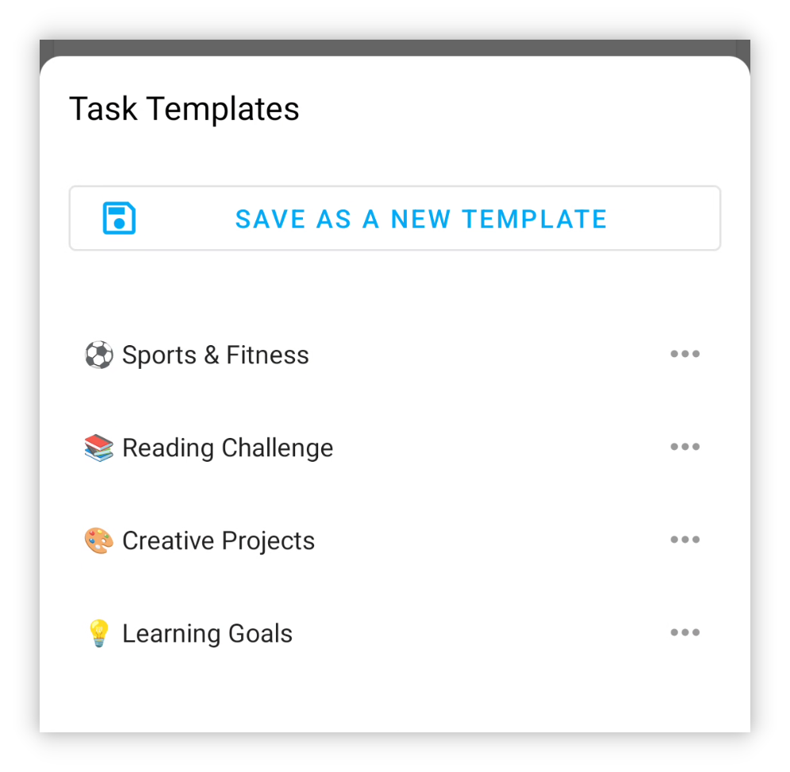

## v1.93.0 — Шаблоны задач и Material 3

## 🚀Введение

В LifeUp мы внимательно слушаем отзывы пользователей, и недавние усилия были направлены на улучшение наиболее востребованных функций. Мы стремимся совершенствовать ваш опыт использования LifeUp на основе ваших ценных отзывов.

Кроме того, мы усердно продвигаемся по дорожной карте разработки, чтобы в будущем принести вам ещё больше интересных обновлений. Ваше доверие и поддержка — то, что побуждает нас постоянно улучшаться.

Помимо этих улучшений, мы активно изучаем технологии вроде Flutter и KMM, открывая новые возможности для дальнейшего развития LifeUp. Следите за этими разработками — мы продолжаем расти и развиваться. 🚀🔍

**Это обновление приносит шаблоны задач, секретные достижения и полную адаптацию к новому языку дизайна Material You, а также другие функции.**

**Некоторые функциональные модули, такие как чувства и API, также получили улучшения и оптимизации.**

Если у вас есть вопросы или предложения, пишите на 📫[lifeup@ulives.io](mailto:lifeup@ulives.io) или создайте issue на GitHub (https://github.com/Ayagikei/LifeUp/issues)

---

## I. 📋 Шаблоны задач

В этой версии добавлены встроенные шаблоны задач. Больше не нужно создавать задачи косвенно через «Копировать задачу» и API.

При создании или редактировании задач можно сохранить текущие настройки как шаблон.

В будущем при создании задач можно одним нажатием импортировать прежние настройки наград, параметры задач и многое другое.

### 📕 Как использовать?

При создании или редактировании задач нажмите кнопку «Шаблоны задач» в верхней панели.

Шаблоны задач сохраняют большинство ваших настроек, но пока не включают срок выполнения.

## II. 🎨 Тема Material You

Эта версия полностью адаптирована к языку дизайна Material You (тема).

Этот язык дизайна более современный и выглядит чище. Это также один из официально продвигаемых стилей интерфейса на будущее.

Кроме того, ключевая особенность Material You — «у каждого может быть свой цвет темы».

Это позволяет LifeUp ввести новые механизмы: динамические цвета темы на основе обоев и пользовательские цвета темы. (Примечание: требуется поддержка устройства.)

### 📕 Как использовать?

Как показано на изображениях выше: откройте боковую панель → Настройки → Отображение и настройте соответствующие параметры.

Если ваше устройство не поддерживает динамические цвета темы, можно выбрать из предустановленных цветов.

Если устройство поддерживает динамические цвета темы, можно включить эту функцию и гибко настроить желаемые цвета:

## IV. 🌐Новый официальный сайт

Мы запустили новую landing-страницу, которая упрощает знакомство друзей с LifeUp.

Просто посетите [lifeup.ulives.io](https://lifeup.ulives.io), чтобы узнать, что предлагает LifeUp.

## III. ✨ Другие функции

**Тема интерфейса**

1. Полная адаптация к Material Design 3.
2. Поддержка настройки цветов темы Material Design 3: пользовательские цвета, цвета из обоев и цвета из изображений.
3. Улучшены некоторые анимации, например всплывающие окна.
4. Оптимизирована адаптация edge-to-edge (иммерсивный режим).

**Задачи**

1. Поддержка шаблонов задач.
2. Статистика на странице деталей поддерживает переключение по временным критериям и оптимизированы параметры по умолчанию.
3. Страница истории поддерживает поиск по названиям задач и обновлены связанные элементы интерфейса и взаимодействие.

**Достижения**

1. Поддержка секретных достижений.
2. При добавлении достижений поддерживается «Продолжить добавление следующего достижения».

**Атрибуты**

1. Поддержка скрытия атрибутов.

**Таймер Pomodoro**

1. Поддержка редактирования записей времени.
2. На странице Pomodoro поддерживается завершение задачи (долгое нажатие на выбранную задачу в режиме паузы).

**Чувства**

1. Поддержка добавления чувств напрямую на странице чувств.

**API**

1. Добавлен API «use_item».
2. Добавлен API «random».
3. Добавлен API «edit_exp».
4. API «item» теперь поддерживает изменение параметров «action_text», «disable_use» и «title_color_string».
5. API «shop_settings» поддерживает параметр «silent».
6. Поддержка плейсхолдера «time». Теперь можно задавать задачи с датами вроде «срок завтра» или «срок в следующем месяце» без инструментов автоматизации.

------

Помимо этих функций, мы устранили различные сообщённые проблемы и исправили ошибки. Подробности — в журнале обновлений ниже.

### ♻️ Оптимизации

1. Добавлены префиксы в некоторых местах отображения id данных.
2. Оптимизировано отображение командных активностей.
3. Попытка решить проблему, когда некоторые Toast-уведомления были слишком длинными для полного отображения.
4. Улучшена логика завершения через виджет в командах — согласованность с поведением в App.
5. Страница статистики: после выбора «Пользовательский» диапазона повторное нажатие «Пользовательский» снова открывает выбор дат.
6. Обеспечена совместимость с Harmony OS 4 для отображения кнопок действий в уведомлениях с прогресс-баром.
7. Улучшена логика взаимодействия с запросами уведомлений.
8. Устранена проблема, когда метод ввода мог перекрывать поле «Количество повторений».
9. При создании задач теперь сохраняется выбор пользователя не конкретного времени начала (напр. автоматически или срок сегодня). При редактировании восстанавливаются эти параметры, а не конкретное время — чтобы избежать расхождений.
10. При создании задач неожиданные предупреждения о дубликатах теперь также отображаются во всплывающем окне «Проверить дубликаты».
11. Добавлена поддержка индонезийского языка.
12. Обновлены переводы.

## 🐛 Исправления ошибок

1. Исправлена проблема, когда в некоторых случаях модуль «мир» мог бесконечно загружаться.
2. Исправлена проблема, когда магазин/склад мог бесконечно показывать загрузку.
3. Исправлены проблемы при вызове API с UI-контентом через content provider.
4. Исправлены проблемы сортировки задач, не соответствующие ожиданиям.
5. Исправлена некорректная статистика на странице статистики после выбора «Пользовательского» диапазона.
6. Исправлена проблема, когда всплывающие окна запросов уведомлений не поддерживали прокрутку.
7. Исправлена проблема, когда поиск в модуле «мир» в некоторых случаях показывал весь контент.
8. Исправлена проблема, когда опция «Показать завершённые» также отображала замороженные задачи.
9. Исправлены проблемы расчёта средних значений на странице статистики.

## Особая благодарность участникам GitHub, героям обратной связи по email и переводчикам Crowdin

Мы выражаем глубокую благодарность пользователям, которые активно создавали issues на GitHub, писали нам на email с отзывами и посвящали время переводам на Crowdin.

Ваши совместные усилия сыграли ключевую роль в формировании опыта LifeUp для нашего глобального сообщества. Вы помогли улучшить функциональность и доступность App, и ваш вклад поистине неоценим.

Продолжая вместе делать LifeUp лучше, мы выражаем искреннюю благодарность за вашу неизменную поддержку и сотрудничество. 🙏📧🌍
