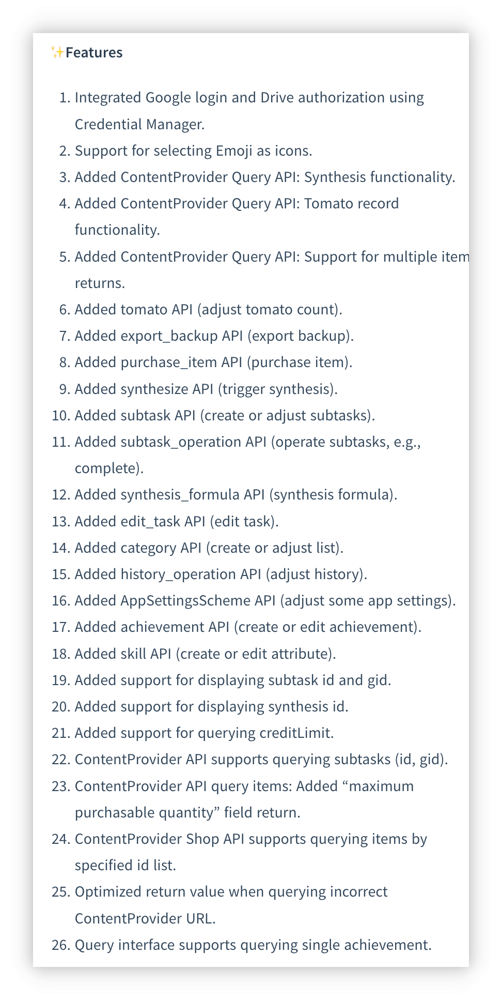

<h1 align="center" padding="100">v1.98.0 API 2.0 и обновление десктопного клиента</h1>

## Введение
Это первый релиз 2025 года со следующими основными обновлениями:

- Поддержка Emoji-иконок: теперь можно напрямую использовать Emoji в качестве иконок для предметов, достижений и многого другого.

- Вторая волна обновлений API: интерфейсы API теперь поддерживают изменение задач, редактирование эффектов предметов, условий разблокировки достижений, синтез и почти все основные функции.

- Оптимизация LifeUp Cloud и десктопного клиента: улучшен опыт автоматического обнаружения подключения; в десктопном клиенте добавлена функция «Новые чувства» и поддержка импорта/экспорта резервных копий.

## I. Emoji-иконки

### 📕Как использовать?

- В этой версии при выборе иконок для предметов, достижений и т. д. можно напрямую выбирать Emoji в качестве иконок.

## II. Вторая волна обновлений API

С момента открытия API в v1.90.0 мы рады видеть, что многие пользователи активно исследуют API и создают на его основе богатый контент. Многие начинали с нуля изучать URL и успешно применяли API для создания виджетов рабочего стола, DIY-десктопных клиентов и даже интеграции с веб-приложениями — это впечатляет.

Однако из-за сложных структур данных и большого объёма проектирования и разработки в первой партии API не хватало некоторых основных функций: редактирование задач, редактирование предметов, создание достижений с условиями разблокировки, создание предметов с эффектами использования. Завершение этих функций продолжалось до этой версии.

Проектирование, разработка, тестирование и обновление облака, десктопных клиентов и документации API привели к экспоненциальному росту нагрузки, поэтому ветка разработки, начатая несколько месяцев назад, завершила разработку и тестирование только сейчас.

**Но наши усилия принесли плоды! Сегодня API охватывает почти все основные функции LifeUp. Открывая API, мы надеемся сделать LifeUp не просто App, а открытой платформой, где пользователи могут свободно разрабатывать, расширять и настраивать собственные системы геймификации.**

### 📕Как использовать?

- Методы использования API см. в нашей библиотеке документации → Каталог → Открытые интерфейсы.
- В документацию добавлены определения новых API-интерфейсов.

## III. Десктопный клиент: архив и чувства

### Архив

Теперь можно напрямую экспортировать или импортировать файлы резервных копий в десктопном клиенте.

Это упростит перенос данных на другие устройства и восстановление.

### Публикация новых чувств

Теперь поддерживается публикация новых чувств из десктопного клиента с полной поддержкой добавления изображений и настройки времени.

⚠️Примечание: редактирование чувств пока не поддерживается.

### Прочие обновления

- Оптимизированы сообщения об ошибках и пояснения, связанные с подключением: чётко указывается, проблема в сети или в том, что бэкенд LifeUp не запущен
- Поддержка просмотра деталей задачи
- Поддержка проверки безопасности API Token (опционально, требуется LifeUp Cloud 2.0.0)
- Логика покупки теперь использует новый API «purchase item» вместо прежнего «adjust item quantity API» + «adjust coin amount API». Теперь корректно обрабатывается логика лимита покупки, сохраняя согласованность с App.

Это обновление также демонстрирует возможности API через десктопный клиент — все функции десктопного клиента реализованы через API.

## IV. Оптимизация LifeUp Cloud

> LifeUp Cloud — инструмент, который предоставляет API как HTTP-интерфейсы и служит мостом для подключения десктопного клиента.

На основе отзывов о LifeUp Cloud мы внесли множество оптимизаций:

- Добавлено отображение статуса для быстрого определения причины, по которой десктопный клиент не может подключиться
- Добавлены расширенные настройки
  - Разрешить кросс-доменный доступ: полезно при обращении к HTTP-интерфейсам LifeUp Cloud с помощью веб-технологий
  - Разрешить настраивать порты сервиса
  - Разрешить задавать токены доступа: опциональная мера проверки безопасности
- Оптимизированы возвращаемые значения ошибок и спецификации интерфейсов LifeUp Cloud
- Оптимизированы логика обнаружения сервиса и переключения HTTP-сервиса — автоматическое обнаружение в десктопном клиенте должно работать лучше

## V. Анонс

Поскольку в этом обновлении относительно мало функций, не связанных с API, ниже — анонс предстоящего контента, включая функции в разработке:

- **Крупная функция:** повторяемые достижения
- **Средняя функция:** оптимизация читаемости текста на пользовательском фоне
  - Изначально казалось небольшим изменением, но оказалось довольно сложным
- **Мелкая функция:** действия «завершить» и «напомнить позже» в уведомлениях
  - Изначально планировалась поддержка постоянных уведомлений, но отказались — новые версии Android больше не поддерживают настоящую постоянность

## VI. ✨Полный журнал обновлений

### **LifeUp-Android**

**v1.98.0 (2025/01/01)**

**✨Функции**

1. Интеграция входа через Google и авторизации Drive с Credential Manager.
2. Поддержка выбора Emoji в качестве иконок.
3. Добавлен ContentProvider Query API: функция синтеза.
4. Добавлен ContentProvider Query API: функция записей помидора.
5. Добавлен ContentProvider Query API: поддержка возврата нескольких предметов.
6. Добавлен tomato API (изменение количества помидоров).
7. Добавлен export_backup API (экспорт резервной копии).
8. Добавлен purchase_item API (покупка предмета).
9. Добавлен synthesize API (запуск синтеза).
10. Добавлен subtask API (создание или изменение подзадач).
11. Добавлен subtask_operation API (операции с подзадачами, напр. завершение).
12. Добавлен synthesis_formula API (формула синтеза).
13. Добавлен edit_task API (редактирование задачи).
14. Добавлен category API (создание или изменение списка).
15. Добавлен history_operation API (изменение истории).
16. Добавлен AppSettingsScheme API (изменение некоторых настроек App).
17. Добавлен achievement API (создание или редактирование достижения).
18. Добавлен skill API (создание или редактирование атрибута).
19. Добавлена поддержка отображения id и gid подзадач.
20. Добавлена поддержка отображения id синтеза.
21. Добавлена поддержка запроса creditLimit.
22. ContentProvider API поддерживает запрос подзадач (id, gid).
23. ContentProvider API запрос предметов: добавлено поле «максимальное количество для покупки».
24. ContentProvider Shop API поддерживает запрос предметов по указанному списку id.
25. Оптимизировано возвращаемое значение при запросе неверного URL ContentProvider.
26. Интерфейс запроса поддерживает запрос одного достижения.

**♻️Оптимизация**

1. Оптимизирована пользовательская сортировка по умолчанию для новых предметов.
2. Оптимизирована пользовательская сортировка по умолчанию для новых атрибутов.
3. В API «add_item» добавлены параметры `purchase_limit`, `disable_use` и `effects`.
4. В API «add_task» добавлены параметры `background_alpha`, `items`, `start_time`, `auto_use_item`, `remind_time` и `pin`.
5. В API «add_task» добавлена поддержка большего числа частот задач.
6. В API «item» добавлена поддержка параметров `effects` и `purchase_limit`.
7. Добавлена поддержка прерывания операций в предыдущих API (напр. ввод).
8. Добавлена поддержка указания параметра `signed` для числовых плейсхолдеров.
9. Добавлены плейсхолдеры случайного числа и случайного десятичного числа.

### **LifeUp-Desktop**

**v1.2.0 (2025/01/01)**

**🚀Функции**
1. Поддержка управления архивом
- Резервная копия на компьютер
- Восстановление с компьютера
- Поддержка перетаскивания
2. Поддержка создания новых мыслей
- Выбор изображений
- Синхронизация изображений на мобильное устройство
3. Просмотр деталей задачи
4. Улучшения системы покупки
- Использование нового API «Purchase Items»
- Согласованность лимитов покупки с App
5. Опциональная проверка API Token
6. Мультиплатформенная поддержка
- Windows
- Linux
- macOS (Apple Silicon)
- macOS (Intel) 🆕
7. Улучшена обработка ошибок и уведомления

### **LifeUp Cloud**

**v2.0.0 (2025/01/01)**

**🚀Функции**
1. Оптимизация сервиса
- Улучшена логика обнаружения сервиса и совместимость
- Больше устройств поддерживают автоматическое определение IP
- Оптимизированы переходы состояния запуска/паузы сервиса
- Улучшена обработка ошибок и уведомления
2. Безопасность и производительность
- Добавлена опциональная проверка API Token
- Добавлены параметры конфигурации CORS
- Поддержка настройки пользовательского порта
- Поддержка настройки длительности wake lock
3. Улучшение интерфейса
- Совершенно новый дизайн интерфейса
- Улучшен общий визуальный опыт
