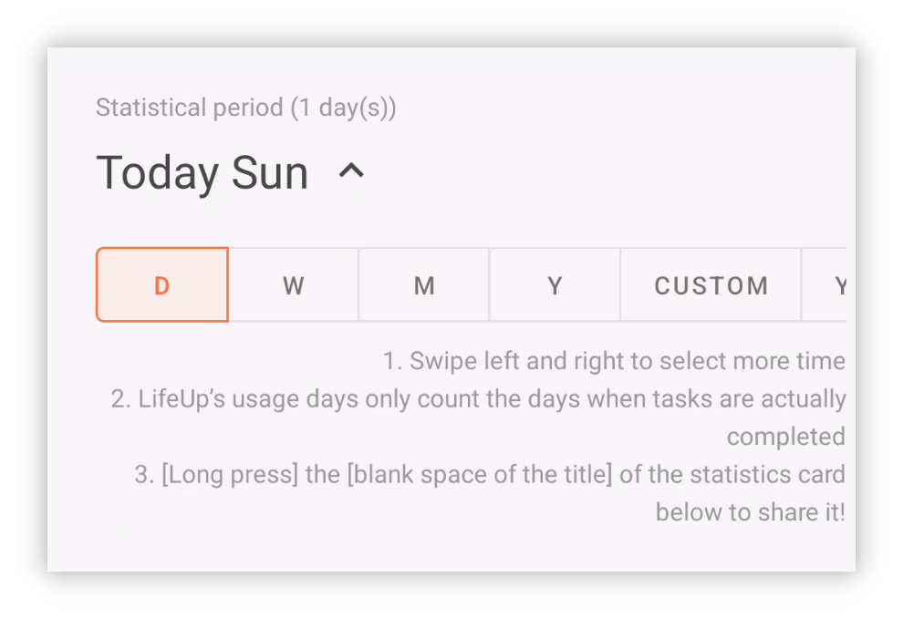

## v1.92.0 - Yeniden tasarlanan istatistikler, güncellenmiş masaüstü, daha fazla widget

**LifeUp kullandığınız için teşekkürler!**

İşte v1.91.1–v1.92.0'ı kapsayan son güncellemeler.

Bu güncellemelerin kullanımınız ve verimliliğiniz için faydalı olmasını umuyoruz.

Sorularınız veya önerileriniz için 📫[lifeup@ulives.io](mailto:lifeup@ulives.io) adresine yazabilir veya GitHub'da issue açabilirsiniz (https://github.com/Ayagikei/LifeUp/issues

---

## 🔖Genel bakış

### 📱Android uygulaması

1. 📈**Yeniden tasarlanan istatistikler**
2. 🏆**Yeni uygulama widget'ları**: Mağaza eşyaları widget'ı ve Deneyim Puanı değişim widget'ı
3. ✨**Yeni özellik**: Mağaza/Envanter listesini gizleme desteği

### 🖥️Masaüstü

1. ✨**Otomatik bağlantı**
2. 🚀**Duyguları markdown'a dışa aktarma**
3. 🖥️**macOS kurulum paketi**

## 📱Android uygulaması güncellemeleri

### 🏆Yeniden tasarlanan istatistikler

İstatistikler ve veri incelemesi yalnızca verimliliğimizi artırmak için önemli bir adım değil; aynı zamanda ilham ve geri bildirim kaynağıdır.

Çabalarımızı gözden geçirerek ilerlememizi ve Başarımlarımızı verilerle görebilir; sorunları ve iyileştirme alanlarını belirleyebiliriz.

Bunun için size çeşitli ilginç veri içgörüleri sunan [İstatistik 2.0]'ı başlattık.

 

#### ❓Nasıl kullanılır?

Yeni istatistiklere erişmek için v1.92.0 sürümüne yükseltin, [İstatistik] sayfasına gidin ve üstteki [Yeni istatistikleri görüntülemek için tıklayın] düğmesine dokunun.

 

#### 📊İstatistik öğeleri

İstatistik 2.0 çeşitli modüller için veri analizi sunar: domateslerde Odak görevlerinin yüzdesinden günlük ortalama domates sayısına, Özelliklerdeki günlük değişimlerden eşya satın alma kayıtlarına ve görev tamamlama durumuna kadar.

 

#### ⏰Zaman filtresi

**Esnek** zaman aralığı filtrelemesini destekler; gün, hafta, ay, yıl veya özel zaman aralığı verilerini kolayca görüntüleyebilirsiniz.

LifeUp size göre olmalı; yıllık özeti yıl sonunu beklemek zorunda değilsiniz, her yıl yıllık özeti kaybetme endişesi de taşımazsınız.

LifeUp'ta **geçmiş yılların yıllık özetlerine** istediğiniz zaman erişebilirsiniz. 2022 yıllık özet verilerinizi merak ediyor musunuz~ Hemen güncelleyin ve deneyin!

 

#### 👥Paylaşım

LifeUp yolculuğunuzu toplulukla paylaşın!

Paylaşmak istediğiniz veri istatistik kartına uzun basmanız yeterli; paylaşım kartı oluşturup tek dokunuşla diğer uygulamalara aktarabilirsiniz.

------

### 🏆**Yeni uygulama widget'ları**

#### Mağaza listesi widget'ları

Bu güncelleme büyük ve küçük boyutlara uygun iki Mağaza listesi widget'ı tanıtıyor.

Artık doğrudan masaüstünden satın alıp kullanabilirsiniz~

> Not: Mevcut olan "Mağaza" widget'ıdır, "Envanter" widget'ı değil.
>
> Eşya satın almanıza ve kullanmanıza izin verse de "Envanter"deki eşyaları doğrudan görüntülemenize izin vermez.

 

Bu sefer Mağaza listesi görev listesi gibi:

**Her widget için farklı listeler seçebilirsiniz.**

 

Üstteki arka plan alanına dokunarak uygulama içindeki Mağaza sayfasına hızlıca atlayabilirsiniz.

#### Günlük Deneyim Puanı değişim widget'ı

Bu widget ile başlatıcıda günlük Deneyim Puanı değişimlerinizin özet verilerini görebilirsiniz.

------

## 🖥️Masaüstü

### ✨Otomatik bağlantı

Kullanıcı geri bildirimine göre IP doldurmak, masaüstü sürümünü kullanmayı engelleyen önemli bir faktör.

Bu güncelleme LifeUp Cloud Server IP'sini otomatik algılama işlevini getiriyor.

 

Bu işlevi kullanmanın ön koşulu:

- LifeUp Cloud v1.3.0'ı indirin (Google Play güncellemelerinden veya GitHub Releases sayfamızdan alabilirsiniz).

Masaüstü sürümünde ilgili IP adresini otomatik algılayabilirsiniz; artık elle doldurmanız gerekmez.

> Testlerden sonra bu özellik şu an esas olarak Windows tarafında doğrulandı.
>
> macOS tarafında otomatik algılama henüz desteklenmiyor olabilir.

------

### 🚀**Duyguları markdown'a dışa aktarma**

Masaüstü sürümü artık Duyguları markdown biçiminde dışa aktarmayı destekliyor.

Birden fazla gruplama ve dışa aktarma yöntemini destekler; izlenimler tam görsel ekleriyle birlikte gelir.

Markdown biçimiyle **üçüncü taraf araçları** kullanarak kolayca pdf, word vb. biçimlere dönüştürebilirsiniz.

------

### **✏️Görev ekleme**

Daha önce oluşturulan API yetenekleriyle masaüstü sürümü artık basit görev oluşturmayı destekliyor.

Mevcut ayarlar uygulamadaki tüm seçenekleri kapsamıyor ama basit görevler oluşturmak için yeterli.

Sonraki sürümlerde görev oluşturma seçeneklerini genişletmeye ve görev düzenlemeyi desteklemeye devam edeceğiz.

------

### 🖥️**macOS kurulum paketi**

Sürüm 1.1.0'dan itibaren macOS kurulum paketlerini de yayınlamaya başlayacağız.

Basit testten sonra Mac OS sürümünün işlevleri temelde normal.

Ayrıntılar için [🖥LifeUp Desktop (lifeupapp.fun)](https://docs.lifeupapp.fun/en/#/guide/api_desktop) sayfasına bakın.

### **Sürüm notları**

#### LifeUp Android uygulaması

**1.92.0-rc02 (2023/07/16)**

**🐛Düzeltme**

1. Mağaza widget'ının diğer uygulamalara atlayınca (API çalıştırırken) çalışmaması düzeltildi
2. Mağaza widget'ında liste değiştirirken ara sıra oluşan anormallik düzeltildi
3. Mağaza widget'ının uygulama ayarlarına göre tükenen veya satın alınamaz eşyaları gizlememesi düzeltildi
4. Mağaza widget'ında belirli bir eşyaya tıklayınca yanıt vermeme düzeltildi
5. Bazı nadir çökme sorunları düzeltildi

**1.92.0-rc01 (2023/07/11)**

**✨Özellikler**

1. İstatistik 2.0
2. Paylaşım kartı

**♻️Optimizasyon**

1. Artık "satın alınamaz" eşyalar için fiyat ayarlanabilir; iade gibi senaryolarda kullanılabilir
2. Ayarlarda "Görev cezasını ayrı ayarla" kapatıldığında ceza düğmesi artık gösterilmez
3. Takım ayrıntılarında alt görev UI'si optimize edildi
4. İzlenimler UI'si optimize edildi

**🐛Düzeltme**

1. Özellik kırpma stili "yuvarlatılmış dikdörtgen"e değiştirildiğinde düzenleme simgesinin uzun süre eski simgeyi göstermesi düzeltildi

#### **LifeUp-Desktop**

**v1.1.0 (2023/06/25)**

**🚀Özellikler**

1. "LifeUp Cloud" IP adresi ve bağlantısının otomatik kontrolü (LifeUp Cloud v1.3.0 gerekir)
2. Görev ekleme desteği; şu an desteklenen seçenekler sınırlı (Fixed [#6](https://github.com/Ayagikei/LifeUp-Desktop/issues/6))
3. İzlenimleri markdown biçiminde dışa aktarma (Fixed [#5](https://github.com/Ayagikei/LifeUp-Desktop/issues/5))
4. Geleneksel Çince metin eklendi
5. macOS sürümü eklendi
6. Güncelleme kontrolü desteği

**🔧Optimizasyon ve hata düzeltmeleri**

1. Başarım alt kategorilerinin doğru görüntülenmemesi düzeltildi
2. Bazı simgelerin doğru görüntülenmemesi düzeltildi (LifeUp v1.91.3 gerekir)
3. Başlık uyumsuzluğu düzeltildi (Fixed [#8](https://github.com/Ayagikei/LifeUp-Desktop/issues/8))
4. Windows yükleyicisine kısayol seçeneği eklendi (Fixed [#13](https://github.com/Ayagikei/LifeUp-Desktop/issues/13))
5. Pencere boyutu alma yöntemi iyileştirildi; 1080p altı çözünürlüklere uyarlandı

#### **LifeUp Cloud**

**v1.3.0 (2023/06/25)**

**🚀Özellikler**

1. Masaüstünün IP'sini otomatik keşfetmesi için mDNS hizmet kaydı (masaüstü v1.1.0 gerekir)
2. ContentProvider üzerinden çağrılan API'ler için sonuç değerleri eklendi.

**🔧İyileştirmeler**

1. QR kod tarama düğmesinin tıklama alanı genişletildi
2. ActivityNotFound çökmesi düzeltildi
