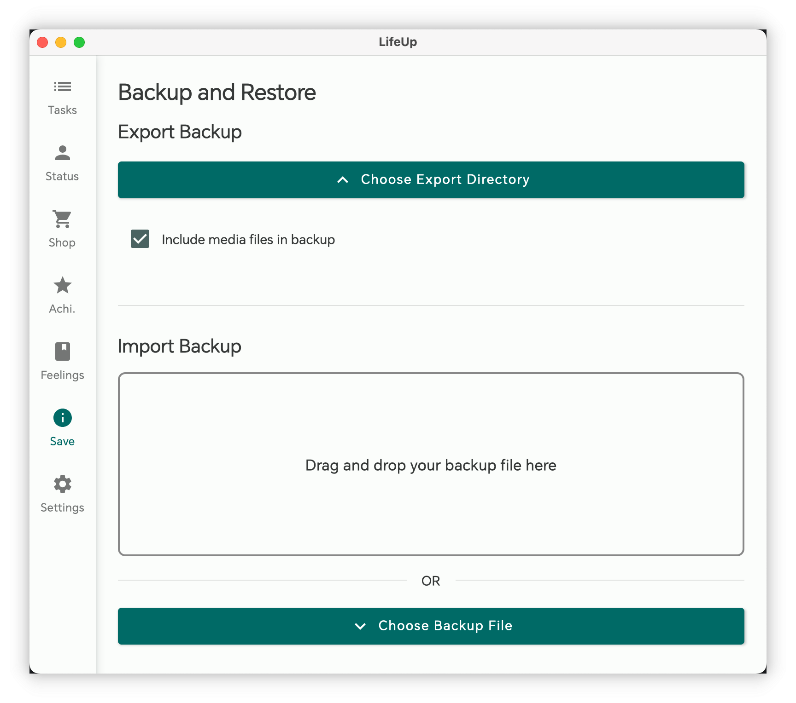

<h1 align="center" padding="100">v1.98.0 API 2.0 ve masaüstü istemci güncellemesi</h1>

## Giriş
2025'in ilk sürümü; öne çıkan güncellemeler:

- Emoji simge desteği: Artık eşyalar, Başarımlar ve daha fazlası için simge olarak doğrudan Emoji kullanabilirsiniz.

- API güncellemelerinin ikinci dalgası: API arayüzleri artık görev düzenleme, eşya efektleri düzenleme, Başarım kilitleme koşulları, Sentez ve neredeyse tüm temel işlevleri değiştirmeyi destekliyor.

- LifeUp Cloud ve masaüstü istemci optimizasyonu: Otomatik bağlantı algılama deneyimi iyileştirildi; masaüstü istemcisine "Yeni Duygular" özelliği eklendi ve yedek veri içe/dışa aktarma destekleniyor.

## I. Emoji simgeler

### 📕Nasıl kullanılır?

- Bu sürümde eşyalar, Başarımlar vb. için simge seçerken artık doğrudan emoji ifadelerini simge olarak seçebilirsiniz.

## II. API güncellemelerinin ikinci dalgası

API işlevselliği v1.90.0'da açıldığından beri birçok kullanıcının API'yi keşfederek zengin içerik oluşturduğunu görmekten memnuniyet duyuyoruz. Bazı kullanıcılar URL bilgisini sıfırdan öğrenip API'yi masaüstü widget'ları, DIY masaüstü istemcileri ve hatta web uygulaması entegrasyonu için başarıyla uyguladı — etkileyici.

Ancak karmaşık veri yapıları ve önemli tasarım ve geliştirme iş yükü nedeniyle ilk API grubunda görev düzenleme, eşya düzenleme, kilitleme koşullu Başarım oluşturma ve kullanım efektli eşya oluşturma gibi bazı temel işlevler eksikti. Bu özelliklerin tamamlanması bu sürüme kadar sürdü.

Cloud, masaüstü istemcileri ve API dokümantasyonunun tasarımı, geliştirmesi, testi ve güncellemeleri üstel artan iş yükü getirdi; birkaç ay önce başlatılan geliştirme dalı ancak şimdi geliştirme ve testi tamamladı.

**Ancak çabalarımız meyve verdi! Bugün API, LifeUp'ın neredeyse tüm temel işlevlerini kapsıyor. API'yi açarak LifeUp'ın yalnızca bir uygulama değil, kullanıcıların kendi oyunlaştırma sistemlerini özgürce geliştirebileceği, genişletebileceği ve özelleştirebileceği açık bir platform olmasını umuyoruz.**

### 📕Nasıl kullanılır?

- API kullanım yöntemleri için dokümantasyon kütüphanemize bakın → Dizin → Açık arayüz bölümü.
- Yeni API arayüz tanımları dokümantasyona eklendi.

## III. Masaüstü istemci: arşiv özelliği ve Duygular

### Arşiv

Artık yedek dosyalarını doğrudan masaüstü istemcisinde dışa veya içe aktarabilirsiniz.

Bu, verileri diğer cihazlara aktarma ve kurtarma sürecini basitleştirir.

### Yeni Duygular yayınlama

Artık masaüstü istemcisinden yeni Duygular yayınlamayı destekliyor; görsel ekleme ve zaman özelliklerini ayarlama tam destekleniyor.

⚠️Not: Duyguları düzenleme henüz desteklenmiyor.

### Diğer güncellemeler

- Bağlantıyla ilgili hata mesajları ve açıklamalar optimize edildi: ağ sorunu mu yoksa LifeUp arka uç çalışmıyor mu net gösteriliyor
- Görev ayrıntılarını görüntüleme desteği
- API Token güvenlik doğrulaması (isteğe bağlı; LifeUp Cloud 2.0.0 sürümü gerekir)
- Satın alma mantığı artık önceki "eşya miktarı ayarla API" + "altın miktarı ayarla API" yerine yeni "eşya satın al API" kullanıyor. Satın alma limiti mantığı doğru işlenir; uygulamayla tutarlı kalır.

Bu güncelleme ayrıca masaüstü istemcisi üzerinden API yeteneklerini göstermeye hizmet ediyor; tüm masaüstü istemci özellikleri API üzerinden uygulanıyor.

## IV. LifeUp Cloud optimizasyonu

> LifeUp Cloud, API'yi HTTP arayüzleri olarak sunan ve masaüstü istemci bağlantısı için köprü görevi gören bir araçtır.

LifeUp Cloud hakkındaki geri bildirimlere dayanarak çok sayıda optimizasyon yaptık:

- Masaüstü istemcisinin neden bağlanamadığını hızlıca anlamak için durum gösterimi eklendi
- Gelişmiş ayarlar eklendi
  - Cross-origin erişime izin ver: web tabanlı teknolojilerle LifeUp Cloud HTTP arayüzlerine erişmek için yararlı
  - Özel hizmet portlarına izin ver
  - Erişim belirteçleri ayarlama: isteğe bağlı güvenlik doğrulaması
- LifeUp Cloud arayüzlerinin hata dönüş değerleri ve spesifikasyonları optimize edildi
- Hizmet keşfi ve HTTP hizmet anahtarı mantığı optimize edildi; masaüstü istemcisinin otomatik algılaması artık daha iyi çalışmalı

## V. Ön izleme

Bu güncelleme API dışı özellikler açısından nispeten az getirdiğinden, geliştirme altındaki özellikler dahil yaklaşan sürüm içeriğinin bir ön izlemesi:

- **Büyük özellik:** Tekrarlanabilir Başarımlar
- **Orta özellik:** Özel arka planlar için metin okunabilirliği optimizasyonu
  - Başta küçük bir değişiklik sanıldı ama oldukça karmaşık çıktı
- **Küçük özellik:** Bildirimlere tamamla ve daha sonra hatırlat eylemleri
  - Kalıcı bildirimler planlanmıştı ama yeni Android sürümleri gerçek kalıcılığı desteklemediği için vazgeçildi

## VI. ✨Tam güncelleme günlüğü

### **LifeUp-Android**

**v1.98.0 (2025/01/01)**

**✨Özellikler**

1. Credential Manager kullanarak Google girişi ve Drive yetkilendirmesi entegre edildi.
2. Simge olarak Emoji seçme desteği.
3. ContentProvider Query API eklendi: Sentez işlevselliği.
4. ContentProvider Query API eklendi: Domates kaydı işlevselliği.
5. ContentProvider Query API eklendi: Birden fazla eşya dönüşü desteği.
6. Domates API eklendi (domates sayısını ayarla).
7. export_backup API eklendi (yedek dışa aktar).
8. purchase_item API eklendi (eşya satın al).
9. synthesize API eklendi (Sentez tetikle).
10. subtask API eklendi (alt görev oluştur veya ayarla).
11. subtask_operation API eklendi (alt görevleri işle; örn. tamamla).
12. synthesis_formula API eklendi (Sentez formülü).
13. edit_task API eklendi (görev düzenle).
14. category API eklendi (liste oluştur veya ayarla).
15. history_operation API eklendi (geçmişi ayarla).
16. AppSettingsScheme API eklendi (bazı uygulama ayarlarını ayarla).
17. achievement API eklendi (Başarım oluştur veya düzenle).
18. skill API eklendi (Özellik oluştur veya düzenle).
19. Alt görev kimliği ve gid görüntüleme desteği eklendi.
20. Sentez kimliği görüntüleme desteği eklendi.
21. creditLimit sorgulama desteği eklendi.
22. ContentProvider API alt görevleri sorgulamayı destekler (id, gid).
23. ContentProvider eşya sorgusu: "maksimum satın alınabilir miktar" alanı dönüşü eklendi.
24. ContentProvider Mağaza API belirtilen kimlik listesine göre eşya sorgulamayı destekler.
25. Hatalı ContentProvider URL sorgulandığında dönüş değeri optimize edildi.
26. Sorgu arayüzü tek Başarım sorgulamayı destekler.

**♻️Optimizasyon**

1. Yeni eklenen eşyalar için varsayılan özel sıralama optimize edildi.
2. Yeni eklenen Özellikler için varsayılan özel sıralama optimize edildi.
3. "add_item" API'sine `purchase_limit`, `disable_use` ve `effects` parametreleri eklendi.
4. "add_task" API'sine `background_alpha`, `items`, `start_time`, `auto_use_item`, `remind_time` ve `pin` parametreleri eklendi.
5. "add_task" API'sine daha fazla görev sıklığı desteği eklendi.
6. "item" API'sine `effects` ve `purchase_limit` parametre desteği eklendi.
7. Önceki API'lerde (ör. giriş) işlemi sonlandırma desteği eklendi.
8. Sayısal yer tutucular için `signed` parametresi belirtme desteği eklendi.
9. Rastgele sayı ve rastgele ondalık yer tutucular eklendi.

### **LifeUp-Desktop**

**v1.2.0 (2025/01/01)**

**🚀Özellikler**
1. Arşiv yönetimi desteği
- Bilgisayara yedekle
- Bilgisayardan geri yükle
- Sürükle bırak desteği
2. Yeni düşünceler oluşturma desteği
- Görsel seçimi
- Görseli mobile senkronize etme
3. Görev ayrıntıları görüntüleme desteği
4. Satın alma sistemi iyileştirmeleri
- Yeni "Eşyaları satın al" API kullanımı
- Satın alma limitlerini uygulamayla tutarlı tutma
5. İsteğe bağlı API Token doğrulaması desteği
6. Çoklu platform desteği
- Windows
- Linux
- macOS (Apple Silicon)
- macOS (Intel) 🆕
7. Geliştirilmiş hata işleme ve bildirimler

### **LifeUp Cloud**

**v2.0.0 (2025/01/01)**

**🚀Özellikler**
1. Hizmet optimizasyonu
- Geliştirilmiş hizmet keşfi mantığı ve uyumluluk
- Daha fazla cihaz otomatik IP algılamayı destekler
- Optimize edilmiş hizmet başlat/duraklat durum geçişleri
- Geliştirilmiş hata işleme ve bildirimler
2. Güvenlik ve performans
- İsteğe bağlı API Token doğrulaması eklendi
- CORS yapılandırma seçenekleri eklendi
- Özel port ayarları desteği
- Özel uyku kilidi süresi desteği
3. UI geliştirmesi
- Yepyeni arayüz tasarımı
- Genel görsel deneyim iyileştirildi
