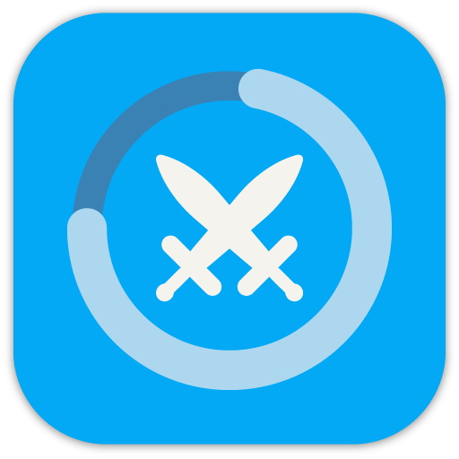

# 介绍

> 人升，让你的人生升级

 

《人升》是一款融合了游戏化激励元素的待办事项、习惯养成应用，**可以当作是简约版的《地球Online》~**

在这里，你完成任务的过程不再枯燥无味，根据任务的轻重缓急，完成任务时你可以获得『经验值』、『金币』奖励。
经验值奖励能提升你不同属性的『等级』；你可以使用金币去商店购买设定好的「自我奖励」商品。
达成一定的条件（如达到指定等级、连续完成任务多少天）还有可能解锁『成就』，从而获取更多的奖励。

除此之外，应用还支持感想、番茄钟、世界、橱窗等模块待你探索！

> 《人升》目前由两名个人开发者在业余时间维护和迭代开发。我们所拥有的资源远比不上商业产品，但我们想要以我们的想法构建一款独特的游戏化待办事项应用。

---

## 激励体系

《人升》的激励体系基于**仪式感**，这几大功能都是可以相辅相成，互相影响的。

只有当你注重经验值等级提升的时候，等级体系才会对你有比较大激励作用。

只有当你切实地按照商品奖励体系，限制和给予现实中的自己奖励时，商品体系才能够产生最有效的作用。

**当然，有可能你完全不需要某个体系，那么也完全不会影响应用的正常使用。**你可以只使用你所关注的模块，并逐渐摸索应用。

---

## 如何获取

### 直接下载

http://lifeupapp.fun/zh/index.html#cta

### 中国大陆地区应用商店

如果你处于中国大陆地区，可以在手机自带的应用商店搜索《人升》并下载。

⚠ 但请注意，应用商店下载的版本可能并不是最佳版本，安装后可以先在应用内检测更新，更新到最新版本再使用。

### Google Play

如果你处于海外或者港澳台地区，可以通过 Google Play 搜索《人升》或“LifeUp”付费下载 Pro 版本。

或者直接访问：https://play.google.com/store/apps/details?id=net.sarasarasa.lifeup

### iOS

欢迎体验我们新上架的 App —— 《ulives》

http://ulives.lifeupapp.net/

---

## 上架市场

目前《人升》的上架市场已经覆盖了绝大多数手机品牌和第三方市场。

列表如下所示：

| 市场（依最初上架时间排序）                                   | 是否上架 | 是否官方上架 | 备注                                             |
| ------------------------------------------------------------ | -------- | -------------- | ------------------------------------------------ |
| 酷安                                                         | ✔️        | ✔️              | 更新最快的市场。                                 |
| 魅族                                                         | ✔️        | ✔️              | - |
| 小米                                                         | ✔️        | ✔️              | - |
| 应用宝                                                       | ✔️        | ✔️              | - |
| Google Play                                                  | ✔️        | ✔️              | Google Play 上的是买断版本，相当于拥有会员权益。      |
| 华为                                                         | ✔️        | ✔️              | - |
| 阿里全家桶（**豌豆荚、PP 助手、YunOS 应用商店、UC 应用商店等**) | ✔️        | ✔️              | - |
| OPPO（一加）                                                  | ✔️      | ✔️            | - |
| VIVO                                                         | ✔️        | ❌              | 不允许个人开发者上架，目前是抓包。               |
| 三星                                                         | ✔️        | ❌              | 目前是抓包上架。                                 |
| 360                                                          | ❌        | ✔️              | 不再上架新版本。                                 |
| 百度                                                         | ✔️        | ✔️              | - |

> 非官方上架的应用市场，只要能正常更新、登录使用就是正版，不需要担心安全性问题。
>
> 所以有建议的话，建议还是多重渠道进行反馈~

由于维护的时间成本问题，加上很多市场的开发者回复也接收不到反馈（用户甚至完全留意不到被回复了），这就像将时间投入黑洞一般。

我们会放弃除了**酷安**以外的所有应用市场的回复工作，反馈处理主要基于 QQ 群、QQ 频道、邮件、会员渠道。

**并且将更多时间投入到应用的实际开发维护中去，实现更好的人升。**

---

## 特色简介

🎨 **小而美**

丰富的功能蕴含在不到 15MB 的安装包之中（随着应用功能的迭代，应用体积会不可避免地增长）。

**免费下载且应用内不会出现任何一秒的广告，没有开屏页面。打开应用就极速进入任务清单页面。**
权限申请也极为克制，这里不需要存储空间读写、电话状态读取权限，**你甚至可以关掉所有权限，在离线的情况下正常使用《人升》。**

并且非会员可以使用《人升》中绝大部分（95%）的功能，我们并不会因此盈利一分。

> 2023/02/19：
>
> 打个补丁，为了应用的可持续性发展，我们逐渐将更多的个性化设置仅开放给了会员使用。但普通功能也在逐渐更新和完善，以往的免费试用功能也会持续保留。
>
> 【无广告】严格意义上也属于会员权益，但由于我们目前控制好了维护成本，有空间将其开放给所有普通试用用户。
>
> 但为了全体会员的权益、应用的可持续性发展，我们会保留以下权利：
>
> - 在应用出现亏损时间点、或较大亏损迹象、或不足以支撑日常维护的情况下，去除试用用户的【无广告】权益的权利（不影响会员和 Pro 版本等）。
> - 在应用出现亏损时间点、或较大亏损迹象、或不足以支撑日常维护的情况下，去除试用用户的【无限期试用】权益的权利（不影响会员和 Pro 版本等）。

✨ **属性**

《人升》划分为六大属性，你可以指定任务所归的属性。
比如持续完成锻炼身体相关的任务，可以提升你的『力量』等级。

🎁 **金币与商店**

作为自我奖励的游戏化体现形式。你需要先定好价格，上架相应的奖励商品。在完成任务得到金币奖励后，来商店购买自己的奖励吧！
比如可以定义价格为 10 金币的「一杯奶茶」商品。

🏆 **成就系统**

内置多达 57 个系统成就待你探索《人升》的方方面面。
当然，你也可以创建属于自己的成就清单，存放中长期人生目标。甚至可以设定成就的解锁条件，系统会自动检测是否达到了解锁目标。
比如你可以设置一个名为“读者”的成就，解锁条件为“完成 15 次‘每天阅读 30 分钟’”。在你真正达到这个条件后，应用会自动提醒你已解锁条件。

🎲 **开箱**

你可以设计一种宝箱商品，设置可以概率性地获得不同的奖励。完成任务后，体验游戏中的开箱抽奖的乐趣吧~
比如可以设置完成一个任务后，获得一个宝箱。其中 75% 的概率什么都得不到，而 25% 的概率可以得到“看一场电影”的奖励。

🎨 **不止于游戏化的实用性**

作为一款待办事项、习惯养成应用，无论是系统日历提醒、重复设置、子任务、子任务提醒、重复目标次数还是计数功能，该有的功能这里应有尽有，并且这些基础功能都是完全免费的。

🤝 **世界**

社交应用已经足够多了，我们提供了一个没有纷争、安静的世界模块。这里没有转发、评论与留言，只有用户分享的任务设计、商品奖励设计、完成任务时的感想以及相互鼓励点赞。
在世界模块，你可以自由加入他人创建的任务团队，完成任务后可以公开发表任务感想。也可以将他人设计的商品奖励进货到自己的商店中，又或者是分享自己的商品设计。

⏰ **番茄钟**

连番茄钟也变得游戏化了。在这里，每专注 25 分钟可以获得 1 个虚拟番茄。选择是吃掉虚拟番茄获得经验值，还是卖掉它来赚取金币呢？

- **感想**

记录总结你完成任务或者解锁成就时的所思所想吧！

- **隐私安全**

应用完全支持离线使用。
你可以在不登录的情况下，体验到除了“世界”模块外的几乎所有功能。
应用不会要求绑定手机号，仅支持 Google、微博、QQ 和易班授权登录。我们只会记录这些账号的昵称和一个唯一 ID。
注意：待办事项之类的大部分数据都会存放本地磁盘，可以使用【导出备份】、【WebDAV 备份】等方式处理自己的数据安全。也需要留意备份，防止数据丢失。

- **未来可期**

你可以想象最初的《人升》只有属性这一个特色功能吗。从课余到业余时间，我们已经陆陆续续维护与更新《人升》达 3 年之久。
有了你们的支持，《人升》的未来可期。

 

- **🧐小谈一下押金制**，目前也有一部分用户出于好意提议我们未来采用押金制。

**但就我个人而言，觉得押金制有些功利（无论对于开发者还是使用者）。**

对于使用者来说，使用实际的金钱惩罚来逼迫自己冲动地完成或者是坚持某个目标，

有种自我绑架的意味。对于自己的提升，肯定不及兴趣和单纯的自制来得多。

甚至也有可能起反作用，让自己对本来想要做的事情产生厌恶之情。

又或者是，为了避开惩罚，就算没完成也硬是点击`完成`按钮。

逐渐偏离最初的目标，从坚持完成某件事，变为为了不受惩罚而完成某件事。

当然，这些都因人而异，选择适合自己的方式即可。

**只是基于以上原因，《人升》不可能采用押金制。**

---

## 杂项

- **支持语言**

《人升》目前支持多种语言，其中：

- 中国大陆应用市场分发的版本为了缩减应用体积，只保留了英语、简繁体中文。
- 在 Google Play、GitHub 以及海外应用市场分发的版本会包括所有语言。
  - 开发者会初始提供英文、简繁体中文的初版文本。
  - 除英文、简繁体中文外的语言，皆由社区进行维护：[ (crowdin.com)](https://crowdin.com/project/lifeup)。欢迎贡献翻译！
  - 英文、繁体中文会有社区贡献润色和补正版本。

- **定价**

应用完全支持免费使用，基础功能不会有任何限制。只有针对会员追加了一些特有的扩展功能，如【自定义音效】。目前会员的定价是 18 元终身（当前日期 2023 年 2 月 19 日，实际定价以应用内的`扩展`页面展示为准）。

> 随着应用的发展和开支的调整，我们后续可能会逐渐调整会员售价。

- **问题反馈**

如果有问题或者建议，欢迎通过邮件或者应用内进行反馈。
会员也可以通过直接联系进行反馈。

- **应用协议与隐私权政策**

[隐私协议 (lifeupapp.fun)](introduction/privacy-trems)

- **联系邮箱**

[lifeup@ulives.io](mailto:lifeup@ulives.io)

---

## 谷歌版本差异

《人升》自始以来是以“付费应用”的质量标准进行设计的，国内分发的免费试用版本与海外分发的付费版本会有些许机制差异：

| 差异点             | 国内会员      | 谷歌版本          | 备注                                                         |
| ------------------ | ------------- | ----------------- | ------------------------------------------------------------ |
| 内置会员功能       | ✔️             | ✔️                 | 如自定义音效、自定义背景、设置不可购买、更多的主题色等，详情请查阅`侧边栏`-`扩展`页面。 |
| 提前体验功能       | ✔️（内置更新） | ✔️                 | Google Play 的更新机制特殊，我们会在内测期间按比例逐步发布正式版。 |
| 应用内更新         | ✔️             | ❌                 | -                                                            |
| 会员说明页面       | ✔️             | ❌                 | -                                                            |
| 多语言支持         | ❌（仅中英文） | ✔️                 | Google Play 版本会包含所有由社区贡献的语言（[LifeUp dashboard in Crowdin](https://crowdin.com/project/lifeup)）。 |
| 免登录享受会员功能 | ❌             | ✔️不需要应用内登录 | Google Play 版本是通过设备登录的 Google 账号进行许可校验的，所以无需应用内登录。 |
| 集成服务           | 友盟          | Firebase          | 用于崩溃收集等基础统计服务，不涉及用户唯一标识。             |
| 支持谷歌登录       | ✔️             | ✔️                 | 应用内的 Google 登录与分发版本无关。                         |
| 发布格式           | apk           | aab               | Play 商店使用 App Bundle 机制进行发布，应用体积更小，更新更快，并且支持动态下发语言文件等功能。 |

---

## [独立应用性质](https://wiki.lifeupapp.fun/zh-cn/#/guide/faq?id=%e7%8b%ac%e7%ab%8b%e5%ba%94%e7%94%a8%e6%80%a7%e8%b4%a8)

《人升》与你生活中使用到的绝大部分应用都不一样。
