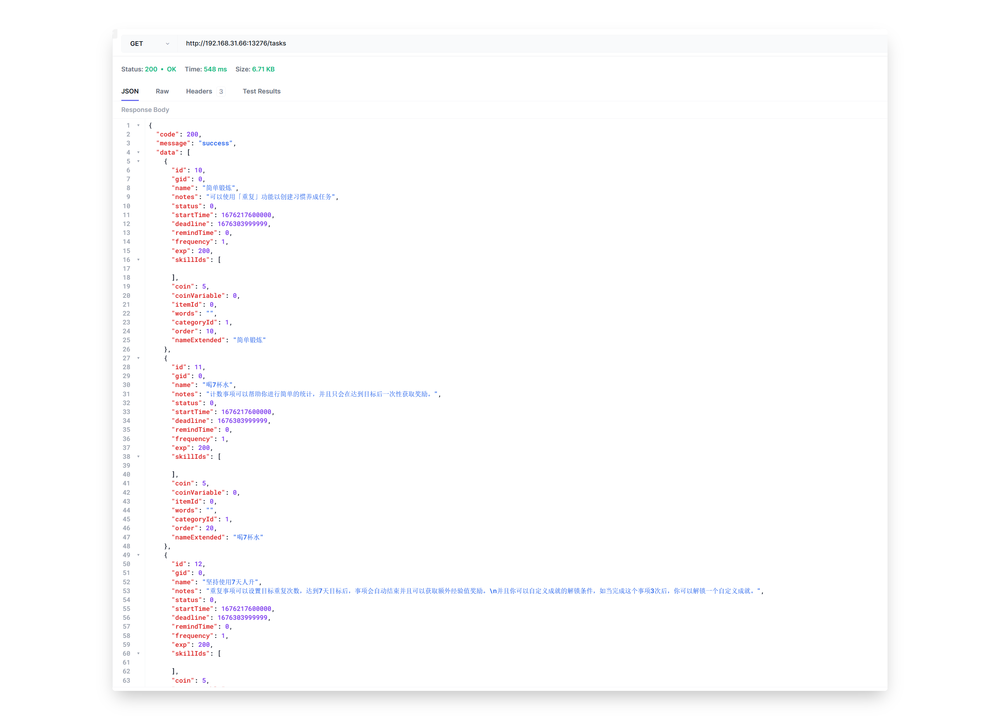

<h1 align="center" padding="100">v1.91. 0 - 状态小部件、自定义等级梯度、简易桌面端（会员内测）</h1>

大家久等了~

由于各种杂事，年底至今整体的开发和学习进度都延后了不少。

线上 v1.90.x 版本比我们想象的要稳定，虽然也有一定数量的小问题，但几乎没有大问题。

大家久等了~

由于各种杂事，年底至今整体的开发和学习进度都延后了不少。

最近终于回到了正常更新的状态，v1.91 将会按照之前的「开发路线图」带来一些更新。

我们原定在 v1.91 引入集成谷歌日历。但在实际开发途中遇到不少技术阻碍。为了尽快推出更多的更新，我们目前暂时决定延后它，转而先开发一些其他功能再回来研究谷歌日历集成。

我们还尝试涉足一个新领域：局域网桌面端的搭建。需要注意的是，该桌面端还十分简陋且依赖于手机数据。

**v1.91 会进行一周或以上的会员内测。**

**如果您是会员，请在「扩展」页面点击加入「alpha测试」，然后在「关于」页面检测更新即可获取到内测版本。**

## 🔖总览

1.   **🏆小部件：全新的状态小部件（第一批）**
2.   **📈属性：自定义等级梯度**
3.   **✨多端：桌面端**
4.   **✏️API：查询完整列表数据和其他改进**
5.   **🍅番茄：自动开始工作、休息计时**
7.  **🚀其他：性能优化**
10. **完整更新日志**

<!-- more -->

---

## 🏆小部件：全新的状态小部件（第一批）

本次更新会带来一系列跟属性、金币相关的小部件：

- 金币（小、大、目标） 
- 属性列表（小、大）

并且这仅仅是第一批~

### 📝 使用方式

一般是长按或双指桌面缩放添加小部件。

**如果你是 MIUI 用户，操作方式会复杂更多**，可以搜索一下 MIUI 怎么添加小部件，或者在 B 站查看我们的视频教程。

---

## 📈属性：自定义等级梯度

在 v1.91 版本中，你可以自定义你的等级梯度，即每个等级所需的经验值。

你可以根据自己的喜好选择更高的挑战性，或是更平缓的增长曲线，现在都依你所愿。

如果你只是想了解系统内置的等级表，也可以前往该页面查看。

### 📝 使用方式

侧边栏 - 设置 - 进阶 - 自定义等级

---

## ✨多端：桌面端

这段时间，我们也尝试了新的东西，并且随着新的 API 更新，我们使它能够查询到各种详细列表数据。

我们开发了一个**完全开源**的局域网桌面端软件，它可以通过连接到您的手机并展示各种列表数据，并且支持一部分简单操作：购买商品、完成任务、导出感想图片并用系统图片浏览器查看。

该软件理论上支持 Windows、Linux 和 MacOS 系统（间接也算是使「人升」支持🍎了，虽然不是大家想要的🍎）。

当前，桌面端仍处于早期开发阶段。

我们将继续进行维护并添加更多功能，例如可以通过桌面端添加任务、以桌面端为适配界面的交互、将感想导出为 markdown 格式等。

### 📝 使用方式

详情可查看「侧边栏 - 设置 - 实验 - 云人升」 一栏。

---

## ✏️API：查询完整列表数据和其他改进

**数据接口**

作为桌面端的数据来源基础，该版本我们提供了完整的数据查询接口。

如果你是 Android 开发者，你可以通过我们的 LifeUp SDK 查询「人升」中的各种数据。

如果你是其他任何类型的开发者，你可以通过使用 HTTP 协议调用《云人升》API。这也是桌面端的做法。

如果你不了解开发，也不用担心：

首先，现在是最好的学习机会。

第二，上述数据的 API 开放，意味着社区的开发者可以使用这些数据进行二次开发。

比如，他们可以设计任务列表页面、商店页面，进行更复杂的二次开发（比如折扣、买卖大头菜功能？）。

二次开发的成果也可以惠及到所有用户（真正的 MOD）。

具体接口后续会补充到 API 文档中。

**其他 API 接口改进**

新增

- ATM 存取款
- 商品设置“是否禁止购买”
- 任务设置“标签颜色”
- 直接设置 ATM 余额
- 简单查询指定商品详情
- 弹窗接口增加第三种按钮和操作选项

行为变动

- confirm_dialog 弹窗 API，如果不提供某些按钮的文本或操作的话，该按钮现在会直接不展示。

  这将提供更高的弹窗控制灵活度，比如你可以设置一个无按钮的纯文本弹窗，用于显示文本、激励语。

- penalty 惩罚 API，以往版本扣除商品最多100件，现在将限制扩展到了9位数。

### 📝 使用方式

查看我们的 API 文档以及 GitHub 仓库。

---

## 🍅番茄：自动开始工作、休息计时

该版本还将引入自动开始番茄钟功能。

请确保你的手机已经进行了「兼容性配置」，避免系统中断番茄钟的运行。

**注意，开启「自动开始休息」后，原先的额外统计的小倒计时功能将失效。**

### 📝 使用方式

前往 番茄 - 右上角设置 页面。

---

## 🚀其他：性能优化

通过用户反馈和在线数据收集，我们发现在大量数据的情况下，“人升”应用中某些数据查询的效率会显著降低。

对于一款待办事项工具类应用，稳定性和长期性是至关重要的。

因此，在这个版本中，我们针对大量数据的场景进行了一系列优化。这些优化能够显著提高大部分列表页面的加载速度（特别是待办事项页面）。

我们将继续针对这些场景进行优化。

---

还没有关注公众号？

关注一波小透明吧.jpg

后续更新介绍等都会在公众号发布。

![[Pasted image 20220522010757.png]]

---

## 完整更新日志

**1.91.0-alpha01 (2023/02/13)**

**✨特性**

1. 支持自定义等级梯度
2. 首批新增小部件
   - 金币（小、大、目标）
   - 属性（小、大）
3. 支持通过 Content Provider API 查询“人升”中的大部分数据详情信息，包括：
   - 提供新版《云人升》
   - 提供简陋的初版局域网桌面版（Windows、Linux、MacOS）
4. 番茄计时记录支持多选删除
5. 番茄钟支持设置自动开始休息和工作
6. API 改进和新增字段，包括：
   - ATM 存取款
   - 商品设置“是否禁止购买”
   - 任务设置“标签颜色”
   - 直接设置 ATM 余额
   - 简单查询指定商品详情
   - 弹窗接口增加第三种按钮和操作选项

**♻️优化**

1. 改进大量数据时的查询、处理速度和性能表现

2. 修复自适应图标的不正确边距问题

3. 优化番茄计时记录的显示效果

4. 改进恢复备份时的交互表现

5. 增加通过 Google Play 获得会员许可的 UI 体现

6. 当从文件系统直接导入备份时，如果选中的不是“人升”的备份文件，会提供禁用该一键导入特性的提示

7. 在选择商品弹窗时，搜索商品后，自动关闭输入法

8. API 行为变动，包括：

   - confirm_dialog 弹窗 API，如果不提供某些按钮的文本或操作的话，该按钮现在会直接不展示。

     这将提供更高的弹窗控制灵活度，比如你可以设置一个无按钮的纯文本弹窗，用于显示文本、激励语。

   - penalty 惩罚 API，以往版本扣除商品最多100件，现在将限制扩展到了9位数。

**🐛修复**

1. 修复番茄计时等页面会在某些情况下在尾部显示“加载中”的问题
2. 修复某些第三方库导致的崩溃问题
3. 修复将番茄钟放置于底部导航栏时，会因为提示弹窗而崩溃的问题
4. 修复在浏览他人个人主页时，显示的属性值异常的问题
5. 修复属性等级降低 API 事件、通知未能正确发送的问题
6. 修复某些长按-编辑页面的交互问题
7. 修复图片管理、合成页面的部分边距异常问题
8. 修复部分弹窗不可滚动，导致横屏下无法正常使用的问题

**✨特殊发布：云人升 v1.1.1（2023/02/13）**

1. 支持 Content Provider 信息读取和授权操作。
2. 在服务启动期间，申请 Wake Lock，以便在锁屏时也能够响应操作。
3. 增加 Content Provider 的一系列接口。

**✨特殊发布：人升-桌面端 v1.0.1（2023/02/13）**

初版发布，需要搭配《云人升》和手机端使用。

支持以下操作：

- 查询任务、清单、商品、成就、商品、感想列表。
- 购买商品、完成任务。
- 支持使用桌面端图片浏览器查看感想大图。

---

> 蹭个热度
>
> 润色助理：ChatGPT
>
> 代码编写、单元测试编写助理：GitHub Copilot
