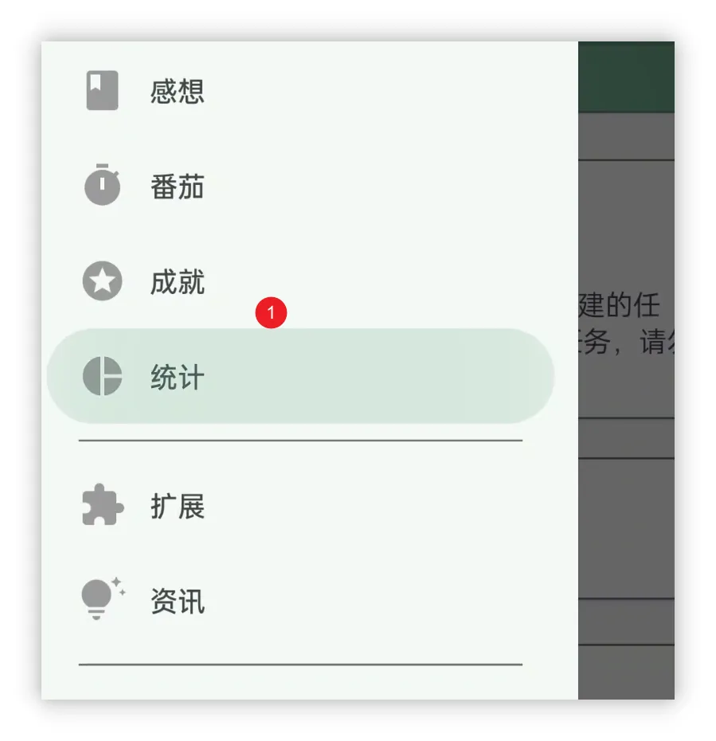

![[cover 1.jpg]]
<h1 align="center" padding="100">v1.92.0 - 统计2.0</h1>

## 简介
该版本我们带来了全新设计的统计功能，目前正在会员内测中，欢迎参与内测~

## 📈统计 2.0

统计和数据复盘也是我们提升生产力的重要一步。

> 回顾自己的努力：既能以数据激励自己，也能从数据中挖掘问题，改进自己的计划。

为此，我们推出了【统计 2.0】，为你带来一系列有趣的数据统计。

这些统计都是基于我们以往提供的原始历史数据（任务历史、计时历史、仓库使用历史等）。

 

### ❓如何使用？

升级 v1.92.0 内测版本后，点击【统计】页面，再点击顶部的【点击查看新版统计】即可~

 

### 📊统计项

统计 2.0 会涵盖各个模块的数据统计：无论是**番茄**的专注任务占比、每天的平均番茄数、每天的**属性**变动、**商品**购买统计、**任务**完成列表等都应有尽有。

 

### ⏰时间筛选

本次统计 2.0 支持了**高自由度**的时间范围筛选，你可以快捷查看当天、当周、当月、当年，自定义时间范围。

你的人升应由你做主，不必等到年末查看年终总结，也不必害怕再也没法看到每年的年终总结。

在人升中，可以随时查看**往年的年终总结**，好奇自己的2022年年终总结数据吗~赶快更新试试吧！

**不同的时间范围选择，可能会展示不同类型的统计项。**

 

### 👥分享

欢迎去朋友圈晒出你的**人升轨迹**！

现在你**只需要长按**你想要分享的数据统计卡片，即可生成分享卡片，并一键分享到其他应用（如微信朋友圈、QQ等）。

 

### 🍪画饼时间

虽然目前的统计几乎涵盖了各个模块，但开发下来仍觉得有很多改进空间。

一些已知问题：

- 时间范围的交互改进（比如 2020年 就在使用的用户，应当直接提供一个【2020年】统计的选项）
- 数据计算耗时问题，增加加载进度展示。
  - 如果选择的时间段的数据量比较大，目前计算可能会比较耗时，而且没有明确的进度显示
  - 长列表生成分享卡片，可能会遇到生成出来了，但是展示不了的问题（不影响分享）

规划：

- 持续增加各种统计项和统计维度，比如现在是没法做到回顾某一天的属性值的。
- 新旧统计合并。
- 做好统计和状态的项目区分，统一重新设计【状态】+【我的】+【统计】页面。

---
除此之外，我们还修复了近段时间反馈的大量问题和一些问题修复。

详情可以查阅下述的更新日志~

## 完整更新日志

**1.92.0 (2023/07/11)**

> 会员内测发布时间

**✨特性**

1. 统计2.0
1. 分享卡片

**♻️优化**

1. 现在支持为“不可购买”的商品设置价格，并用于退货等场景
2. 当在设置中关闭“独立设置任务惩罚”后，不再显示惩罚按钮
3. 优化团队详情中子任务的展示 UI
4. 优化感想的展示 UI

**🐛修复**

1. 修复当属性裁剪样式改为“圆角矩形”后，编辑图标可能会长期显示老图标的问题

