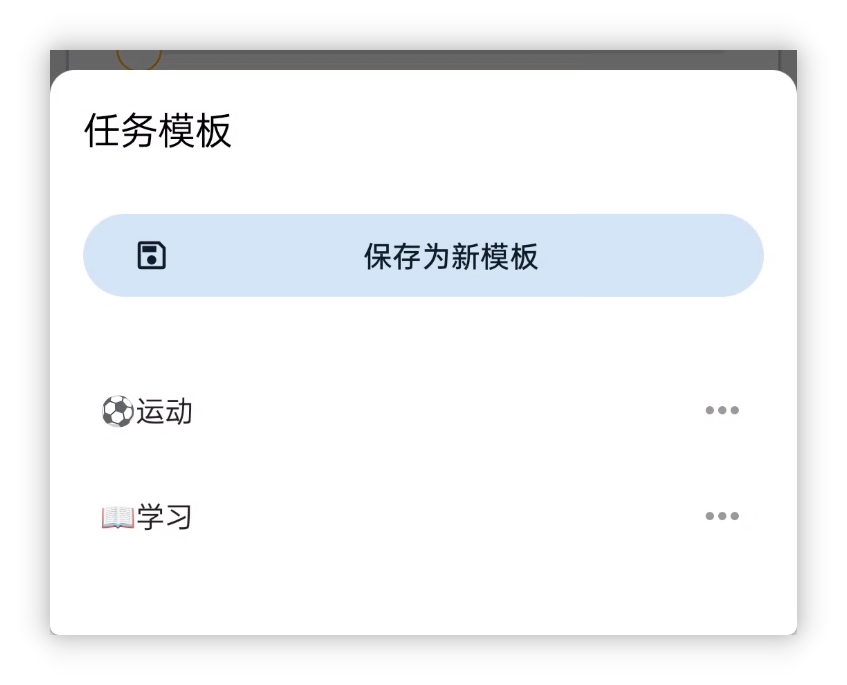
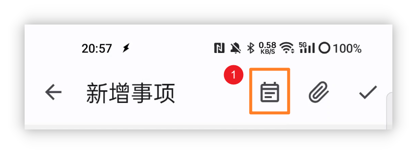
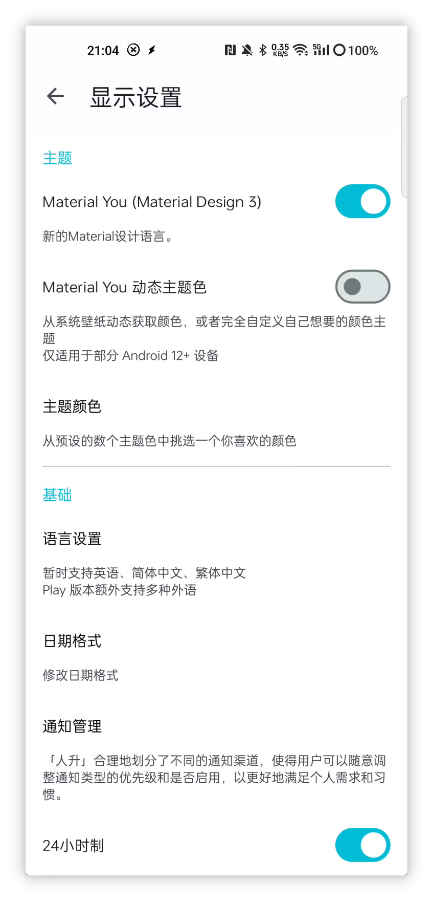
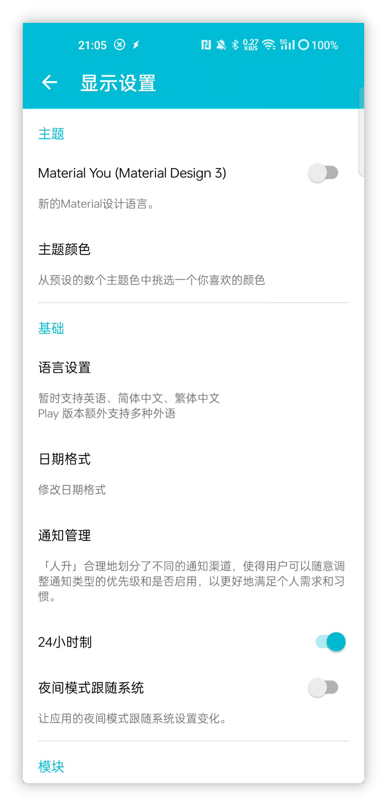
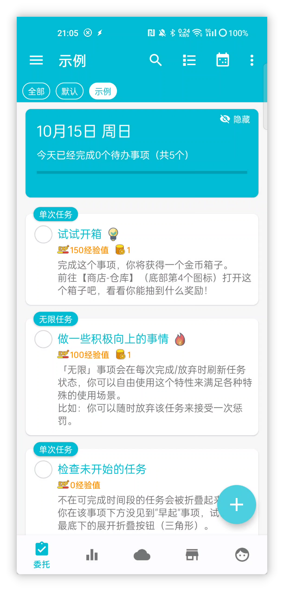
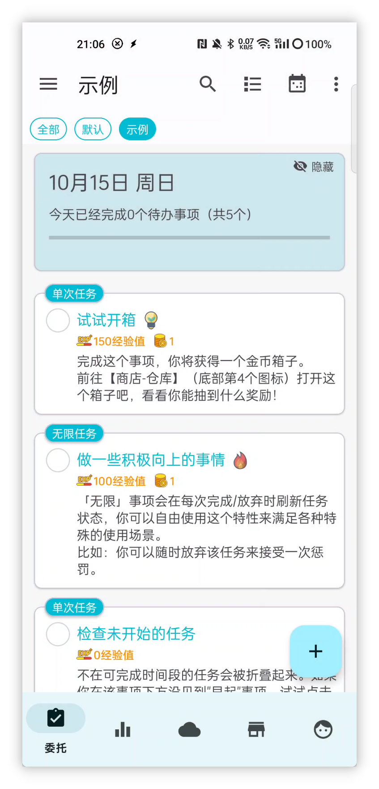
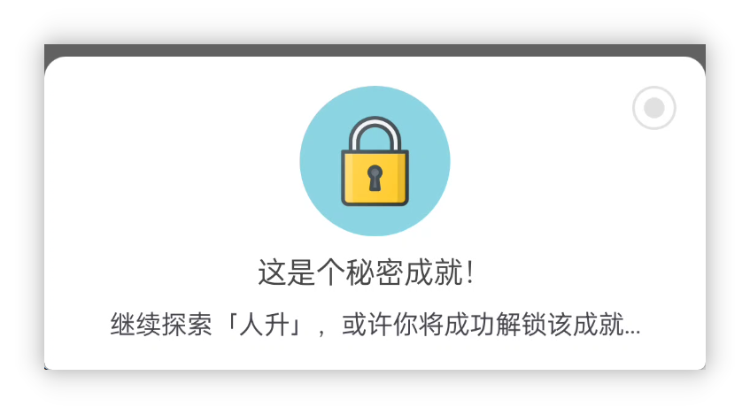

![[cover 1.jpg]]
<h1 align="center" padding="100">v1.93.0 任务模板与新主题</h1>

## 简介
许久不见~

本次更新带来了任务模板、秘密成就，以及完整适配了新的设计语言 Material You 等特性。

部分功能模块如感想、API 也有着部分改进和优化。

**❓如何加入内测？**

如果你已经是会员的话，可以在应用内-关于页面，点击**检测更新**获取内测版本。

目前版本正在“会员尝鲜”渠道发布，后续测试稳定后，会轮动到其他渠道。

**📧如何反馈问题？**

如果你在内测途中遇到了任何问题，欢迎随时通过邮件、会员渠道、QQ 群等方式反馈~

## 一、📋任务模板

该版本引入了内置的任务模板功能。而不再需要使用“复制任务”、“API”的方式间接实现了。

用户在新建/编辑任务时，可以将当前的选项保存为模板。

未来创建任务时，可以一键导入之前的奖励设置、任务设置等等。

 

### 📕如何使用？

新建/编辑任务时，点击顶栏的任务模板按钮即可。

任务模板会记录你设置的绝大多数内容，但目前并不包含期限时间。

## 二、🎨Material You 主题

--

该版本完整适配了 Material You 的 UI 设计语言（主题）。

这一套设计语言更佳现代化，并且观感上会更佳简洁。也是未来官方主推的 UI 样式之一。

并且由于 Material You 有个核心特色是【每个人都能拥有不一样的主题色】。

这使得《人升》也能引入动态从壁纸取色、自选主题色等新机制了。**（但这一点需要设备支持。）**

 

### 📕如何使用？

如上图所示，打开【侧边栏 - 设置 - 显示】即可调整相关选项。

如果你的设备不支持动态主题色，则还是只能通过预设的主题色中挑选。

但如果你的设备支持动态主题色的话，你可以开启动态主题色功能，并高自由度地自定义你想要的主题色：

## 三、✨更多特性

**UI 主题**

1. 完整适配 Material Design 3
2. 支持设置 Material Design 3 主题的颜色来源：自选颜色、从壁纸取色、从图片取色等
3. 部分动画效果改进：弹窗等
4. 优化“边到边”（沉浸式）适配效果

**任务**

1. 支持任务模板
2. 详情页面的统计，支持切换依据时间标准。并且优化了默认选项
3. 历史页面支持搜索任务名称，并调整了相应的 UI 和交互

**成就**

1. 支持设置秘密成就
2. 添加成就时，支持“继续添加下一个成就”

**属性**

1. 支持隐藏属性

**番茄**

1. 支持编辑计时记录
2. 番茄页面支持完成任务（暂停状态下，长按选择的任务）

**感想**

1. 支持在感想页面直接创建感想

**API**

1. 增加`使用商品`的 API

2. 增加`随机` API

3. 增加`直接编辑经验值`的 API

4. `商品`API现支持调整“禁止使用”、“标题颜色”、“操作文案”等参数

5. `商店设置` API 支持“silent”参数

6. 支持`time`时间占位符

   现在你可以不借助自动化工具，就可以使用 API 设置明天截止、下个月截止之类的任务了

---

除此之外，我们还修复了近段时间反馈的大量问题和一些问题修复。

详情可以查阅下述的更新日志~

### ♻️优化

1. 部分显示数据 ID 的地方增加前缀
2. 团队动态显示优化
3. 尝试解决部分 Toast 提示太长显示不全的问题
4. 优化了小部件完成团队时，部分逻辑与应用内不一致的问题
5. 统计页面：在选中“自定义”时间范围后，再次点击“自定义”，现在可以触发重新选择日期
6. 兼容鸿蒙 4 上进度条通知没法显示操作按钮的问题
7. 优化通知请求的交互逻辑
8. 优化输入法会挡住【目标重复次数】输入的问题
9. 现在创建任务时，会记录用户选择的非具体的开始时间（比如自动、期限当天），编辑时，会恢复此类选项而非具体时间，避免导致编辑的时间不符合预期
10. 创建任务时，如果出现了重复不符合预期的警告，现在也会在“检查重复”弹窗上显示
11. 增加印尼语
12. 更新翻译

## 🐛修复

1. 修复某些情况下，世界模块可能会卡加载（一直转圈圈）的问题
2. 修复某些情况下，商店/仓库可能会一直显示加载（一直转圈圈）的问题
3. 修复通过 content provider 调用含 UI 的 API 时，可能会发生错误的问题
4. 修复任务排序可能不符合预期的问题
5. 修复统计页面选择“自定义”时间范围后，数据不正确的问题
6. 修复通知请求的弹窗不支持滚动的问题
7. 修复世界模块搜索某些情况下会显示所有内容的问题
8. 修复【显示已完成】选项也会展示被冻结的任务的问题
9. 修复统计页面平均值计算问题

