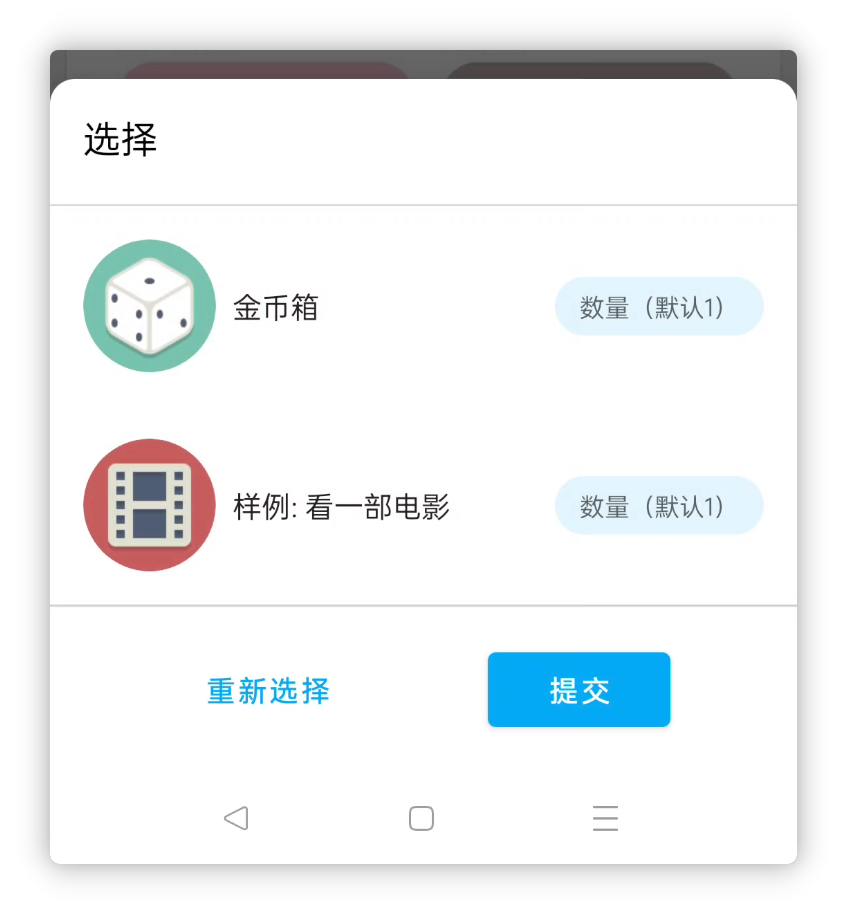
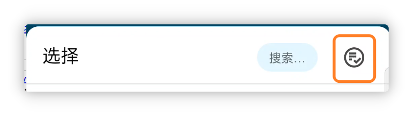
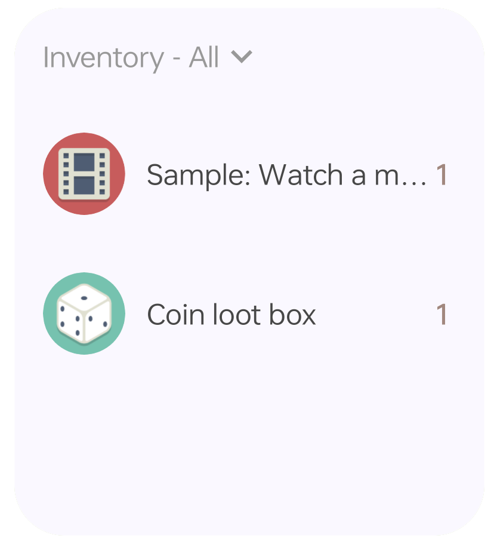
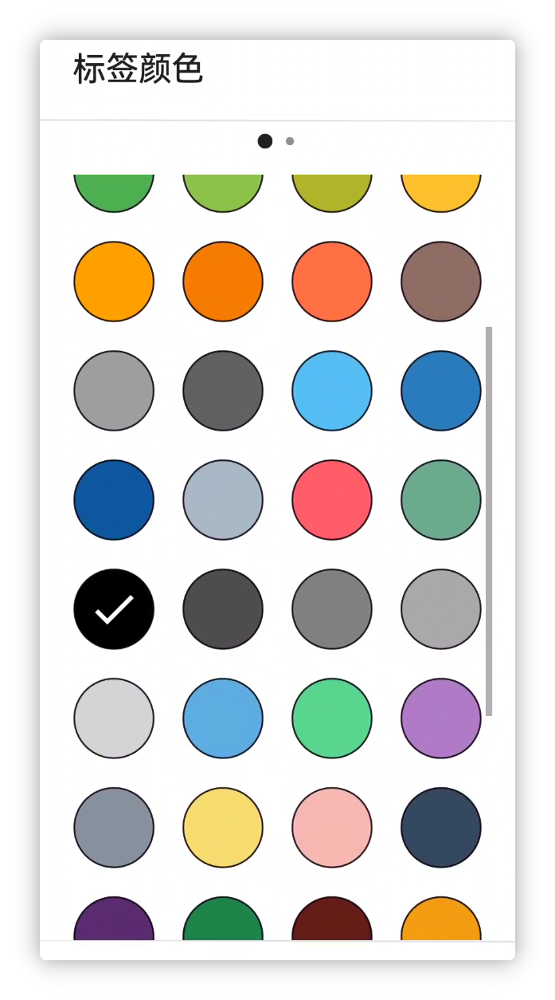
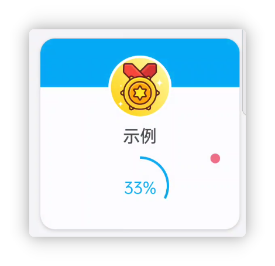
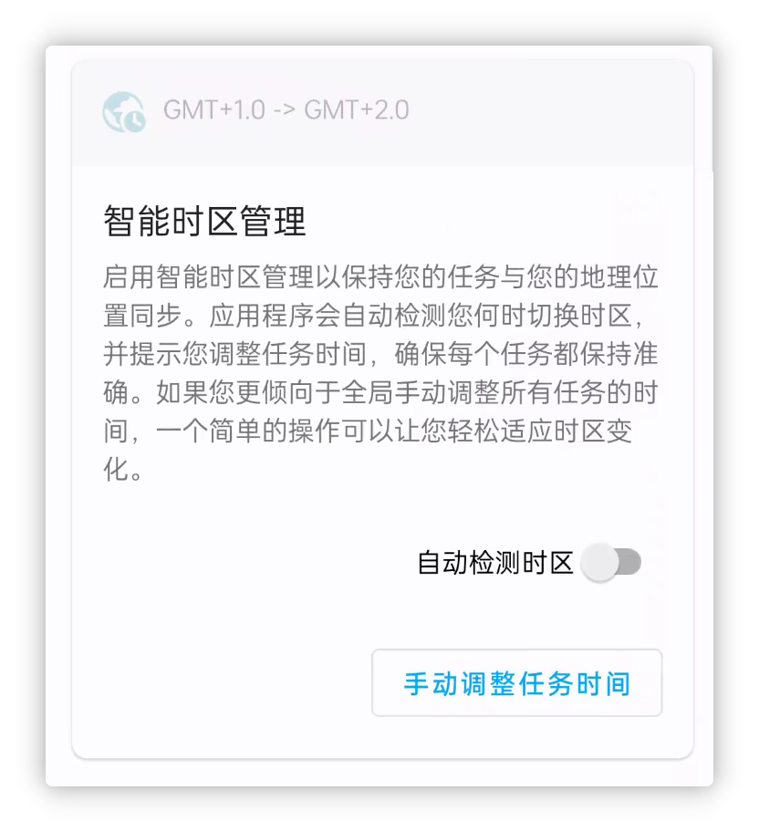
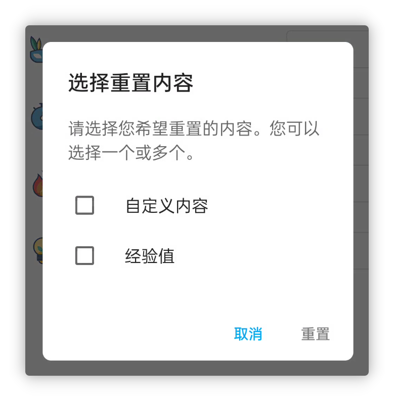

<h1 align="center" padding="100">v1.94.0 多选商品奖励</h1>

## 简介
本次更新主要带来了多选商品奖励、仓库小部件等特性，其次仍是大量的优化、性能提升和问题修复。

**❓如何加入内测？**

如果你已经是会员的话，可以在应用内-关于页面，点击**检测更新**获取内测版本。

目前版本正在“会员尝鲜”渠道发布，预计本周测试稳定后，会轮动到其他渠道（会员内测-稳定）。

**📧如何反馈问题？**

如果你在内测途中遇到了任何问题，欢迎随时通过邮件、会员渠道、QQ 群等方式反馈~

## 一、✅多选商品奖励

现在，在人升中各个选择商品的地方，基本都支持了多选商品。而不再需要通过设置开箱、合成的方式来实现多种奖励。

比如，你可以：

- 直接为任务设置多种商品奖励
- 设置开箱时，直接挑选多个商品，再一次性设置概率
- 直接为成就、子任务设置多种商品奖励

 

### 📕如何使用？

选择商品时，点击顶部的多选按钮即可。

> 需要注意的是，部分场景可能仅支持单选。

## 二、🔧仓库小部件

该版本引入了两种尺寸的仓库小部件。

现在你可以直接在桌面上查看仓库的内容，并快捷使用仓库里的商品了。

 

### 🚀 优化和问题解决

尽管我们数个版本前推出了商店小部件。

但上线后，我们陆续收集到了一些崩溃或者异常问题。

比如由于小部件的系统传输限制，如果商品过多甚至可能会导致应用崩溃。或者切换清单异常。或者自定义图片加载失效。

在该版本中，我们也找到了合适的解决方案。现在商店、仓库小部件应该支持能够显示大量的商品，我们测试过接近1000件商品的商店小部件仍能够正常使用和加载。（当然，不推荐这样干）。

 

### 📕如何使用？

一般是长按系统桌面即可创建小部件。

如果你的设备是小米、红米设备（MIUI/HyperOS），MIUI/HyperOS添加小部件的方式较为隐藏，请查阅兼容性配置文档查看如何添加小部件。

## 三、✨更多特性

**UI 主题**

1. 自定义（任务、商品文本）颜色增加了更多的预设值
1. 适配 Android 14 单色自适应图标特性
1. 增加了很多语言适配（Google Play版本）

**成就**

1. 如果存在未领取奖励的成就，成就清单现会显示小红点。

**任务**

1. 惩罚任务的子任务现会正常执行惩罚逻辑
1. 增加【智能时区管理】，如果你涉及到跨时区工作，人升也支持自动检测时区变动，并且支持全局调整时间
1. 详情页面的统计依据现支持记忆上一次的选择，并且我们优化了部分场景的默认值
1. 优化了【我的】页面的连续完成任务天数的宽限处理，现在应该某一天忘记完成任务，补打卡也能续上连续完成天数

**属性**

1. 支持删除经验值记录
1. 支持重置单独一个属性的经验值

**小部件**

1. 现在点击商店、仓库小部件的空白处，支持直接进入小部件所指向的清单，而非上一次清单
2. 任务小部件现会显示计数任务的进度

**API**

> API 相关的文档在本文发布时可能仍未更新，我们预计会在本周内更新，请等待一会~

1. 增加编辑番茄记录的API
1. 完成任务的API现也支持正常处理惩罚任务
1. 完成任务的API现也支持处理计数任务（增加`count`参数）
1. 完成任务的API现支持奖励系数参数
1. 调整商品API支持更改商品所属清单id
1. 新建、调整商品的API支持排序依据参数
1. 跳转API现支持跳转到使用商品弹窗
1. 部分参数的定义不够统一，现已统一处理。如`itemId` -> `item_id`
1. 增加正计时开始、暂停、结束的广播通知
1. 调整商品的API的`title_color_string`现支持传空字符串以恢复默认值
1. 完成任务的广播增加清单id
1. 开箱、合成现也会触发使用商品的广播

---

除此之外，我们还修复了近段时间反馈的大量问题和一些问题修复。

详情可以查阅下述的更新日志~

### ♻️优化

1. 添加或编辑任务时，如果没有选择属性，输入经验值增加警告提示
1. 优化了上传重试记录
1. 优化了自定义等级页面的标题展示和输入限制
1. 优化了经历过大量重复的任务的撤销性能耗时问题。
1. 重构了使用商品弹窗、日历界面等逻辑。
1. 优化了任务提醒的相关逻辑，确保已经删除或者来自之前数据的提醒不会再被发出。
1. 优化了备份界面的相关等待中文案。
1. 在自定义属性页面选择的图片，现也会加入到历史选择中。
1. 编辑番茄记录时，现会尝试修正（增加、减少）正确的番茄数。

### 🐛修复

1. 修复统计、备份相关的系统成就在重构后未正常触发的问题。
1. 修复随机API搭配toastAPI小部件使用等场景可能会跟默认的toast冲突问题。
1. 修复了从小部件进入任务详情，在某些场景下不会刷新任务详情的问题。
1. 修复了某些特殊情况可能会导致错误多次开箱的问题（提前预支商品库存）。
1. 修复在详情页面编辑没有子任务的任务，并新增子任务，返回后不会展示子任务的问题。
1. 修复了某些特殊情况，无法编辑金币奖励的问题。
1. 修复了某些情况，领取团队事项可能不生效的问题。
1. 修复了MD2下某些底部弹窗的样式异常问题。
1. 修复了番茄钟的追加时间取值可能错误的问题。
1. 修复了经验值变动小部件的颜色条可能显示不出来的问题。
1. 修复了某些任务在日历-进行中可能没法正常显示出来的问题。
1. 修复了历史、感想等页面的某些列表加载问题。
1. 修复了完成任务API连续调用两次没法连续完成两次任务的问题。

