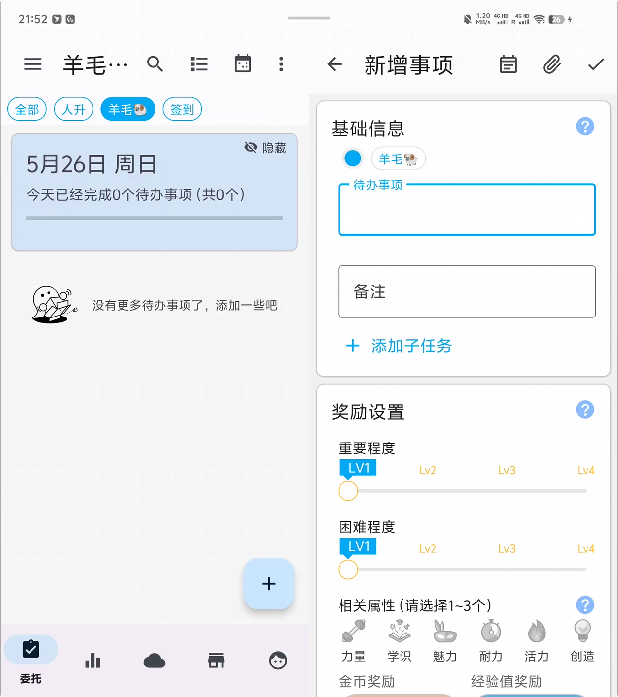
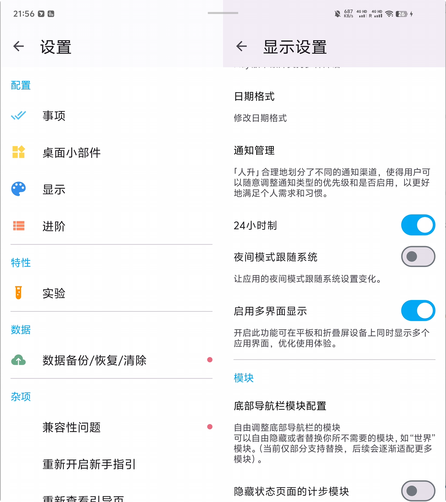
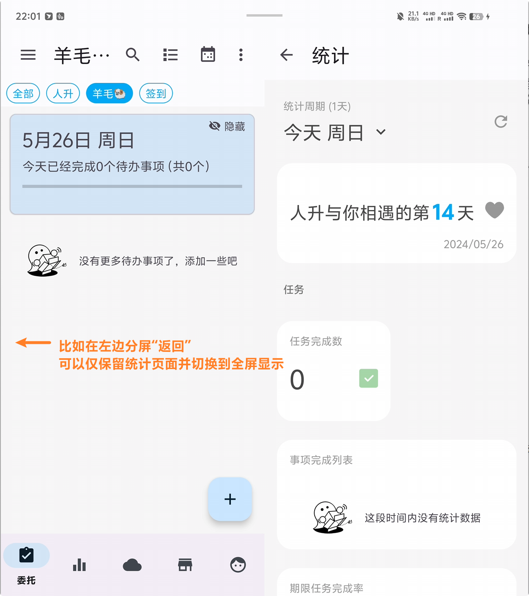
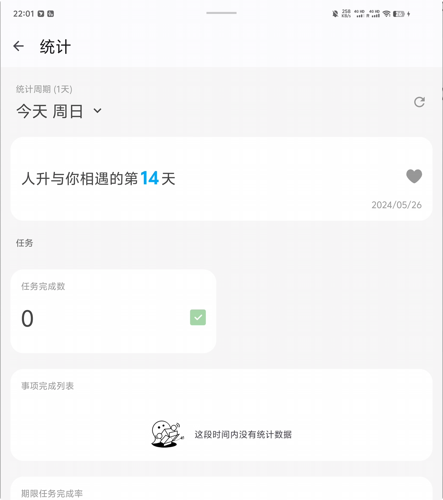

<h1 align="center" padding="100">v1.95.0 大屏幕适配</h1>

## 简介
本期更新主要带来了大屏幕设备的显示优化，支持应用内分屏显示多个界面（平行视界）。

除了这一点之外，还带了一部分优化和问题修复。

比如商店、仓库小部件支持了与应用内一致的裁剪显示，统计图表的数据显示优化等。

即便是非大屏幕设备，也推荐更新~

## 一、大屏幕显示优化

如果你使用的大屏幕设备，且系统支持该功能的话，现在**人升**支持分屏显示不同的界面。

不同的界面会有着不同的分屏规则（比如成就页面会优先左边显示成就清单，右边切换到清单内的成就列表），用户也可以通过在不同的分屏中“返回”来让另外一边屏幕占满全屏。

如果你对当前的分屏规则有任何反馈的话，欢迎随时到 QQ 频道或者 GitHub issues 页面提交反馈~

 

### 📕如何使用？

- 更新后，该功能默认开启。
- 可以前往【设置】-【显示】-【启用多界面显示】调整功能是否开启。

⚠️ 注意，该功能需要设备系统支持。并非所有大屏设备支持。如果你的设备不支持的话，可以查看是否有系统更新。

## 三、✨更多优化和近期更新日志

**🎉1.95.0-rc01 (2024/05/24)**

**✨特性**

**重点更新**

1. 支持为平板、折叠屏等大屏设备应用内分屏显示

**♻️优化**

1. 商店、仓库小部件的图片现重新支持了应用内一致的裁剪效果
2. 统计页面，当只选择一天时，现在也支持显示折线图

**🐛修复**

1. 修复了编辑 API 任务时，编辑页面显示的任务类型不正确的问题
2. 修复了统计页面中任务完成、放弃、逾期数统计计算异常的问题

**1.94.3 (2024/05/10)**

**♻️优化**

1. 当系统深色模式变动时，现会尝试更新小部件适配主题
2. 当隐藏了【世界】模块后，系统成就的小红点提醒不再计算【世界】模块相关的数据

**🐛修复**

1. 修复了多选商品时的低概率崩溃问题
2. 修复了与弹窗相关的低概率崩溃问题
3. 修复了调用修改商品 API 时，仓库小部件可能不会刷新的问题
4. 修复了仓库小部件可以使用【不可使用】的商品的问题

**1.94.2 (2024/04/26)**

**🐛修复**

1. 修复了计算任务当前次数异常的问题（会导致设置了目标重复次数的任务进度不准确）
   - 该修复会回滚之前的优化撤销任务的性能的改动，待后续实现更合理的解决方案

