<h1 align="center" padding="100">v1.96.0 获得时自动使用商品</h1>

## 简介
本期更新主要支持了：

1. 完成任务或解锁成就时直接使用商品，触发商品效果
2. 单次使用商品的数量限制放宽至 1000
3. 现购买开箱、合成类商品也支持直接使用（开箱/合成）
4. 团队任务也将支持发布感想至本地感想

## 一、完成任务或解锁成就时，直接使用商品

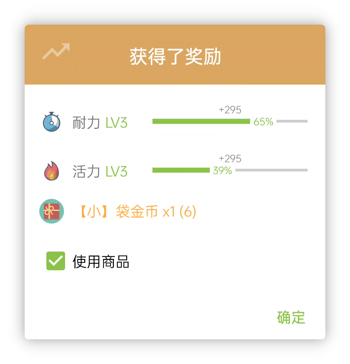

 

### 📕如何使用？

- 该功能对任务（事项）、成就都生效。
- 目前该功能不会默认开启，你需要编辑任务或成就的商品奖励，勾选自动使用商品才针对该任务或成就启用该功能：

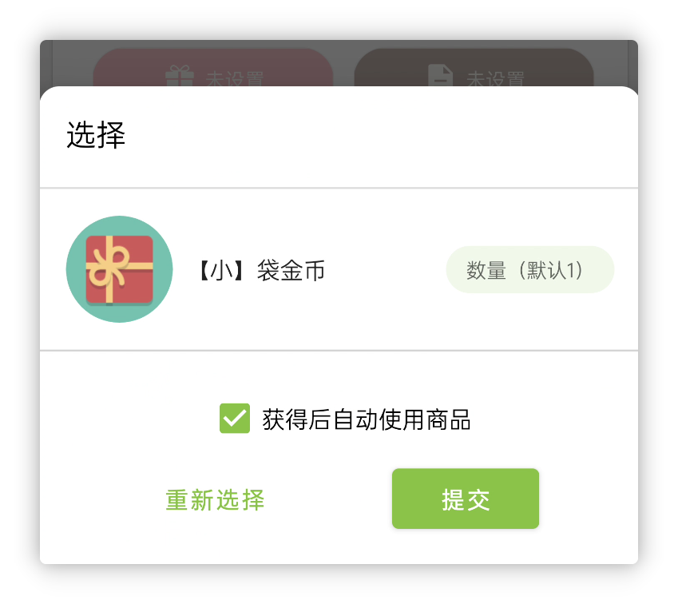

随后在完成任务时，即可二次确认是否要立即使用商品。

**该功能适配所有的商品使用效果，包括：**

- 经验值增减
- 金币增减
- 触发 URL 跳转（API）
- 倒计时
- 开箱
- 简易合成

不过使用该功能的话，有一点需要特别留意：

商品的使用效果非常复杂，**人升是不支持撤销商品使用的。**

如果你完成了任务，并且使用商品，然后再撤销完成，这实质上可能会导致你的商品数量扣至负数。

这也是为什么完成任务的弹窗会有二次确认是否要使用商品。

未来版本也会针对拥有数为负数的商品加强交互提示。

## 二、“使用”商品优化

除了上述功能外，我们针对“使用”商品的逻辑也做了更多的优化：

1. 购买开箱、合成类商品，现在也支持直接使用
2. 单次使用包含特殊使用效果的商品的最大数量限制从100调整至1000（包含开箱，但URL效果比较特殊，仍限制为1）

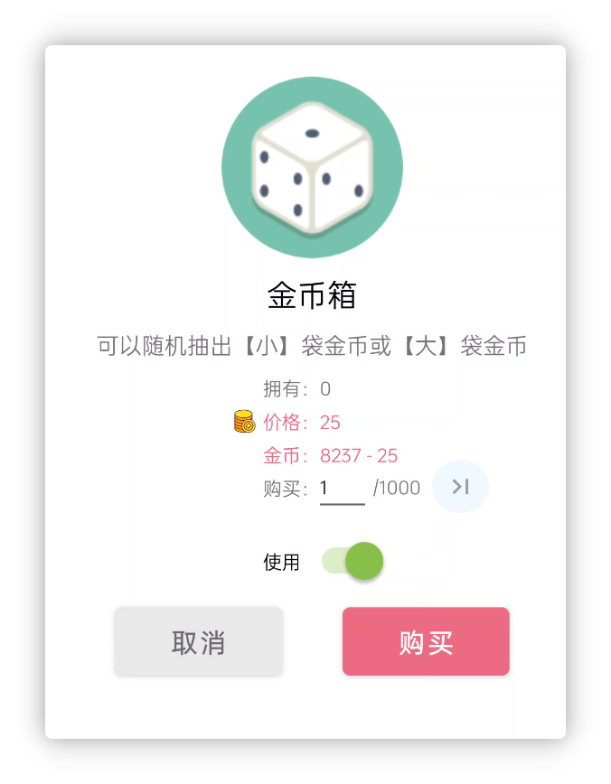

## 三、团队任务发布本地感想

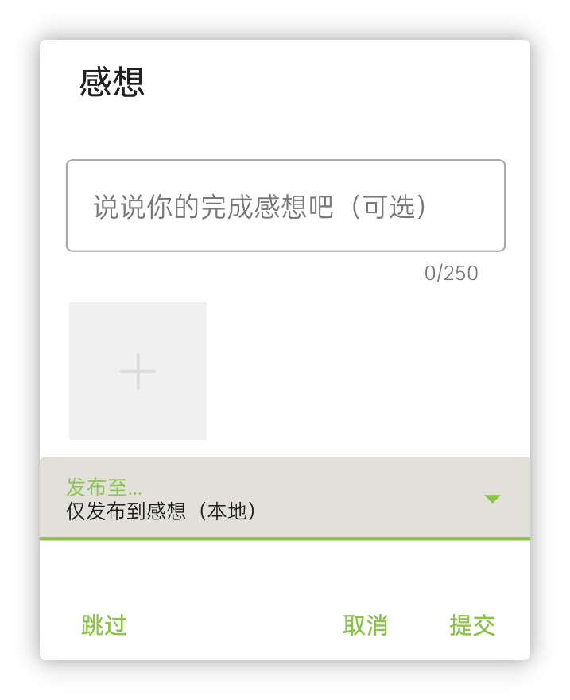

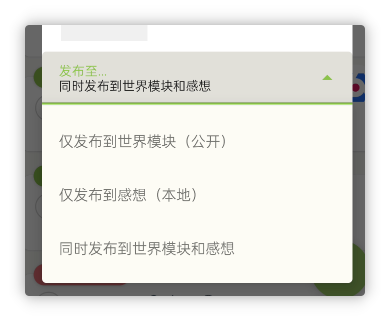

现在完成团队任务，你可以自由选择发布感想的地方。

## 四、奖励、惩罚弹窗重构

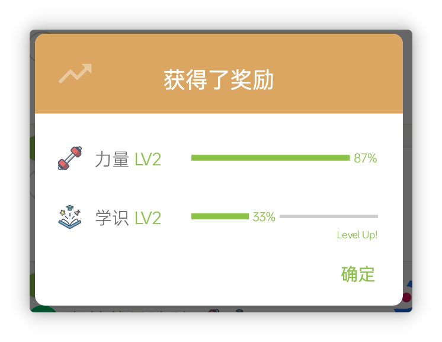

我们重构了属性奖励、惩罚弹窗的相关逻辑，重构后：

- 它将支持任意数量的属性，也支持不同的数值增减，所以我们能够同步作出一些改进：
  - 所以我们移除了商品使用效果中对属性数量的限制
  - 逾期后的经验值弹窗将不再会被分割成多个弹窗显示，而是合并成同一个弹窗
  - 商品的使用效果也不会根据不同的数值而拆分多个弹窗显示，而是合并成同一个弹窗
- 统一和改进过的动画播放效果，现在会更加流畅与一致

## 五、其他一些小功能

**支持为历史任务计时**

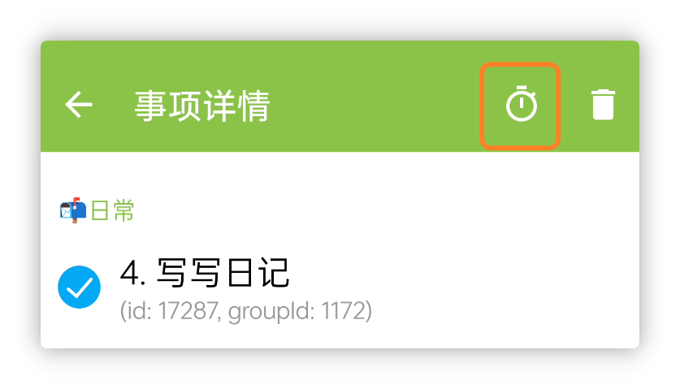

**任务备注中的第三方 URL Scheme 现也支持解析和直接点击跳转**

比如点击任务备注打开支付宝：

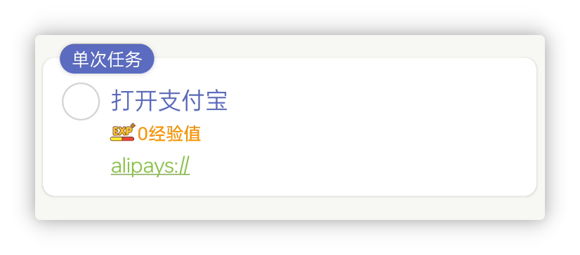

或者直接放人升的API：

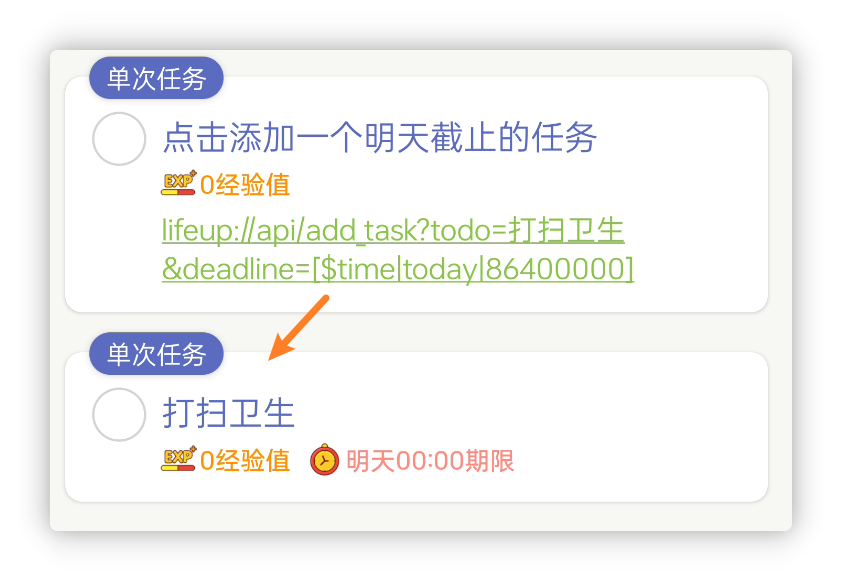

**历史页面现支持通过任务备注搜索历史记录**

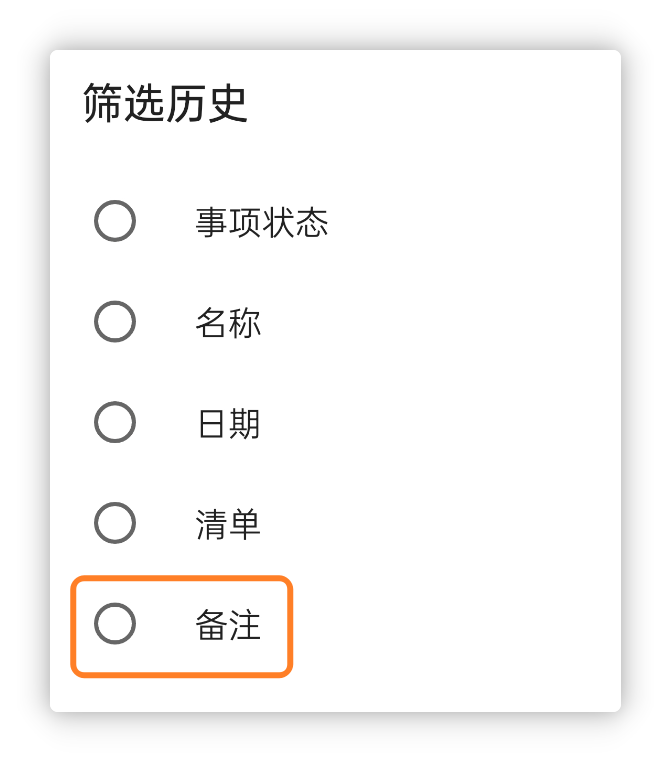

**统计页面支持按大类筛选**

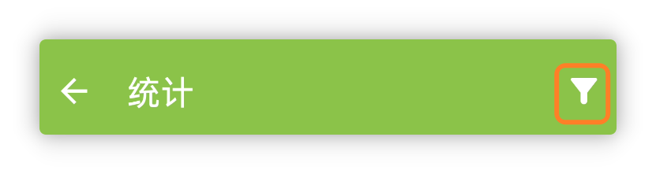

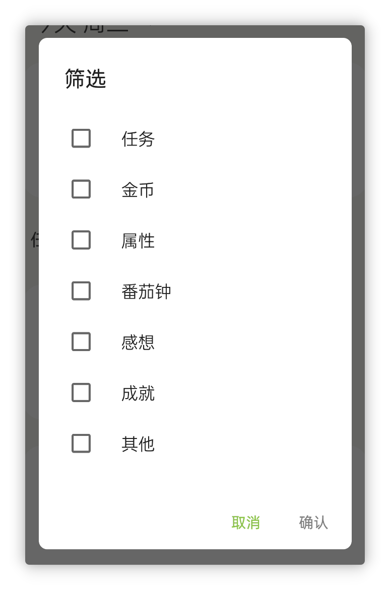

**在技术层面上**，

1. 我们全面升级了人升的相关基础依赖、构建工具和混淆规则等。最明显的改进可能是应用体积下降了（v1.95.0版本国内安装包15.9MB -> v1.96.0-beta01版本国内会员内测13.4MB）
2. 我们自动化了文档库的发布流程，现在只要提交改动到仓库即可自动发布到对应的站点。在这里也特别感谢@WantenMN最近对文档库的 PR 贡献。

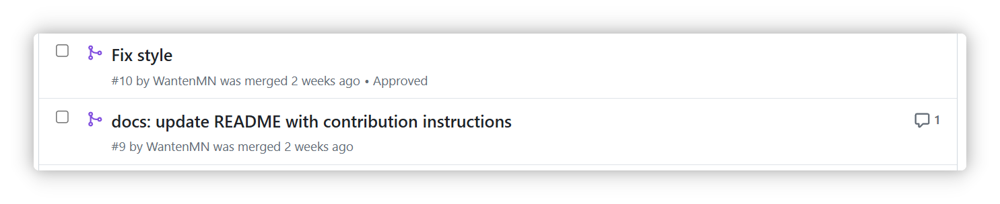

3. 自动化了会员内测的相关发布流程。

## 六、✨更多优化和近期更新日志

**🎉1.96.0 - beta01**

**✨特性**

**重点更新**

1. 完成任务或解锁成就时直接使用商品，触发商品效果
2. 单次使用商品的数量限制放宽至 1000
3. 现购买开箱、合成类商品也支持直接使用（开箱/合成）
4. 团队任务也将支持发布感想至本地感想
5. 任务备注中的第三方 URL Scheme 现也支持解析和直接点击跳转
6. 历史页面现支持通过任务备注搜索历史记录
7. 支持为历史任务计时
8. 统计页面支持按大类筛选
9. 重构了属性经验值奖励、惩罚弹窗：同步优化了商品使用效果的属性选择数量限制、逾期的属性经验值减少弹窗拆分等相关逻辑

**♻️优化**

1. 选择商品时，单选现在也沿用与多选一致的UI效果
1. 优化了任务列表的加载速度
1. 现添加或编辑任务时，不再强制要求期限时间在当前时间之后，这可以用于创建历史记录，以及增加了一些灵活性。
1. 如果开启了显示数据ID，现感想弹窗也会显示对应的 ID
1. 优化了逾期处理弹窗的相关性能问题
1. 统一了倒计时计时状态和暂停状态的按钮顺序
1. 世界模块-个人主页删除动态的交互改为更容易理解的按钮
1. 感想、成就页面的相关加载效果优化

**🐛修复**

-
