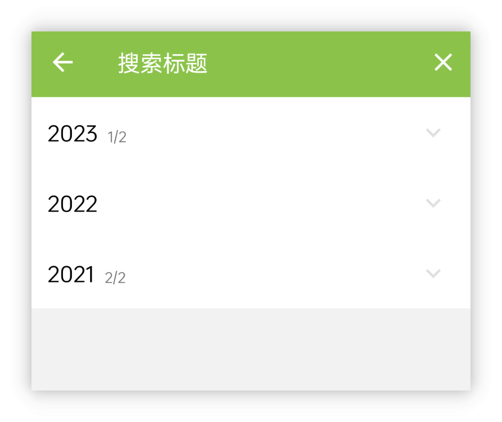
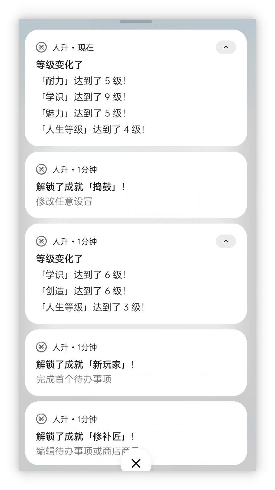
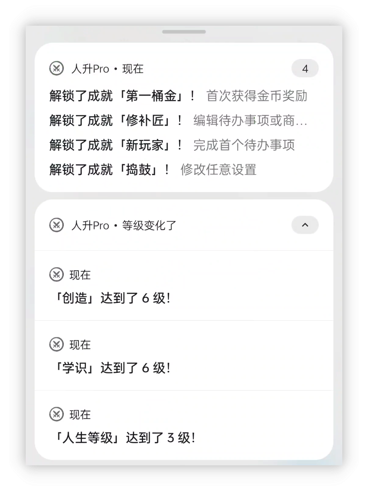
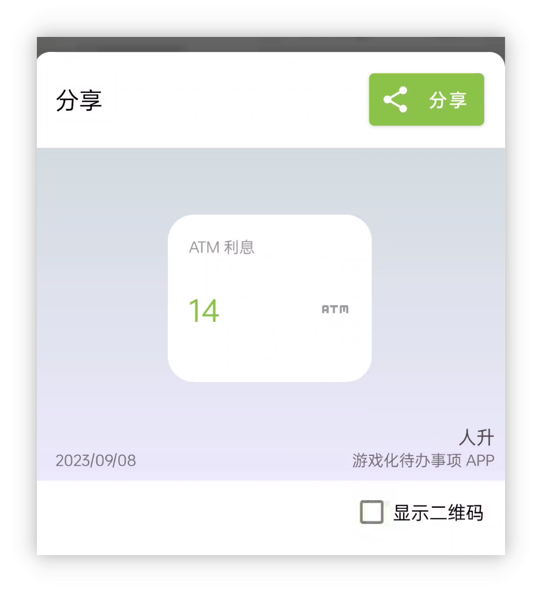
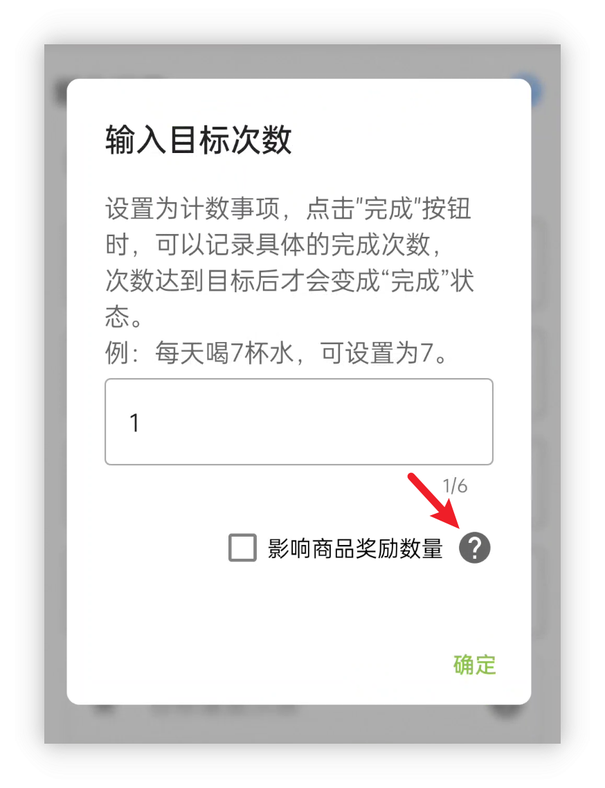
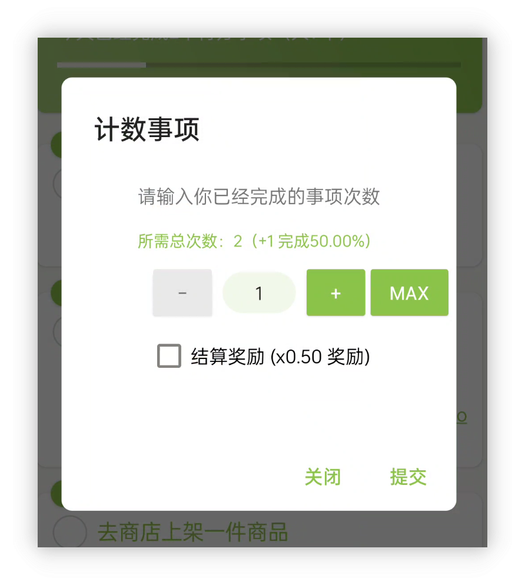
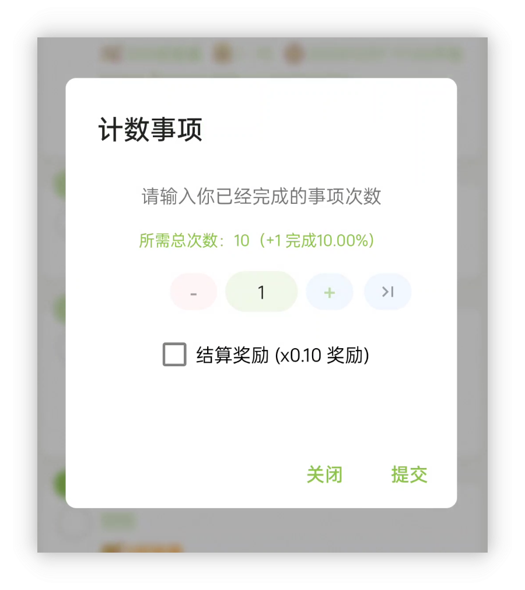
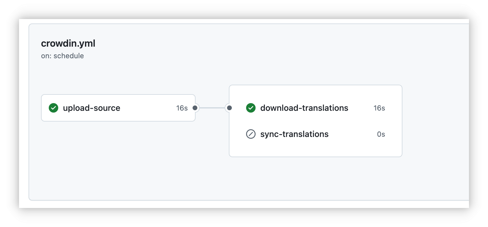
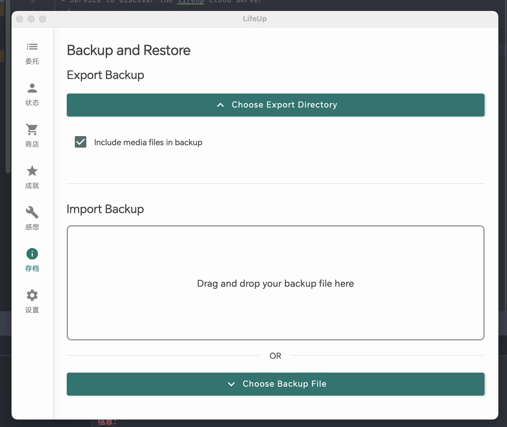
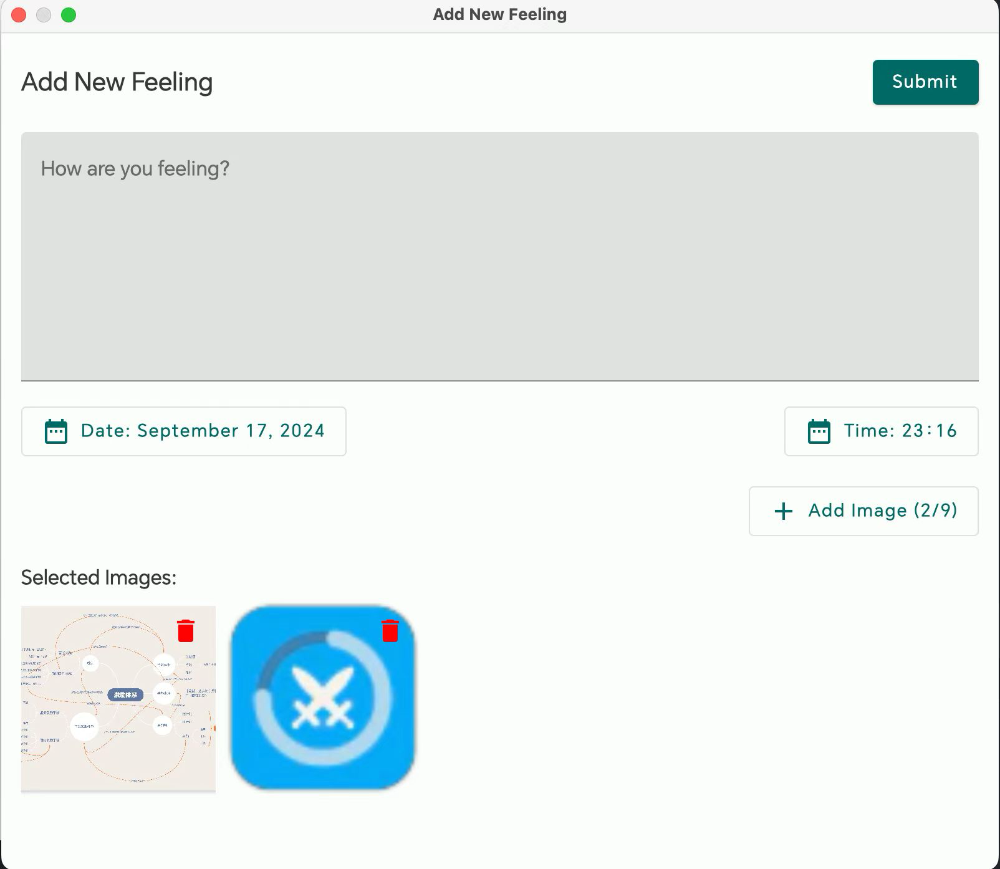

<h1 align="center" padding="100">v1.97.0 性能和体验优化、内置字体大小设置</h1>

## 简介
本期更新也是继续聚焦于性能优化和一些遗留问题处理。

**性能优化**

应用性能一直是我们关注的重点之一。

随着用户长期使用和数据量的不断增加，app 性能面临的挑战也在逐步加大。我们经常会收到用户的疑问，比如在长期使用过程中，创建大量任务和商品是否会对 app 产生影响。

此前，我们主要优先处理了用户反馈的崩溃问题和新功能开发，对一些遗留的 ANR（应用未响应）问题关注较少。

近期版本中，我们将逐步修复已知的 ANR 问题，以进一步提升用户的使用体验。

本次更新带来了显著的性能优化，旨在为长期使用的用户提供更流畅的体验。同时，这也是为后续 API 和 app 更新奠定基础，带来更多功能和改进。

**其他优化小点**

- 当金币不足时，现商品购买按钮会展示为禁用样式
- 成就清单内，支持按成就名称搜索🔍
- 支持应用内字体大小设置
- 优化了世界-随机任务的随机逻辑，现在会减少最新一批任务出现的频率，更为随机化
- 优化了通知分组逻辑，现属性、成就解锁等通知应该能正确分组展示
- 统计-分享现支持切换是否展示二维码
- API 任务、链接使用效果、计数任务等比较常见的咨询项增加了应用内说明。

**❓如何加入内测？**

如果你已经是会员的话，可以在应用内-关于页面，点击**检测更新**获取内测版本。

本期更新的 v1.97.0 版本已经在“会员尝鲜”渠道发布了一段时间。后续稳定会逐步发布至“会员稳定”渠道。

由于本期更新涉及到一些基础框架的更新，尽管我们已经进行了不少测试，但难以评估所有影响面，建议更新前，备份一次完整的应用数据。

同时，上期更新的「v1.96.0 获得时自动使用商品」现已轮动至【会员内测-稳定渠道】，「v1.95.0 大屏适配」已在官网发布。

**📧如何反馈问题？**

如果你在内测途中遇到了任何问题，欢迎随时通过邮件、会员渠道、腾讯频道（QQ频道）等方式反馈~

## 一、性能优化

这一段可能会偏技术一些，但从用户的角度来看，它代表着整体性能的提升，包括但不限于：

- 启动速度的提升
- 任务列表加载、任务刷新速度的加快
- 完成任务的流畅度提升
- 属性、商店、成就等操作的提速...

根据我们的实测结果，一些极限场景下的性能表现为：

- 撤销某个重复多次的任务：提速 95%
- 加载包含大量任务的任务列表：提速 10% ~ 26%
- 代码模拟高频完成可重复任务：提速 75% ~ 80%
- ...

 

本次更新过程有些坎坷，我们非常感谢参与会员内测的用户，感谢大家尝鲜并反馈问题。

原本的更新计划是通过优化一些频繁调用数据库的地方，增加内存缓存，启用数据库的 WAL 模式，以及改进线程调度，来提升性能和修复已知的线上卡顿问题。

在实测中，我们发现缓存的确很有效，能够将几百毫秒、几十毫秒的耗时降至个位数毫秒，甚至接近 0 毫秒。

然而，在发布了 rc-01 和 rc-02 版本后，意外出现了几例启动时完成任务卡住的奇怪问题反馈。这让我们很难理解，且在测试中也无法复现类似问题。

我们只好继续发布多个版本，不断修复已知问题，并直接修改所使用的数据库 ORM 框架，以进一步提升性能。

经过数天的排查后，我们发现问题的根本原因是启用数据库的 WAL 模式时，修改了数据库的备份逻辑，导致备份过程中会阻塞其他操作（如完成任务等）。如果用户开启了「启动时自动云备份」，这个问题就会尤为明显。

不过，因祸得福的是，排查问题期间采取的激进性能改进方案，意外进一步释放了数据库的性能表现。

 

### 📕如何使用？

- 升级即可享受到性能提升。

## 二、优化小点
**当金币不足时，现商品购买按钮会展示为禁用样式**
可以更直观地在商店页面浏览足够金币购买的商品了：

**成就清单内，支持按成就名称搜索🔍**

**支持应用内字体大小设置**

默认人升的字体大小设置是跟随系统的，该版本允许在此基础上进一步调整大小。

**优化了世界随机任务的生成逻辑，降低了最近一批任务频繁出现的概率，使随机性更为均衡**

我们收到部分用户反馈，随机任务总是集中在前几项。对此，我们进行了相关优化，改善了任务分布的随机性。

**优化了通知分组逻辑，现属性、成就解锁等通知应该能正确分组展示**

改动前：

改动后：

**统计-分享现支持切换是否展示二维码**

**API 任务、链接使用效果、计数任务等比较常见的问题项增加了应用内说明。**

**UI层面**

1. 为弹窗增加了背景模糊的效果。因为人升有着较多的弹窗，甚至是连环弹窗。背景模糊可以让用户更好的聚焦于当前的弹窗内容上，更清晰。
2. 像商店的购买、仓库使用等按钮替换为系统控件实现，进一步提升UI一致性。

改动前：

改动后：

> 购买、使用按钮看截图可能不太明显，但应用内还是能看出明确区别。

### 三、技术点优化
除了上述功能优化外，由于LifeUp是我们在空闲时间维护的应用，同时还需要维护「云人升」和桌面端等多个应用，以及正在调研和开发中的iOS版本等，因此我们会持续优化一些技术细节，并逐步实现自动化流程，节省更多时间。

**3.1 Crowdin多语言自动同步**

此前，我们一直手动同步Crowdin上的多语言文本，如繁体中文、法语、德语、日语等。由于依赖人工操作，无论是英文原文的上传，还是翻译文本的下载，都可能出现版本延迟的情况。

本次更新，我们将Crowdin的多语言同步引入到了开发工作流中。今后，这项工作将会自动执行，使得多语言文本的更新更加快速和高效。

**3.2 功能点独立回退机制**

过去的更新发布中，若某个功能出现问题，通常只能等待下一个版本的修复，无法直接回滚。由于更新和审核的过程都比较耗时，特别是审核时间不可控，导致问题难以及时解决。

为了解决此类问题，本次更新引入了一套有效的控制机制，支持对单个功能点进行独立开关和回退操作。今后，当我们开发可能存在风险的功能时，可以通过便捷的配置进行回退，减少问题的影响。

一个实际案例是，在rc01版本发布时，由于「当金币不足时，商品购买按钮会展示为禁用样式」的功能代码未考虑到贷款金额设置，导致贷款功能失效。用户反馈后，我们通过回退该功能点，及时避免了问题影响，并获得了充足的时间进行下一个版本的更新。

### 四、小预告

因为本期更新带来的功能点比较少，顺便也预告下后续版本的内容。

下个版本桌面端和 API 会迎来一波更新，到时候会先支持桌面端备份、恢复，以及从桌面端编写新感想等。

我们也会尝试适配一些桌面端特性：比如拖拽选择要恢复的文件；调用系统的文件选择器选择感想图片等等。

> 开发中版本截图，不代表最终效果

## 六、✨完整更新日志

**🎉1.97.0 (2024/09/11)**

**内测问题修复**

rc06 -> rc07

- 修复由于代码执行时序问题，可能会导致完成任务后，自动使用商品的逻辑失效的问题

rc03 -> rc06

- 数据库相关问题修复
- 性能提升

rc02 -> rc03

- 多语言文本更新和裁剪
- 任务列表页面与清单切换的相关性能提升
- 修复「全部」和「默认」清单的相关设置（筛选、排序）可能会互相关联的异常问题
- 其他性能问题修复和优化

rc01 -> rc02

- 修复贷款金额足够时，购买按钮仍是不可按状态的问题
- 部分卡顿问题优化

**✨特性**

**重点更新**

- 本次更新主要为性能优化和问题修复。
- 大幅优化了应用的整体性能表现，现在获取任务列表和各种操作会更加流畅，目标安卓 API 版本适配至 Android 14。

**其他**

1. 当金币不足时，现商品购买按钮会展示为禁用样式
2. 成就清单内，支持按成就名称搜索🔍
3. 支持应用内字体大小设置
4. 优化了世界-随机任务的随机逻辑，现在会减少最新一批任务出现的频率，更为随机化
5. 优化了通知分组逻辑，现属性、成就解锁等通知应该能正确分组展示
6. 统计-分享现支持切换是否展示二维码

**♻️优化**

1. 优化了网络访问逻辑
2. 弹窗增加背景模糊效果
3. 商店、仓库、橱窗等界面的按钮优化，使用 Material 官方按钮样式
4. Content Provider 查询任务历史记录的 API 现会返回任务的结束时间
5. Content Provider 查询任务历史记录的 API 现支持筛选任务 Group Id
6. 提升了大量依赖库的版本
7. Goto API 支持跳转到「新事项默认设置」页面
8. Goto API 跳转到「新建成就」页面时，现需要传递 category_id 参数
9. 增加 API 任务、计数任务、商品链接效果等应用内指引
10. 优化了新用户检测更新的逻辑和错误提示
11. 删除账号操作增加 loading 和错误提示
12. 优化了任务详情页面点击完成主任务的点击范围
13. 优化了导入备份的错误提示，现会更严格阻止导入异常备份文件

**🐛修复**

1. 修复新建任务时，如果先触发了事项内容为空的错误提示，即便输入了文本，该错误提示也不会自动消失的问题
2. 修复了底部导航栏模式下，统计页面不展示筛选按钮的问题
3. 修复了在特别窄小的设备显示比例下，部分界面显示异常的问题
4. 修复了在复制任务的情况下，子任务的奖励可能会出现异常关联的问题（该问题出现自v1.96.0版本）
5. 修复了当触发 Dropbox 自动备份时，因用户连接 Dropbox 异常时的错误提示
6. 尝试修复预览极端大图的内存消耗和崩溃问题
7. 修复了当购买物品时勾选使用但使用失败的情况下，小部件的数据不会正确刷新的问题
8. 修复了编辑成就会更改成就完成时间，而且有可能错误触发成就解锁通知等问题
9. 修复了大屏幕分屏显示模式下，当同时显示任务列表页面和详情页面，完成任务、子任务、更新计数等操作时，两个页面不会同步刷新的问题
10. 修复了在任务列表页面，长按已经逾期过的单次任务，没法清空期限显示的问题

