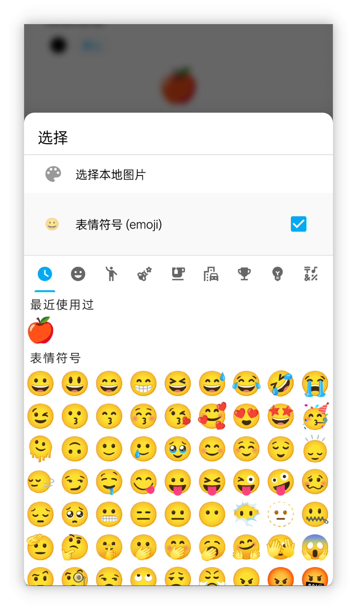

<h1 align="center" padding="100">v1.98.0 API 2.0 & 桌面端更新</h1>

## 简介
这是 2025 年首个版本，主要更新如下：

- Emoji 图标支持: 现在可以直接使用 Emoji 作为商品、成就等地方的图标。

- 第二波 API 更新: 支持修改任务、编辑商品使用效果、成就解锁条件以及合成等几乎所有核心功能的 API 接口。

- 云人升和桌面端优化: 提升了自动连接检测的体验；桌面端新增了“新建感想”功能，并支持备份数据的导入导出。

## 一、Emoji 图标

 

### 📕如何使用？

- 该版本在为商品、成就等挑选图标时，现在支持直接选择 Emoji 表情符号作为图标。

## 二、第二波 API 更新

自 v1.90.0 版本开放 API 功能以来，我们欣喜地看到许多用户积极探索并基于 API 进行了丰富的创作。许多用户从零开始学习 URL 相关知识，并成功应用 API 创建了桌面小部件、DIY 桌面端，甚至实现了网页应用联动，令人印象深刻。

然而，第一批 API 由于数据结构复杂，设计和开发工作量巨大，一直缺乏一些核心功能，例如编辑任务、编辑商品、创建带解锁条件的成就以及创建带使用效果的商品等。这些功能的完善一直持续到本版本才最终完成。

API 的设计、开发、测试以及云端、桌面端和 API 文档的更新，带来了指数级增长的工作量，导致几个月前启动的开发分支直到现在才完成开发和测试。

**但我们的努力也带来了丰硕的成果！如今，API 已覆盖人升几乎所有核心功能。我们希望通过开放 API，让人升不止于一款应用，而是将其打造成一个开放平台，让用户能够自由地二次开发、扩展和定制自己的游戏化系统。**

 

### 📕如何使用？

- API 使用的方式可以查阅我们的文档库 - 目录 - 开放接口一栏。
- 新增的 API 接口相关定义已补充到文档内。

### 三、桌面端：存档功能 & 感想

#### 存档

现在你可以在桌面端直接导出或导入备份文件了。

这将简化数据到其他设备和恢复的流程。

#### 发布新感想

现支持从桌面端发布新感想，也完整支持添加图片和设置时间等功能。

⚠️注意：暂不支持编辑感想。

#### 其他

- 优化了连接的相关错误提示和说明：比如明确是网络问题，还是因为人升后台没运行导致的失败
- 支持查看事项详情了
- 支持了 API Token 安全令牌校验功能（可选，需搭配云人升 2.0.0 版本使用）
- 购买逻辑现在也是调用新的「购买商品 API」，而非之前的「调整商品数量 API」+「调整金币数 API」。所以现在能够正确处理限购之类的逻辑，跟应用内应该能够保持一致的。

本次更新其实也是以演示 API 的目的更新桌面端的，桌面端的能力都是通过 API 实现的。

### 四、云人升优化

>  云人升是一个将 API 暴露成 HTTP 接口的一个工具，也是链接桌面（电脑）端的桥梁。

本次我们也针对云人升的相关反馈做了不少的优化：

- 添加了相关状态的显示，以便快速检测出为什么桌面端连接不上
- 添加了一些高级设置
  - 允许跨域访问：如果使用基于网页的技术访问云人升的 HTTP 接口的话，这会有用
  - 允许自定义服务端口
  - 允许设置访问令牌：可选的安全校验手段
- 优化了云人升的相关接口的错误返回值和规范
- 优化了服务发现和 HTTP 服务开关的逻辑，现在桌面端的自动检测应该会更好使

### 五、小预告

因为本期更新带来的非 API 功能点比较少，顺便也预告下后续版本的内容，以下是几个正在开发中的功能：

- **大型需求点：**重复型成就
- **中型需求点：**自定义背景的文本可读性优化
  - 原本以为是小改动，但实际上挺复杂
- **小型需求点：**通知提醒增加完成、稍后提醒等操作
  - 原计划还想要支持常驻提醒的，但高版本安卓已经不支持真正的常驻了，这一点先放弃了

## 六、✨完整更新日志

#### 人升

**v1.98.0 (2025/01/01)**

**✨特性**

1. 集成 Google 登录和 Drive 授权，使用 Credential Manager。
2. 支持选择 Emoji 作为图标。
3. 新增 ContentProvider 查询 API：合成功能。
4. 新增 ContentProvider 查询 API：番茄记录功能。
5. 新增 ContentProvider 查询 API：支持多商品返回。
6. 新增 tomato API（调整番茄数）。
7. 新增 export_backup API（导出备份）。
8. 新增 purchase_item API（购买商品）。
9. 新增 synthesize API（触发合成）。
10. 新增 subtask API（新建或调整子任务）。
11. 新增 subtask_operation API（操作子任务，例如完成）。
12. 新增 synthesis_formula API（合成公式）。
13. 新增 edit_task API（编辑任务）。
14. 新增 category API（新建或调整清单）。
15. 新增 history_operation API（调整历史记录）。
16. 新增 AppSettingsScheme API（部分应用设置调整）。
17. 新增 achievement API（新建或编辑成就）。
18. 新增 skill API（新建或编辑属性）。
19. 新增展示子任务 id、gid 的功能。
20. 新增展示合成 id 的功能。
21. 新增支持查询 creditLimit。
22. ContentProvider API 支持查询子任务（id、gid）。
23. ContentProvider API 查询商品：增加"最大可购买数量"字段返回。
24. ContentProvider Shop API 支持指定 id 列表查询商品。
25. 优化查询错误 ContentProvider URL 时的返回值。
26. query 接口支持查询单个成就。

**♻️优化**

1. 优化新增商品的默认自定义排序。
2. 优化新增属性的默认自定义排序。
3. 「add_item」 API 增加 `purchase_limit`、`disable_use`、`effects` 等参数。
4. 「add_task」 API 增加 `background_alpha`、`items`、`start_time`、`auto_use_item`、`remind_time`、`pin` 等参数支持。
5. 「add_task」 API 支持设置更多任务频率。
6. 「item」 API 支持 `effects` 和 `purchase_limit` 参数。
7. 前置 API（例如输入等）支持终止操作。
8. 数字占位符支持指定 `signed` 参数。
9. 新增随机数字、随机小数占位符。

#### 云人升

**v2.0.0 (2025/01/01)**

**🚀功能**
1. 服务优化
- 改进服务发现逻辑和兼容性
- 更多设备支持自动检测 IP
- 优化服务启动/暂停状态切换
- 改进异常处理流程和提示
2. 安全与性能
- 新增可选的 API Token 校验
- 新增跨域（CORS）设置选项
- 支持自定义端口
- 支持自定义唤醒锁持续时间
3. 界面优化
- 全新的界面设计
- 改进整体视觉体验

#### 桌面端

**v1.2.0 (2025/01/01)**

**🚀功能**
1. 支持存档功能
- 直接备份到电脑
- 从电脑恢复备份
- 支持文件拖放
2. 支持在桌面端创建新的感想
- 支持选择图片
- 支持图片传输至手机
3. 支持查看任务详情
4. 改进购买系统
- 使用新版「购买物品」API
- 与 app 内限购逻辑保持一致
5. 支持可选的 API Token 校验
6. 多平台支持
- Windows
- Linux
- macOS（Apple Silicon）
- macOS（Intel）🆕
7. 改进异常处理流程和提示

