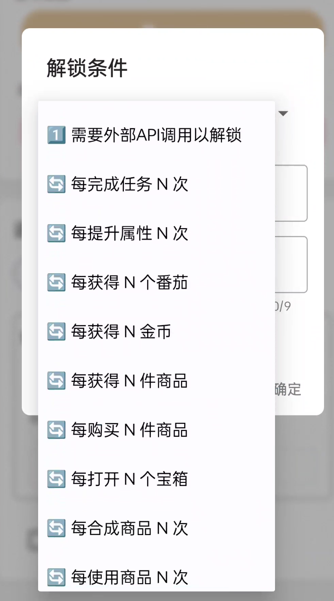
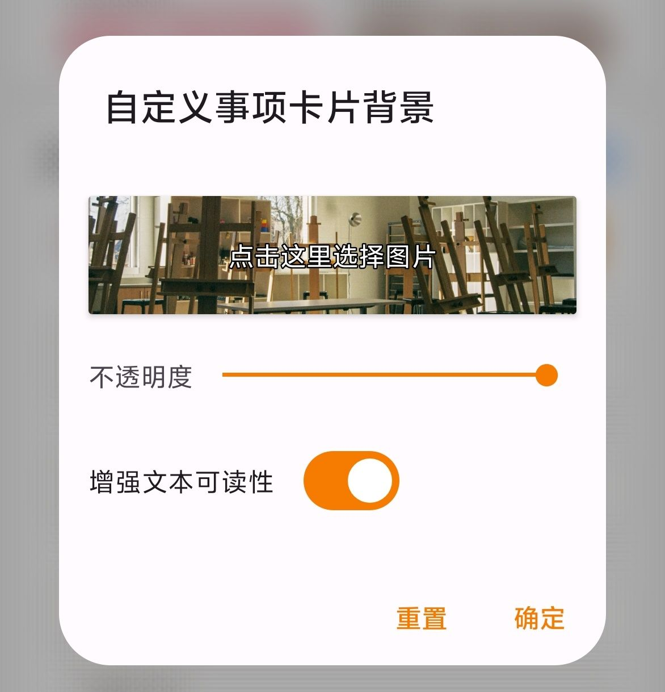
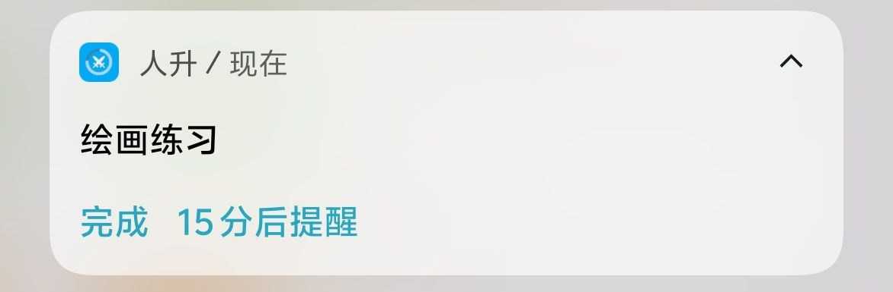
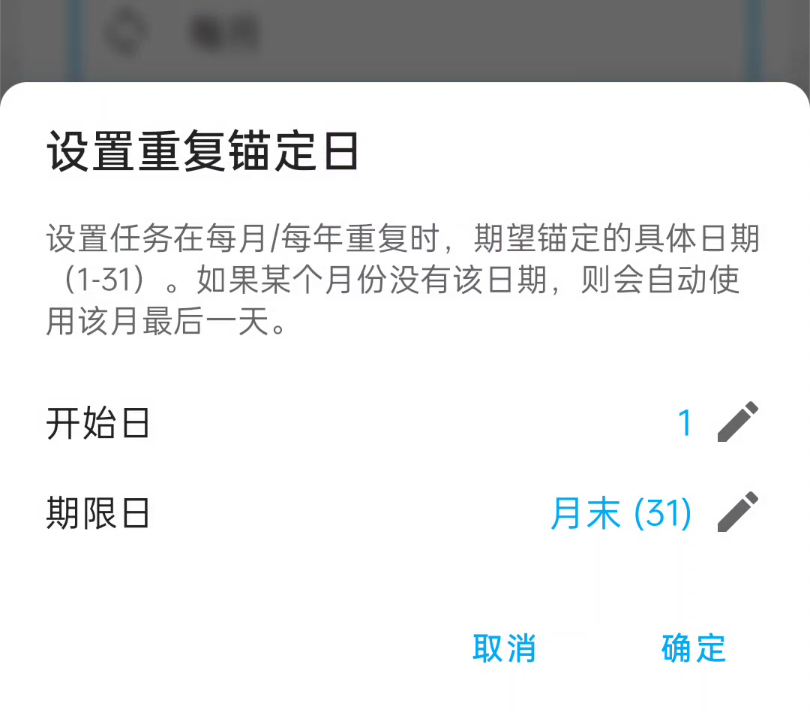
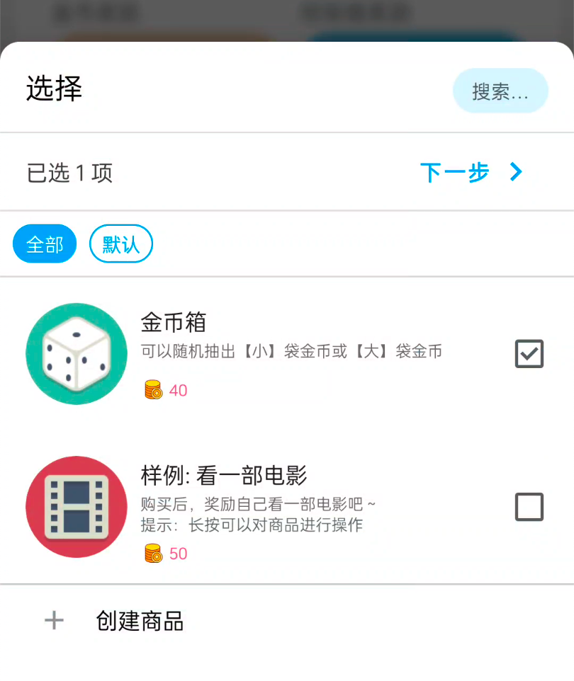
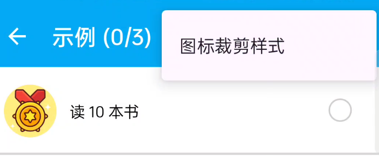

<h1 align="center" padding="100">v1.99.0 - 重复成就</h1>

## 简介
该版本主要引入了：

- 重复达成型成就：比如每完成 X 次任务、每提升 X 次力量等级即可领取一次奖励的成就
- 自定义卡片背景引入高对比度字体选项
- 通知提醒增加操作

## 一、重复达成型成就

本次更新主要引入了可重复达成型成就条件条件：

- 此类成就解锁条件允许重复达成，并且每次达成都可以领取一次奖励，多次达成可以领取多次。
  - 比如你可以设置「每提升 10 级力量」可解锁一次成就。

 

### 📕如何使用？

- 它们属于新增的成就解锁条件，创建或编辑成就时指定解锁条件。

## 二、自定义背景：增强字体可读性

我们引入了一个「增强文本可读性」选项，允许在自定义背景时，可以突出显示文本和部分图标。

 

### 📕如何使用？

- 编辑自定义背景时，勾选「增强文本可读性」即可

### 三、通知操作

我们为应用的通知提醒增加了「完成任务」和「稍后提醒」操作。（只适用于通知提醒，不支持日历提醒方式）

### 四、其他交互优化

1. 我们为每月、每年重复额外增加了一个锚定日选项。这可以让用户更方便地选择月末或者指定日。

2. 选择商品奖励时，现在默认进入多选模式。我们不再严格区分单选/多选模式。这样的交互会更加简单和合理。并且重选时，也会保持之前的选项。

3. 成就也支持了更改「图标裁剪样式」

## 五、✨完整更新日志

**v1.99.0 (2025/05/17)**

**✨特性**

1. 支持可重复达成的成就类型
1. 增加通知提醒操作：完成任务、稍后提醒
1. 自定义背景：新增增强文本可读性选项
1. 支持调整成就的图标裁剪样式
1. 支持调整每月/每年任务的月锚定日

**♻️优化**

1. 优化了成就解锁进度的计算逻辑
1. 优化了选择商品的相关交互
1. 优化新建/编辑任务关于提醒权限提醒按钮的位置
1. 优化了相对提醒时间的存储逻辑
1. 允许冻结非重复和无限重复任务

**🐛修复**

> 部分问题修复会陆续下放到【会员稳定版本】和【正式版】

1. 修复了编辑成就可能会以外重置 API 解锁条件进度的问题
2. 修复了通过购买商品 API 可以购买库存数为 0 的商品的问题
3. 修复了某些特殊情况下，新建商品页面可以选中已删除清单的问题
4. 修复了任务模板没法保存金币自动计算状态的问题
5. 移除了进入详情页面的相关转场动画，以修复长按交互失效的问题
6. 修复了番茄钟选择任务时，会出现冻结任务的问题
7. 修复了某些途径编辑任务，会导致任务状态错误重置为未完成的问题
8. 修复了感想弹窗相关的交互问题
