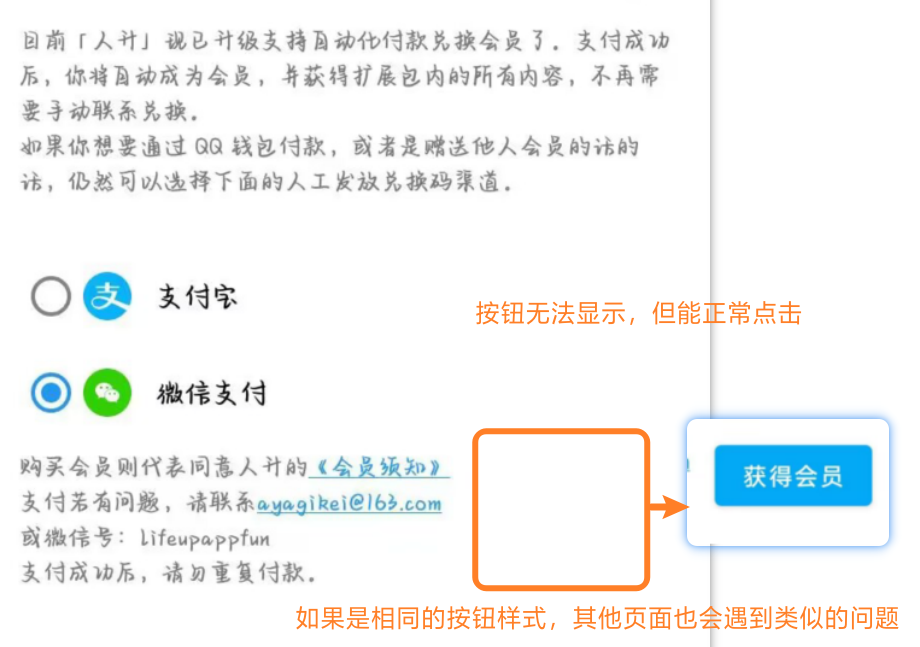

# 兼容性配置

这里列举了部分设备的兼容性配置问题，

如果您不进行相应的配置，可能无法正常使用【提醒】、【番茄钟】、【倒计时】、【小部件】等相应功能。

这些限制与应用本身并无关系，甚至与 Android 也没多少关系，**大都是由手机厂商“定制”导致的问题。**并且由于是手机厂商“定制”的系统，应用开发者们也没法从代码层面提供解决方案。

> 如果您使用的是 AOSP 或类 AOSP 系统（如 Pixel 手机），基本上只需要“忽略电池优化”即可正常使用《人升》所有功能。

## 主要问题

> [!WARNING]
> 我们已经在应用流程设下了无数提示，包含但不限于：初始任务、新手教程、常见问题、设置页面小红点和二次确认才能移除小红点，部分相关的功能的额外提醒。但仍然没法阻挡有陆陆续续的用户可以完美绕开所有提示来到 QQ 群或者私聊反馈相同的问题。  **为了您的应用正常使用体验，请务必重视以下配置❗❗ 特别是如果您需要使用桌面小部件、番茄钟、倒计时、提醒等功能时。**

> [!NOTE]
> 下方涉及「需要后台运行」的功能点，由于不同手机、系统涉及到很多不一样的选项。经常有用户漏配一些选项（比如华为需要把电池优化调成“手动管理”），导致 App 仍有问题。  **经我们确认，主流设备（如华为/荣耀、小米/红米、OPPO/Realme/一加、vivo/iQOO、三星、Pixel等），只要正常配置后，相关设置项都能正常使用过。**  如果您在配置后仍有问题，如需反馈，请带上所有的配置项截图、视频在频道发帖。可以跟其他同型号的用户对比一下设置项，也可以向对应的手机工程师/客服反馈问题。

| 功能                                                         | 需要后台运行      | 需要其他权限               | 备注                                                         |
| ------------------------------------------------------------ | ----------------- | -------------------------- | ------------------------------------------------------------ |
| 事项提醒（系统通知）                                         | ✔️                 | 需要“通知”权限         | 默认方式，**请参考[后台保活文章](guide/background_running)进行配置**； 并确认已经启用了“通知”。 |
| 事项提醒（日历事件）                                         | -                 | 需要“日历读写”权限         | **可在应用内【设置】-【事项】-【更换提醒方式】处更改**       |
| 番茄钟/商品倒计时       | ✔️                 | -                          | **请参考[后台保活文章](guide/background_running)进行配置；** 如果未配置可能出现不提醒、倒计时被冻结（回到应用内才计时）、通知倒计时不精准、通知的操作按钮无法点击等多种现象 |
| 正计时                                                       | -                 | -                          | -                                                            |
| 小部件数据刷新          | ✔️（部分设备需要） | -                          | **请参考[后台保活文章](guide/background_running)进行配置；** 如果未配置可能出现一直显示“正在加载中”或“已经完成了所有任务”或无法刷新等现象 设置后，需要创建新的小部件以生效 |
| （非小米手机）小部件完成计数任务、跳转应用内                 | -                 | -                          | -                                                            |
| （小米手机）小部件完成计数任务、跳转应用内                   | -                 | 需要“允许后台显示界面”权限 | 该问题为 MIUI/澎拜 OS 系统独有，需要在系统的APP设置页面进行配置 |
| （李跳跳等广告跳过工具）会帮你自动点击通知栏跳过番茄钟、ATM 弹窗等 | -                 | -                          | 请在相应工具设置内，关闭对《人升》和《系统用户界面》（主要影响番茄钟的通知按钮）的处理。 |
| 番茄设置中没法创建快捷方式                                   | -                 | -                          | 部分厂商的手机需要先前往应用管理页面，开启“创建快捷方式”权限 |

### 小部件添加方式（各系统入口） :id=widget-entrypoints

目前各大系统都推出了自己的特殊小部件，并将安卓通用小部件的添加入口隐藏起来了；同时大部分系统也会限制 App 直接请求添加小部件，需要在系统桌面中手动翻找入口。

省流（大部分新版本系统通用）：
1. 在桌面长按或双指捏合，进入桌面编辑模式
2. 找到系统特殊小部件的添加页面（命名因系统而异，如华为：服务卡片、vivo：原子组件、OPPO：卡片）
3. 进入系统小部件列表后，快速滑到最下方，找到小入口（如“窗口小工具”“应用挂件”“插件”）
4. 点击小入口进入安卓通用小部件列表，在其中找到“人升”并添加
5. （可选）安卓小部件有最小尺寸限制，但可自行放大：添加后原地长按并松手，拖动右下角等控点即可

| 系统/品牌 | 系统特殊小部件入口 | 安卓通用小部件入口（通常在列表底部） | 视频教程 |
| --- | --- | --- | --- |
| 小米/红米（MIUI/澎湃 OS） | 系统小部件入口（名称因版本略有差异） | 安卓通用小部件入口（通常在列表底部） | https://www.bilibili.com/video/BV17W4y1s7dL |
| 华为/荣耀（HarmonyOS/EMUI） | 服务卡片 | 窗口小工具 | https://www.bilibili.com/video/BV1RYZMYvE7X |
| vivo/iQOO | 原子组件 | 应用挂件 | https://www.bilibili.com/video/BV1iu411R7VK |
| OPPO/Realme/一加 | 卡片 | 插件 | https://www.bilibili.com/video/BV1Qr76ztEmF/ |

## 非常见问题

| 现象                                   | 设备 | 可能/已知原因                                                | 解决方案                                                     |
| -------------------------------------- | ---- | ------------------------------------------------------------ | ------------------------------------------------------------ |
| ATM弹窗打不开                          | 任何 | 跳过广告的工具可能错误认为部分弹窗为广告，自动关闭了弹窗     | 使用相关工具时，将《人升》加入白名单                         |
| 界面异常文本无法显示                   | ？   | 系统异常，导致官方控件的渲染异常                             | 建议更换稳定版系统，或等待系统更新                           |
| 系统渲染UI崩溃                         | ？   | 系统异常，崩溃堆栈皆为系统堆栈                               | 建议更换稳定版系统，或等待系统更新                           |
| 无法调整小部件尺寸                     | ?    | 一般是用户操作问题                                           | [查看视频教程](https://www.bilibili.com/video/BV17W4y1s7dL/?share_source=copy_web&vd_source=141b0b80de90aedb6b7f25458fa6b5d1&t=70) |
| 极少数用户遇到了部分按钮无法展示的问题 | ？   | 似乎与设备关系不大，可能跟第三方工具、主题、系统bug相关 并且信息有限，如果你遇到了该问题，或者发现了解决该问题的相关线索，欢迎向我们提供更多信息（如设备机型、系统版本等） |  |

## 鸿蒙系统兼容性

仅对双框架鸿蒙系统（HarmonyOS 4.3.0 及以下）兼容，鸿蒙 5 及以上可通过「卓易通」兼容环境运行；鸿蒙 Next 原生系统暂不支持。  

完整说明与限制请见：[鸿蒙系统兼容性说明](guide/harmonyos-compatibility.md)。

## 问题反馈

> [!NOTE]
> 如果您遇到了更多的兼容性问题，建议入群反馈，查看是否有其他人也遇到了类似的问题。如果排查到并非《人升》自身的问题后，您需要向系统工程师反馈。

兼容性问题属于系统与应用间，或者应用与应用间相关的问题；

开发者一般也只能提供简单的思路，具体可能需要手动排查问题原因，由我们登记在上述表格里。
