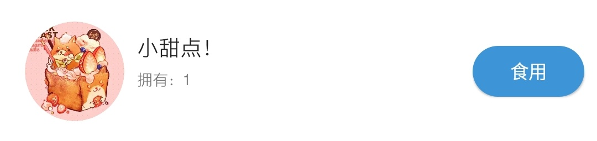
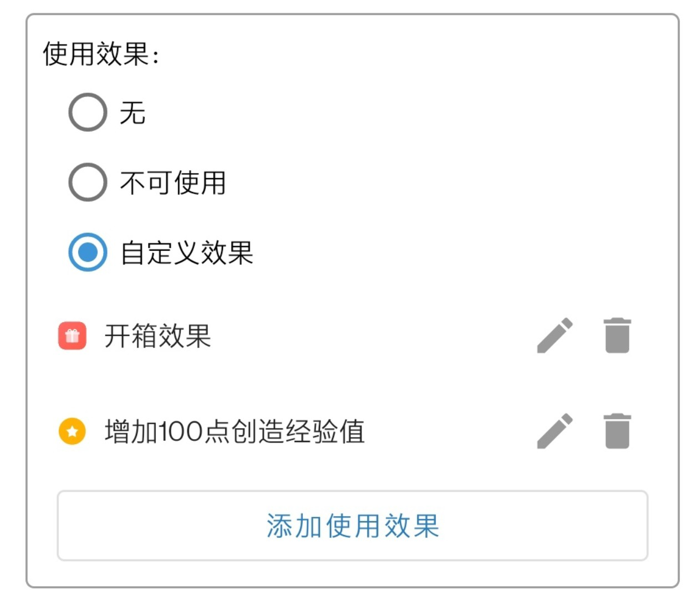
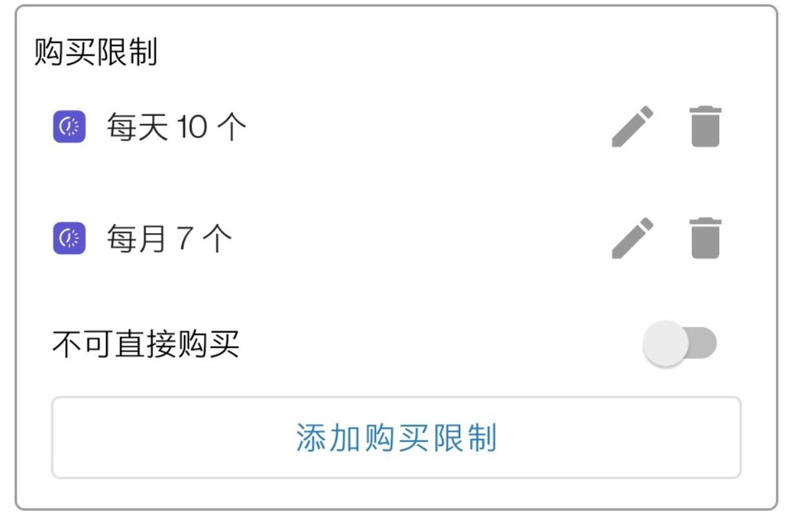
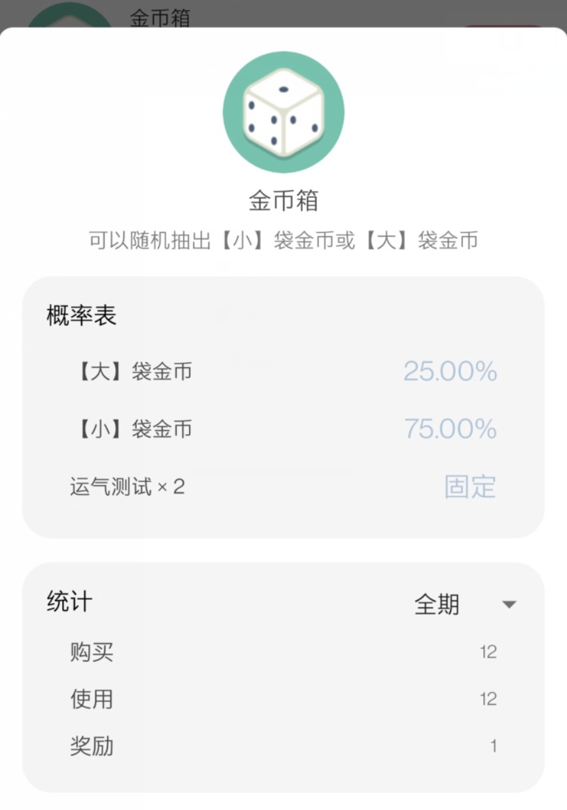

# 商品详解

## 概念简介

### 商品的含义

《人升》中的商品含义是“使用游戏化的形式体现的自我奖励机制”。

使用金币衡量任务的完成程度，随后购买自己心仪的奖励，正向激励自己继续努力。

大体上可以分为两类商品：

1. 现实奖励。
   
   应用协助完成记录、购买、限购等机制。但奖励的具体实施需要现实中的你进行行动。
   比如「休息5分钟」、「看一场电影」、「买一瓶肥宅快乐水」。

2. 应用内的奖励。
   
   配合「使用效果」，可以实现一些应用内的奖励。如奖励一定的金币、经验值、随机开箱（盲盒）抽取其他奖励等等。

   这种奖励也可以跟现实奖励相配合，实现各种各样的效果。

### 仓库的含义

仓库可以当作是一个暂存区，存放一些暂未使用的奖励。

举个简单的例子，比如你购买了「看一场电影」的奖励。

但是当时还不想实施这个奖励的话，可以在购买时，不勾选「（立即）使用」的选项，那么商品就会自动存放到仓库中。

 

另外：
- 事项、成就设置的商品奖励也会自动放入这里。
- 含有特殊操作的商品（比如合成、开箱）也会强制放入仓库。

---

## 新建商品

其实除了手动创建商品外，也可以**试试到橱窗进货别人创建好的各种商品**哦~

### 基础信息

这里的信息很简单：
- 清单（最上方的`默认`)：点击可切换所属清单，默认值会是当前清单
- 图标：可以在应用提供的接近200个图标中挑选，也可以随时选择本地设备中的图片。甚至可以在橱窗中，将他人的商品图标添加到临时列表，然后再在这里进行选择。
- 商品名称：输入奖励的名称即可
- 售价：输入购买一份奖励所需的价格
- 描述：（可选）输入商品的描述，会在一些界面进行展示

---

### 进阶设置

#### 库存数量

商店中该商品的库存数量，当库存为0时，该商品会自动下架。

以下情景都会减少库存数量：
- 购买
- 或者从事项、成就得到商品奖励

 

#### 自定义操作按钮文案（会员功能）

 可自定义所有对该商品的使用操作的文案（比如购买弹窗中的`使用`开关和仓库中的`使用`按钮），默认值为`使用`。

 
 **使用场景：**

 - 将食品类的奖励的文案，定义成`食用`
 - 将游戏类的奖励的文案，定义成`游玩`

 

#### 使用效果

在这里可以为商品定义特殊效果。

默认商品的行为是记录数量，适用于上文所说的现实奖励。

如果你想要实现一些特殊效果，可充分利用这里提供的设置。

三大类使用效果：

1. **无**
   
   默认值，只负责记录数量，使用时减少数量。
2. **不可使用**
   
   该选项会隐藏使用按钮，可用于一些收藏型的奖励。（如XX徽章）

3. **自定义效果**
   
   丰富多样的特殊效果，如奖励经验值、金币、随机开箱。

**关于自定义效果的详细说明，可以查看该文章。（待编写）**

 

#### 购买限制

##### 设置不可直接购买（会员功能）

如果你是会员的话，可以直接设置该商品无法直接购买，只能从事项/成就奖励中获取。

如果你是非会员的话，可以尝试设置高价格。

##### 日/周/月/年限购

可以设置每日、每周、每月、每年限制购买的数量，可以同时添加多个条件。

> 注：每周是从周一开始计算。

---

## 列表管理

### 商店

#### 详情

点击商品可查看商品详情信息。

#### 菜单

长按商品可对商品执行「编辑」、「下架」、「移至...」和「分享」等操作。

- **编辑**: 重新进入编辑页面，可更改所有商品相关信息。
- **下架**: 在商店列表中隐藏该商品，无法再在商店中购买。但不会影响事项成就奖励该商品。下架后的商品，如有需要，可以在仓库中「重新上架」。
- **移至**: 将商品移动至另外一个商品清单。
- **分享**: 公开上传商品到「世界」中的「橱窗」模块，让全世界的用户可以「进货」该商品。

> 进货的含义只是复制一份该商品，并不会影响你的金币。但你可以查看到有多少用户进货了你的商品。

---

### 仓库

仓库的清单默认会跟商店中的保持一致，暂时不支持自定义。

#### 详情

点击商品可查看商品详情信息。（与商店中一致）

#### 菜单

长按商品可对商品执行「退货」、「重新上架」等操作。

- **退货**: 以售价的8折退货商品，也可以选择不获得金币退货。
- **重新上架**: 针对已下架的商品可执行的操作。
