# 人升3周年啦~

时光荏苒，距离首次发布《人升》并在 V2EX 宣传已经过去了 3 年。

未曾想过当时在学校创建的小项目，能达到现在的小小高度。

想着，三周年做一些简单的回顾和展望。

匆忙编写，未作充分的准备，可能叙述的也比较水~

三周年之际，《人升》在各个市场的下载总和也大概超过了100W下载量（含有大量更新水分）。

今年7月份，也有幸自荐登上了Google Play英美各区首页的「近期更新」模块。

后续明年年初也跟 Google 可能会有另一个小合作（

也从最初的默默无闻，到陆陆续续从一些自媒体或者用户宣传中，看到《人升》的影子。

很是欣慰。

## 开发历程

### 1. 总时间线

这是《人升》较大的功能模块迭代时间线。

其中还持续穿插着诸多的功能小特性、优化、问题修复，代码重构和 UI 优化等工作。

感兴趣的同学也可以查看我们详细的[更新日志](https://wiki.lifeupapp.fun/zh-cn/#/introduction/release_log)。

接下来想按时间顺序讲下《人升》开发阶段的相关时间节点事件。

### 2. 梦始

#### **缘由**

于我个人而言，一直想要一款**比较简洁、支持离线使用**的游戏化To-do应用，不需要繁琐的游戏化配置、小游戏。

因为我当时主用的ToDo应用是《微软ToDo》，所以可能更恰当的一句话需求就是：微软ToDo+属性等级。

恰逢一场校内的易班应用开发比赛（只要是支持易班登录的即可），拉上了一位后端同学开始了开发。

> 这就是支持易班登录的原因~

在开发《人升》之前，其实也只有一个书单列表的小demo的开发经验。

**开发当时，也有一个比较重要的决策：**

在完全不会的场景下，就逼着自己使用 Kotlin 进行开发（也是后端同学的建议）。

#### **最初的需求思维导图**

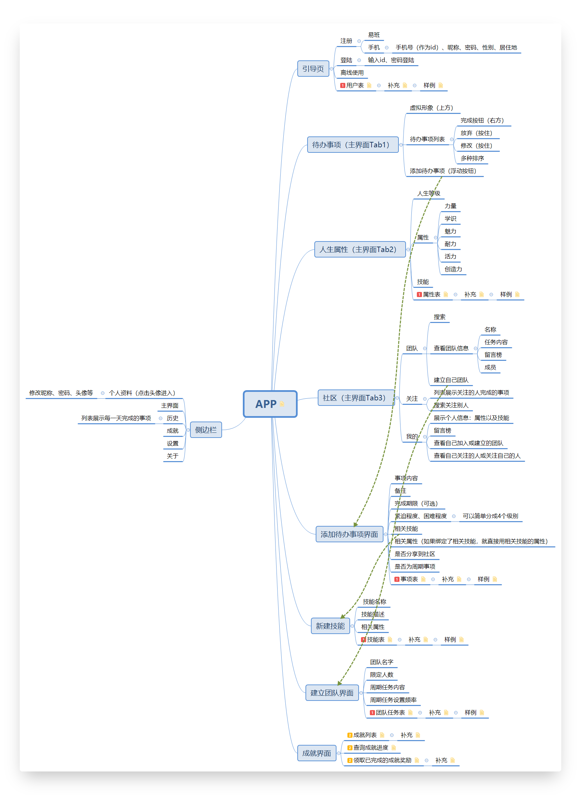

因为只有一两个月的开发时间，当时版本很粗糙。

但也初备了「待办事项」、「属性」、「团队」等功能。

「技能」和「成就」应该是鸽了。

> 因为技能的定义冲突问题，一直搁置到近期，才以属性自定义的形式进行呈现。

#### **起名**

当时想着应用的理念为「人生升级」之类的词汇，

就取了「人生」的谐音「人升」。英文名则是对应的「LifeUp」。

#### **开发**

> 你永远想不到开发会先开发什么功能.jpg

1. 先用 Inkscape 设计了应用图标
2. 然后开发了引导页
3. 多语言（部分英文化）
4. 首页框架
5. 登录页面
6. ...

#### **避免影响**

游戏化部分，我们尽量避免着受已有应用的影响。

想靠着自己的见解开发一款与众不同的游戏化应用。

其中初始属性的定义，也参考了不少游戏的设置（比如Fallout系列的SPECIAL系统）。

#### **结果**

由于不擅拉票，易班这次比赛还次于某个无法正常使用的失物招领应用。

简单略过描述。

### 3. 初次发布

#### 上架酷安

易班比赛结束不久后，校内又举办了一场由*PeroPero Games*（就是那个开发了Muse Dash的工作室，蹭个热度）赞助的游戏和应用开发比赛。

我们就计划着完善《人升》，再次参加比赛。

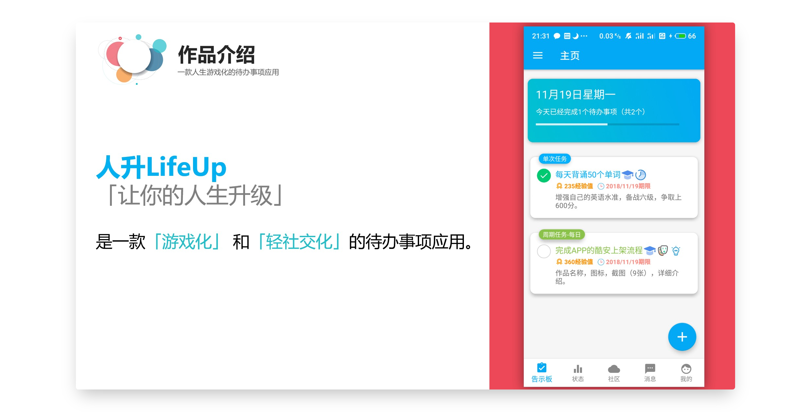

为了让应用的表现更有说服力，我们将应用发布到了酷安，也方便评委/观众进行下载。

就是下面这个惨淡的数据：

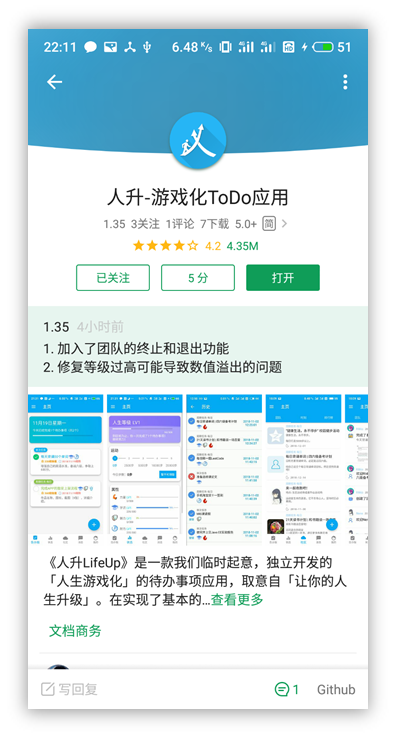

这时的应用版本，为了实现更多的趣味功能，也增加了一个非常简陋的成就系统（与现在版本的成就完全没资格比对），以及“臭名昭著”的计步奖励力量经验值。

#### 比赛答辩

吸取了一些上次比赛答辩的经验教训，这次将答辩展示的关注点聚焦在了应用本身的趣味性（而非技术实现上）。

有个有趣的小插曲，当时的评委其实是分为游戏组和应用组的。但由于《人升》是`游戏化`应用，我们也很神奇地被*PeroPero Games*创始人之一的师兄提问。

我们也将应用在 V2EX 发了帖子进行简单的宣传，当时来了一波 V2 老哥在酷安留言，也算是我们的种子用户了。

但其实在答辩的时候，总的下载数应该寥寥于100左右。（现在终于可以乘个万了）。

这次，也终于拿下了第一。

### 4. 酷安头条

赛后一段时间内，我们也在纠结如何处置这款应用。

如果没有用户的话，更新也就缺失了动力。

当时就是打算发布个摸鱼公告（短期内时间不够维护，长期会做这些功能）的心态，在酷安发布了一份简单的后续开发计划。

这份开发计划如今看来是十分不靠谱的，比如聚焦在阅读记录统计等功能上。

完全想不到的是，这份公告居然被酷安小编推到了首页头条（万恶之源）。

《人升》的评论区也在一天内被一两百条评论淹没，即便当时的应用基础功能都不够完备、游戏化元素更是严重缺失。

然后，我们也是从那时候发现，当时的版本居然不兼容安卓9。

在安卓9上，应用无法联网。

因为当时的设备是安卓8，无法复现问题。

**排查了好一段时间，才发现是安卓9默认禁止了htt**p访问...

> 现在看来是大乌龙了（

也是因为涌入的用户和鼓励，我们持续着完善着应用的基础功能。

当时主要的游戏化体现仍然仅仅有「属性」，但这已经足以实现一部分激励作用了。

### 5. 更高一步的游戏化

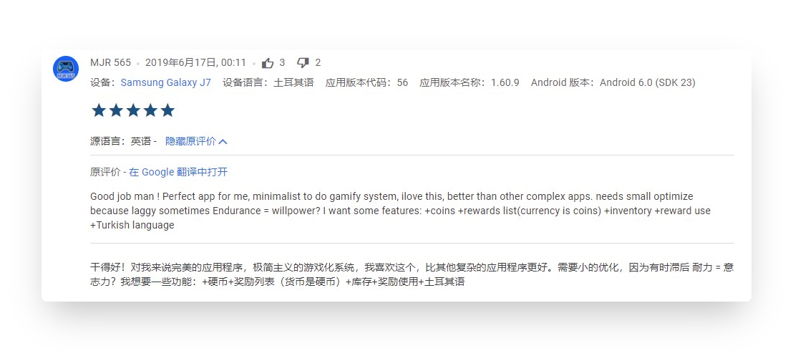

19年4月份，我们将应用完整英文化后，发布到了 Google Play。

> 在当今看来，这无疑是最正确的重要决策之一。

因为Google Play上，不允许免费应用转为付费。

我们将《人升》设置为了买断制付费应用，19年4月份上架后，也陆陆续续有零星的海外用户使用。

其中，上图中的评论，为我们指明了开发方向。

当时，我虽然知道有类似的奖励机制的应用，但未曾试用。

也凭借着自己的理解，在8月份的版本中发布了「商店-仓库-金币」功能。

该功能无疑是当今人升中最为重要的功能之一。

> 但商店的理念与属性其实并不一致，但又不矛盾。
>
> 属性其实讲究的是开箱即用，用户完全不需要任何设置即可体验经验值增长和升级。
>
> 而商品则是对应自我奖励，需要个性化配置。
>
> 但在人升中，它们同属于激励机制，而且有着诸多的联动机制。

直至19年末，人升已经有了初具雏形的属性和金币体系了，还有个系统成就模块。

### 6. 篡改

当时，《人升》是开源的，我们希望能够由开源社区进行代码贡献和维护（如Habitca的客户端一样）。

但没想到，换来的只有一些篡改版本。

后续只能将其闭源，并且争取登录各个应用市场。

### 7. 实验功能（20年）

20年（中旬准备毕设摸了一阵子），我们则是推出了一系列实验功能和功能完善：

- 简洁模式
- 感想
- 自定义成就和解锁条件支持
- 番茄钟
- 商品使用效果
- 开箱
- 世界橱窗

也终于灭绝了`商品无用论`。

也是在20年中下旬，我们“被逼着”上线了会员系统。

此前，人升一直是完全免费+自愿捐赠。

用爱发电不可长取，营收也可以带来持续的动力。

### 8. 标准化和基础建设（21年）

今年，我们也持续维护着各个功能模块：

- 开箱功能完善（连开、固定）
- 合成系统
- 属性自定义
- 正计时

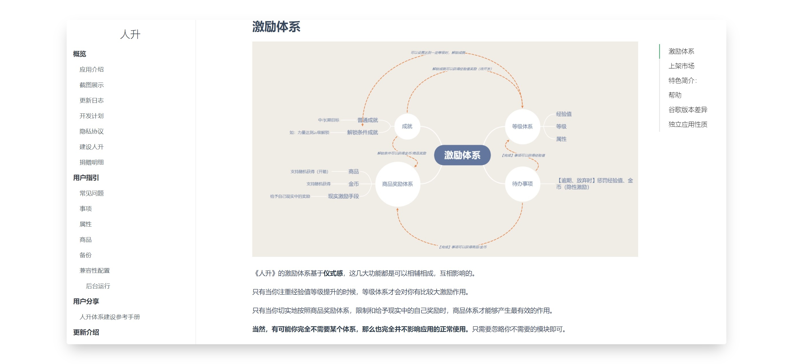

除应用功能外，也搭建了：

- 新官网
- 文档网站
- 新宣传视频
- 服务器升级和迁移
- 自动化打包
- 静态代码扫描
- YouTrack需求和问题管理
- 新宣传图

此处可插入新宣传视频：

---

## 感想

随便提一些个人感想和碎碎念，时间有限未作充分思考。

### 1. 接受称赞、反思吐槽、忽略噪声

称赞就不用多说了~

从吐槽中，我们也能发掘一些需求和优化点，比如是否是指引不到位、交互不合理等等。

关于噪声，可以理解为毫无意义的批评。

> “噪声”的说法也是来自某篇独立开发相关的译文。

印象最深刻的是，有一位会员，三番两次通过多种渠道付款后，在同一天内找个奇怪的理由退款（比如“清单”不支持连续创建）。

后来退款时发现该用户行为不正常，可能涉及诈骗等，后续就直接不发送兑换码而是退款了。

与此类似的，也有某市场评论区

> 应用内以前有个很好玩的小游戏，后面被砍了

我都不知道我开发了小游戏.jpg

甚至于经常会有经验主义者，

「这种机制火不起来、这种收费模式不会有用户的、要做押金制」等等。

学会忽略即可~

市场是公平的，交给市场做评判。

### 2. 关注中短期规划

因为《人升》这款应用的特殊性，中短期灵活的规划可能更适合它。

随便举两个简单的例子：

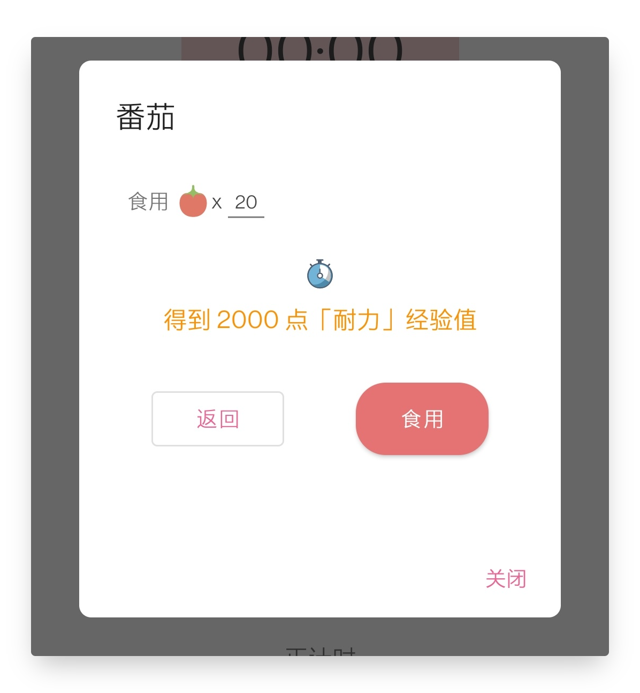

1. 当初开发番茄钟的时候，直到功能开发完了一大半。才灵光一闪，加上了番茄食用的设定。

2. 开发商品使用效果的时候，也是直到最终阶段，才想到了合成机制这个比较有趣的玩法。

   后续更是将合成做成了独立的系统。

### 3. 看重可维护性

一款需要长期更新维护的应用，可维护性是至关重要的。

我们在开发《人升》的过程中，也一直在推陈出新，调研新的技术框架，一步步从MVC -> MVP -> MVVM。

一些老且需要增添功能的页面，我们也抽空进行了重构（统计、新建任务、任务列表页面、状态页面等等）。

这些时间的投入，也是为了减少未来的债务。

> 不要偿还过去，不要透支未来。

### 4. 想法与表达之前注定存在失真

如同我们最初的思维导图也未能完成实现一样。

> 其实我们更早期的构想，也存在着人物系统。

一款产品的构思和最终实现，终究会存在不少的失真。

原因可能有平台限制、时间限制、技术水平限制等等。

想法并不值钱。

对表达失真的取舍，可能才是价值点所在。

---

## 表现

### 1. 国际化

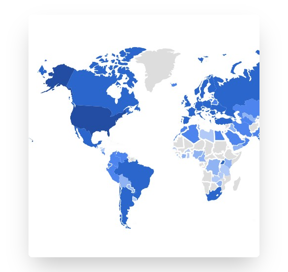

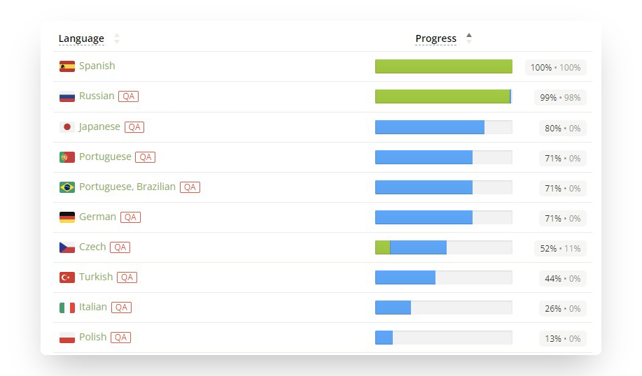

虽然当前人升海外的用户总量不多，但用户还是遍及各个国家地区。

多语言方面，我们初始维护着简繁体中文和英文。

其余语言由用户参与贡献和润色，也有着不俗的翻译进度。

### 2. 海外市场营收

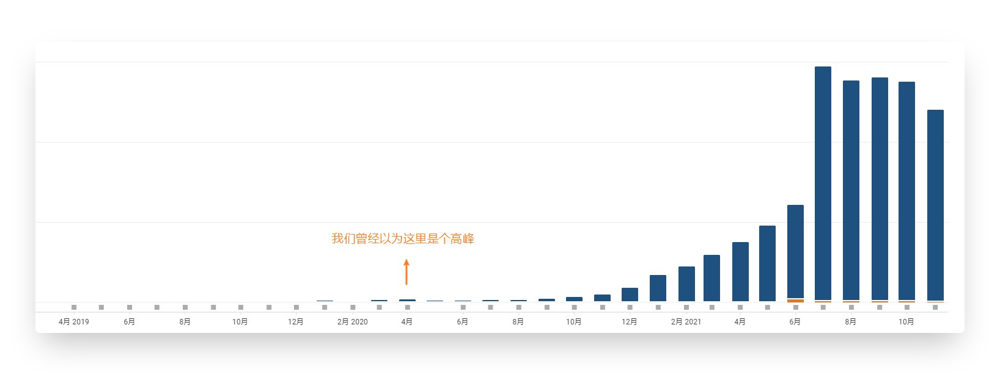

随着7月份上了一波英美区首页，海外市场表现很惊人。

之后的几个月也是平稳了下来。

我们也相信这一次的高度，更不会是顶峰，只是个山腰或者山脚~

### 3. 市场排名

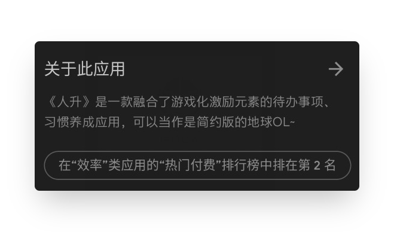

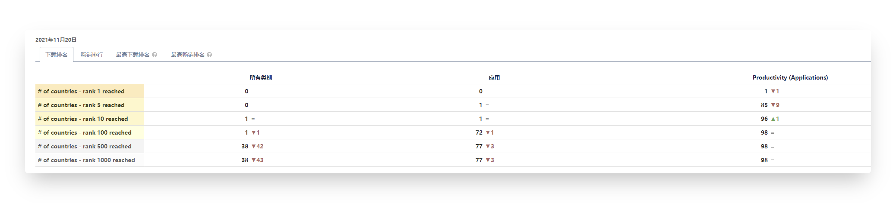

在限定「效率」类的「热门付费」（这里的付费指的是付费应用，其实属于蓝海了）的条件下，

**《人升》能在美区以及其他84个国家或地区保持着排名前5的水准。**

## 展望

### 1. 标准化

回顾前一段时间，其实《人升》的功能迭代导致的问题一直都很多。

也有一些比较严重的：

- 低版本手机启动崩溃
- 服务端慢查询导致年初经常宕机
- 商品排序导致商品被复制
- 谷歌新账户登录不了

曾经有一些系列版本中的小版本号迭代到了16。

因为这些问题，曾经尝试了一些手段（会员alpha测试、发包周期调整、自测用例），但因为人力问题，还是不能很好地解决。

今年下旬，成功邀请了一位非常非常优秀的测试同学加入了团队。

协助测试和搭建了很多相关的东西（自动化打包、静态代码分析等等），使得近期的一些版本发布周期很稳定。

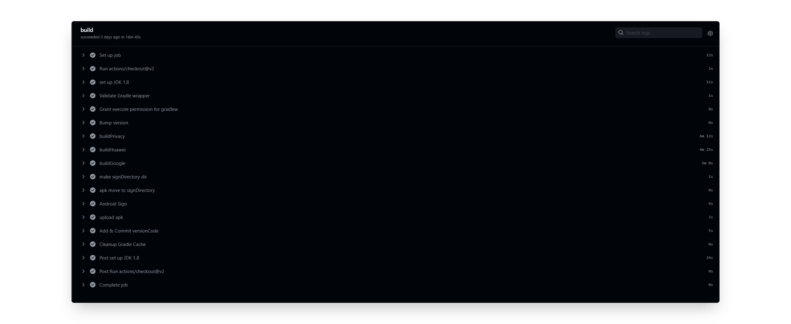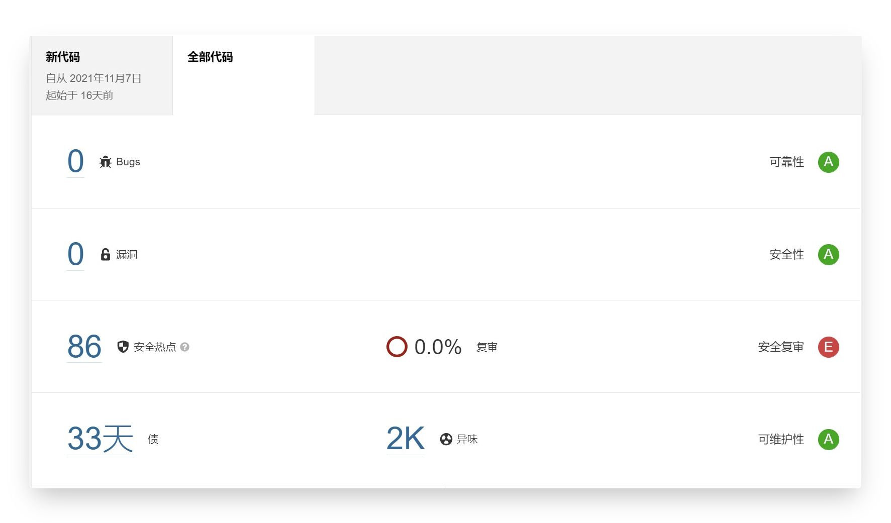

虽然拉长了初期版本的发布周期，但是算上原先的修复发布而言，总周期无疑是缩短了的。

甚至参与了一些功能的开发。

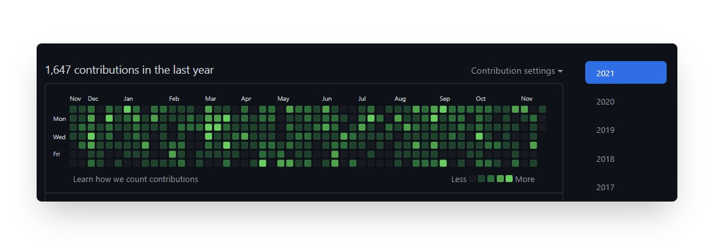

**作为一款有多达 2400 次代码提交的离线化工具类应用，稳定性是至关重要的。**

后续也会在注重稳定性的前提下进行功能迭代开发。

### 2. 跨平台

iOS 版本是个巨大的痛点。

困于技术水平、时间和增量同步难以解决的情况，一直很难尝试进行 iOS 版本的开发。

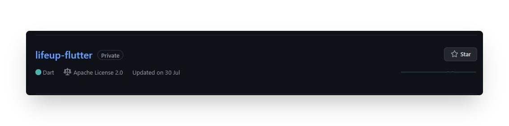

虽然今年建了 Flutter 版本仓库，但仍没时间学习和进行开发。

后续计划是在 Flutter 上进行一些革新功能的实现和 UI 的重新设计（人升2.0？）

### 3. 开放

除了普通的功能迭代外，

我们会尝试在后续版本中开放一些客户端接口（比如新建任务、增减金币、增删商品）。

以便用户也能够在外部扩展实现一些功能。

### 4. 做时间的朋友

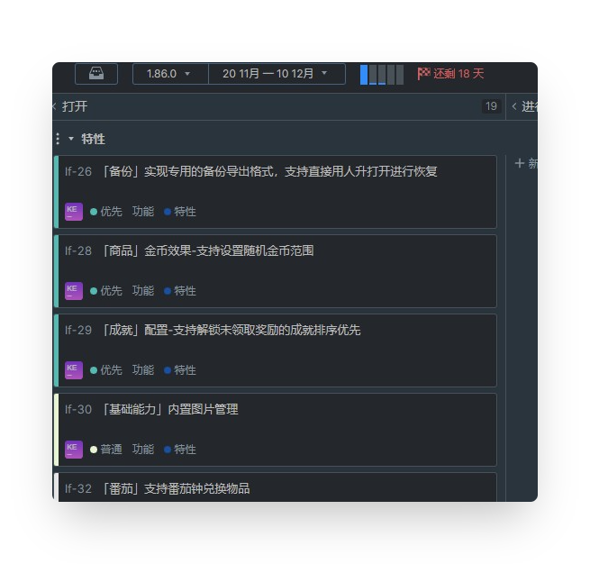

《人升》尚且仍有大量需要改进和维护的点，我们会做时间的朋友，持续维护和更新。

定个小目标，明年《人升》排名前5的数量保持不变或增长的前提下，能减少一个限定条件（在85个国家或地区的热门付费类的所有应用排名前5）。

《人升》仍是由三名开发人员在业余时间进行维护。

这里的开发也是泛义，目前开发人员都是身兼数职的（所以英文版里的关于页面，将`developers`改为了`designers`）。

> 实际上一款产品的诞生，需要产品、设计、交互、客户端开发、后端开发、测试、运维、市场发布、运营等诸多职位的参与。
>
> 看起来满当当的半个月，我们的实际可开发时长可能不足4天。
>
> 但可以肯定的一点是，我们会坚持下去（因为还有很多活没干完~）。

## 结语

比较遗憾的是三周年没有做充分的准备，今年公众号也断更了一年。

应用内有比较多的设计理念、一些细节改动都没机会在本文涉及。

后续有机会可能会以独立文章的形式发布更多内容，感谢关注~

感谢用户们的长期理解和支持！

希望人升能随着优秀的用户们一起升级成长~

> 也欢迎参与人升的共建。
