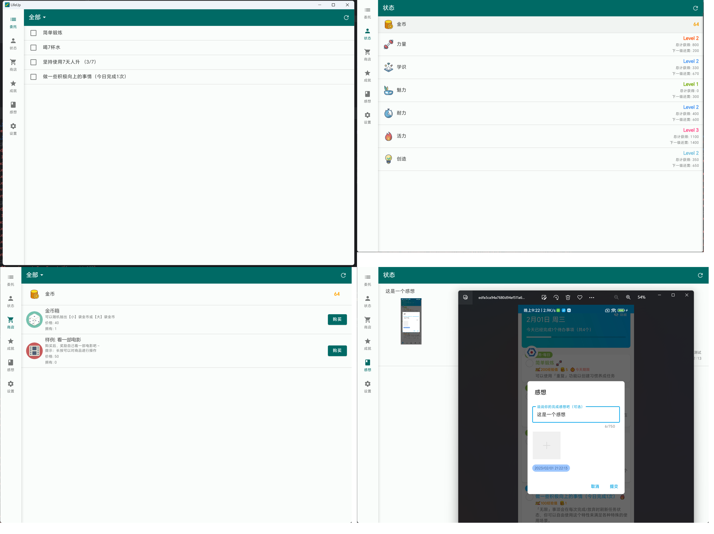

## 2024 年开发计划

!> 这是我们目前正在进行的开发计划。我们会竭尽所能根据该计划指引进行产品的改进和升级。但考虑到环境的不断变化，开发计划中的内容可能会有所修改或增减。具体以产品发布和上线的实际情况为标准。

### 一、开发计划

> 更新于 2025/09/14

| 模块                      | 子功能                                                       | 预估版本    | 需求缘由                                                     | 优先级 | 结果                                  |
| ------------------------- | ------------------------------------------------------------ | ----------- | ------------------------------------------------------------ |-----|-------------------------------------|
| 基础能力（1）             | 多选商品 & 获得时使用商品（？）                              | v1.94       | 略                                                           | P0  | ✅ v1.94 已上线多选功能 ✅ 自动使用商品已于 v1.96 版本上线 |
| 基础能力（2）             | 奖励弹窗通用化改造（支持任意数量的属性和商品）               | v1.96       | 略                                                           | P0  | ✅ v1.96 版本上线；预计后续版本放宽一些设置项目         |
| 基础能力（3）             | 音效资源管理 & 商品音效使用效果                              | v1.95       | 略                                                           | P0  | 🚧                                  |
| 基础能力（4）             | 提醒优化                                                     | v1.95       | 略                                                           | P0  | ✅ 已上线                                |
| 大屏幕适配（平板/折叠屏） | 基于 [Activity embedding](https://developer.android.com/guide/topics/large-screens/activity-embedding) 适配平板、折叠屏 | v1.95       | 略                                                           | P1  | ✅ 预计于 v1.95 上线                         |
| 小部件                    | 小部件扩充（仓库小部件）                                     | v1.95       | 略                                                           |     | ✅ v1.94 已上线                          |
| 日历集成                  | - Google Calendar 双向同步 - 系统日历 双向同步           | v1.96 ~ v1.99 | - 海外大量需求反馈。 - 人升是一款待办工具，与日程应用有功能重合但不一致，再内置日程功能的话，工程量十分庞大。与外部联动或是更佳的解决方案，并能一定程度减少跨平台同步需求。 | P1  | 🚧                                  |
| API                       | - 扩充 API 能力和数量，尽量覆盖所有基础功能 - 桌面端功能完善，支持备份/恢复等 | v1.94 ~ 1.99  | - 仍缺少大量 API，如编辑等。 - 人升没法做到 all in one，但提供 API 功能可以实现每个人定制和扩展自己的人升。并且实现开源社区。  | P1  | 🚧 预计将在 v1.98.x 版本上线                   |
| 成就                      | - 重复型成就                                                 | v1.94 ~ 1.97  | ~                                                            | P2  | ✅ 已上线                   |
| 数据体系                  | - 数据和图片分开备份 - 支持部分数据导出和导入 - 支持内置多档案切换 | ~           | - 因 WebDAV 上传大文件容易失败，坚果云有流量限制，全量+图片备份过于庞大。 - 部分数据导出+导入，可以用于用户间分享体系。也可以为增量同步打下一部分基础。 - 内置多档案，用户可以直接切换多个体系使用，并且随意调试应用。而不需要重复清空数据或使用分身类软件。 | P1  | 🚧                                  |
| 多端（Flutter 方向）       | - 持续学习和使用 Flutter 开发跨端版本                        | ~           | - iOS 版本雏形开发，复刻现有 Android 版本。                  | P2  | 🚧 搁置                               |
| 多端（KMP 方向）           | - 探索使用 KMP 的更多可能性                                  | ~           | - 探索学习 KMP 技术，为未来做准备                            | P0  | ✅ 已上线 ulives - iOS 新应用              |

总的来说：

1. 我们会贯彻之前确定的方向，以稳定、优化现有功能为主，不随意增添功能模块。
2. 我们将利用一两个大版本的时间，解决一些基础功能上的缺陷和痛点。
3. 然后再着手研究日历集成和重复型成就。
4. 期间会持续完善 API 等。

多端跨平台将作为我们 2024 年的重点推进目标之一。

### 二、2023 年回顾

`人升`的半业余半课余开发历程已经度过了五周年，即将踏入第六个年头，我们也发布了数百个版本，仅 Android 仓库就提交了近 5000 次代码。

 

尽管 2022 年 10 月提出的开发计划是以深化人升的功能体系为主，但是由于环境变化问题，途中仍遭遇了不少阻碍和困扰。

#### 1.1 环境

典型的就如：

- 受到了部分省份的“反诈”误报且找不到申诉途径，几番周折才解决了一部分问题。但近期又出现了山东地区的误报问题，目前还未找到申诉和复现途径。

- 中国国内安卓手机应用市场审核标准层层加码、市场和人员间规范不统一，审核人员不专业。

  - 某些应用市场经常会在没改动的地方拒审。

  - 某 V 应用市场差点以“隐私合规”作为理由拒绝我们的`人升`应用。市场方面要求我们的应用必须申请【读取所有文件权限】或者【读取所有照片权限】并提供相应说明，以便用户可以从相册中选择图片。不过，`人升`采用了更注重隐私保护的方法，不需要申请这样的权限，也不会直接读取用户的文件。相反，我们的应用通过跳转至系统自带的相册应用，只接收用户选定的图片，确保了隐私的最大程度保护。

    但审核人员反而不了解这类最正确的做法，经过了几个工作日跟客服沟通才得以过审。

 

为了减少环境问题对我们的影响：

我们加强了应用内更新机制，并减少提交应用市场审核的频次。

现国内版本支持应用内更新，并可自选切换稳定渠道或会员内测渠道。

此外，我们也更新了一下官网（https://lifeupapp.fun/zh/index.html），作为备选的下载渠道。

以便大家可以更方便地通过官网下载并安装应用，并规避应用市场审核的风险和延误。

应用内的网络请求也增加了备用渠道，以缓解和预防部分省份因误报而无法访问的问题。

 

随着审核日益严格，以及目睹其他独立开发者在国内安卓市场遭遇的各种阻碍，

可以说在 2023 年，国内安卓平台对于独立开发者而言，已不再是理想的首发上架目标。

毕竟国内安卓市场有着最严格的资质要求，以及最复杂且**多变**的审核标准。

>  但讽刺的是，与此同时，一些粗制滥造的山寨应用却能轻松上架并标识“人工复检通过”。

这可能也是为什么在小红书上看到的许多独立开发者作品仅有 iOS 版本。

Google Play 和 App Store 仍是首选。

?> 大家也可以多关注和支持那些仍在坚守国内安卓平台的独立开发者和小团队~

 

所以，2024 年：

- 我们将把上一期开发计划中未完成的部分迁移至本期，如日历集成、重复型成就、基础能力、数据体系等。
- 多端开发将作为我们的重要目标，并且可能会包含两个方向。
  - 使用 Flutter 复刻人升（由于人力有限，这部分将由后端同学-小小开发推进）
  - 探索使用 KMP (Kotlin Multiplatform) 的更多可能性

#### 1.2 国内用户增长

除此之外，2023 年`人升`在中国应用市场也有着显著的用户增长。感谢大家的支持！

- 为了减少手动发放兑换码的耗时，并更集中将精力用于开发：2023 年我们额外接入了自动化支付方式（微信、支付宝），并支持了微信登录。
  - 这一点解放了我们大量的时间。

- 2023 年有一次 QQ 空间的用户传播，再次把我们的服务器打崩了好几天。
- 我们也在尝试运营公众号、小红书、B 站等，推广、介绍人升的更新和创意用法。
- 随着用户群的增长，我们也遇到了一些波折和奇特的经历。例如：
  - 有用户对着我们的公众号自动回复连续发了十几句粗话。
  - 我们从 QQ 群中移除了一位不友好的用户，结果他转头去写了一篇小作文。
  - 在回答一位用户关于 API 获取方法的详细咨询时，我们不仅给出了详尽的解答，还提供了案例作为参考。然而，该用户还是反复问同一个问题，最后因为没法理解自称感受到了前所未有的心寒。
  - 在人工发放兑换码期间，一位用户在收到兑换码后，又通过不同渠道请求相同的码。我们提醒他不要多渠道重复申请，甚至替他解释可能是网络延迟的原因，没想到换来了一句“没有人比我更懂网络”，然后还跑去市场评分留言他最懂网络。

- 通过众多案例和与其他独立开发者的交流，我们发现大多数独立开发者都经历过类似的困境，最终选择关闭某些即时通信和社交媒体渠道。我们深有同感。
  - 在大公司中，通常有专门的客服团队或客服机器人来处理众多咨询，有效地将其转化为具体需求或问题反馈给开发者。
  - **而独立开发者自身一般要承担客服、运营的工作，与一个不讲理的用户周旋，损失的是这个独立开发者 100% 的开发时间（更别提还有小作文作为挑战副本了），最终影响到的只能是开发者、产品以及使用该产品的核心用户。**
  - 因此，我们也越来越倾向于推荐用户通过电子邮件等方式提供反馈。

 

所以，2024 年：

- 我们将继续减少人力投入重复性的咨询工作，而是完善文档、常见问题。即便存在咨询，也是通过邮件、QQ 频道等统一处理。
- 尝试少量运营一些社交媒体。

#### 1.3 海外用户增长

2022 年初，我们加入了 Google Play Pass 后，迎来了一大波用户增长。

但该增长并没有持续多久，到达 2022 年中旬的时候，用户增长逐渐疯狂减少，而且没有好转迹象。

由于`人升`是一款买断制应用，用户增长对我们非常重要，也是我们得以持续运营、以至未来有机会全职投入开发的基石。

我们尝试了大量手段来改进增长：

- 找专业的设计师重新设计了商店宣传图
- 改进应用和宣传图多语言
- 改进应用描述
- 改进新手教程文档
- 加快更新的频率
- ...

虽然实施了大量手段，并对部分指标有所改进。但仍然回不到稳定增长的时期。

我们就只能顺其自然了。

好消息是 2023 年末，似乎有些好转迹象了。

 

所以，2024 年：

- 完善国际化建设（文档、应用内语言支持等）。

#### 1.4 质量管理

鉴于`人升`是一款由我独自开发并进行测试的离线工具类应用，避免出现严重的崩溃问题尤为重要。

2023 年的版本迭代过程相较以往耗时更长，同时，我们为会员内测预留了充足的时间，以确保准备充分。

这些措施似乎有效地防止了大规模严重崩溃的发生。

然而，每次版本更新仍不可避免地伴随着一些问题，包括一些关键路径上的问题。

为此，我们将持续提升`人升`的应用质量管理，以稳定性为最重要的指标（尤其是在当前日益严峻的环境和审核挑战下）。

 

所以，2024 年：

- 加强质量管理。

#### 1.5 深耕功能

如之前三周年文章所提到的，`人升`是一款逐渐摸索和成长的应用。

所以什么商店、自定义成就、API 此类功能都不在初期规划中，而是随着更新和反馈逐渐开发和新增的。

但这也引入了一些问题：

- 部分模块存在着一些粗糙的细节规划。
  - 比如商品奖励前期只考虑单奖励。
  - 属性等系统前期也未考虑自定义等，逐渐重构才能够支持增删和自定义等级等。
  - 还有很多此类问题，如属性的奖惩弹窗和历史展示最多只支持 3 个。
- 这些后续新增的模块，缺少针对应用整体的分析和规划。

我们将坚持三周年文章所说的方向，继续深耕应用的现有功能模块，解决一些痛点问题，而非追求新的功能模块。

比如我们会支持直接多选商品奖励、完善备份机制、提醒优化、小部件补全等。

#### 1.6 API 与扩展性

如上面所说，我们已经不打算引入新的功能模块了。

但肯定会有想要扩展应用的需求。

所以我们 2023 年引入了 API 功能。

将`人升`本体作为一台体系的基础能力提供出去。

即便用户不懂编程，也可以使用 Tasker/MacroDroid 之类的自动化工具扩展功能，实现自动化能力。

典型的就如：

- NFC、扫码完成任务
- 起床自动打卡
- 自定义小部件
- 等等...

如果用户了解编程，更是能从上面扩展出更多的玩法甚至 App。

我们也基于 API 开发了一个简易的桌面版本（并开源了）。

即便经过了数个版本的 API 扩展，目前仍然缺少不少能力。

比如不支持“感想”相关的操作，不支持通过 Content Provider 更新数据等。

我们将在 2024 年继续扩展 API，使其尽量覆盖应用的方方面面。

> 虽然目前看到了很多用户自用 API，但还是缺少分享出来的可独立运行的产物，我们需要持续提供更强的 API 能力，以便构建 API 生态。

#### 1.7 关于未来

随着上述的种种问题和环境变化，我们也逐渐调整了`人升`永久会员的售价（即便如此，`人升`的会员定价也是远远低于大部分其他应用的），更新也会逐渐倾向于提供为会员功能。

我们逐渐意识到，应用终究还是为核心用户服务的。

核心的用户的反馈和支持能够最终在应用的改进上体现，这才能实现开发者与用户间的共创和正循环。

如果想要讨好所有人，应用只会变成屎山，偏离核心用户的诉求，也会降低开发者的收益和动力。

 

我们上面提到了 KMP (Kotlin Multiplatform)，这是一门较为新兴的跨平台技术。也能混合运用上原生的能力。

在`人升`的开发途中，我们逐渐有些新的点子。但并非所有点子都能、都适合在`人升`上落地。

比如替换全套 UI、大改商店逻辑等等，这势必会严重影响现有用户的体验。我们也见过了很多多番大改应用导致失败的案例。

 

并且由于`人升`初期开发技术选型的时候，由于当时官方的数据库框架`Room`尚未问世，挑选了一个国内开发的一个小众数据库框架。

现在一些性能问题也凸显出来了，并且难以替换。

除此之外，现在`人升`同时支持 Material 3 和老版 Material Design，加上夜间模式、多语言、国内手机系统的分裂（兼容性配置的文档只会越来越长，原生系统以及海外版本的系统一般都只需要单个页面配置即可）等等问题，每个页面的开发需要考虑的东西都很多很复杂。

 

于是我们打算探索一下 KMP，看看能否将一部分技术使用 KMP 实现。

也是为了未来能够有机会落地更多的点子和新项目，技多不压身。
